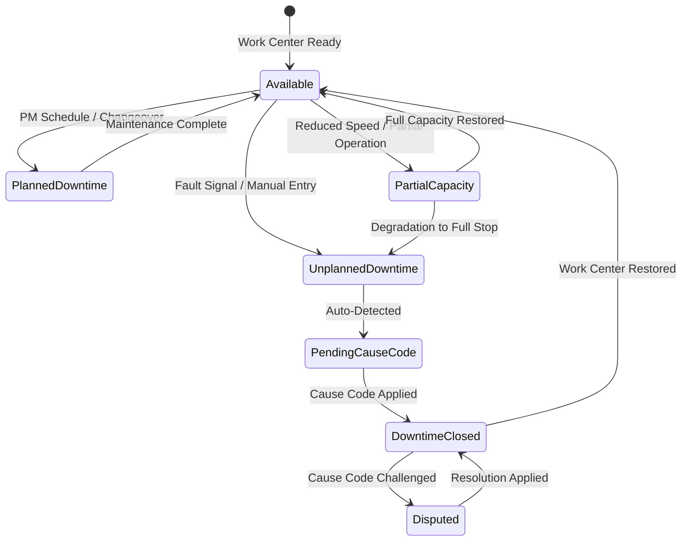

# Edge Cases — Machine Downtime

## Overview

Machine downtime management in the MES captures, classifies, and reports equipment availability events that affect production scheduling, OEE calculations, and maintenance planning. In discrete manufacturing, downtime is measured at the work center level and rolled up to line, cell, and plant availability metrics.

This document covers edge cases that occur at the boundaries of shift boundaries, concurrent events, retroactive corrections, and the integration between the MES downtime module, the CMMS (Computerized Maintenance Management System), and the SAP Plant Maintenance (PM) module.

---

## Edge Case Scenarios

### Unplanned Downtime Mid-Operation

**Scenario Description**

A work center experiences an unplanned failure (mechanical fault, power fault, safety trip) while an operation is actively in progress — parts are mid-cycle on the machine, work instructions are open on the terminal, and confirmations for the current operation have not been submitted.

**Trigger Conditions**

- PLC fault signal received by OPC-UA server while operation status is `IN_PROGRESS`
- Operator presses the emergency stop while an operation is active
- Automatic machine fault detected by the IoT edge node (vibration anomaly, temperature threshold exceeded)
- Power interruption causes ungraceful shutdown of the work center controller

**System Behavior**

The MES receives the fault or downtime signal from the IoT edge layer or the OPC-UA server. The operation status transitions from `IN_PROGRESS` to `INTERRUPTED`. The active operation is suspended — the confirmed quantity up to the interruption point is preserved; no partial confirmation is submitted to ERP. A downtime event is created automatically with type `UNPLANNED`, the triggering signal source, and the exact timestamp of the fault signal.

The system captures the last confirmed cycle count and marks the in-progress cycle as `INCOMPLETE`. Material issued for the in-progress operation is preserved in `WIP_COMMITTED` state — it is not returned to stock until the operation either resumes or is explicitly cancelled. The work center status is set to `UNPLANNED_DOWNTIME`, blocking any new operation starts.

When the work center is restored, the interrupted operation can be resumed (continuing from the saved cycle count) or restarted. If resumed, the total operation time includes both pre-interruption and post-restoration time segments.

**Expected Resolution**

Downtime is recorded with accurate duration. The operation is either completed after restoration or formally closed as a partial completion with appropriate yield accounting. OEE metrics correctly reflect availability loss from the interruption.

**Test Cases**

| ID | Input | Expected Output | Pass/Fail Criteria |
|---|---|---|---|
| MDT-UMO-01 | PLC fault signal at 10:32:15 while operation cycle 47 is active | Operation `INTERRUPTED`; downtime event created at 10:32:15; cycle 47 marked `INCOMPLETE` | Downtime timestamp matches PLC signal timestamp within 1 second |
| MDT-UMO-02 | Work center restored at 11:15:00; operator resumes operation | Operation resumes from cycle 47; time segments 10:00–10:32 and 11:15–completion both captured | Total operation time = pre-fault segment + post-restoration segment |
| MDT-UMO-03 | Operator cancels operation instead of resuming | Partial yield recorded; WIP materials returned to stock; partial GR sent to ERP | Material balance reconciled; no phantom WIP remaining |
| MDT-UMO-04 | Fault signal received but OPC-UA connection is delayed by 45 seconds | Downtime recorded with adjusted timestamp; delay flagged in event metadata | Timestamp correction audit trail references OPC-UA signal delay |

---

### Cascading Line Stoppage

**Scenario Description**

A single work center failure triggers a cascading stoppage across downstream work centers in a production line — the buffer between work centers empties, and upstream work centers must also stop to prevent overproduction of WIP with nowhere to go.

**Trigger Conditions**

- Bottleneck work center fails; downstream buffer depletes within minutes
- Line balancing logic detects that downstream starvation has occurred
- Upstream work centers continue producing until WIP accumulation triggers a buffer overflow stop
- SCADA system sends a line-stop signal when downstream buffer reaches zero

**System Behavior**

The MES line topology configuration defines the upstream-downstream relationships between work centers. When the primary failure work center enters `UNPLANNED_DOWNTIME`, the system evaluates the line topology to identify:

1. Downstream work centers that will be starved within the configured buffer depletion time
2. Upstream work centers that will overflow their output buffer

The system generates cascade stop recommendations to the line supervisor within the buffer depletion window. If the supervisor does not act within the threshold, the system sends automatic stop signals to upstream SCADA-controlled work centers that have auto-stop capability configured. Each cascade stop is recorded as a separate downtime event with cause type `CASCADE_STOP` and a reference to the originating failure event.

Each downstream/upstream stoppage has its own start and end time — they are not assumed to be simultaneous with the primary failure.

**Expected Resolution**

The primary failure is repaired. The line restarts in the correct sequence (downstream first, then upstream). Cascade stop downtime events are correctly attributed to the primary failure in OEE reporting. MTTR calculations account for the full cascade recovery time.

**Test Cases**

| ID | Input | Expected Output | Pass/Fail Criteria |
|---|---|---|---|
| MDT-CLS-01 | Work center WC-05 (bottleneck) fails; WC-06 and WC-07 downstream | WC-06 and WC-07 enter `CASCADE_STOP` when buffer depletes; reference to WC-05 failure | Cascade stop events reference originating failure event ID |
| MDT-CLS-02 | Upstream WC-03 overflows buffer within 8 minutes | Auto-stop signal sent to WC-03 at buffer overflow threshold; `CASCADE_STOP` event created | Stop signal timing matches buffer overflow calculation |
| MDT-CLS-03 | WC-05 restored; line restart sequence initiated | Downstream work centers restart first; upstream restarts after buffer replenishment | Restart sequence log shows correct order; no premature restarts |
| MDT-CLS-04 | OEE report run after cascade event | Primary failure attributed to WC-05; cascade stoppages shown as linked availability losses | OEE report distinguishes root-cause downtime from cascaded downtime |

---

### Multiple Concurrent Breakdowns

**Scenario Description**

Two or more work centers in the same production area experience unplanned failures simultaneously or within a short time window, overloading the maintenance response capacity and creating complex OEE attribution when maintenance resources must prioritize.

**Trigger Conditions**

- Power surge or utility failure affects multiple machines simultaneously
- Two independent mechanical failures occur within minutes of each other during a shift
- Maintenance team responds to one failure while a second is reported, creating queued maintenance work orders

**System Behavior**

The MES creates independent downtime events for each affected work center. Each event has its own fault signal, start time, cause code workflow, and resolution. The maintenance work order system (CMMS integration) receives work order creation requests for each failure. When CMMS capacity is limited, maintenance work orders are prioritized by:

1. Production order priority of the affected work center
2. Work center OEE weight (critical path vs. non-critical)
3. Time in downtime (FIFO as tiebreaker)

The MES maintenance dashboard shows all concurrent breakdowns with their priorities, assigned technicians, and estimated repair times. If no technician is available for a lower-priority breakdown, the system records `AWAITING_TECHNICIAN` as the hold reason within the downtime event.

**Expected Resolution**

Each breakdown is resolved independently. OEE correctly attributes downtime to each work center. The production schedule is dynamically adjusted to account for reduced available capacity across the affected work centers.

**Test Cases**

| ID | Input | Expected Output | Pass/Fail Criteria |
|---|---|---|---|
| MDT-MCB-01 | WC-02 and WC-04 fail simultaneously | Two independent downtime events created; separate CMMS work orders generated | Each event has independent fault signal reference and start timestamp |
| MDT-MCB-02 | Only one maintenance technician available | Higher-priority work center's work order assigned to technician; lower-priority enters `AWAITING_TECHNICIAN` | Priority ranking logged; technician assignment audit trail preserved |
| MDT-MCB-03 | WC-02 repaired first; WC-04 still down | WC-02 downtime event closed; WC-04 event remains open | Independent event lifecycle; no cross-contamination of downtime records |
| MDT-MCB-04 | Both fail during shift change | Downtime events preserve timestamps across shift boundary; both shifts attributed correctly | Downtime duration split calculation at shift boundary is accurate |

---

### Downtime During Shift Change

**Scenario Description**

An unplanned downtime event starts before a shift ends and extends into the next shift, requiring the downtime duration to be correctly split across shift boundaries for shift-level OEE and productivity reporting.

**Trigger Conditions**

- Work center fails at 22:45; shift ends at 23:00; next shift starts at 23:00
- Planned maintenance window straddles two shifts
- Work center is restored during the overlapping handover period when both outgoing and incoming shifts are active

**System Behavior**

The MES shift calendar defines exact shift start and end times, including any overlap handover windows. Downtime events that span a shift boundary are automatically split into two segments — one attributed to the outgoing shift, one to the incoming shift. The split is performed at the exact shift boundary timestamp. Both segments reference the same root downtime event (same event ID) but appear as separate records in shift-level OEE calculations.

The outgoing shift supervisor's OEE report includes the downtime segment up to shift end. The incoming shift's OEE report includes the downtime segment from shift start to resolution. The full downtime event remains open and tracked as a single event for maintenance reporting purposes (MTTR, MTBF calculations use the full duration, not split segments).

**Expected Resolution**

Each shift's OEE report accurately reflects only the downtime within that shift's window. MTTR uses the full event duration. The handover report clearly flags open downtime events that will be inherited by the incoming shift.

**Test Cases**

| ID | Input | Expected Output | Pass/Fail Criteria |
|---|---|---|---|
| MDT-DSC-01 | Downtime starts at 22:45; shift ends 23:00; resolved 23:45 next shift | Outgoing shift: 15 min downtime; Incoming shift: 45 min downtime | Both segments reference same event ID; OEE split correctly at 23:00 |
| MDT-DSC-02 | Shift handover period (22:55–23:05 overlap); downtime starts 22:58 | Downtime start in outgoing shift; split at 23:00 boundary | Segment durations sum to total event duration; no time unaccounted |
| MDT-DSC-03 | Incoming shift supervisor views OEE on handover | Open downtime events from prior shift flagged in handover dashboard | Handover dashboard lists open events with duration inherited at shift start |
| MDT-DSC-04 | Downtime spans three shifts (large repair) | Three segments created, one per shift | Segment count = number of shift boundaries crossed; all segments reference same event |

---

### Retroactive Downtime Entry

**Scenario Description**

Production data was recorded on paper or the MES terminal was offline, and downtime must be entered after the fact, potentially hours or days later, requiring retroactive insertion of downtime events into the historical time series.

**Trigger Conditions**

- MES terminal offline during downtime; paper recording used
- Operator forgot to log downtime at the time of occurrence
- Supervisor reviews shift report and discovers undocumented downtime
- System clock failure caused incorrect timestamps during the period

**System Behavior**

Retroactive downtime entry is permitted within a configurable window (default: 72 hours from the event period). Entries beyond this window require supervisor approval with a documented reason. All retroactive entries are created with `ENTRY_TYPE: RETROACTIVE` and include the entering user's ID, the entry timestamp, and the documented reason for late entry.

When a retroactive downtime event is inserted into the historical time series, the OEE calculations for all affected shifts and periods are recalculated. Affected reports are flagged with a `RETROACTIVE_CORRECTION` marker until the recalculation is confirmed. ERP-posted production confirmations are not automatically reversed — a separate review determines whether ERP corrections are needed.

Retroactive downtime entry is validated against existing records to prevent overlap with already-recorded events or production confirmations.

**Expected Resolution**

The retroactive event is entered with full audit trail. OEE is recalculated for affected periods. Reports are updated and marked as corrected. Any required ERP adjustments are handled separately.

**Test Cases**

| ID | Input | Expected Output | Pass/Fail Criteria |
|---|---|---|---|
| MDT-RDE-01 | Enter downtime event 18h after occurrence, within 72h window | Event created with `RETROACTIVE` type; OEE recalculated for affected shift | `RETROACTIVE_CORRECTION` marker on shift OEE report; entry reason logged |
| MDT-RDE-02 | Enter downtime event 80h after occurrence (beyond window) | System requires supervisor approval before entry is accepted | Approval workflow created; event not entered until approved |
| MDT-RDE-03 | Retroactive entry overlaps with existing production confirmation record | Conflict flagged; user must confirm resolution approach (accepted downtime or correction) | No silent overwrite; overlap conflict must be explicitly resolved |
| MDT-RDE-04 | Bulk retroactive entry of 12 events from paper records | Batch import processes all 12; OEE batch recalculated for affected day | Batch import audit record; each event individually traceable |

---

### Disputed Downtime Cause Codes

**Scenario Description**

The assigned cause code for a downtime event is disputed — typically between production (attributing to maintenance quality) and maintenance (attributing to operator misuse or production scheduling pressure), creating a disagreement that affects departmental KPIs and cost allocation.

**Trigger Conditions**

- Maintenance closes a downtime event with cause code `OPERATOR_ERROR`; production disputes this classification
- Production enters `MECHANICAL_FAILURE`; maintenance believes the root cause was `INSUFFICIENT_LUBRICATION` (planned maintenance missed)
- Multiple cause codes are applicable and the primary cause is unclear

**System Behavior**

When a cause code is disputed, the disputing party (production supervisor or maintenance supervisor) initiates a dispute workflow by selecting `DISPUTE_CAUSE_CODE` on the downtime event. The event is flagged as `DISPUTED` — its cause code is preserved as-is for current reporting, but reports display a dispute indicator. The dispute workflow routes to a neutral arbitrator role (plant manager or engineering lead). Both parties submit their evidence and proposed cause codes. The arbitrator reviews and selects the final cause code with a documented rationale.

The final cause code replaces the disputed code. OEE reports are recalculated. Historical KPI calculations for the affected period are updated. The full dispute history (original code, disputed code, arbitrator decision, rationale) is preserved in the downtime event record.

**Expected Resolution**

The arbitrator closes the dispute with a final cause code. Affected OEE and cost allocation reports are updated. The resolution is immutable — no further changes to the cause code are permitted after arbitration.

**Test Cases**

| ID | Input | Expected Output | Pass/Fail Criteria |
|---|---|---|---|
| MDT-DCC-01 | Maintenance codes event as `OPERATOR_ERROR`; production disputes | Event flagged `DISPUTED`; arbitration workflow created; both parties notified | Dispute timestamp logged; current cause code preserved pending resolution |
| MDT-DCC-02 | Arbitrator selects `MECHANICAL_FAILURE` as final cause code | Event updated; OEE/cost allocation recalculated; dispute closed | Arbitration decision record includes arbitrator ID, rationale, and timestamp |
| MDT-DCC-03 | Attempt to change cause code after arbitration is closed | System rejects change; error references immutable arbitration record | No cause code change permitted on `ARBITRATED_CLOSED` events |
| MDT-DCC-04 | Report run showing disputed events outstanding | Dispute indicator shows on OEE dashboard; pending disputes listed separately | Disputed events do not contaminate resolved OEE metrics; clearly separated in UI |

---

### Planned vs. Unplanned Reclassification

**Scenario Description**

A downtime event that was initially recorded as unplanned is subsequently reclassified as planned (or vice versa), because the maintenance team discovers that the failure was actually a predictable degradation that should have been caught by preventive maintenance.

**Trigger Conditions**

- Post-incident RCA reveals the failure mode was a known wear pattern that PM should have prevented
- A planned maintenance event was not completed on schedule; when the machine subsequently fails, the failure is actually the consequence of missed PM
- Management requests reclassification for KPI reporting accuracy

**System Behavior**

Reclassification is permitted within the configured correction window and requires supervisor authorization. The reclassification is recorded as an amendment — the original classification is preserved and the new classification is added with a `RECLASSIFICATION_REASON`, the authorizing user, and the timestamp. OEE calculations differentiate planned and unplanned downtime (planned downtime does not reduce availability in OEE calculation when it is scheduled in the work center calendar; unplanned downtime always reduces availability). A reclassification therefore affects the OEE availability metric and is recalculated upon reclassification.

If a missed PM is identified as the root cause, the MES triggers a CMMS work order to review and reinstate the PM schedule.

**Expected Resolution**

Reclassification is applied with full audit trail. OEE is recalculated. If applicable, CMMS PM schedule is reviewed. KPI reports are updated to reflect the reclassified events.

**Test Cases**

| ID | Input | Expected Output | Pass/Fail Criteria |
|---|---|---|---|
| MDT-PUR-01 | Unplanned event reclassified to planned after RCA | Classification updated; OEE recalculated; original classification preserved in amendment | OEE availability metric changes to reflect planned status; amendment record complete |
| MDT-PUR-02 | Reclassification attempt beyond correction window | Supervisor override required; event not reclassified without approval | Approval workflow initiated; no silent reclassification |
| MDT-PUR-03 | Missed PM identified as root cause during reclassification | CMMS triggered to review PM schedule; PM schedule deficiency flag raised | CMMS work order created; references downtime event and missed PM activity |
| MDT-PUR-04 | Manager requests bulk reclassification of 20 events | Bulk reclassification requires separate authorization for each event | Bulk workflow routes each event for individual supervisor approval; no batch bypass |

---

### Partial Machine Capacity

**Scenario Description**

A work center is not completely down but is operating at reduced capacity — for example, only 3 of 4 spindles are functional, or the machine is running at 60% speed due to a sensor fault — and must be correctly represented in OEE performance metrics rather than as a binary available/unavailable state.

**Trigger Conditions**

- Vibration sensor fault prevents the machine from running above 60% programmed speed
- One spindle on a multi-spindle CNC is broken; others remain operational
- SCADA reports a reduced throughput rate via OPC-UA DA tag

**System Behavior**

The MES work center model supports fractional capacity states. When a partial capacity condition is detected (via OPC-UA production rate tag or manual operator entry), the work center status transitions to `PARTIAL_CAPACITY` with a `capacity_factor` between 0.01 and 0.99. The OEE performance metric is calculated using the actual cycle time vs. ideal cycle time, which naturally captures the performance loss. The availability metric is not penalized for partial capacity (the machine is still available, just running slower).

Production order scheduling is adjusted to reflect the reduced throughput rate. Completion time estimates are recalculated. If the capacity factor drops below a configurable minimum threshold (default: 0.50), the system recommends a full downtime call to the supervisor.

**Expected Resolution**

Partial capacity is tracked for the duration of the degraded state. When full capacity is restored, the work center returns to `AVAILABLE` status. OEE performance losses are correctly captured for the partial capacity period. The full downtime vs. partial capacity boundary is clearly documented.

**Test Cases**

| ID | Input | Expected Output | Pass/Fail Criteria |
|---|---|---|---|
| MDT-PMC-01 | OPC-UA reports production rate 60% of nominal | Work center status = `PARTIAL_CAPACITY(0.60)`; OEE performance metric updated | Performance metric = actual cycle time / ideal cycle time; availability unchanged |
| MDT-PMC-02 | Capacity factor drops to 0.45 (below 0.50 threshold) | Supervisor alerted with recommendation for full downtime call | Alert includes current capacity factor, threshold, and production impact estimate |
| MDT-PMC-03 | Production order completion time recalculated for 60% capacity | Revised completion estimate = original estimate / 0.60; schedule updated | Schedule recalculation logged; affected downstream orders also rescheduled |
| MDT-PMC-04 | Full capacity restored; work center returns to `AVAILABLE` | Partial capacity event closed; OEE period split at restoration timestamp | OEE report shows partial capacity segment and full capacity segment separately |

---

### Preventive Maintenance Conflict with Production

**Scenario Description**

A scheduled preventive maintenance (PM) window conflicts with a high-priority production order that must be completed by a customer deadline, creating a conflict between equipment reliability and production fulfillment.

**Trigger Conditions**

- PM window is auto-generated by CMMS for a period coinciding with a rush production order
- Production scheduler manually schedules a job into a PM window without recognizing the conflict
- PM window is extended (repair discovered during PM) into a confirmed production window

**System Behavior**

The MES cross-checks production order schedules against work center maintenance calendars during the scheduling process. When a conflict is detected, both the production planner and the maintenance planner receive a `PM_PRODUCTION_CONFLICT` alert. The system quantifies the conflict: if the PM is deferred, the estimated increase in failure risk (based on MTBF data) is calculated and presented. If the PM window is maintained, the production order's revised completion date is calculated.

Deferral of PM requires explicit authorization from the maintenance manager with a documented deferral reason and a rescheduled PM date. The deferred PM is not silently dropped — it is rescheduled within a configurable deferral limit (default: 7 days). If the deferral limit is exceeded without rescheduling, an escalation alert is sent.

**Expected Resolution**

A documented decision is made — either the PM proceeds (production order rescheduled) or the PM is deferred within permitted limits (production order executes on schedule). In both cases, the decision is recorded with full authorization trail.

**Test Cases**

| ID | Input | Expected Output | Pass/Fail Criteria |
|---|---|---|---|
| MDT-PMC2-01 | PM scheduled for 08:00–10:00; rush order scheduled for 08:30 | `PM_PRODUCTION_CONFLICT` alert raised; both planners notified | Alert includes conflict window, PM duration, and order deadline |
| MDT-PMC2-02 | Maintenance manager defers PM by 3 days | Deferral record created; PM rescheduled; work center available for production | Deferral reference includes authorization, reason, and new PM date |
| MDT-PMC2-03 | PM extended by 2h due to discovered wear; overlaps production window | Production order rescheduled; customer service alerted if deadline at risk | Delivery risk flag raised; revised completion date calculated and communicated |
| MDT-PMC2-04 | Deferral limit (7 days) exceeded without rescheduling PM | Escalation to plant manager; maintenance manager alerted; PM flagged `OVERDUE` | Escalation timestamp = deferral date + 7 days; no silent PM cancellation |
