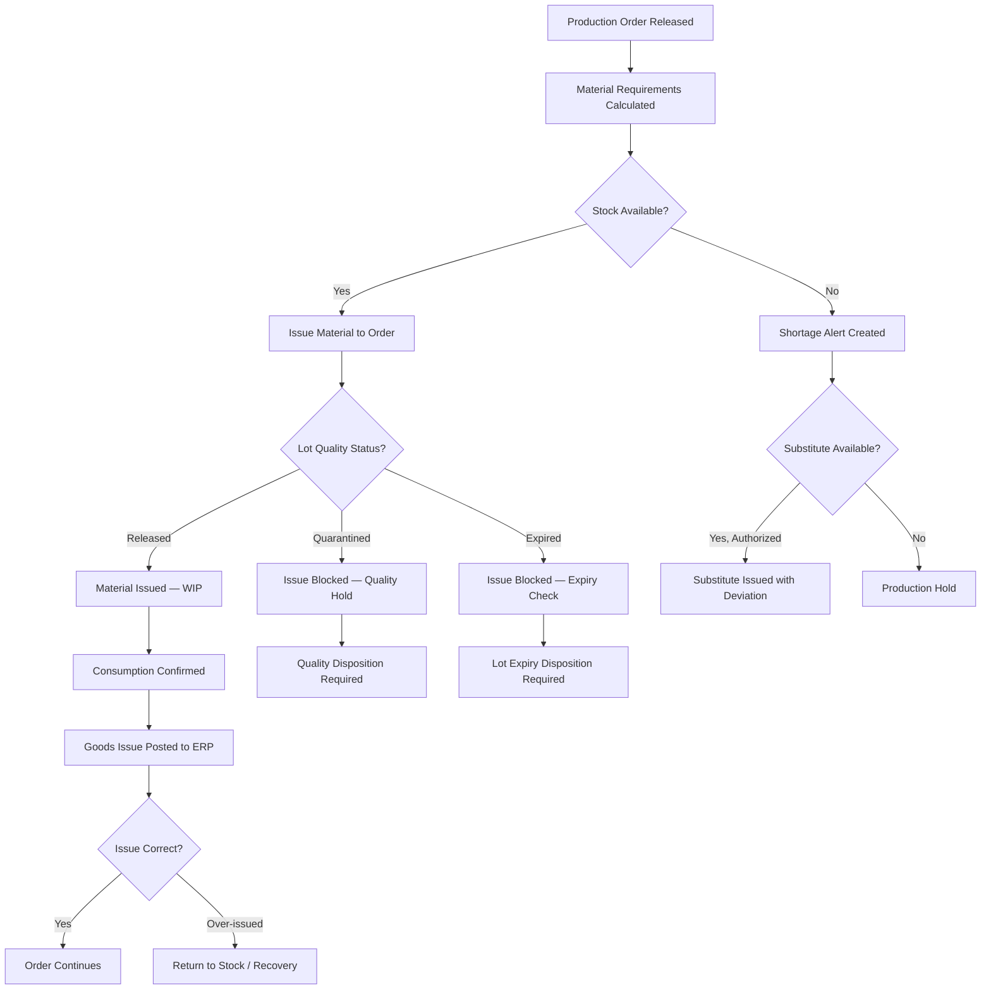

# Edge Cases — Material Shortage

## Overview

Material management in the MES covers the issuance, tracking, and reconciliation of raw materials, components, and sub-assemblies against production orders. The MES interfaces with the Warehouse Management System (WMS) and SAP Materials Management (MM) module to confirm stock availability, execute goods issues, and maintain lot traceability through to finished goods.

Edge cases in material management are high-impact because shortages can halt production, while incorrect issuances create inventory discrepancies that cascade through ERP costing, MRP replenishment, and customer fulfillment. Material traceability is a regulatory requirement for many discrete manufacturing verticals (medical devices, automotive, aerospace).

---

## Edge Case Scenarios

### Material Shortage Mid-Production Run

**Scenario Description**

A production order is mid-execution when the material supply for a required component is exhausted — either because the issued quantity was insufficient, the actual consumption rate was higher than planned, or another concurrent order consumed the last available stock.

**Trigger Conditions**

- BOM consumption is higher than theoretical due to scrap or rework on the line
- A concurrent production order issues the last available stock before the current order's requirements are fully met
- Physical count reveals a discrepancy with ERP stock levels (phantom inventory)
- A lot is recalled mid-run due to a retroactive quality hold

**System Behavior**

The MES monitors component consumption in real time. When the remaining issued quantity for a component falls below the `LOW_STOCK_THRESHOLD` (default: 20% of remaining requirement), a low-stock alert is sent to the material handler and production supervisor. When the issued quantity reaches zero and the production order still has unfulfilled requirements, the MES generates a `MATERIAL_SHORTAGE` event and transitions the operation to `MATERIAL_HOLD` status.

The shortage event triggers an emergency replenishment request to the WMS and a material exception alert to the production planner and supply chain team. The MES calculates the maximum producible quantity with the remaining on-hand stock across all available lots and presents this to the supervisor. The supervisor can authorize partial completion up to the maximum producible quantity, or place the full order on hold pending replenishment.

**Expected Resolution**

Replenishment arrives and the order is completed, or the order is partially completed and the remaining quantity is rescheduled. Inventory discrepancies between ERP and physical stock are flagged for investigation.

**Test Cases**

| ID | Input | Expected Output | Pass/Fail Criteria |
|---|---|---|---|
| MS-MID-01 | Component reaches 20% of remaining requirement | Low-stock alert sent to material handler and supervisor | Alert includes component ID, current stock, remaining requirement, and estimated time to depletion |
| MS-MID-02 | Component reaches zero; order still has 40 units remaining | `MATERIAL_SHORTAGE` event; operation enters `MATERIAL_HOLD` | WMS replenishment request created; maximum producible quantity calculated |
| MS-MID-03 | Supervisor authorizes partial completion (60 of 100 units) | Order partially completed; remaining 40 units rescheduled | Partial GR sent to ERP; shortage rescheduling record created |
| MS-MID-04 | Phantom inventory: ERP shows 50 units available but physical = 0 | Discrepancy flagged; inventory freeze created; ERP stock count request generated | Physical count request sent to WMS; no issue allowed until reconciled |

---

### Partial Lot Availability

**Scenario Description**

The production order requires 500 units of a component, but the only available lot contains 300 units. The order can be fulfilled by combining multiple lots or must be partially executed and rescheduled.

**Trigger Conditions**

- Only one lot of a component is available and it is smaller than the order requirement
- Multiple lots are available but none individually meet the full requirement
- One lot is in `RELEASED` quality status; the remaining requirement would need a lot currently in `UNDER_INSPECTION`

**System Behavior**

When the MES calculates material requirements at release, it checks whether the full quantity can be satisfied from `RELEASED` lots. If partial lot availability is detected, the system presents the material planner with the allocation options:

1. **Split issue:** Issue available quantity from current lots; remaining quantity reserved from the next expected lot (goods receipt date shown).
2. **Partial order start:** Release the order for the available quantity; hold the remainder until full stock is available.
3. **Multi-lot issue:** Combine multiple partial lots to meet the full requirement (requires traceability configuration to support multi-lot assemblies).

For multi-lot issues, the MES records each lot used and the quantity consumed from each, maintaining full component traceability at the assembly level.

**Expected Resolution**

The order is executed with the available quantity (single or multi-lot) or the partial availability is explicitly managed with a production hold for the remainder. All lot usage is traceable.

**Test Cases**

| ID | Input | Expected Output | Pass/Fail Criteria |
|---|---|---|---|
| MS-PLA-01 | Order requires 500 units; one lot of 300 available | Partial availability alert; planner presented with split-issue or partial-order options | Alert includes available quantity, required quantity, and next expected replenishment date |
| MS-PLA-02 | Planner selects multi-lot issue (3 lots of 200, 150, 150) | All three lots issued; per-lot quantities recorded in traceability | Traceability record shows each lot ID, quantity, and issue timestamp |
| MS-PLA-03 | Second lot is in `UNDER_INSPECTION` | Second lot cannot be issued; only `RELEASED` lot issued; remainder held | `QUALITY_HOLD_PENDING` status on material reservation for second lot |
| MS-PLA-04 | Inspection of second lot completes; lot released | System auto-triggers remaining material issue; production hold lifted | Auto-issue event generated when lot transitions to `RELEASED`; hold lifted without manual intervention |

---

### Lot Expiry During Production

**Scenario Description**

A material lot that was valid at the time of issue reaches its expiry date while the production order is still in progress, creating a situation where in-process material is technically expired before the finished goods are complete.

**Trigger Conditions**

- Shelf life of a component is short (days or hours) and production order spans the expiry window
- Production delays (downtime, rework) extend the order duration beyond the lot's original expiry margin
- Expiry date is misconfigured in the system; actual expiry is earlier than recorded

**System Behavior**

The MES shelf life engine monitors active material issues for approaching and actual expiry. At a configurable warning threshold (default: 24 hours before expiry), a pre-expiry alert is sent to the quality engineer and production supervisor. At the moment of expiry, the material issue record is flagged as `EXPIRED_IN_PROCESS`.

The system does not automatically halt production at the moment of expiry — halting an in-progress operation mid-cycle may create more risk than completing it. Instead, the operation is flagged for post-completion quality review. The supervisor is required to acknowledge the expiry event. The finished goods from this production segment are placed on a quality hold pending engineering disposition of the expired-in-process condition.

If the production delay that caused the expiry was due to a machine breakdown or other documented event, this context is automatically captured in the expiry event record.

**Expected Resolution**

The quality engineering team reviews the expired-in-process event and determines whether the finished goods are acceptable. If the shelf life overrun is within a permitted extension (documented in the material specification), a use-extension authorization is created and the hold is lifted. Otherwise, the finished goods are rejected and scrapped.

**Test Cases**

| ID | Input | Expected Output | Pass/Fail Criteria |
|---|---|---|---|
| MS-LXP-01 | Component lot expires in 20 hours; production order will take 30 hours | Pre-expiry alert at 24h warning threshold | Alert includes lot ID, expiry timestamp, and estimated production completion time |
| MS-LXP-02 | Lot expires while operation is mid-cycle | Operation flagged `EXPIRED_IN_PROCESS`; supervisor acknowledgment required | Supervisor acknowledgment captured; production continues; finished goods placed on hold |
| MS-LXP-03 | Use-extension authorization issued for 6-hour overrun | Quality hold lifted; extension record linked to lot, order, and authorizing engineer | Extension record includes authorization reference, new acceptable-until time, and approver |
| MS-LXP-04 | No use-extension authorized; lot expired by 12 hours | Finished goods dispositioned for scrap; scrap record created in ERP | ERP scrap posting generated; yield variance captured |

---

### Substitute Material Authorization

**Scenario Description**

The required material is unavailable, but an alternative material has been identified that could substitute. The substitute material may have slightly different specifications and requires engineering authorization before use in production.

**Trigger Conditions**

- Primary material is out of stock and lead time is unacceptable for the production deadline
- A vendor quality hold has been placed on the primary material lot
- Engineering has pre-approved a substitute but it has not yet been activated in the BOM

**System Behavior**

When a shortage is declared and a substitute candidate is identified (either from a pre-configured substitute BOM list or manually proposed by the materials team), the MES initiates a substitute material authorization workflow. The workflow requires sign-off from:

1. Manufacturing Engineering — confirming the substitute is technically compatible
2. Quality — confirming the substitute meets all quality requirements
3. Design Engineering (for design-controlled characteristics) — confirming no regulatory impact

The authorization is time-limited (configurable per substitute, default: 30 days) and quantity-limited (authorized quantity only). The authorization references the specific production orders and part numbers it covers. If the substitute has different process parameters (cycle times, temperatures, feeds/speeds), the MES applies the substitute's routing parameters for the authorized orders.

Once authorized, the substitute material is issued with a `SUBSTITUTE_AUTHORIZATION` flag. This flag propagates through the lot genealogy to finished goods and is visible in traceability reports and outgoing shipment documentation.

**Expected Resolution**

The substitute material is used under documented authorization. Finished goods carry the substitute flag in their traceability records. The authorization expires automatically after the defined period and quantity.

**Test Cases**

| ID | Input | Expected Output | Pass/Fail Criteria |
|---|---|---|---|
| MS-SMA-01 | Shortage on P/N 123456; substitute P/N 789012 proposed | Authorization workflow created; engineering, quality, and design teams notified | Workflow includes part numbers, order scope, and proposed authorization period |
| MS-SMA-02 | All three approvers sign off | Substitute authorized; substitute material issuable against target orders | Authorization record includes all approver IDs, timestamps, and scope |
| MS-SMA-03 | Substitute issued for order ORD-2025-001 | Issue record flagged `SUBSTITUTE_AUTHORIZATION`; flag propagates to finished goods lot | Finished goods traceability record includes substitute authorization reference |
| MS-SMA-04 | Attempt to use substitute on order not covered by authorization | Issue blocked; error references authorization scope limitation | Authorization scope validation enforced at issue time; out-of-scope orders blocked |

---

### Over-Issue Recovery

**Scenario Description**

More material than required was issued to a production order — either through system error, operator error, or BOM quantity rounding — creating an inventory discrepancy and potentially a traceability gap for the excess material.

**Trigger Conditions**

- Operator enters incorrect quantity in the goods issue screen
- BOM quantity rounding results in an extra full unit being issued when a fractional quantity was needed
- Automatic issue triggered twice due to a system retry after a timeout
- Material issued for a cancelled or reduced production order quantity

**System Behavior**

When an over-issue is detected (actual issued quantity exceeds BOM requirement by more than the configured tolerance — default: 5%), the MES raises an `OVER_ISSUE` event and alerts the material handler and supervisor. The system calculates the excess quantity and creates an automatic return-to-stock request in the WMS for the excess quantity.

The return must be executed against the specific lot(s) from which the excess was issued. If the excess material has already been consumed (i.e., physically incorporated into production and cannot be returned), the difference is recorded as an unplanned consumption variance. The variance is posted to ERP as a goods movement with the appropriate cost element for excess material consumption.

**Expected Resolution**

Excess physical material is returned to the correct storage location and lot. If it cannot be returned (consumed in production), the variance is documented and posted to ERP. Traceability records are corrected to reflect the actual quantities used.

**Test Cases**

| ID | Input | Expected Output | Pass/Fail Criteria |
|---|---|---|---|
| MS-OIR-01 | BOM requires 10 units; 13 units issued | `OVER_ISSUE` alert; return-to-stock request for 3 units generated | Return request references specific lot and issued quantity; over-issue logged |
| MS-OIR-02 | Return-to-stock executed; 3 units physically returned | WMS receipt created; ERP reversal GI posted; inventory reconciled | ERP reversal document matches lot and quantity; inventory balance corrected |
| MS-OIR-03 | Excess material already consumed in production | Unplanned consumption variance recorded; ERP cost variance posting made | Variance record includes order, component, quantity, and reason code |
| MS-OIR-04 | Duplicate issue transaction due to system retry | Duplicate detected via idempotency check; second transaction rejected | First transaction confirmed; second rejected with `DUPLICATE_ISSUE` error; no double posting |

---

### Negative Inventory Prevention

**Scenario Description**

A material issue transaction would result in a negative inventory balance in the MES or ERP — typically due to timing differences, concurrent transactions, or inventory record errors. Negative inventory is prohibited to prevent phantom stock and invalid material consumption records.

**Trigger Conditions**

- Two concurrent production orders both request the last available units; one succeeds, the other would create a negative balance
- Goods receipt not yet posted in ERP but material is physically available in the warehouse
- Inventory adjustment is pending while an issue is attempted

**System Behavior**

Before processing any goods issue, the MES queries the current available stock quantity from the WMS/ERP integration layer using a real-time stock check (not a cached value). If the requested issue quantity exceeds the available stock, the transaction is blocked with a `NEGATIVE_INVENTORY_PREVENTION` error. The system does not allow the transaction to proceed, even with supervisor override, until sufficient stock is confirmed.

If the goods receipt is in transit (physical stock present but not yet posted), the material handler can create a `PENDING_GR_CONFIRMATION` record that temporarily reserves the in-transit quantity against the production order. Once the GR is officially posted, the issue transaction is automatically completed.

**Expected Resolution**

No negative inventory is created. Either the production order waits for sufficient stock to be available, or a goods receipt is processed and the issue completes automatically.

**Test Cases**

| ID | Input | Expected Output | Pass/Fail Criteria |
|---|---|---|---|
| MS-NIP-01 | Issue 50 units; available stock = 30 units | Transaction blocked; `NEGATIVE_INVENTORY_PREVENTION` error returned | Block is immediate; error includes available quantity and requested quantity |
| MS-NIP-02 | Two concurrent orders each requesting last 30 units of 30 available | First order issues 30 units successfully; second order blocked by negative inventory check | Exactly 30 units issued total; second order receives shortage alert |
| MS-NIP-03 | Physical stock present; GR not yet posted in ERP | Material handler creates `PENDING_GR_CONFIRMATION` reservation | Reservation holds stock; prevents it from being allocated to another order |
| MS-NIP-04 | GR posted; pending reservation fulfilled | Issue transaction auto-completes; production resumes | Auto-completion triggered by GR posting event; no manual intervention required |

---

### Split Lot Traceability

**Scenario Description**

A material lot is physically split into two containers or sub-lots during handling (partial delivery to line, quality hold on portion of lot), and the traceability system must maintain independent tracking of each sub-lot while preserving the link to the parent lot.

**Trigger Conditions**

- A large inbound lot is split for delivery to two different production lines
- A quality hold is placed on a portion of a lot; the remainder continues into production
- A lot is split during receiving inspection (portion passes, portion fails)

**System Behavior**

Lot splitting creates child lot records from the parent. The parent lot is marked `SPLIT` and is no longer directly issuable — only child lots can be issued. Each child lot inherits the parent's quality status, expiry date, and supplier information at the time of split, but subsequently maintains an independent status and can be independently dispositioned.

Child lots carry a `PARENT_LOT_ID` reference in their header, and the parent lot maintains a `CHILD_LOTS` list. The lot genealogy tree in the traceability report shows the full parent-child-grandchild hierarchy. Any quality event (hold, disposition, expiry update) applied to a child lot does not automatically propagate to other child lots.

The MES prevents the same physical quantity from existing in both parent and child lots — the split transaction transfers quantity from parent to children, and the sum of all child lot quantities must equal the parent lot quantity at the time of split.

**Expected Resolution**

Each child lot is independently traceable from receipt through to finished goods consumption. The traceability report can reconstitute the full genealogy from any point in the supply chain.

**Test Cases**

| ID | Input | Expected Output | Pass/Fail Criteria |
|---|---|---|---|
| MS-SLT-01 | Lot L001 (500 units) split into L001-A (300) and L001-B (200) | Parent L001 marked `SPLIT`; two child lots created; parent no longer issuable | Sum of child quantities = 500; parent lot balance = 0 |
| MS-SLT-02 | L001-A issued to production line 1; L001-B held for quality inspection | L001-A issue succeeds; L001-B blocked (quality hold) | Independent status enforced; L001-A issuance does not affect L001-B |
| MS-SLT-03 | Quality hold on L001-B; L001-A already consumed in finished goods | Finished goods from L001-A unaffected; L001-B hold does not retroactively flag L001-A consumption | Independent child lot tracking confirmed; no cross-contamination |
| MS-SLT-04 | Traceability query for finished goods using L001-A material | Report shows: Finished Good → Production Order → Lot L001-A → Parent Lot L001 → Supplier | Full genealogy chain intact; parent lot supplier details visible |

---

### Quarantined Material Accidentally Issued

**Scenario Description**

A material lot that is in `QUARANTINED` or `HOLD` quality status is accidentally issued to a production order — either due to a WMS scan error, a system status synchronization delay, or incorrect label scanning.

**Trigger Conditions**

- Quality hold placed in MES but status has not yet propagated to WMS (sync delay)
- Operator manually scans a quarantine label but the scanner returns the wrong lot ID
- Emergency production situation leads supervisor to override the quarantine warning

**System Behavior**

The MES performs a quality status check at the point of goods issue scan. If the scanned lot is in `QUARANTINED`, `ON_HOLD`, or `REJECTED` status, the issue is blocked with a `QUALITY_BLOCKED_ISSUE` error and the block reason is displayed on the operator terminal. The block cannot be overridden without a supervisor authorization with a documented reason.

If a quarantined lot is discovered to have been issued (e.g., due to a synchronization delay that allowed the issue to process before the hold status arrived), the MES triggers a retroactive investigation. The issued quantity is traced through the production record. The affected operations and any completed assemblies or finished goods are flagged `SUSPECT`. An urgent quality review is initiated.

**Expected Resolution**

Proactive cases: The issue is blocked; a conforming lot is substituted. Retroactive cases: The issued quantity is traced, affected WIP/FG is quarantined, and a disposition decision is made by the quality team.

**Test Cases**

| ID | Input | Expected Output | Pass/Fail Criteria |
|---|---|---|---|
| MS-QMI-01 | Operator scans quarantined lot for goods issue | Issue blocked; `QUALITY_BLOCKED_ISSUE` displayed on terminal | Block immediate; lot ID and hold reason shown; supervisor override workflow offered |
| MS-QMI-02 | Status sync delay: quarantine placed in MES 3 min after issue completed | Retroactive investigation triggered; affected operations flagged `SUSPECT` | Retroactive flag applied to all operations using the issued lot; quality review created |
| MS-QMI-03 | Supervisor overrides block with reason code `EMERGENCY_PRODUCTION` | Issue proceeds with override; authorization record created; quality notified | Override record includes supervisor ID, reason, timestamp; quality team alert sent |
| MS-QMI-04 | Retroactive investigation finds quarantined material in finished goods | Finished goods quarantined; customer notification assessment initiated | FG quarantine transaction created; notification assessment references the quality hold |

---

### Vendor Lot Quality Hold Received After Issue

**Scenario Description**

A vendor issues a quality alert or recall for a specific lot of supplied material after that lot has already been received, accepted, and partially or fully issued into production at the manufacturer's facility.

**Trigger Conditions**

- Vendor sends an 8D or quality alert document after the lot is already in use
- Internal lab testing (performed after initial acceptance) reveals a nonconformance
- Industry-wide safety alert is received for a component batch that includes the affected lot

**System Behavior**

This scenario is handled by the Retroactive Quality Hold workflow (see Quality Control edge cases), but with material-specific extensions in the MES supply chain module. When a vendor quality alert is received, the supply chain team enters the vendor lot number into the MES. The system performs a forward traceability search identifying all internal lot IDs received from that vendor lot, all production orders that consumed material from those lots, all WIP operations currently using those materials, and all finished goods assembled using those materials.

The impact report is generated automatically and routes to quality, supply chain, and customer service. Physical stock is immediately quarantined. In-process WIP using the material receives a `VENDOR_HOLD_IN_PROCESS` flag. Finished goods using the material are flagged for customer notification assessment.

**Expected Resolution**

The full impact is assessed within the configured response SLA (default: 4 hours for Safety Class A alerts, 8 hours for Class B). Disposition decisions are made for each impact category (in-stock, WIP, finished goods, shipped goods). Customer notification decisions are documented.

**Test Cases**

| ID | Input | Expected Output | Pass/Fail Criteria |
|---|---|---|---|
| MS-VQH-01 | Vendor quality alert for lot VL-2025-099; lot already consumed in 5 orders | Impact report generated; 5 orders flagged; remaining stock quarantined | Impact report generated within system SLA; all 5 order IDs listed |
| MS-VQH-02 | Two production orders actively using material from VL-2025-099 | Both orders receive `VENDOR_HOLD_IN_PROCESS` flag; supervisors alerted | Alert includes vendor alert reference number, material ID, and recommended action |
| MS-VQH-03 | Finished goods from VL-2025-099 already shipped to customer | Customer notification assessment created; quality director and customer service notified | Assessment includes shipment reference, customer ID, quantity, and ship date |
| MS-VQH-04 | Vendor alert found to be false alarm after investigation | Impact flags removed; quarantined stock released; documentation of false alarm retained | All flags and quarantines cleared with reference to vendor retraction document |
