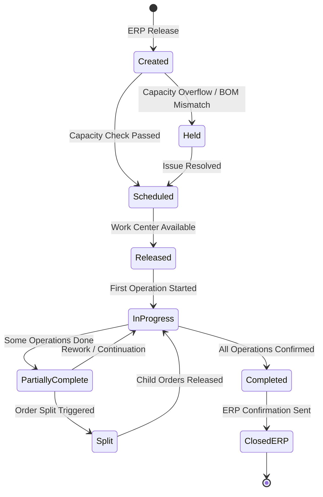

# Edge Cases — Production Order Management

## Overview

Production order management in the MES orchestrates the lifecycle of discrete manufacturing work orders from ERP release through shop-floor execution to completion confirmation back to SAP. This document covers edge cases arising from concurrency, capacity constraints, data synchronization failures, and operational corrections that occur in high-throughput discrete manufacturing environments.

All scenarios assume the MES is the system of execution while SAP S/4HANA is the system of record for production orders. The MES receives orders via IDoc/BAPI or REST APIs and manages real-time status through to goods receipt confirmation.

---

## Edge Case Scenarios

### Concurrent Order Release

**Scenario Description**

Two schedulers simultaneously release the same production order from different MES terminals, or an ERP-triggered automatic release races with a manual release initiated from the MES shop-floor scheduling screen.

**Trigger Conditions**

- Two API calls to `POST /production-orders/{id}/release` arrive within the same transaction window (< 50ms apart)
- ERP batch job pushes order status change via IDoc while a supervisor manually releases the order on the terminal
- Retry logic on a timed-out release request sends a duplicate

**System Behavior**

The MES applies an optimistic locking strategy using an `etag` (version hash) on the production order resource. The first request to acquire the row-level database lock succeeds and transitions the order to `RELEASED`. The second concurrent request detects a version mismatch and returns HTTP 409 Conflict with a `X-Conflict-Resource: production-order/{id}` header. The system does not create a duplicate order or duplicate work center allocation. An idempotency key (`X-Idempotency-Key`) on the release endpoint ensures that a retry of the same logical request from the same client is recognized and returns the successful outcome without re-processing.

**Expected Resolution**

The order is released exactly once. The operator whose request lost the race receives a conflict notification in the UI with the current order state. ERP is notified of the single release event. No duplicate capacity reservation is created on the work center.

**Test Cases**

| ID | Input | Expected Output | Pass/Fail Criteria |
|---|---|---|---|
| PO-CC-01 | Two simultaneous `POST /release` calls with same order ID, same version | First call: 200 OK, order status `RELEASED`; Second call: 409 Conflict | Exactly one `RELEASED` event in audit log; no duplicate work center allocation |
| PO-CC-02 | ERP IDoc release + manual MES release within 30ms | Order released once; ERP receives single confirmation | Single `production_order.released` Kafka event; idempotency log entry created |
| PO-CC-03 | Client retries release after network timeout using same idempotency key | 200 OK with cached response; no duplicate processing | Idempotency key hit logged; order state unchanged from first successful call |
| PO-CC-04 | Release of same order from two different user sessions 5 seconds apart | First succeeds; second returns 409 with current etag | 409 response body contains `currentVersion` field; UI refreshes to current state |

---

### Capacity Overflow

**Scenario Description**

A production order is released to a work center that has already reached 100% of its available machine hours or operator capacity for the target shift, creating an overloaded schedule.

**Trigger Conditions**

- Multiple high-priority orders are released simultaneously against the same bottleneck work center
- A shift capacity change (operator absence, machine downtime) reduces available capacity after orders were already scheduled
- ERP releases an order with a requested start date that falls within an already-full capacity window

**System Behavior**

During release, the MES performs a real-time capacity availability check against the work center calendar and existing confirmed operation load. If utilization would exceed the configured threshold (default: 100%, configurable per work center), the order enters a `CAPACITY_HOLD` state rather than `RELEASED`. The MES sends an alert to the production scheduler via the notification service and logs a `CAPACITY_OVERFLOW` event with the work center ID, order ID, required capacity (hours), available capacity (hours), and overflow percentage. The ERP order status is updated to reflect the hold. The scheduler can override the hold with explicit confirmation, triggering a capacity overload acknowledgment record.

**Expected Resolution**

The order is held pending scheduler intervention. The scheduler either reschedules the order to a different shift/work center, splits the order, or explicitly overrides the capacity constraint with a documented reason. Capacity metrics are updated in real time. OEE projections account for overloaded states.

**Test Cases**

| ID | Input | Expected Output | Pass/Fail Criteria |
|---|---|---|---|
| PO-CAP-01 | Release order requiring 8h to work center with 2h remaining capacity | Order enters `CAPACITY_HOLD`; scheduler notified | `CAPACITY_OVERFLOW` event logged with overflow delta = 6h |
| PO-CAP-02 | Scheduler overrides hold with reason code `AUTHORIZED_OVERTIME` | Order transitions to `RELEASED`; override audit record created | Audit record contains user ID, timestamp, override reason, capacity delta |
| PO-CAP-03 | Capacity frees up (order cancelled) while new order is on hold | System automatically re-evaluates hold; order auto-releases if capacity now sufficient | Auto-release event generated; scheduler notified |
| PO-CAP-04 | 10 orders released simultaneously, work center capacity for 3 | First 3 pass capacity check and release; remaining 7 enter `CAPACITY_HOLD` | Capacity allocation is first-come-first-served by timestamp; no deadlock |

---

### Partial Completion

**Scenario Description**

A production order is partially completed — some operations are confirmed and goods partially produced — but the order cannot be finished due to material shortage, machine breakdown, or shift end with no continuation plan.

**Trigger Conditions**

- Material runs out mid-order leaving some planned quantity unproduced
- Machine breakdown after partial production during a shift
- Operator closes shift with operations partially confirmed and no follow-on shift assigned

**System Behavior**

The MES allows partial quantity confirmation at the operation level. When an order is partially confirmed, the system creates an `actual_quantity_produced` record that is less than `planned_quantity`. The order status transitions to `PARTIALLY_COMPLETE`. The MES updates ERP with a partial goods receipt (GR) for the confirmed quantity using the BAPI `BAPI_PRODORDCONF_CREATE_TT`. Remaining open quantity is retained in the MES order. The system flags the order for rescheduling and calculates the yield shortfall. If the partial completion is due to a machine breakdown, a downtime record is automatically linked to the order.

**Expected Resolution**

The partially completed quantity is confirmed in ERP and inventory. The remaining quantity is rescheduled or the order is formally closed as a short shipment with a documented reason code. Variance reporting captures actual vs. planned yield.

**Test Cases**

| ID | Input | Expected Output | Pass/Fail Criteria |
|---|---|---|---|
| PO-PC-01 | Order for 100 units; 60 units confirmed, material exhausted | Status = `PARTIALLY_COMPLETE`; GR for 60 units sent to ERP | ERP GR document created for 60 units; remaining 40 flagged in MES |
| PO-PC-02 | Partial completion confirmed, then machine breakdown registered | Downtime record linked to order; OEE impact captured | Downtime event references order ID and operation number |
| PO-PC-03 | Partial completion followed by order closure (short shipment) | Order closed with `SHORT_SHIPMENT` reason; ERP order technically completed | ERP confirmation sent for actual qty; variance report generated |
| PO-PC-04 | Partial completion, then continuation next shift with new operator | Continuation order picks up from last confirmed operation | Operation sequence continuity maintained; no duplicate confirmations |

---

### BOM Version Mismatch

**Scenario Description**

A production order is released in MES against a Bill of Materials (BOM) version that has since been updated in SAP, creating a mismatch between the materials and quantities in the MES work order and the current engineering BOM.

**Trigger Conditions**

- Engineering change order (ECO) approved in SAP after production order was created but before MES release
- MES BOM cache is stale due to a failed synchronization cycle
- Manual BOM override applied in SAP without MES notification

**System Behavior**

At release time, the MES validates the BOM version on the production order against the current active BOM in the MES BOM repository (synchronized from SAP). If a version mismatch is detected, the order is held with status `BOM_VERSION_HOLD`. The system logs the expected BOM version (from order), the current active BOM version, and the delta in components (added, removed, or quantity-changed components). A notification is sent to the engineering and production planning teams. The operator cannot proceed with material issue against the stale BOM without resolution.

**Expected Resolution**

Production planning either updates the production order in SAP to reference the current BOM version and re-releases it, or formally documents a deviation (permitted use of old BOM version) via an engineering deviation record. The MES accepts either path with appropriate audit trail.

**Test Cases**

| ID | Input | Expected Output | Pass/Fail Criteria |
|---|---|---|---|
| PO-BOM-01 | Release order with BOM v3; current active BOM is v4 | Order held with `BOM_VERSION_HOLD`; delta report shows changed components | Delta report lists component changes between v3 and v4 accurately |
| PO-BOM-02 | SAP updates order to BOM v4; MES receives update | Hold lifted automatically; order transitions to `RELEASED` | Hold-lift event logged with triggering SAP IDoc reference |
| PO-BOM-03 | Engineering deviation submitted for BOM v3 use | Deviation record linked to order; order released with deviation flag | Deviation reference visible in order header and traceability record |
| PO-BOM-04 | BOM sync failure; MES cache is 24h stale | All new releases flagged for manual BOM validation; alert raised to Integration team | Stale-cache alert triggers when sync age exceeds configurable threshold (default: 2h) |

---

### ERP Sync Failure During Release

**Scenario Description**

The MES successfully releases a production order on the shop floor (work center allocated, materials staged), but the confirmation back to SAP ERP fails due to network connectivity loss or SAP system unavailability.

**Trigger Conditions**

- SAP BASIS scheduled downtime during MES release window
- Network partition between MES application tier and SAP RFC gateway
- SAP IDoc inbound processing queue backup causing timeout

**System Behavior**

The MES uses an outbox pattern for ERP confirmations. When the SAP call fails, the confirmation event is persisted to the `erp_outbox` table with status `PENDING`. The MES continues local execution — the production order is `RELEASED` in the MES, and shop-floor operations can begin. A background retry processor attempts the SAP confirmation at configurable intervals (default: 30s, 1m, 5m, exponential backoff up to 1h). The MES UI displays a `ERP_SYNC_PENDING` badge on affected orders. Once SAP connectivity is restored, the outbox processor replays the confirmation. Deduplication on the SAP side prevents double-posting.

**Expected Resolution**

The ERP confirmation is eventually delivered. No production stoppage occurs due to ERP unavailability. The order lifecycle completes in both systems with consistent status. The outbox is cleared within one minute of SAP connectivity restoration.

**Test Cases**

| ID | Input | Expected Output | Pass/Fail Criteria |
|---|---|---|---|
| PO-ERP-01 | Release order; SAP RFC unavailable | MES order `RELEASED`; outbox entry created; UI shows `ERP_SYNC_PENDING` | Production can begin; outbox entry in `PENDING` state |
| PO-ERP-02 | SAP recovers after 45 minutes | Outbox replays; SAP order updated; `ERP_SYNC_PENDING` badge removed | SAP order status matches MES within 60s of recovery |
| PO-ERP-03 | SAP returns permanent error (order locked by another user) | Outbox entry transitions to `FAILED`; alert sent to ERP integration team | Alert contains SAP error code, order ID, retry count, last attempt timestamp |
| PO-ERP-04 | Network recovers; duplicate retry sent to SAP | SAP deduplication rejects second IDoc; MES confirms receipt of acknowledgment | Exactly one SAP production order confirmation document created |

---

### Retroactive Time Correction

**Scenario Description**

An operator or supervisor needs to correct the start or end time of a completed operation after the fact — for example, because the operator forgot to clock in/out at the correct time, or the MES terminal was offline and times were captured manually on paper.

**Trigger Conditions**

- Operator reports incorrect timestamp after shift end
- MES terminal was offline; paper records are used to reconstruct timing
- System clock synchronization error caused incorrect timestamps to be recorded

**System Behavior**

The MES permits retroactive time corrections subject to a configurable correction window (default: 72 hours from the event timestamp). Corrections beyond the window require a supervisor override with a documented reason. All corrections are written as amendment records — the original record is preserved and marked as `SUPERSEDED`, and the correction is written as a new record linked to the original with a `CORRECTION_OF` relationship. The corrected record carries the correcting user's ID, timestamp of correction, and reason code. OEE calculations, labor efficiency reports, and ERP confirmations (if not yet sent) are recalculated using the corrected times. If ERP has already received the original confirmation, a correction IDoc is generated.

**Expected Resolution**

Corrected times are reflected in all downstream calculations. Original records are preserved for audit. ERP is updated where applicable. Reports show a correction flag on affected records.

**Test Cases**

| ID | Input | Expected Output | Pass/Fail Criteria |
|---|---|---|---|
| PO-RTC-01 | Correct operation end time from 14:30 to 14:15 within 24h | Correction record created; OEE recalculated; original marked `SUPERSEDED` | OEE delta recalculated; audit trail shows both original and correction |
| PO-RTC-02 | Correction attempted 96h after event (beyond 72h window) | System requires supervisor override; correction not applied without override | Supervisor override request created; original record unchanged until approved |
| PO-RTC-03 | Time correction on operation already confirmed to ERP | Correction IDoc sent to SAP; ERP confirmation document updated | SAP confirmation reflects corrected times; MES-ERP delta report is clean |
| PO-RTC-04 | Batch retroactive correction of 50 operations from paper records | Bulk import processes all corrections; OEE batch recalculated | All 50 corrections applied; bulk correction audit entry references import batch ID |

---

### Order Splitting and Merging

**Scenario Description**

A production order needs to be split into multiple child orders (for parallel execution across work centers, or due to partial capacity availability) or multiple small orders need to be merged into a single consolidated order for efficiency.

**Trigger Conditions**

- Scheduler manually initiates a split to run sub-quantities on two parallel work centers
- Capacity overflow forces splitting of a large order across two shifts
- Multiple small orders for the same part and work center are merged to reduce setup time
- ERP initiates a split via a configuration change order

**System Behavior**

**Split:** The MES creates child production orders derived from the parent, distributing planned quantity across children. The parent order transitions to `SPLIT` status and cannot be directly confirmed. Each child order carries the parent's BOM reference, routing, and priority. Material requirements are recalculated per child. Traceability links parent-child relationships. ERP is notified of the split via IDoc.

**Merge:** Merge is permitted only for orders in `SCHEDULED` or `RELEASED` status for the same material number, same BOM version, same work center, and same target date. A merged order inherits the highest priority of the constituent orders. All original order IDs are recorded as predecessors in the merged order header. ERP is notified of the merge.

**Expected Resolution**

Split: All child orders complete and confirm back to ERP. Parent order auto-closes when all children complete. Traceability shows full parent-child lineage.
Merge: Single order executes and confirms. All original order references are traceable in the audit trail.

**Test Cases**

| ID | Input | Expected Output | Pass/Fail Criteria |
|---|---|---|---|
| PO-SM-01 | Split order of 200 units into two children of 100 each | Two child orders created; parent in `SPLIT` status; ERP notified | Parent-child links in traceability; total planned qty = 200 |
| PO-SM-02 | Complete one child order; other still in progress | Parent remains in `SPLIT`; partial GR for completed child sent to ERP | ERP GR for child quantity; parent closure deferred |
| PO-SM-03 | Merge three orders for same material on same work center | Single merged order created; predecessors listed; highest priority inherited | ERP notified of merge; original order IDs preserved in merged order header |
| PO-SM-04 | Attempt to merge orders with different BOM versions | Merge rejected with `BOM_VERSION_CONFLICT` error | Rejection reason logged; original orders unchanged |

---

### Priority Inversion

**Scenario Description**

A low-priority production order has been scheduled first on a work center, and a higher-priority order arrives or is escalated after the low-priority order has already started setup or early execution, creating a priority inversion that may require interrupting ongoing work.

**Trigger Conditions**

- Customer escalates an order to `HOT` priority after a lower-priority order has begun setup
- ERP releases a rush order with `RUSH` priority flag to a work center already occupied
- Scheduler manually increases priority of a queued order above an in-progress order

**System Behavior**

The MES detects priority inversion by comparing the priority of the in-progress or setting-up order against newly released or re-prioritized orders in the work center queue. When inversion is detected, a priority inversion alert is raised to the supervisor. The system does not automatically interrupt an in-progress operation; the supervisor must explicitly initiate an order pre-emption. If pre-emption is authorized, the in-progress order is suspended (not cancelled), its current state is saved, and the high-priority order is inserted at the head of the queue. The suspended order resumes after the higher-priority order completes.

**Expected Resolution**

The high-priority order is executed first. The suspended order resumes and completes. Downtime due to the interruption (setup teardown and redo) is captured as a priority-change downtime event linked to both orders.

**Test Cases**

| ID | Input | Expected Output | Pass/Fail Criteria |
|---|---|---|---|
| PO-PI-01 | Low-priority order in setup; high-priority order arrives | Priority inversion alert raised; supervisor prompted | Alert contains both order IDs, priorities, and interruption cost estimate |
| PO-PI-02 | Supervisor approves pre-emption | Low-priority order suspended; high-priority order begins | Suspension record created; high-priority order state = `IN_PROGRESS` |
| PO-PI-03 | Supervisor rejects pre-emption | High-priority order queued behind in-progress order; requestor notified | Rejection audit record with reason; high-priority order queued, not dropped |
| PO-PI-04 | High-priority order completes; suspended order resumes | Suspended order transitions back to `IN_PROGRESS` at saved operation state | No duplicate operation confirmations; setup time correctly attributed |

---

### Work Center Unavailability at Release Time

**Scenario Description**

A production order is released in the MES but the designated work center is in a downtime state, under planned maintenance, or has been decommissioned since the order was scheduled.

**Trigger Conditions**

- Work center entered unplanned downtime between scheduling and release
- Preventive maintenance window overlaps with the scheduled production window
- Work center decommissioned or capacity-reduced due to retooling

**System Behavior**

At release time, the MES validates work center availability by checking the work center's current status (`AVAILABLE`, `DOWNTIME`, `MAINTENANCE`, `DECOMMISSIONED`). If the work center is not `AVAILABLE`, the release is blocked and the order enters `WORK_CENTER_HOLD` with the current work center status code. The system proposes alternative work centers with the same capability class and sufficient remaining capacity, ranked by priority and proximity. The scheduler can either wait for the primary work center to return to `AVAILABLE` or re-route to an alternative.

**Expected Resolution**

The order is released to an available work center (primary or alternative). ERP routing is updated if the alternative work center differs from the original routing. Traceability records the actual work center used.

**Test Cases**

| ID | Input | Expected Output | Pass/Fail Criteria |
|---|---|---|---|
| PO-WC-01 | Release order to work center in `DOWNTIME` state | Order enters `WORK_CENTER_HOLD`; alternative suggestions provided | Hold event logged; at least one alternative proposed if equivalent capacity exists |
| PO-WC-02 | Work center returns to `AVAILABLE` while order is on hold | System auto-evaluates hold; order auto-releases if no other blocks | Auto-release event logged; scheduler notified |
| PO-WC-03 | Scheduler routes order to alternative work center | Order released to alternative; ERP routing updated | ERP routing change IDoc generated; traceability records actual vs. planned WC |
| PO-WC-04 | All equivalent work centers unavailable | Order remains on hold; escalation alert sent to production manager | Escalation includes list of unavailable WCs and estimated restoration times |
