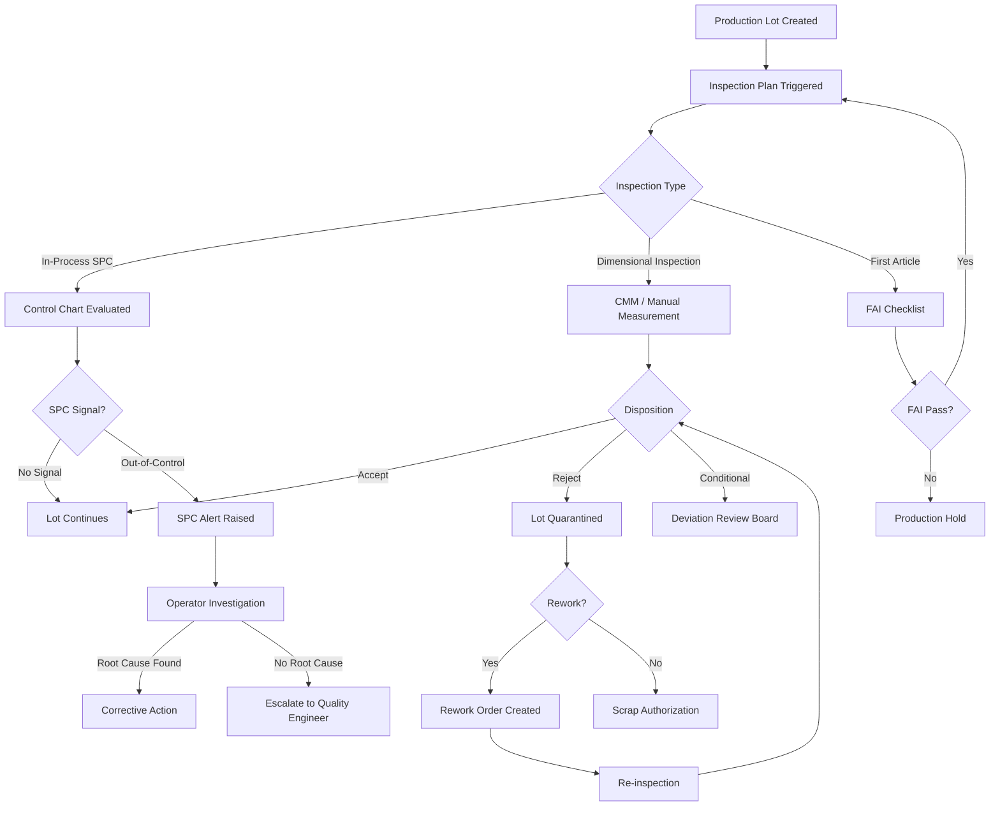

# Edge Cases — Quality Control

## Overview

Quality control in the MES encompasses statistical process control (SPC), in-process inspection, lot disposition, and integration with laboratory information management systems (LIMS). This document covers edge cases that arise at the boundaries of automated SPC monitoring, human inspection workflows, equipment calibration, and lot traceability in discrete manufacturing.

The MES quality module enforces APQP and PPAP-aligned inspection plans, supports AQL-based sampling, and integrates with coordinate measuring machines (CMMs) and vision systems via OPC-UA. Quality decisions are immutable once released — corrections follow a documented amendment process compliant with ISO 9001 and, where applicable, FDA 21 CFR Part 11.

---

## Edge Case Scenarios

### SPC Out-of-Control Signals

**Scenario Description**

A statistical process control chart for a critical dimension generates an out-of-control signal (Western Electric rules violation, Nelson rules violation, or Cp/Cpk falling below the minimum threshold) during active production, requiring immediate evaluation before further parts are produced.

**Trigger Conditions**

- Seven consecutive points on the same side of the centerline (Nelson Rule 2)
- Two out of three consecutive points beyond two sigma (Nelson Rule 3)
- Cpk drops below 1.33 (minimum threshold for critical dimensions)
- Single point beyond three sigma (Western Electric Rule 1)
- Automated measurement system pushes a data point; SPC engine evaluates in real time

**System Behavior**

The SPC engine processes incoming measurements against all active control rules for the characteristic. Upon detecting a violation, the system immediately sets the operation status to `SPC_HOLD` and prevents the operator from confirming additional parts. A real-time alert is broadcast to the operator terminal, the quality supervisor dashboard, and the shift manager notification queue. The specific violated rule(s), the out-of-control point(s), and the control chart graphic are included in the alert. The hold is production-line-specific and does not affect other operations unless the characteristic is shared across operations.

The MES records the out-of-control event with a unique ID, violated rules list, measurement values, sample timestamp, and the production order and operation reference. The quality engineer must acknowledge the alert and either initiate a process investigation or authorize continuation with documented justification.

**Expected Resolution**

The process is investigated and a root cause is identified. A corrective action record is created in the MES quality management module. Once the corrective action is verified (typically by a new sample conforming to control limits), the SPC hold is released and production resumes. All parts produced between the last in-control point and the hold are placed in a sub-lot for additional inspection.

**Test Cases**

| ID | Input | Expected Output | Pass/Fail Criteria |
|---|---|---|---|
| QC-SPC-01 | 7 consecutive measurements above centerline (Nelson Rule 2) | Operation status `SPC_HOLD`; alert raised with rule ID and data points | Hold prevents further confirmation; alert delivered within 5 seconds |
| QC-SPC-02 | Single point at 3.2 sigma above UCL | Immediate hold; Western Electric Rule 1 violation logged | Measurement value, sigma value, and UCL stored in alert |
| QC-SPC-03 | Cpk recalculated as 1.28 on critical dimension | Alert raised; quality engineer notified; `CPKVIOLATION` event logged | Alert references characteristic ID, Cpk value, and minimum threshold |
| QC-SPC-04 | Quality engineer acknowledges and authorizes continuation | SPC hold released; authorization record with justification stored | Authorization audit trail includes user ID, timestamp, justification text |
| QC-SPC-05 | SPC hold released; process produces conforming points | Normal production resumes; sub-lot from hold period flagged for 100% inspection | Sub-lot boundary defined by last in-control timestamp to hold release timestamp |

---

### Borderline Defect Disposition

**Scenario Description**

An inspected part or lot has a measurement result that falls outside specification but within a pre-defined borderline zone, or the defect classification is ambiguous between minor and major, requiring escalation beyond the standard pass/fail automated disposition.

**Trigger Conditions**

- Measurement falls between specification limit and the borderline tolerance band (typically ±10% of the tolerance)
- Visual defect is photographed but does not clearly map to a defect code in the defect catalogue
- Inspector selects `BORDERLINE` disposition code rather than `ACCEPT` or `REJECT`
- Automated vision system confidence score falls below threshold (< 85%) for a defect classification

**System Behavior**

The MES routes the borderline disposition to a Material Review Board (MRB) workflow. The lot is quarantined pending MRB decision. The MRB notification includes the measurement data, photos (if captured), the inspector's notes, the applicable specification, and the borderline zone definition. The MRB can disposition the lot as `USE_AS_IS`, `REWORK`, `REJECT_SCRAP`, or `REJECT_RETURN_TO_VENDOR`. Each disposition requires a minimum quorum of approvers (configurable per material class). The decision is recorded as immutable with all approver signatures and timestamps. If the MRB approves `USE_AS_IS`, a deviation record is automatically created and linked to the lot and any customer-facing shipment.

**Expected Resolution**

The MRB reaches a documented, multi-party decision. The lot disposition is finalized, and the appropriate action (release, rework, or scrap) is executed. The deviation record ensures traceability from the nonconforming condition to the disposition decision.

**Test Cases**

| ID | Input | Expected Output | Pass/Fail Criteria |
|---|---|---|---|
| QC-BDD-01 | Measurement 0.003mm outside nominal, within borderline zone | MRB workflow triggered; lot quarantined; MRB members notified | Quarantine timestamp matches trigger; MRB notification includes spec and measurement |
| QC-BDD-02 | MRB votes 3-0 for `USE_AS_IS` | Deviation record created; lot released; all three signatures logged | Deviation ID linked to lot ID; each approver's timestamp recorded |
| QC-BDD-03 | Vision system confidence = 72% for surface defect | `BORDERLINE` auto-disposition triggered; image stored for MRB review | Image reference in MRB notification; confidence score logged |
| QC-BDD-04 | MRB quorum not met within 24h | Escalation to Quality Director; lot remains quarantined | Escalation timestamp = quarantine timestamp + 24h; Director notified with quorum status |

---

### Re-inspection After Rework

**Scenario Description**

A lot that was rejected and sent for rework must undergo re-inspection before it can be released. The re-inspection must use the same inspection plan, potentially with increased sample size, and must maintain traceability linking the original inspection, the rework record, and the re-inspection result.

**Trigger Conditions**

- Lot disposition set to `REWORK` by MRB or automatic SPC response
- Rework work order is completed and confirmed in MES
- Operator submits lot for re-inspection after rework completion

**System Behavior**

When a rework work order is completed, the MES automatically creates a re-inspection task linked to the original inspection record and the rework order. The re-inspection plan defaults to the original inspection plan with a sample size multiplier (default: 1.5×, configurable). The re-inspection is assigned to a qualified inspector who was not the original inspector (independence requirement for reworked lots, configurable). The re-inspection results are stored as a new inspection record with `REINSPECTION` type and a `REWORK_OF` link to the original inspection. If the reworked lot fails re-inspection, it may not be sent for further rework without engineering approval — it is automatically dispositioned for `REJECT_SCRAP` consideration.

**Expected Resolution**

The reworked lot either passes re-inspection and is released, or fails and proceeds to scrap disposition. The full chain — original inspection → rework → re-inspection — is traceable in the lot genealogy record.

**Test Cases**

| ID | Input | Expected Output | Pass/Fail Criteria |
|---|---|---|---|
| QC-RIR-01 | Rework order completed; lot submitted for re-inspection | Re-inspection task created with 1.5× sample size; original inspector excluded | New inspection record has `REINSPECTION` type and `REWORK_OF` link |
| QC-RIR-02 | Re-inspection passes | Lot released; re-inspection record linked to rework and original inspection | Traceability chain: Lot → Original Inspection → Rework → Re-inspection → Released |
| QC-RIR-03 | Re-inspection fails (rework was inadequate) | Lot quarantined; engineering approval required for second rework attempt | Second rework blocked without explicit engineering authorization |
| QC-RIR-04 | Same inspector attempts re-inspection | System blocks assignment; error returned with independence requirement | Assignment rejected; alternative inspector list provided |

---

### Sampling Plan Exhaustion

**Scenario Description**

An AQL sampling plan has been applied to a lot, but the sample size required to reach a disposition decision exceeds the available quantity in the lot — either because the lot is smaller than the sampling plan minimum or because earlier samples were consumed or damaged during testing.

**Trigger Conditions**

- Lot quantity falls below the AQL sample size due to earlier partial shipment or in-process consumption
- Destructive testing consumes samples faster than planned, leaving too few parts for statistical validity
- Lot is split after sampling has begun, creating orphaned samples

**System Behavior**

When the sampling plan engine calculates that the required sample size (per AQL table) cannot be met from the available lot quantity, the system automatically escalates to the next tighter sampling level (from Level II to Level S-4, for example) or flags the inspection for engineering disposition if no valid AQL table entry exists for the lot size. The quality engineer receives an alert with the lot size, the originally selected AQL level, the required sample size, and the actual available quantity. An alternative 100% inspection path is offered if the lot size permits. The system does not allow the lot to be released without a documented disposition of the sampling plan exception.

**Expected Resolution**

The quality engineer selects an alternative inspection approach (smaller AQL level, 100% inspection, or engineering waiver). The selected approach is documented and linked to the lot. The lot is inspected under the alternative plan and dispositioned accordingly.

**Test Cases**

| ID | Input | Expected Output | Pass/Fail Criteria |
|---|---|---|---|
| QC-SPE-01 | Lot of 18 units; AQL Level II requires 32 samples | Escalation to sampling exception; quality engineer alerted | Alert contains lot size, required size, and alternative plan options |
| QC-SPE-02 | Engineer selects 100% inspection as alternative | 100% inspection plan assigned; all 18 units queued for inspection | Inspection plan type updated to `FULL_INSPECTION`; audit record created |
| QC-SPE-03 | Destructive testing consumes 5 of 20 available samples; plan requires 32 | Remaining availability flagged; sampling plan marked as `EXHAUSTED` | Plan exhaustion event logged; lot quarantined pending re-disposition |
| QC-SPE-04 | Engineering waiver issued for sampling exception | Waiver document linked to lot; lot dispositioned per waiver terms | Waiver reference in lot record; waiver approver and timestamp captured |

---

### Inspector Unavailability

**Scenario Description**

A lot reaches an inspection gate in the production flow, but no qualified inspector is available — due to shift absence, training conflict, or all qualified inspectors being occupied on other lots.

**Trigger Conditions**

- Scheduled inspector is absent; no backup assigned
- All qualified inspectors for the inspection type (e.g., CMM-certified) are actively occupied
- Inspection task queue builds up faster than inspector capacity
- Shift ends with pending inspection tasks not completed

**System Behavior**

When an inspection task cannot be assigned (no available qualified inspector), the MES triggers an `INSPECTION_QUEUE_OVERFLOW` alert to the quality supervisor. The lot waits in `PENDING_INSPECTION` status — it is not released and does not enter the production flow downstream. The system tracks queue wait time per lot and escalates to the quality manager if wait exceeds the configured threshold (default: 2 hours for standard inspections, 30 minutes for FIFO-critical inspections). The MES provides a real-time inspection resource dashboard showing current queue depth, inspector utilization, and estimated wait times.

**Expected Resolution**

A qualified inspector is assigned (from the current shift or called in), or an emergency alternative is authorized (supervisor performing inspection under qualified oversight). The lot is inspected and dispositioned without further delay to the production schedule.

**Test Cases**

| ID | Input | Expected Output | Pass/Fail Criteria |
|---|---|---|---|
| QC-INA-01 | Inspection task created; no qualified inspectors available | `INSPECTION_QUEUE_OVERFLOW` alert; lot in `PENDING_INSPECTION` | Alert includes lot ID, inspection type, required qualification, and wait time |
| QC-INA-02 | Wait time exceeds 2h threshold | Escalation to quality manager; escalation logged with elapsed wait time | Escalation timestamp = arrival timestamp + 2h; manager notified |
| QC-INA-03 | Inspector from next shift signs in early and accepts task | Task assigned; inspection proceeds; sign-in time captured | Inspector assignment logged; actual start vs. planned start delta calculated |
| QC-INA-04 | 5 lots queue up while 2 inspectors are occupied | Queue depth visible on dashboard; priority ordering applied (FIFO or production order priority) | Dashboard reflects real-time queue; highest-priority lot served first upon inspector availability |

---

### Inspection Equipment Calibration Expiry

**Scenario Description**

An inspector attempts to use a measuring instrument or CMM whose calibration certificate has expired, or the calibration expiry is discovered retroactively after inspection results have already been recorded.

**Trigger Conditions**

- Calibration due date passes without renewal
- Inspector selects an instrument without checking calibration status (UI allows but system flags)
- Retroactive discovery that an instrument used over the past N days was out of calibration

**System Behavior**

**Proactive (at inspection time):** The MES validates the calibration status of all equipment referenced in an inspection task before allowing results to be entered. If the assigned instrument is `CALIBRATION_EXPIRED`, the MES blocks result entry and alerts the inspector and metrology team. The instrument is automatically set to `QUARANTINED` status in the equipment master, preventing further use.

**Retroactive (after results recorded):** When a calibration expiry is discovered for an instrument used in past inspections, the MES identifies all inspection records that referenced the instrument during the expired period. Each affected lot is flagged with a `CALIBRATION_SUSPECT` status, triggering a retroactive quality review. Lots that have already been shipped are flagged for customer notification assessment.

**Expected Resolution**

For proactive cases, a calibrated instrument is substituted and inspection proceeds. For retroactive cases, the metrology team evaluates whether the calibration drift was within acceptable limits (measurement uncertainty analysis). Lots where the drift is confirmed acceptable are released. Lots where drift is unacceptable undergo re-inspection or are dispositioned by MRB.

**Test Cases**

| ID | Input | Expected Output | Pass/Fail Criteria |
|---|---|---|---|
| QC-CAL-01 | Inspector selects CMM with calibration expired 3 days ago | Result entry blocked; instrument quarantined; metrology alerted | Block is immediate; instrument status = `QUARANTINED`; no results recorded |
| QC-CAL-02 | Retroactive discovery: gauge 7 expired 2 weeks ago | All lots inspected with gauge 7 in past 14 days flagged `CALIBRATION_SUSPECT` | Flagged lot count = all lots inspected with that instrument during expired period |
| QC-CAL-03 | Metrology confirms drift was < 5% of tolerance | `CALIBRATION_SUSPECT` removed; lots re-confirmed; assessment record created | Assessment record includes drift value, tolerance, and metrology engineer approval |
| QC-CAL-04 | Shipped lot identified as `CALIBRATION_SUSPECT` | Customer notification assessment initiated; quality record updated | Notification decision (yes/no) is documented with approver and timestamp |

---

### First Article Inspection Failure

**Scenario Description**

A First Article Inspection (FAI) is conducted on the first unit from a new production run, new tooling, or after an engineering change order, and the FAI fails — blocking the full production run from proceeding.

**Trigger Conditions**

- New part number being produced for the first time
- Engineering change order (ECO) requires a new FAI
- New tooling or fixture installed on a work center
- Supplier change requires FAI on first incoming shipment

**System Behavior**

When an FAI task is created, the production order status is set to `FAI_PENDING` and the full production run is held — only the single FAI unit is permitted to be produced. If the FAI passes, the hold is lifted and the full production order is released. If the FAI fails, the system creates a `FAI_FAILURE` record with the specific failed characteristics, the measured vs. nominal values, and the dimensional deviation. The production order remains on hold. An engineering review is triggered. Production engineering must resolve the root cause (tooling adjustment, program correction, fixture change) and authorize a second FAI attempt. A maximum of three FAI attempts are permitted before an engineering review board convenes.

**Expected Resolution**

FAI passes on first or subsequent attempt. The FAI approval record is stored and linked to the production order, the part number, and the revision level. The production run proceeds. FAI records are retained for the life of the part per PPAP requirements.

**Test Cases**

| ID | Input | Expected Output | Pass/Fail Criteria |
|---|---|---|---|
| QC-FAI-01 | FAI unit measured; 2 of 15 characteristics out of tolerance | FAI status = `FAILED`; production hold maintained; failed characteristics detailed | Failure record includes characteristic IDs, nominal, actual, and deviation values |
| QC-FAI-02 | Tooling adjusted; second FAI unit produced and submitted | Second FAI attempt logged; all characteristics within tolerance | FAI passes on second attempt; production hold lifted; attempt count = 2 recorded |
| QC-FAI-03 | Three consecutive FAI failures | Engineering review board triggered; production blocked until board decision | Board convened within 24h per process SLA; production order not auto-released |
| QC-FAI-04 | FAI attempt on ECO without engineer authorization | FAI attempt blocked; requires engineering change approval reference | Block includes requirement for ECO number; attempt only permitted after ECO approval |

---

### Lot Split Quality Status

**Scenario Description**

A lot that has an active inspection or quality hold is split into two sub-lots for operational reasons (partial shipment, work center routing), and the quality status of each sub-lot must be correctly inherited or independently evaluated.

**Trigger Conditions**

- Partial shipment of a lot before inspection is complete
- Sub-lot routed to different work center mid-inspection
- System-generated split during production order splitting
- Customer requires partial delivery while rest of lot is under MRB review

**System Behavior**

When a lot is split, each child lot inherits the parent's quality status at the time of split. If the parent is in `UNDER_INSPECTION` or `MRB_REVIEW`, each child lot also enters those states and requires independent disposition. The parent lot's inspection record is superseded; new inspection records are created for each child (or the existing record is annotated to indicate which samples are associated with which child lot). The MES prevents shipment of any child lot whose quality status is not `RELEASED`. If only one child lot needs immediate disposition (e.g., partial shipment), the MRB can disposition that child lot independently while the other remains under review.

**Expected Resolution**

Each child lot has an independent quality record and disposition. The parent-child relationship is preserved in the lot genealogy. The traceability report shows the complete quality history from parent through each child lot.

**Test Cases**

| ID | Input | Expected Output | Pass/Fail Criteria |
|---|---|---|---|
| QC-LSQ-01 | Lot under MRB review is split into two child lots | Both children inherit `MRB_REVIEW` status; independent disposition records created | Each child lot has its own MRB case; parent MRB case marked `SUPERSEDED_BY_SPLIT` |
| QC-LSQ-02 | Child lot 1 dispositioned `USE_AS_IS`; child lot 2 still under review | Child lot 1 released; child lot 2 remains in `MRB_REVIEW` | Independent state management; child lot 1 shipment not blocked |
| QC-LSQ-03 | Attempt to ship child lot 2 while under review | Shipment blocked; error references open MRB case for child lot 2 | Shipping gate enforces quality status check; block includes MRB case ID |
| QC-LSQ-04 | Parent lot with 50% inspection complete is split | Inspection samples associated with correct child lot; remaining samples assigned to other child | Sample-to-child-lot mapping preserved; no samples orphaned |

---

### Retroactive Quality Hold

**Scenario Description**

A quality hold is placed on a lot after it has already been released and potentially partially or fully consumed in production, shipped to a customer, or incorporated into a finished goods inventory.

**Trigger Conditions**

- Lab results arrive late revealing a nonconformance not detected in initial inspection
- Vendor issues a field quality alert for a received material lot that has already been consumed
- Internal audit discovers a process deviation that occurred during the lot's production

**System Behavior**

A retroactive quality hold (RQH) event triggers a forward traceability search from the affected lot through all downstream consumption records. The MES identifies every production order, assembly, sub-assembly, or shipment that used material from the affected lot. Each downstream record is flagged with a `SUSPECT` quality status and an RQH reference. Shipments are flagged for customer notification assessment. Materials still in stock are immediately quarantined. Materials partially consumed in in-progress production orders trigger an immediate production hold on those orders. The full impact assessment report is generated and routed to the quality manager and supply chain team.

**Expected Resolution**

The impact assessment is completed within the configured response time (default: 4 hours). Quarantined materials are dispositioned by MRB. Shipped products are assessed for field containment. In-progress orders using suspect material are either continued with engineering authorization or halted and reworked.

**Test Cases**

| ID | Input | Expected Output | Pass/Fail Criteria |
|---|---|---|---|
| QC-RQH-01 | Hold placed on lot L001; lot fully consumed in 3 production orders | All 3 orders flagged `SUSPECT`; impact report generated | Impact report lists all order IDs, quantities, and current disposition status |
| QC-RQH-02 | Portion of lot L001 already shipped to customer | Shipment flagged; customer notification assessment created; quality manager alerted | Notification assessment includes shipment reference, customer, and shipped quantity |
| QC-RQH-03 | Remaining stock of lot L001 in warehouse | Warehouse management receives quarantine signal; stock moved to quarantine location | WMS quarantine transaction created; stock no longer available for issue |
| QC-RQH-04 | In-progress order using lot L001 material | Production hold placed on in-progress order; supervisor alerted | Order status = `QUALITY_HOLD`; reference to RQH event ID in hold record |

---

### Concurrent Inspection Conflict

**Scenario Description**

Two inspectors simultaneously attempt to enter results for the same lot or the same inspection characteristic, or the automated measurement system submits a result at the same time as a manual entry, creating a conflict in the inspection record.

**Trigger Conditions**

- Two inspectors assigned to the same lot in error due to a scheduling system bug
- Automated CMM result submission races with manual entry from the same lot
- Inspector opens the inspection form on two different terminals simultaneously

**System Behavior**

The MES inspection module uses row-level locking on inspection result records. When the first inspector commits results for a characteristic, the record is locked for that characteristic. The second concurrent submission receives a conflict error. The system does not silently accept both values or average them. The conflict is flagged with both submitted values, the user IDs, and timestamps. A quality supervisor must resolve the conflict by selecting the authoritative result and documenting the reason. The audit log records both the original conflict and the resolution.

**Expected Resolution**

The conflict is resolved by the quality supervisor with a documented decision. The authoritative result is stored. The rejected result is archived in the conflict resolution record. The inspection is completed using the authoritative value for lot disposition.

**Test Cases**

| ID | Input | Expected Output | Pass/Fail Criteria |
|---|---|---|---|
| QC-CIC-01 | Two inspectors submit different values for same characteristic within 1 second | First submission accepted; second returns conflict error with first value | Conflict error includes both values, user IDs, and timestamps |
| QC-CIC-02 | CMM auto-submit races with manual entry | Conflict detected; supervisor notified with both values and sources | Source (`CMM_AUTOMATED` vs `MANUAL_ENTRY`) clearly identified in conflict record |
| QC-CIC-03 | Supervisor selects CMM value as authoritative | CMM value stored; manual value archived; resolution record created | Resolution record includes supervisor ID, rationale, and timestamp |
| QC-CIC-04 | Inspector opens inspection form on two terminals | Second terminal opening triggers session conflict warning; earlier session's lock maintained | Earlier session retains lock; second terminal warned; no data loss on either terminal |
