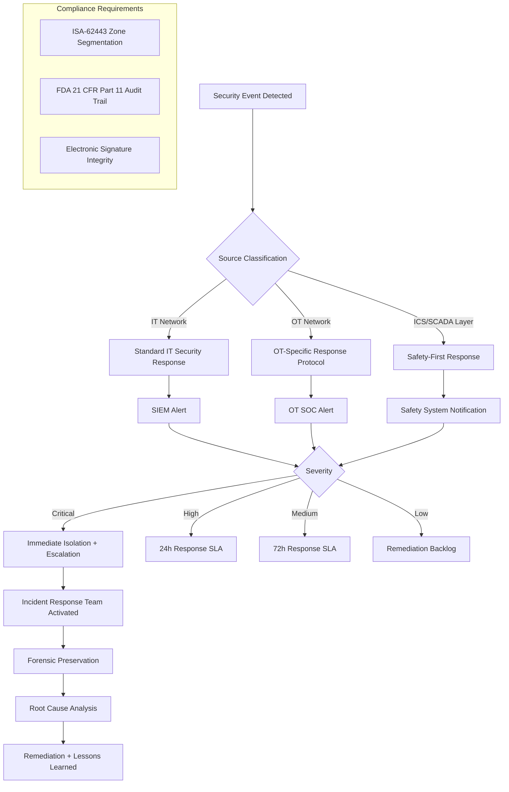

# Edge Cases — Security and Compliance

## Overview

Security and compliance edge cases in the MES span both IT and OT (Operational Technology) domains. The MES operates at the boundary between corporate IT networks and industrial control system (ICS) networks, making it a high-value target for both external attackers and insider threats. This document addresses security scenarios governed by ISA/IEC 62443 (industrial cybersecurity), FDA 21 CFR Part 11 (electronic records and electronic signatures for regulated industries), and general cybersecurity best practices for plant-floor systems.

The OT environment presents unique constraints: some plant-floor terminals cannot be restarted without halting production, security responses must not create safety hazards, and many ICS protocols (OPC-UA, Modbus, PROFINET) were not designed with modern security requirements in mind.

---

## Edge Case Scenarios

### Unauthorized OT Network Access Attempt

**Scenario Description**

An unauthorized host or user attempts to access devices or services on the OT network segment — the network zone containing PLCs, SCADA servers, OPC-UA servers, and safety systems. This violates the ISA-62443 zone and conduit architecture that governs the MES deployment.

**Trigger Conditions**

- An IT workstation or user PC attempts a direct TCP connection to an OT network segment IP address
- A compromised corporate IT host initiates port scanning against OT network subnets
- A vendor laptop plugged directly into the plant floor network bypasses the DMZ
- A rogue wireless access point bridges the IT and OT network segments

**System Behavior**

The network segmentation architecture enforces OT zone boundaries using next-generation firewalls configured per ISA-62443 Zones and Conduits model. Permitted conduits between the IT/MES zone and the OT zone are limited to:
- MES application server → OPC-UA collector (TCP 4840 encrypted)
- SCADA historian → MES data bridge (defined whitelist)

Any traffic attempting to traverse the OT zone boundary outside these permitted conduits is dropped and logged by the firewall. The SIEM (Security Information and Event Management) system correlates firewall drop events and raises a security alert when more than 3 unauthorized access attempts are detected from a single source within 60 seconds.

The MES security module receives the alert and:
1. Logs the event with source IP, destination IP, port, protocol, and timestamp
2. Triggers a `ZONE_BREACH_ATTEMPT` event visible on the security operations dashboard
3. Notifies the OT Security team and Plant Manager via the incident notification pipeline
4. If the source is an internal MES service account, the account is automatically suspended pending review

**Expected Resolution**

The unauthorized access attempt is blocked. The source is identified and investigated. If the source is legitimate (e.g., an approved vendor laptop misconfigured), access is rerouted through the correct conduit. If malicious, the incident response team is activated per the ICS incident response plan.

**Test Cases**

| ID | Input | Expected Output | Pass/Fail Criteria |
|---|---|---|---|
| SEC-OTA-01 | IT workstation (192.168.1.50) attempts TCP connection to PLC (10.10.1.20) on port 102 | Firewall drops connection; SIEM alert created | Drop event logged; SIEM alert raised within 30 seconds |
| SEC-OTA-02 | Five unauthorized attempts from same source within 60 seconds | `ZONE_BREACH_ATTEMPT` event escalated; OT Security team notified | Escalation triggered at 3+ attempts; notification includes source details |
| SEC-OTA-03 | MES service account used from unauthorized IP to access OT conduit | Account suspended; security incident created; administrator alerted | Account suspension immediate; incident includes account ID and originating IP |
| SEC-OTA-04 | Vendor laptop plugged directly to plant floor LAN port | NAC (Network Access Control) detects unknown MAC; port disabled; alert raised | Port disabled within 60 seconds of connection; NAC event references plant floor location |

---

### Audit Trail Tampering Attempt (21 CFR Part 11)

**Scenario Description**

A user or process attempts to modify, delete, or obscure audit trail records in the MES — a direct violation of FDA 21 CFR Part 11 requirements for electronic records, which mandate that audit trails be computer-generated, date/time-stamped, independent of operators, and retained for the full record retention period.

**Trigger Conditions**

- A database administrator attempts to execute `DELETE` or `UPDATE` statements directly against the audit log tables
- A developer pushes a code change that bypasses audit trail generation for a specific operation
- An operator with elevated database access attempts to remove a record of a quality decision they made
- A backup restore operation overwrites a portion of the audit log

**System Behavior**

Audit trail records in the MES are stored in an append-only, immutable log. The database role used by the MES application has no `DELETE` or `UPDATE` permissions on audit log tables. All audit records are write-once via a dedicated audit service that enforces immutability at the application layer.

Every audit record includes a cryptographic hash (SHA-256) of the record content plus the hash of the previous record, forming a hash chain (similar to a blockchain structure). Any attempt to modify a record would break the chain and be detectable during integrity verification. Integrity checks are run on a scheduled basis (hourly) and on demand.

If a direct database manipulation attempt is detected (e.g., via database activity monitoring or IAM alert):
1. The attempt is logged as a `AUDIT_INTEGRITY_VIOLATION_ATTEMPT` event
2. The security incident is immediately escalated to the Compliance Officer, IT Security, and Quality Director
3. If the 21 CFR Part 11 environment has been compromised, a regulatory notification assessment is initiated

**Expected Resolution**

The tampering attempt is detected, blocked (by database permissions), and investigated. The audit trail remains intact. The compliance officer assesses whether a regulatory notification is required. Forensic evidence is preserved.

**Test Cases**

| ID | Input | Expected Output | Pass/Fail Criteria |
|---|---|---|---|
| SEC-ATT-01 | DBA executes `DELETE FROM audit_log WHERE record_id = 12345` | Permission denied; `AUDIT_INTEGRITY_VIOLATION_ATTEMPT` event created | Database returns permission error; security alert generated within 60 seconds |
| SEC-ATT-02 | Hash chain integrity check run after suspicious activity | All record hashes verified; any broken chain links identified with position | Integrity check report identifies any anomalies; clean report confirms intact trail |
| SEC-ATT-03 | Code change deployed that skips audit logging for quality decisions | Code review gate catches missing audit call; deployment blocked | Automated audit coverage check in CI/CD pipeline blocks deployment |
| SEC-ATT-04 | Backup restore overwrites 2 hours of audit records | Hash chain break detected at restore boundary; compliance officer alerted | Compliance alert includes time range affected and references backup restore event |

---

### Electronic Signature Bypass

**Scenario Description**

A user attempts to perform an action that requires an electronic signature (per 21 CFR Part 11) without properly authenticating their identity — either by reusing another user's session, circumventing the re-authentication prompt, or exploiting a code path that skips the signature requirement.

**Trigger Conditions**

- User submits a quality disposition using a session that has already timed out for re-authentication purposes
- API call is crafted to bypass the signature challenge by omitting required signature fields
- User performs a quality-critical action from a shared kiosk session not intended for that action type
- A code defect allows a batch operation to bypass per-record signature requirements

**System Behavior**

Electronic signatures in the MES are implemented as a two-factor re-authentication step: the signing user must provide their password (something they know) at the point of signature, in addition to their active session. The session token alone is insufficient for actions requiring an electronic signature.

Actions requiring electronic signatures are defined in the `signature_required_actions` configuration, which includes:
- Quality lot dispositions
- Production order deviations
- BOM deviation approvals
- Batch record closures (regulated products)
- Safety parameter modifications

The API enforces signature requirements at the controller layer using a `@RequiresElectronicSignature` annotation. If the request does not include a valid `X-Signature-Credential` header (containing the freshly validated credential token), the API returns 403 Forbidden with `reason: ELECTRONIC_SIGNATURE_REQUIRED`.

Any attempt to call a signature-required endpoint without proper credentials is logged as a `SIGNATURE_BYPASS_ATTEMPT` with the user ID, endpoint, timestamp, and session context.

**Expected Resolution**

The action is blocked. The bypass attempt is logged for compliance review. If repeated bypass attempts are detected from the same user or session, the session is terminated and the account is flagged for security review.

**Test Cases**

| ID | Input | Expected Output | Pass/Fail Criteria |
|---|---|---|---|
| SEC-ESB-01 | Quality disposition submitted via API without `X-Signature-Credential` header | 403 Forbidden; `SIGNATURE_BYPASS_ATTEMPT` event logged | Event includes user ID, endpoint, timestamp; action not processed |
| SEC-ESB-02 | User submits stale credential token (expired 5 minutes ago) | 403 Forbidden; credential validated as expired | System requires fresh credential (issued within configurable window, default: 5 minutes) |
| SEC-ESB-03 | Three signature bypass attempts from same user within 10 minutes | User session terminated; account flagged for security review; security team notified | Session termination immediate after third attempt; account review workflow created |
| SEC-ESB-04 | Batch quality disposition attempts to use single signature for 50 records | Rejected; each record requires individual signature or batch signature with explicit enumeration | Batch signature must explicitly enumerate all record IDs; implicit batch signing blocked |

---

### ISA-62443 Zone Breach Detection

**Scenario Description**

A security event is detected that suggests a breach of the ISA-62443 security zone architecture — data or commands flowing through an unauthorized path between security zones, or an asset in a lower-security zone communicating directly with an asset in a higher-trust zone without going through the designated conduit.

**Trigger Conditions**

- A PLC-to-cloud direct connection is detected, bypassing the MES application layer and DMZ
- Unauthorized MQTT traffic is detected on an OT segment (only OPC-UA should be present)
- An IT server is found to have an open connection to a Safety Instrumented System (SIS)
- ARP spoofing is detected in the OT zone, indicating potential man-in-the-middle activity

**System Behavior**

The MES deployment includes a passive OT network monitoring sensor (e.g., Claroty, Dragos, or equivalent) that performs deep packet inspection of OT protocols without active probing. This sensor generates asset inventory and communication baseline data. Any deviation from the established communication baseline (unauthorized protocol, unauthorized source-destination pair, unauthorized data volume) triggers a `ZONE_BASELINE_DEVIATION` event.

The MES security module receives these events via the SIEM integration and classifies them by severity using the ISA-62443 security level (SL) impact matrix. Unauthorized communication to or from a Safety Instrumented System is classified as Critical — the maximum severity. Unauthorized IT→OT communication paths not involving safety systems are classified as High.

Critical events trigger an immediate automatic response:
- OT SOC activated
- Plant Manager and Safety Officer notified
- Option to isolate the affected network segment presented (requires human authorization to execute)

**Expected Resolution**

The unauthorized communication path is identified and blocked. The affected assets are forensically examined. The root cause (misconfiguration, compromised asset, insider threat) is determined. The zone architecture is verified to be intact. If a safety system was involved, a safety assessment is conducted before production resumes.

**Test Cases**

| ID | Input | Expected Output | Pass/Fail Criteria |
|---|---|---|---|
| SEC-ZBD-01 | OT sensor detects direct HTTP connection from PLC to cloud endpoint | `ZONE_BASELINE_DEVIATION` event; OT SOC alerted; connection blocked | Alert includes source, destination, protocol, and deviation from baseline |
| SEC-ZBD-02 | Unauthorized MQTT traffic detected on OT segment | Protocol violation alert; traffic blocked at network level | OT sensor generates protocol anomaly alert; SIEM correlation confirms violation |
| SEC-ZBD-03 | Direct connection from IT host to Safety Instrumented System detected | Critical severity event; OT SOC + Safety Officer + Plant Manager immediately notified | Critical classification confirmed; notification within 60 seconds; isolation option presented |
| SEC-ZBD-04 | ARP spoofing detected in OT zone | High severity event; affected VLAN port isolated; investigation initiated | Port isolation requires human authorization; alert includes spoofed MAC and target IP |

---

### SCADA Command Injection

**Scenario Description**

An attacker or malicious insider attempts to send unauthorized or malformed commands to SCADA-controlled equipment through the MES API or OPC-UA integration layer, potentially causing equipment damage, production disruption, or safety incidents.

**Trigger Conditions**

- A compromised MES user account is used to send a write command to an OPC-UA node that controls machine speed
- An API request crafted with an injected command in a parameter field reaches the SCADA integration layer
- A malicious OPC-UA client connects to the MES OPC-UA server and attempts to write to protected nodes
- A SQL injection in the MES API leads to unauthorized execution of a SCADA command

**System Behavior**

The MES enforces a strict **read-only OPC-UA bridge** for most production monitoring data. Write access to OPC-UA nodes from the MES is limited to a whitelist of specific, designated nodes (e.g., recipe download endpoints) and requires:

1. The calling user to have the `SCADA_WRITE` permission (distinct from standard operator permissions)
2. The target node to be on the approved write node whitelist
3. The command value to pass range and type validation before submission
4. A dedicated `SCADA_WRITE_AUTHORIZATION` event logged with full context before execution

Any attempt to write to an OPC-UA node not on the whitelist returns an `UNAUTHORIZED_SCADA_WRITE` error, is logged immediately, and triggers a security alert. Input fields in the MES API are validated and sanitized before use in any OPC-UA node address construction or command formation, preventing injection attacks.

**Expected Resolution**

Unauthorized command attempts are blocked and logged. The security team investigates the source. If a compromised account is identified, it is immediately suspended. Safety-critical equipment is inspected before resuming production if any command reached its target.

**Test Cases**

| ID | Input | Expected Output | Pass/Fail Criteria |
|---|---|---|---|
| SEC-SCI-01 | Standard operator account attempts OPC-UA write to machine speed node | `UNAUTHORIZED_SCADA_WRITE` error; security alert created | Write blocked; alert includes user ID, target node, and command value |
| SEC-SCI-02 | API parameter contains OPC-UA node injection attempt (`..;ns=2;i=1234`) | Parameter sanitization strips injection; request processed against intended node only | Injection attempt logged; no unauthorized node addressed |
| SEC-SCI-03 | Command value of 999999 RPM sent to approved speed node (range: 0–5000) | Command rejected by range validation; `SCADA_COMMAND_OUT_OF_RANGE` logged | No command sent to PLC; out-of-range log includes submitted value and valid range |
| SEC-SCI-04 | `SCADA_WRITE` permission holder sends valid command to approved node | Command executed; `SCADA_WRITE_AUTHORIZATION` event logged before execution | Pre-execution log confirms authorization; post-execution log confirms delivery |

---

### User Session Hijacking on Plant Floor Terminal

**Scenario Description**

An attacker or opportunistic individual takes over an authenticated operator session on a shared plant-floor terminal — either by physically using an unlocked terminal while the legitimate operator is away, or by intercepting a session token.

**Trigger Conditions**

- Operator walks away from terminal without logging out; another person uses the open session
- Session token captured via network sniffing on an unencrypted plant floor network segment
- Social engineering attack convinces an operator to share their session or credentials
- Shared terminal with inadequate auto-lock configured allows unauthorized use

**System Behavior**

Plant-floor terminals enforce auto-lock after a configurable inactivity period (default: 5 minutes for quality and safety actions; 15 minutes for general operations). When the terminal locks, the session is suspended — not terminated. Re-authentication (password, badge tap, biometric depending on terminal capability) is required to resume.

All API requests include source terminal IP and user session ID in the audit trail. The MES correlates session activity against the terminal assignment plan — if an operator is scheduled on Work Center A but their session is active on Work Center C, an `UNEXPECTED_TERMINAL_ACTIVITY` alert is raised.

Session tokens are generated with 256-bit entropy, transmitted over TLS 1.3 only, and bound to the originating client IP and user agent. A session originating from a different IP than where it was established is immediately invalidated and a `SESSION_IP_CHANGE` security event is created.

**Expected Resolution**

Unauthorized session use is detected quickly via the terminal activity monitoring. The session is terminated. The security team investigates the source. All actions taken during the unauthorized session period are flagged for review to determine if any reversals or compliance notifications are required.

**Test Cases**

| ID | Input | Expected Output | Pass/Fail Criteria |
|---|---|---|---|
| SEC-SSH-01 | Terminal idle for 6 minutes (auto-lock threshold: 5 min) | Terminal locked; session suspended; re-authentication required | Lock at 5-minute mark; session data preserved for re-authentication |
| SEC-SSH-02 | Operator session used from terminal not in their work center assignment | `UNEXPECTED_TERMINAL_ACTIVITY` alert raised; security notified | Alert includes session user, assigned terminal, and actual terminal |
| SEC-SSH-03 | Session token reused from different IP address | Session immediately invalidated; `SESSION_IP_CHANGE` event created | Token invalidated on IP mismatch; user must re-authenticate |
| SEC-SSH-04 | Actions performed during unauthorized session period identified | All actions in period flagged for compliance review | Flagged actions list includes operation IDs, quality decisions, and timestamps |

---

### Certificate Expiry in OPC-UA Connection

**Scenario Description**

The X.509 certificate used to secure an OPC-UA connection between the MES OPC-UA client and the plant-floor OPC-UA server expires, causing the secure channel to be rejected and data collection to stop.

**Trigger Conditions**

- Annual certificate renewal is missed in the OT certificate lifecycle management process
- Certificate was issued with an unexpectedly short validity period (e.g., 90-day cert used instead of annual)
- Clock synchronization drift causes a certificate to appear expired to one endpoint before the other
- Intermediate CA certificate expires, breaking the chain of trust

**System Behavior**

The MES OPC-UA client monitors certificate validity for all configured OPC-UA connections. At 30 days before expiry, a `CERTIFICATE_EXPIRY_WARNING` alert is sent to the OT Security team and the integration team. At 7 days before expiry, the alert is escalated. At 1 day before expiry, a `CERTIFICATE_CRITICAL_EXPIRY` alert is raised with an on-call page.

If the certificate expires without renewal:
1. The OPC-UA secure channel is rejected by the server
2. The connection transitions to `CERTIFICATE_EXPIRED` state
3. Data collection stops (see SCADA connection drop scenario)
4. An incident is created referencing the expired certificate's subject, serial number, and expiry date
5. The MES does not fall back to an unsecured (non-encrypted, non-authenticated) OPC-UA connection under any circumstances

Renewal requires generation of a new certificate, submission to the OPC-UA server's trusted certificate store, and reconnection. In the OT environment, this may require physical access to the OPC-UA server or a remote procedure via the CMMS change management workflow.

**Expected Resolution**

The certificate is renewed before expiry through the proactive alerting process. If expiry occurs, the renewal is treated as a P1 incident with the same urgency as a SCADA connection loss. After renewal, data collection resumes with backfill from buffered edge data.

**Test Cases**

| ID | Input | Expected Output | Pass/Fail Criteria |
|---|---|---|---|
| SEC-CEX-01 | Certificate with 28 days remaining validity | `CERTIFICATE_EXPIRY_WARNING` alert sent to OT Security and integration team | Alert at ≤30 days remaining; includes certificate subject, serial, expiry date, and connection ID |
| SEC-CEX-02 | Certificate expires without renewal | OPC-UA connection rejected; `CERTIFICATE_EXPIRED` incident created; data collection stops | No unsecured fallback; incident P1 priority; same response as SCADA connection loss |
| SEC-CEX-03 | Certificate renewed and installed on OPC-UA server | New certificate added to trust store; connection re-established; data collection resumes | Secure channel re-established; no plaintext connection accepted during gap |
| SEC-CEX-04 | Clock drift causes premature certificate rejection (cert valid but appears expired) | Connection failure logged with NTP sync error as probable cause | `CLOCK_DRIFT_SUSPECTED` flag in connection failure event; NTP sync check initiated |

---

### Privilege Escalation Attempt

**Scenario Description**

A user attempts to gain access to functions or data beyond their assigned role — either by exploiting a vulnerability in the role-based access control implementation, by using a shared account, or by manipulating API parameters to access another user's or another plant's data.

**Trigger Conditions**

- An operator-role user attempts to access the `/admin/` API namespace
- A user manipulates a URL parameter to access production orders from a different plant they are not authorized for
- A user account is assigned to multiple roles; a role conflict leads to an unintended permission grant
- An API endpoint fails to validate that the resource belongs to the requesting user's organizational scope

**System Behavior**

The MES implements role-based access control (RBAC) with organizational scoping. Every API request is checked against:

1. **Role permissions:** Does the user's role include the required permission for the requested action?
2. **Organizational scope:** Is the requested resource within the user's assigned plant/site/work center scope?
3. **Data residency:** Does the resource belong to the organizational unit the user is authorized for?

Authorization failures return 403 Forbidden. The response body does not reveal whether the resource exists (to prevent enumeration attacks) — 404 is returned for cross-scope access attempts.

All authorization failures are logged as `AUTHORIZATION_FAILURE` events. More than 5 authorization failures from the same user within 10 minutes triggers a `PRIVILEGE_ESCALATION_SUSPICION` alert, automatically suspending the account pending security review.

**Expected Resolution**

The escalation attempt is blocked by the authorization layer. The user account is reviewed. If the privilege escalation was accidental (misconfigured role), the role is corrected. If intentional, the security incident response is activated.

**Test Cases**

| ID | Input | Expected Output | Pass/Fail Criteria |
|---|---|---|---|
| SEC-PEA-01 | Operator role user calls `GET /api/v3/admin/users` | 403 Forbidden; `AUTHORIZATION_FAILURE` logged | Event includes user ID, attempted endpoint, and required permission |
| SEC-PEA-02 | User from Plant A requests production order from Plant B via URL parameter | 404 Not Found (not 403 to prevent enumeration); authorization failure logged silently | Resource existence not revealed across scope boundaries; failure logged |
| SEC-PEA-03 | 6 authorization failures from same user in 8 minutes | Account suspended; `PRIVILEGE_ESCALATION_SUSPICION` alert to security team | Suspension after 5th failure within 10-minute window; alert includes failure pattern |
| SEC-PEA-04 | Role conflict grants unintended `QUALITY_RELEASE` permission | Role conflict detected at login; conflicting permissions quarantined; user restricted to safe minimum | Conflict detection at login; user notified; IAM admin alerted to resolve conflict |

---

### Failed Login Lockout in Safety-Critical Context

**Scenario Description**

An operator working on a safety-critical operation (e.g., a process requiring continuous monitoring or a hazardous material handling operation) is locked out of their MES session due to failed login attempts, preventing them from recording safety-critical data or acknowledging safety alerts.

**Trigger Conditions**

- Operator misremembers password after a recent forced password reset
- Badge reader malfunction causes repeated failed smart card authentication
- Account locked by a security policy triggered by unrelated activity on another device

**System Behavior**

The MES differentiates between standard lockout (immediate block after N failed attempts) and safety-critical context lockout. For terminals designated as safety-critical (configured in terminal management), the lockout policy is modified:

1. **Warning phase:** After 3 failed attempts, the terminal enters a `CREDENTIALS_WARNING` state. The operator is warned but access is not yet blocked. A `LOCKOUT_WARNING_SAFETY_CRITICAL` alert is sent to the shift supervisor.
2. **Escalation phase:** After 5 failed attempts, the terminal is locked but an emergency override option is presented that requires an authorized supervisor to physically co-authenticate. The supervisor's authorization is logged with their credential and a safety override reason code.
3. **Complete lockout:** After supervisor override is declined or not available within 5 minutes, full lockout is applied. The supervisor must assume manual monitoring responsibilities until the account is unlocked.

The lockout policy for safety-critical terminals requires a second authorized user (not the account owner) to unlock — self-service unlock is not available in the OT environment.

**Expected Resolution**

The operator either successfully authenticates via supervisor co-authentication or the supervisor assumes monitoring responsibilities. The account is unlocked through the proper IT/OT account management process. No safety-critical monitoring gap occurs without explicit acknowledgment.

**Test Cases**

| ID | Input | Expected Output | Pass/Fail Criteria |
|---|---|---|---|
| SEC-FLL-01 | 3 failed login attempts on safety-critical terminal | `CREDENTIALS_WARNING` state; supervisor alerted; access not yet blocked | Supervisor notification within 30 seconds; terminal remains accessible |
| SEC-FLL-02 | 5 failed attempts; supervisor co-authentication option presented | Terminal locked; supervisor can provide override with credential and reason | Override option visible on locked screen; supervisor credential required |
| SEC-FLL-03 | Supervisor not available within 5 minutes | Full lockout applied; supervisor assumes monitoring responsibility; documented handover | Handover documentation created automatically; supervisor role explicitly noted |
| SEC-FLL-04 | Account lockout caused by activity on IT workstation, not plant terminal | Lockout policy differentiates source device; plant terminal lockout requires plant-specific events | IT and OT lockout counters are independent; IT failure does not lock OT terminal |

---

### Data Integrity Violation in Batch Record

**Scenario Description**

A discrepancy is detected between the data stored in a batch record and the source data — either through hash chain verification, external audit, or reconciliation with the raw IoT data stream — suggesting that the batch record was modified after initial creation.

**Trigger Conditions**

- Hash chain verification fails for a batch record entry
- Regulatory auditor discovers a discrepancy between the paper batch record and the electronic system
- IoT raw data stream shows different values than what was recorded in the batch record
- Database migration or upgrade corrupts a subset of batch record entries

**System Behavior**

Batch records in the MES are cryptographically protected using the same append-only hash chain as the audit trail. Each batch record entry includes a SHA-256 hash of its content plus the previous entry's hash. The system runs automated integrity verification on a 4-hour cycle for records created in the past 30 days, and a daily cycle for older records.

When an integrity violation is detected:
1. A `BATCH_RECORD_INTEGRITY_VIOLATION` critical alert is immediately raised
2. The affected batch record is flagged `INTEGRITY_SUSPECT` and cannot be used for product release
3. The Compliance Officer, Quality Director, and IT Security are notified simultaneously
4. The MES initiates automatic evidence collection: the raw IoT event stream for the affected period is exported; the database transaction log is preserved; the hash chain verification report is generated
5. A regulatory notification assessment is created for all lots associated with the affected batch record

Investigation involves comparing the hash chain, the raw IoT event log, and the database transaction log to determine whether a technical error (e.g., database migration issue) or an intentional manipulation caused the violation.

**Expected Resolution**

The root cause is determined. If the violation was caused by a technical error, the data is restored from the raw IoT stream or backup (with regulatory documentation of the restoration). If intentional manipulation is confirmed, the incident is treated as a critical compliance event with potential regulatory notification. No batch record with an unresolved integrity violation is used for product release.

**Test Cases**

| ID | Input | Expected Output | Pass/Fail Criteria |
|---|---|---|---|
| SEC-DIV-01 | Hash chain verification fails at entry 247 of batch record BR-2025-0893 | `BATCH_RECORD_INTEGRITY_VIOLATION` alert; record flagged `INTEGRITY_SUSPECT` | Critical alert within 5 minutes of scheduled verification run; lot release blocked |
| SEC-DIV-02 | Evidence collection initiated automatically | Raw IoT export, transaction log preservation, and hash chain report generated | All three evidence artifacts created within 30 minutes of alert; linked to incident |
| SEC-DIV-03 | Investigation reveals database migration caused hash recalculation error (not tampering) | Data restored from raw IoT stream; integrity re-verified; `INTEGRITY_SUSPECT` flag cleared | Restoration documented with root cause; regulatory impact assessment completed |
| SEC-DIV-04 | Investigation reveals intentional modification (tampering confirmed) | Regulatory notification assessment initiated; matter escalated to executive and legal team | Escalation pathway documented; no product release from affected lot until regulatory resolution |
