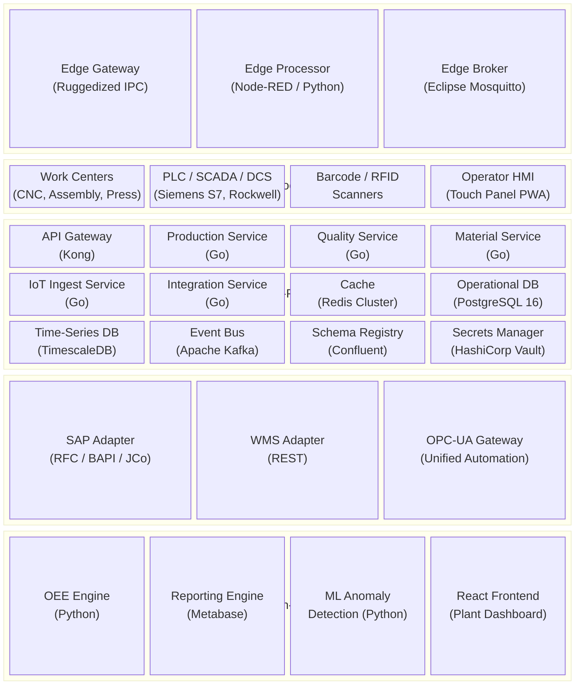
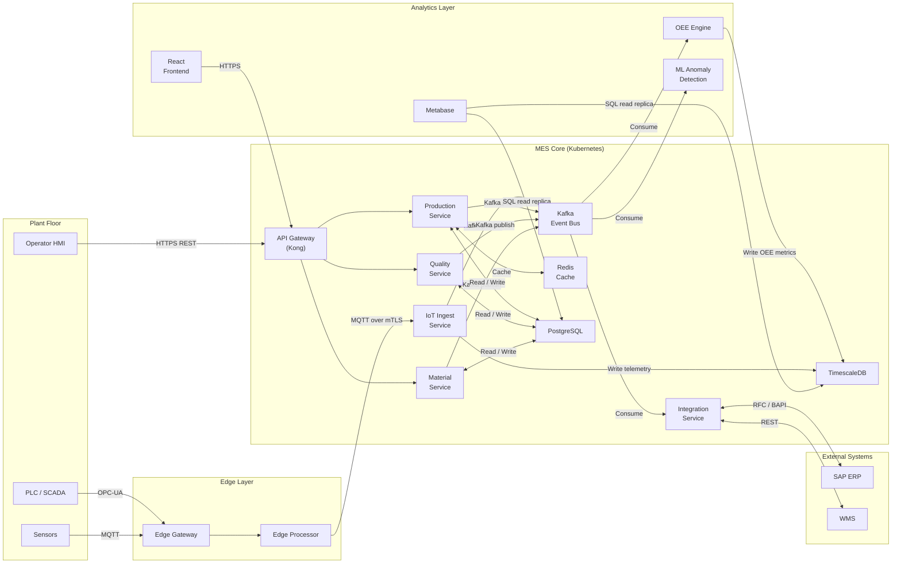

# Architecture Diagram — Manufacturing Execution System

## Architecture Overview

The Manufacturing Execution System (MES) for discrete manufacturing is designed as a cloud-hybrid, event-driven microservices platform that bridges the plant floor and enterprise systems. It operates across five distinct architectural layers — from edge devices collecting sensor data at the machine level to analytics services delivering actionable insights to plant management.

The architecture is shaped by two dominant constraints: **real-time responsiveness** (sub-second latency for machine state changes and operator interactions on the plant floor) and **industrial reliability** (continued operation during WAN outages, with ordered event replay and eventual consistency once connectivity restores).

**Architectural Quality Targets**

| Characteristic | Target |
|---------------|--------|
| Availability (production shifts) | 99.9% |
| Event ingestion latency (edge to store) | < 500 ms |
| API response time P95 | < 300 ms |
| Offline resilience during WAN outage | 4-hour local operation |
| Full genealogy query (10-level) | < 5 seconds |
| Concurrent operators per plant site | 500 |
| Time-series data ingestion rate | 50,000 data points / second |

---

## Architecture Principles

**Industrial-grade reliability over cloud-native purity**

The plant floor cannot tolerate availability degradation caused by cloud connectivity issues. All real-time execution paths run entirely within the plant network. Cloud services are reserved for analytics, long-term archiving, and remote access — never for the critical production execution path.

**Event-driven integration over point-to-point coupling**

All cross-service communication for asynchronous workflows uses an event bus (Apache Kafka). Synchronous REST or gRPC calls are reserved for user-facing queries where a response is immediately required by the caller.

**Defence in depth for operational technology**

The architecture maintains strict network segmentation (ISA/IEC 62443 zones and conduits) between the OT network (plant floor) and the IT network (MES core). The edge layer acts as the sole conduit, with firewall rules preventing any inbound connection from IT to OT initiated outside the edge gateway.

**Immutable audit trail by design**

No update or delete operations are permitted on production records, quality measurements, or traceability data. All corrections are modelled as new compensating events referencing the original record. This satisfies regulatory traceability requirements without bolt-on auditing infrastructure.

**Schema-governed data contracts**

All events published to Kafka carry an Avro schema registered in the Schema Registry. Schema evolution follows backward-compatibility rules, enabling independent service deployment without coordinated release lockstep.

**Separation of operational and analytical workloads**

Operational databases (PostgreSQL) serve OLTP workloads with short-lived transactions. Time-series data (TimescaleDB) serves OEE and sensor analytics. These stores are never queried from hot operational code paths — the Analytics Service materializes views on read replicas.

---

## Layered Architecture (Edge Layer, Plant Floor Layer, MES Core Layer, Integration Layer, Analytics Layer)

### Edge Layer

The Edge Layer runs on ruggedized industrial PCs co-located with work centers or mounted in electrical cabinets on the plant floor. It operates independently of the MES Core Layer and continues logging locally during network outages.

- **Edge Gateway**: Terminates OPC-UA and MQTT connections from PLCs and sensors. Applies deadband filtering to reduce message volume before forwarding. Buffers up to 4 hours of telemetry locally in an embedded SQLite store and replays the buffer in chronological order when MES Core connectivity restores.
- **Edge Processor**: Executes lightweight transformation rules — tag normalization, unit conversion (e.g., raw ADC counts to engineering units), and timestamp alignment to UTC. Runs as Node-RED flows for simple tag mappings or Python microservices for complex state logic.
- **Edge Broker**: An Eclipse Mosquitto MQTT broker provides the local pub/sub fabric for sensor-to-gateway communication within the OT network. Configured with persistent sessions so messages are queued for subscribers that are temporarily offline.

### Plant Floor Layer

Physical assets and human interfaces that generate all primary production data:

- **Work Centers**: CNC machines, robotic assembly stations, stamping presses, and welding cells. Each is mapped to a work center master record in the MES and exposes OPC-UA nodes via its PLC or embedded controller.
- **PLC / SCADA / DCS**: Siemens S7-series PLCs, Rockwell ControlLogix systems, and Wonderware / iFix SCADA systems expose OPC-UA Data Access (DA) and Historical Data Access (HDA) interfaces consumed by the Edge Layer.
- **Barcode / RFID Scanners**: Zebra handheld scanners and fixed RFID readers at pick stations and work centers provide component traceability data. Data flows to the MES via the Operator HMI application or directly over plant Wi-Fi using the MQTT protocol.
- **Operator HMI**: Touchscreen terminals running a React Progressive Web App (PWA) optimized for gloved operation and bright industrial lighting. Work instructions and active job queues are cached locally so the terminal remains functional during brief network interruptions.

### MES Core Layer

The operational heart of the system, deployed as containerized microservices on an on-premises Kubernetes cluster (K3s for small sites, RKE2 for large multi-line plants):

- **API Gateway (Kong)**: Handles JWT validation, rate limiting, request routing, and TLS termination for all inbound API calls. Declarative configuration managed as Kubernetes CRDs.
- **Production Service**: Manages the work order lifecycle — creation, release, operation start/stop, cycle time calculation, yield reporting, and production confirmation generation for SAP.
- **Quality Service**: Owns inspection plans, measurement capture and validation, SPC control chart computation, NCR lifecycle management, and CAPA tracking.
- **Material Service**: Manages the lot and serial number registry, component staging to work centers, explicit and backflush consumption recording, and the WIP balance ledger.
- **IoT Ingest Service**: Subscribes to the Edge Broker MQTT bridge, normalizes payloads against the equipment tag master, enriches events with equipment context, and publishes to Kafka.
- **Integration Service**: Manages bidirectional SAP ERP integration via SAP JCo (RFC/BAPI calls) and WMS REST integration. Handles exponential-backoff retry, dead-letter queuing, and idempotency checking.
- **Redis Cluster**: Application cache for work order assignments, equipment reference data, and operator session tokens. Also provides distributed locks for critical order state transitions that must be serialized.
- **PostgreSQL 16**: Primary relational store for all operational data — work orders, quality records, material ledger, NCR records, and the traceability graph.
- **TimescaleDB**: PostgreSQL extension providing hypertable partitioning, native time-series compression, and continuous aggregates for sensor telemetry and OEE metrics.
- **Apache Kafka**: Event backbone running in KRaft mode. Topics include `production.events`, `quality.measurements`, `material.movements`, `machine.states`, `erp.inbound`, and `erp.outbound`, each partitioned by work center ID for ordered per-work-center processing.
- **Schema Registry**: Confluent Schema Registry enforces Avro schema compatibility for all Kafka topics, preventing producers from publishing breaking changes.
- **HashiCorp Vault**: Manages all secrets with dynamic credential generation, automatic lease rotation, and a complete audit log of every secret access.

### Integration Layer

Dedicated adapters that translate between MES-internal domain models and external system protocols:

- **SAP Adapter**: Translates MES domain events into SAP BAPI and RFC calls, covering SAP PP (CO11N production confirmation, CO15 goods movement), QM (QM02 quality notification), MM (MIGO goods movement), and PM (IW31 maintenance order) modules.
- **WMS Adapter**: REST client for the Warehouse Management System. Handles goods receipt notifications triggered by ERP, outbound transfer orders for material staging, and inbound inventory level synchronization.
- **OPC-UA Gateway**: A Unified Automation aggregating server that consolidates all plant-floor OPC-UA namespaces into a single unified address space accessible from the MES Core Layer, eliminating the need for per-machine OPC-UA client connections from MES services.

### Analytics Layer

Read-only services operating on replicated data, with no write path to operational stores:

- **OEE Engine**: Consumes machine state events from Kafka (`machine.states` topic) and production events (`production.events`) to compute real-time Availability, Performance, and Quality metrics. Writes results to TimescaleDB OEE hypertables.
- **Reporting Engine (Metabase)**: Self-service BI connected to TimescaleDB and PostgreSQL read replicas. Provides shift production reports, quality SPC summaries, material consumption reports, and executive OEE trend dashboards.
- **ML Anomaly Detection**: Python service applying statistical process control models and isolation forests to detect abnormal process parameter patterns before they produce scrap. Reads from TimescaleDB; publishes anomaly alert events to Kafka for downstream consumption by the Quality Service.
- **React Frontend**: Web-based plant dashboard providing real-time production status, live OEE gauges, quality SPC charts, and material genealogy query interfaces. Served from a CDN for remote access; cached as a PWA on plant-floor HMI terminals.

---

## Technology Stack

| Layer | Technology | Rationale |
|-------|-----------|-----------|
| Edge — Runtime | Node-RED 3.x + Python 3.12 | Node-RED provides low-code OT integration flows; Python handles complex transformations without runtime overhead |
| Edge — Broker | Eclipse Mosquitto 2.x (MQTT 5.0) | Lightweight, battle-tested, supports persistent sessions for offline buffering with guaranteed delivery |
| Edge — Protocol | OPC-UA (DA, HDA, A&C) | Industry standard for PLC/SCADA; vendor-neutral; built-in certificate-based security model |
| Edge — Local Buffer | SQLite 3.x | Zero-dependency local store for telemetry buffering during WAN outages; replay in sequence order |
| MES Core — Language | Go 1.22 | Low latency, predictable garbage collection, small memory footprint, excellent concurrency model for event processing |
| MES Core — API | gRPC (internal) + REST / OpenAPI 3.1 (external) | gRPC for low-latency service-to-service; REST for UI, operator terminals, and external integrations |
| MES Core — Container | Docker + Kubernetes (K3s / RKE2) | Standardized packaging; rolling updates without downtime; declarative desired-state management |
| MES Core — Service Mesh | Istio 1.22 | Automatic mTLS between services, traffic shaping, circuit breaking, distributed tracing injection |
| Operational Database | PostgreSQL 16 | ACID compliance, mature JSON support for flexible quality data, proven at manufacturing scale |
| Time-Series Database | TimescaleDB 2.x | Native PostgreSQL extension; continuous aggregates for OEE roll-ups; up to 95% compression on sensor data |
| Event Bus | Apache Kafka 3.7 (KRaft mode) | High-throughput durable event log; consumer group replay; eliminates ZooKeeper dependency |
| Schema Registry | Confluent Schema Registry 7.x | Avro schema governance; backward/forward compatibility enforcement at publish time |
| Cache | Redis 7.x (Cluster mode) | Sub-millisecond latency for reference data; distributed locks with RedLock algorithm |
| Secrets Management | HashiCorp Vault 1.17 | Dynamic database credentials; PKI secrets engine; audit log; Kubernetes auth method |
| API Gateway | Kong Gateway 3.x | JWT validation, rate limiting, plugin ecosystem, declarative configuration via CRDs |
| Frontend | React 18 + TypeScript 5 + Vite 5 | Type safety, fast HMR for development, PWA manifest for plant-floor terminal installation |
| Charting | Apache ECharts 5 | High-performance SPC charts and OEE gauges; WebGL rendering for large time-series datasets |
| Analytics / BI | Metabase 0.50 | Self-service reports without SQL knowledge; native PostgreSQL and TimescaleDB connectors |
| ML Platform | Python + scikit-learn + MLflow | Anomaly detection model training; experiment tracking; model versioning and registry |
| Observability | Prometheus + Grafana + Loki + Tempo | Full-stack observability: metrics, structured logs, distributed traces correlated by trace ID |
| CI / CD | GitHub Actions + ArgoCD | GitOps deployment pipeline; declarative Kubernetes manifests stored in Git as source of truth |
| Infrastructure | On-premises Kubernetes (primary) + Azure (analytics, remote access) | Cloud-hybrid; raw production data never leaves plant until aggregated |

---

## Component Interactions

---

## Architecture Decision Records

### ADR-001 — Edge Computing for OT Data Ingestion

**Status**: Accepted

**Context**: Plant-floor PLCs and sensors generate high-frequency telemetry (up to 100 Hz per tag). Direct ingestion into cloud or data-centre services introduces unacceptable latency and creates a single point of failure for real-time production monitoring. Industrial security frameworks (ISA/IEC 62443) also mandate physical and logical separation between the OT network and corporate IT networks.

**Decision**: Deploy ruggedized edge gateway nodes co-located with work centers on the OT network. Each edge node runs a local MQTT broker, performs deadband filtering and tag normalization, buffers data locally for up to 4 hours in SQLite, and forwards enriched events over an encrypted channel to the MES Core Layer on the IT network.

**Consequences**:
- Plant-floor monitoring continues during WAN or LAN disruptions between OT and IT segments.
- Edge nodes require out-of-band lifecycle management (firmware updates, certificate rotation) via a dedicated management VLAN.
- Adds operational complexity compared with direct cloud ingestion; this overhead is justified by reliability and ISA/IEC 62443 compliance requirements.

---

### ADR-002 — Apache Kafka as the Event Streaming Backbone

**Status**: Accepted

**Context**: MES subsystems (Production, Quality, Material, IoT) generate events that multiple consumers need to process independently and at different rates. Point-to-point synchronous API calls would create tight coupling and make it difficult to add new consumers — such as ML anomaly detection or future third-party integrations — without modifying producers.

**Decision**: Use Apache Kafka (KRaft mode, no ZooKeeper) as the central event bus. All cross-service asynchronous communication flows through Kafka topics. Avro schemas governed by Confluent Schema Registry enforce data contracts. Consumer groups enable independent scaling and parallel processing per partition.

**Consequences**:
- New consumers can subscribe to existing topics without any changes to producers, supporting open/closed extension.
- Event replay enables audit, debugging, and bootstrapping new services with historical data at deployment time.
- Kafka becomes a critical infrastructure component requiring a minimum 3-broker cluster with replication factor 3 and rack-aware partition assignment.
- All consumers must be idempotent since Kafka provides at-least-once delivery semantics by default.

---

### ADR-003 — Microservices Decomposition for MES Core

**Status**: Accepted

**Context**: MES functionality spans several distinct bounded contexts (Production, Quality, Material, IoT, Integration) with differing scaling requirements, release cadences, and team ownership boundaries. A monolithic architecture would couple these domains and prevent independent deployment, making it impractical to update the Quality Service without coordinating a full-system release.

**Decision**: Decompose the MES Core into domain-aligned microservices. Each service owns its schema and data store. Services communicate asynchronously via Kafka for event-driven flows and synchronously via gRPC for low-latency user-facing queries. Cross-domain transactions use the transactional outbox pattern to maintain data consistency without distributed transaction coordinators.

**Consequences**:
- Each service can be independently deployed, scaled, and rolled back.
- Distributed tracing via Tempo is mandatory to diagnose cross-service request flows effectively.
- Initial development velocity is lower than a monolith, which is acceptable given the planned 10+ year operational lifetime of the system.
- Teams must be disciplined about not introducing direct database access across service boundaries.

---

### ADR-004 — TimescaleDB for Time-Series Sensor and OEE Data

**Status**: Accepted

**Context**: Sensor telemetry and OEE metrics are inherently time-series data generated at high frequency. Storing them in standard PostgreSQL tables leads to table bloat, slow time-range queries, and complex manual partitioning at scale (tens of millions of rows per day per plant). Purpose-built alternatives (InfluxDB, Prometheus TSDB) were evaluated but introduce a second query language and additional operational expertise requirements.

**Decision**: Use TimescaleDB as the time-series data store. It extends PostgreSQL with automatic hypertable chunk partitioning, native columnar compression (achieving up to 95% space reduction on telemetry data), and continuous aggregates that pre-compute shift-level and daily OEE roll-ups. It shares the PostgreSQL operational model with the existing relational store, reducing the number of distinct database engines the operations team must manage.

**Consequences**:
- The DBA team manages TimescaleDB using existing PostgreSQL tooling, skills, and backup procedures.
- Continuous aggregates eliminate expensive real-time aggregation queries for OEE dashboards.
- TimescaleDB Community Edition licensing covers all features required by the current implementation; this must be reviewed if the deployment scale exceeds community edition limits.
- Data retention policies (automatic chunk dropping) must be configured at deployment and tested in staging before go-live.

---

### ADR-005 — Cloud-Hybrid Deployment (On-Premises Primary + Azure Secondary)

**Status**: Accepted

**Context**: Manufacturing plants require low-latency, high-reliability production execution regardless of internet connectivity. Plant managers and corporate teams also require remote dashboard access. A pure on-premises deployment satisfies reliability but complicates remote access and long-term data archiving. A pure cloud deployment introduces unacceptable latency and dependency on internet availability for production execution.

**Decision**: Deploy all real-time production execution, quality, IoT, and material tracking components on an on-premises Kubernetes cluster within the plant network. Deploy the analytics reporting layer, long-term cold storage archiving, remote access (Azure Application Gateway + Azure AD), and CI/CD infrastructure on Azure. Only aggregated and anonymized OEE trend data and quality summary statistics are replicated to the cloud analytics tier. Raw production data, recipes, and quality records never leave the plant network boundary.

**Consequences**:
- Production execution is entirely unaffected by Azure service availability incidents or internet outages.
- Remote dashboard access is available via Azure-hosted reverse proxy with Azure AD conditional access policies.
- Data sovereignty is maintained: all sensitive manufacturing data remains on-premises, satisfying customer contractual requirements and regional data residency obligations.
- Two infrastructure environments require consistent Infrastructure-as-Code (Terraform) and GitOps (ArgoCD) practices across both on-premises and Azure to prevent configuration drift.
