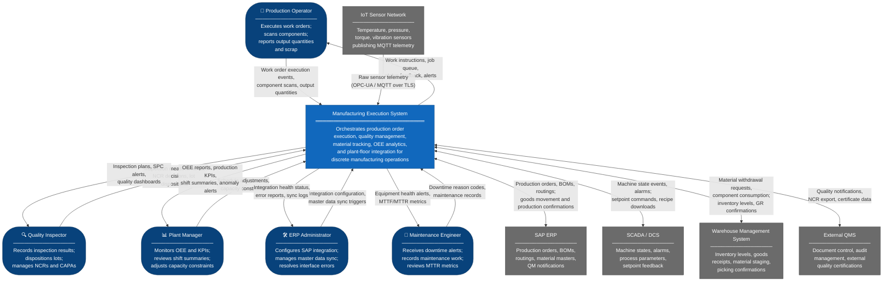
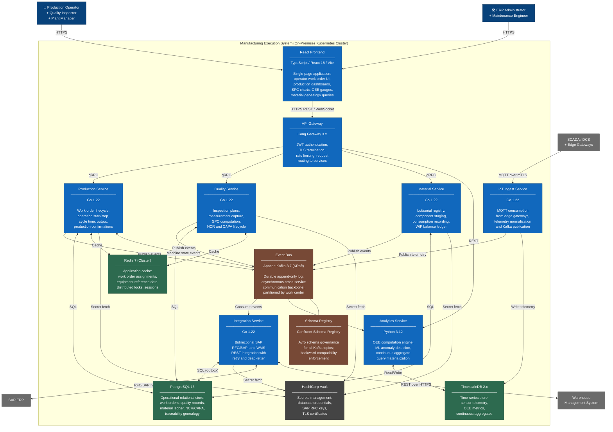
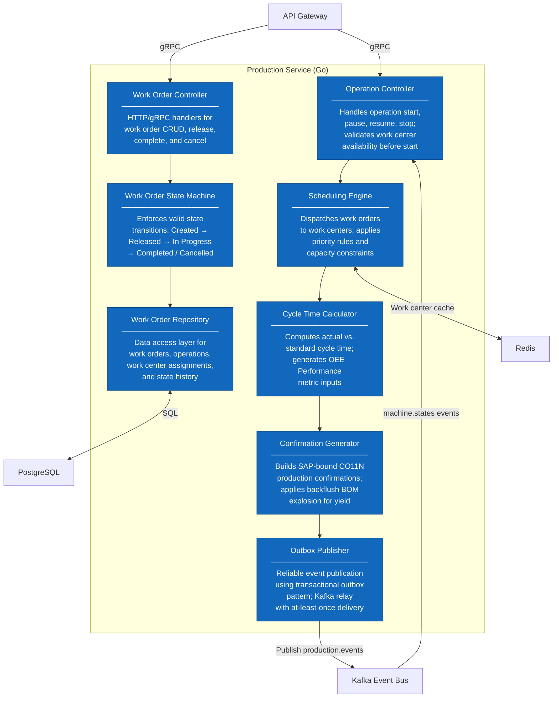
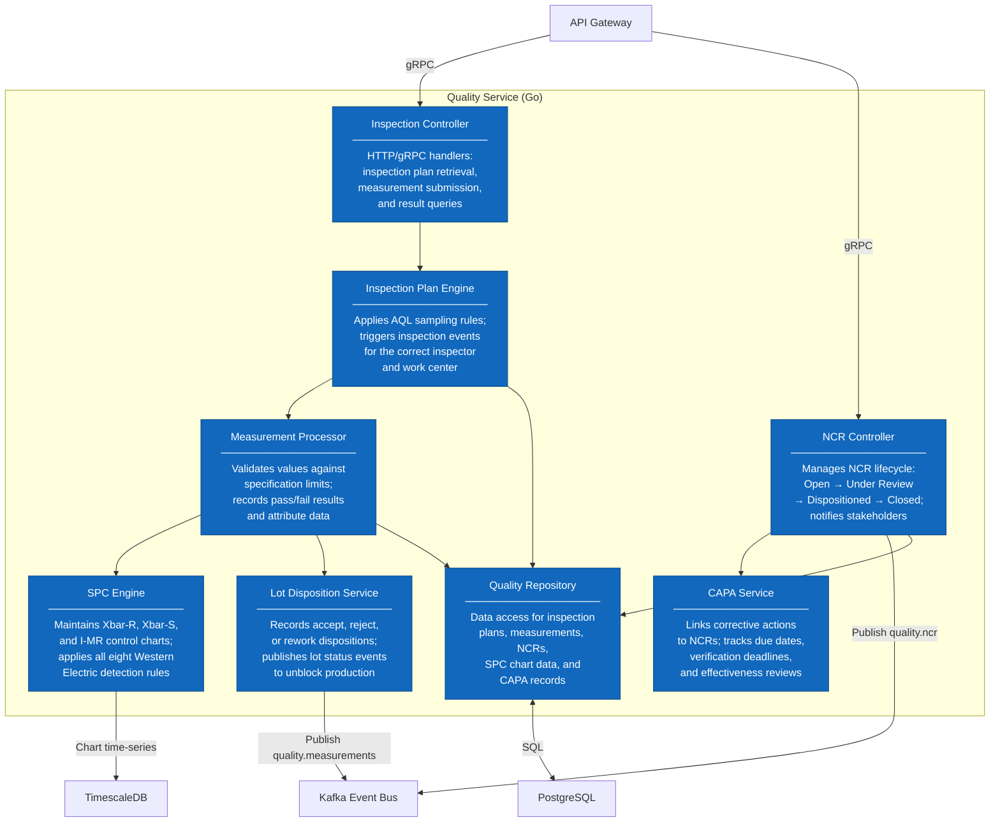
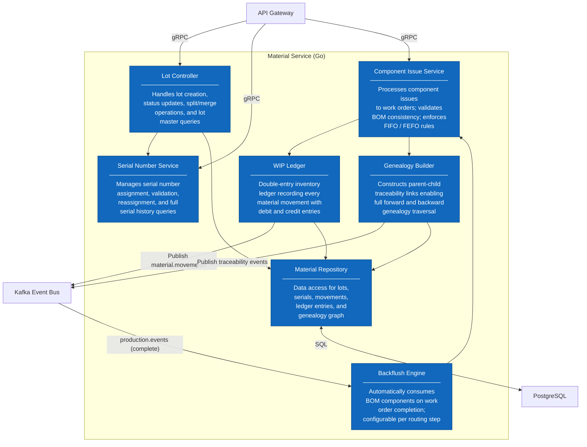
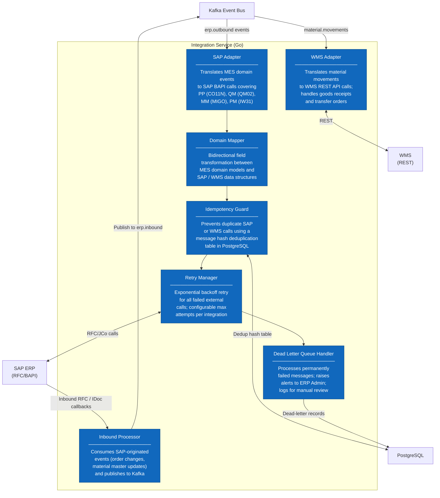

# C4 Architecture Diagrams — Manufacturing Execution System

## Overview

This document presents the C4 model views of the Manufacturing Execution System (MES). The C4 model provides a hierarchical set of diagrams that zoom into the system at increasing levels of detail, enabling different stakeholder groups to understand the architecture at the right level of abstraction without being overwhelmed by irrelevant detail.

**Diagram Levels**

| Level | Audience | Describes |
|-------|---------|-----------|
| Level 1 — System Context | All stakeholders | The MES and its relationships with users and external systems |
| Level 2 — Container | Architects, tech leads | The deployable units (services, databases, frontends) inside the MES boundary |
| Level 3 — Component | Service developers | The major components inside each MES Core service |

**People**

| Person | Role in Manufacturing Operations |
|--------|----------------------------------|
| Production Operator | Executes work orders on the plant floor; scans components via barcode or RFID; reports finished quantities and scrap |
| Quality Inspector | Performs scheduled and triggered inspections; records measurements; manages non-conformance reports and lot dispositions |
| Plant Manager | Monitors production KPIs, OEE trends, and schedule adherence; reviews quality summaries; adjusts capacity constraints |
| ERP Administrator | Configures and monitors the SAP integration; manages master data synchronization schedules; resolves integration errors |
| Maintenance Engineer | Responds to equipment downtime alerts; records maintenance activities and root causes; reviews MTTR and MTTF metrics |

**Notation**

All diagrams use Mermaid flowchart notation styled to approximate C4 semantics. Boxes with blue fill represent internal system containers or components. Grey fill indicates external systems. Person shapes represent human actors.

---

## Level 1: System Context Diagram

The System Context diagram places the MES inside its broader ecosystem. It shows the MES as a black box and identifies every person and external system that interacts with it, along with the nature of those interactions.

---

## Level 2: Container Diagram

The Container diagram opens the MES boundary to reveal the deployable units: microservices, databases, the event bus, and the user interface. Each container is independently deployable and runs in its own process.

---

## Level 3: Component Diagram (MES Core)

The Component diagrams zoom into each of the four primary MES Core services, exposing their internal component structure, responsibilities, and the relationships between those components.

### Production Service Components

### Quality Service Components

### Material Service Components

### Integration Service Components

---

## Key Relationships

The table below summarises the critical relationships between containers, the communication protocol, direction, and the primary data exchanged in each relationship.

| From | To | Protocol | Direction | Key Data Exchanged |
|------|----|----------|-----------|-------------------|
| React Frontend | API Gateway | HTTPS REST + WebSocket | Bidirectional | Work orders, quality records, OEE metrics, real-time production events |
| API Gateway | Production Service | gRPC | Bidirectional | Work order commands and state queries |
| API Gateway | Quality Service | gRPC | Bidirectional | Inspection submissions, measurement queries, NCR management |
| API Gateway | Material Service | gRPC | Bidirectional | Lot queries, component issue requests, genealogy traversal |
| Production Service | Kafka | Kafka Producer | Outbound | `production.events`: order state changes, operation completions, confirmations |
| Quality Service | Kafka | Kafka Producer | Outbound | `quality.measurements`, `quality.ncr`: measurement results, NCR lifecycle events |
| Material Service | Kafka | Kafka Producer | Outbound | `material.movements`: lot issuance, consumption, goods movements |
| IoT Ingest Service | Kafka | Kafka Producer | Outbound | `machine.states`, `sensor.telemetry`: enriched machine events and telemetry |
| Integration Service | Kafka | Kafka Consumer + Producer | Bidirectional | Consumes all outbound topics; produces `erp.inbound` with SAP-originated changes |
| Analytics Service | Kafka | Kafka Consumer | Inbound | `machine.states`, `production.events` for real-time OEE computation |
| Production Service | PostgreSQL | SQL (pgx) | Bidirectional | Work orders, operations, work center assignments, state history |
| Quality Service | PostgreSQL | SQL (pgx) | Bidirectional | Inspection plans, measurements, NCRs, CAPA records |
| Material Service | PostgreSQL | SQL (pgx) | Bidirectional | Lots, serials, movements, WIP ledger, genealogy graph |
| IoT Ingest Service | TimescaleDB | SQL (pgx) | Write-only | Sensor telemetry hypertable: tag value, timestamp, unit, work center |
| Analytics Service | TimescaleDB | SQL (pgx) | Bidirectional | OEE metric writes; continuous aggregate and trend reads |
| Integration Service | SAP ERP | SAP JCo (RFC/BAPI) | Bidirectional | CO11N confirmations, QM02 notifications, MIGO goods movements, IW31 orders |
| Integration Service | WMS | REST / HTTPS | Bidirectional | Goods movement notifications, inventory level queries, staging requests |
| Edge Gateways | IoT Ingest Service | MQTT 5.0 over mTLS | Inbound | Sensor payloads: device ID, tag name, value, engineering unit, UTC timestamp |

### Architectural Invariants

The following rules are enforced by design and must not be violated by any future architectural change:

- The **Production Service**, **Quality Service**, and **Material Service** never call each other directly over synchronous interfaces. All cross-domain coordination flows exclusively through Kafka events, preserving bounded context isolation and preventing cascading failures.
- **TimescaleDB** is written to only by the IoT Ingest Service and the Analytics Service. Operational services (Production, Quality, Material) have no write access to TimescaleDB, preserving a clean separation between transactional and analytical workloads.
- The **Integration Service** is the sole component authorized to initiate calls to SAP ERP and the WMS. No other service may reach external enterprise systems directly, ensuring all integration logic is centralized, auditable, and replaceable.
- All services retrieve secrets exclusively from **HashiCorp Vault** at startup and on lease expiry. Secrets must never appear in environment variables passed through Kubernetes manifests, ConfigMaps, container images, or source code repositories.
- The **API Gateway** is the only authorized ingress point for external HTTP and WebSocket traffic. Direct pod-to-pod requests from outside the cluster are blocked by Kubernetes NetworkPolicy and Istio AuthorizationPolicy rules, preventing bypass of authentication and authorization controls.
- Events published to Kafka topics that carry production or quality data are considered **immutable records**. Consumers must never request deletion or modification of Kafka messages as a workaround for application errors; instead, compensating events must be published referencing the original event identifier.
