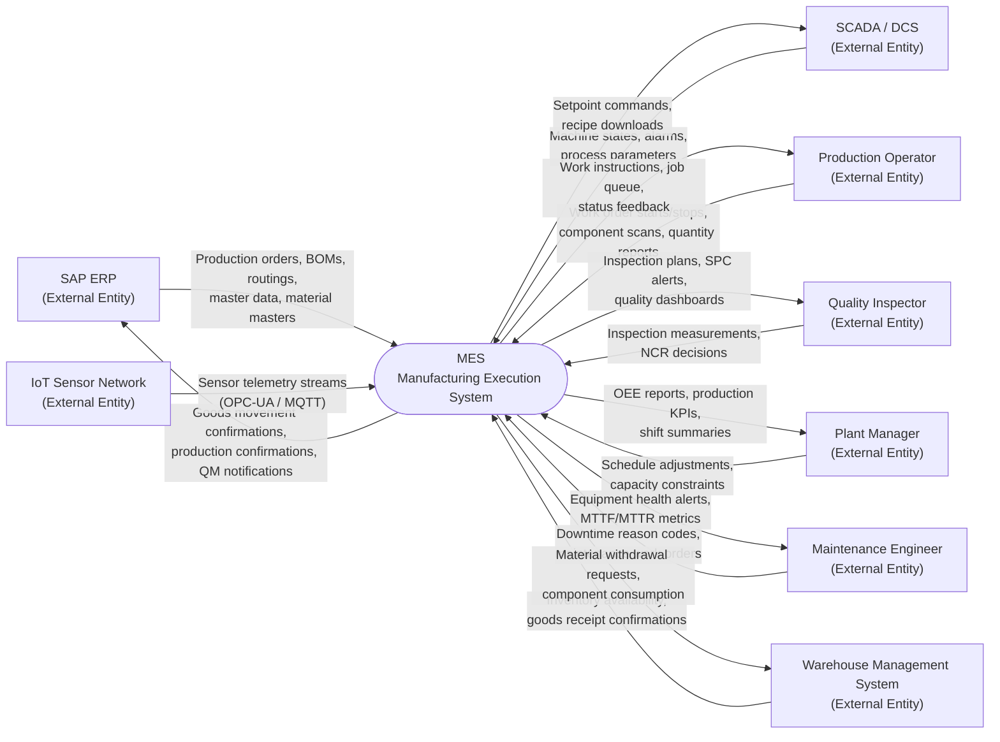
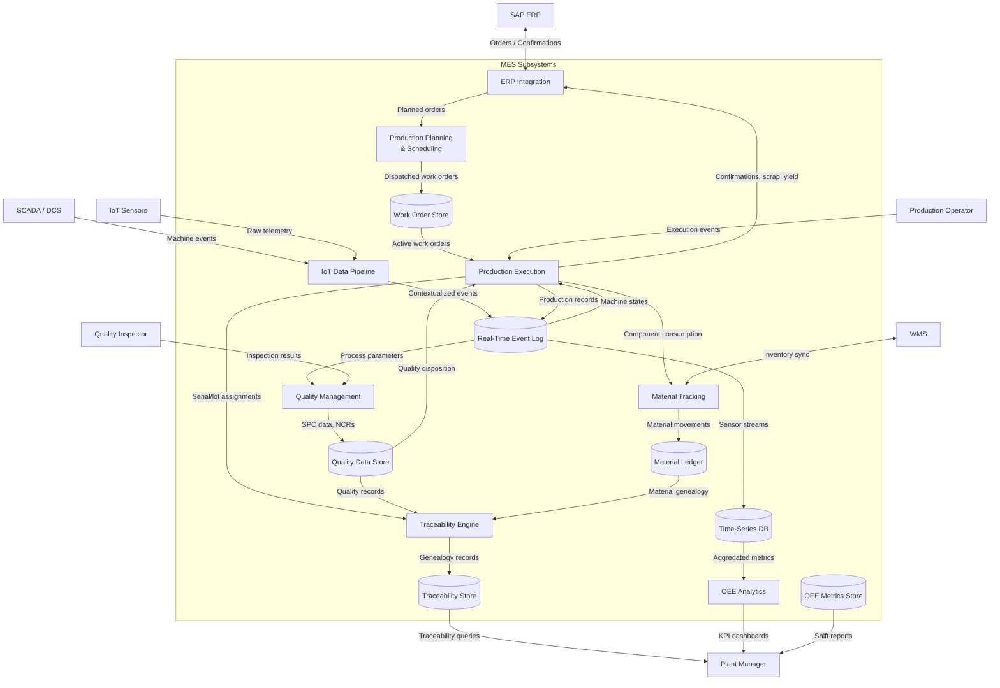
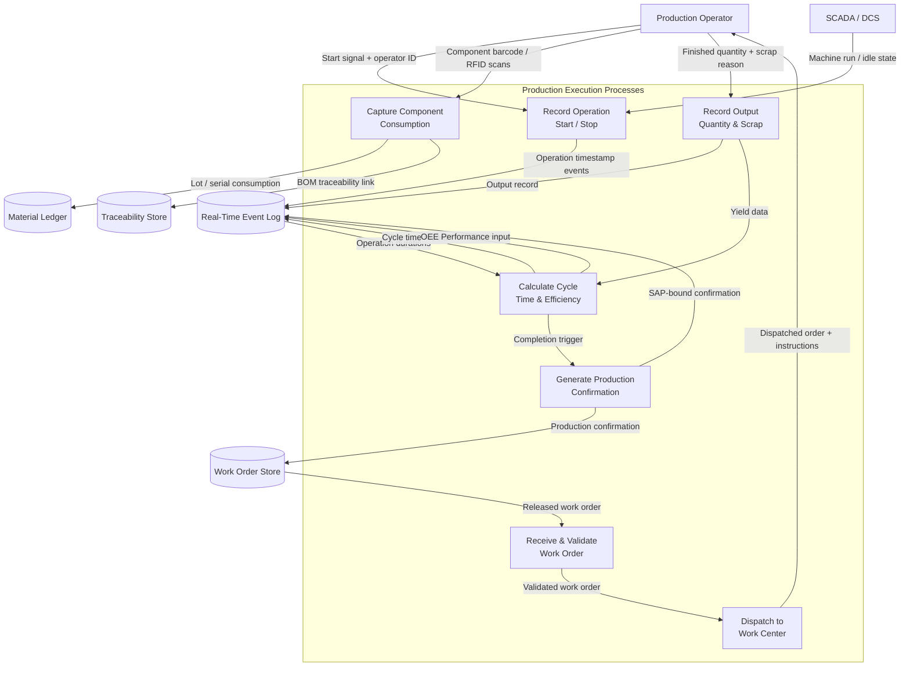
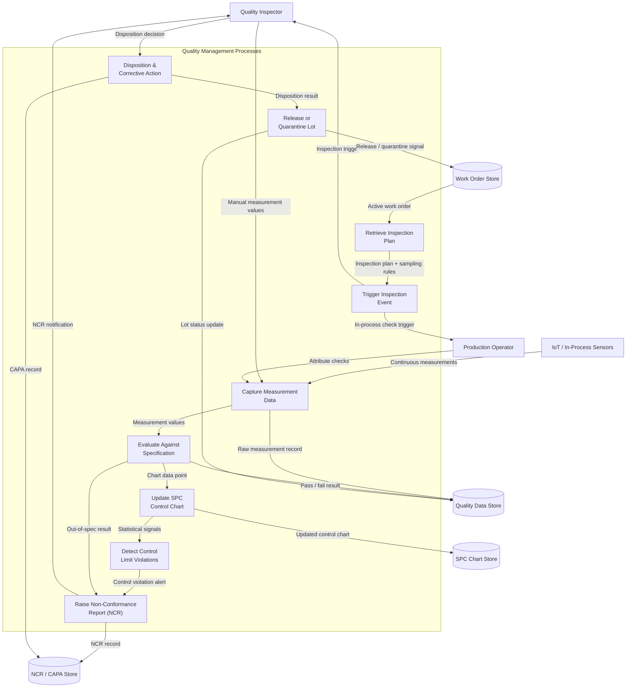
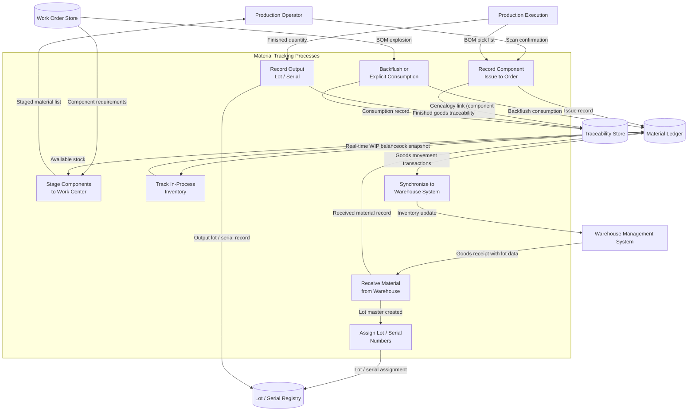
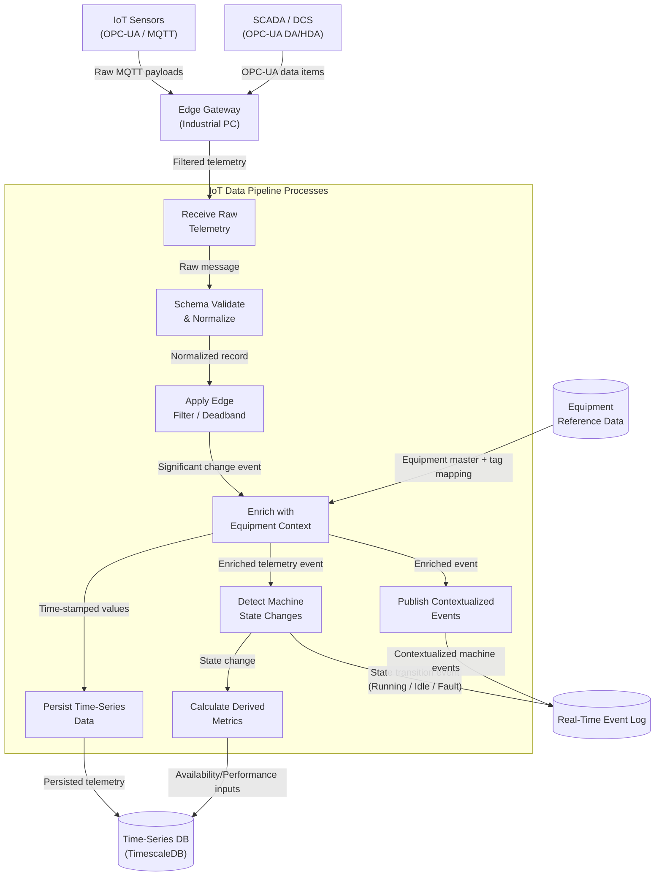

# Data Flow Diagrams — Manufacturing Execution System

## Overview

This document presents the data flow diagrams (DFDs) for the Manufacturing Execution System (MES) supporting discrete manufacturing operations. DFDs model how data moves between external entities, processes, and data stores at progressively increasing levels of detail.

The MES orchestrates production orders, work center scheduling, quality management, material tracking, OEE calculation, and integration with upstream ERP (SAP) and downstream IoT/SCADA systems. These diagrams serve as the authoritative reference for understanding data lineage, transformation points, and integration boundaries across the full production lifecycle.

**Diagram Conventions**

| Symbol | Represents |
|--------|-----------|
| Rounded rectangle | External entity (source or sink) |
| Rectangle | Process (transforms data) |
| Cylinder / open rectangle | Data store (persistent) |
| Labeled arrow | Named data flow |

All flows are named to reflect the semantic content of the data, not the transport mechanism. Bidirectional arrows indicate request/response pairs where both directions carry distinct payloads.

---

## Level 0 Data Flow Diagram (context)

The context diagram presents the entire MES as a single process interacting with all external entities. It establishes the system boundary and identifies every actor that either provides data to or consumes data from the MES.

**External Entities**

| Entity | Role |
|--------|------|
| SAP ERP | Master data, production orders, material requirements planning |
| SCADA / DCS | Real-time machine states, alarms, process parameters |
| IoT Sensor Network | Raw sensor telemetry (temperature, pressure, torque, vibration) |
| Production Operator | Work order execution inputs, component scans, manual measurements |
| Quality Inspector | Inspection results, non-conformance reports, lot dispositions |
| Plant Manager | Schedule adjustments, KPI consumption, capacity constraints |
| Maintenance Engineer | Equipment downtime events, corrective action data |
| Warehouse Management System | Inventory levels, goods receipt confirmations, material staging |

---

## Level 1 Data Flow Diagram (MES subsystems)

The Level 1 diagram decomposes the MES into its primary functional subsystems and shows how data flows among them and with external entities.

**MES Subsystems**

| Subsystem | Responsibility |
|-----------|---------------|
| Production Planning & Scheduling | Transforms ERP orders into dispatched work orders with time-phased schedules |
| Production Execution | Tracks work order progress, operator interactions, and cycle times |
| Quality Management | Manages inspection plans, SPC charting, and non-conformance lifecycle |
| Material Tracking | Maintains real-time WIP inventory, lot/serial genealogy, and component traceability |
| IoT Data Pipeline | Ingests, filters, contextualizes, and routes machine telemetry |
| OEE Analytics | Calculates Availability, Performance, and Quality metrics per work center |
| ERP Integration | Bidirectional synchronization with SAP PP, QM, MM, and PM modules |
| Traceability Engine | Builds and queries full production genealogy records |

---

## Level 2 Data Flow Diagrams (one each for: Production Execution, Quality Management, Material Tracking, IoT Data Pipeline)

### Production Execution

The Production Execution subsystem manages the lifecycle of a work order from release through completion. It coordinates operator interactions, machine state changes, and component consumption to generate a complete production record.

### Quality Management

The Quality Management subsystem enforces inspection plans, evaluates measurements against specifications, manages SPC control charts, and drives the non-conformance lifecycle through disposition and corrective action.

### Material Tracking

The Material Tracking subsystem maintains real-time visibility of WIP inventory, enforces FIFO/FEFO consumption rules, records lot and serial genealogy, and synchronizes stock movements with the Warehouse Management System.

### IoT Data Pipeline

The IoT Data Pipeline ingests raw sensor telemetry from the plant floor, applies edge filtering and contextualization, detects machine state transitions, and routes enriched events to the appropriate MES subsystems.

---

## Data Store Descriptions

| Data Store | Technology | Contents | Retention | Access Pattern |
|------------|-----------|----------|-----------|---------------|
| Work Order Store | PostgreSQL | Production orders, operations, work center assignments, status transitions | 7 years (regulatory) | OLTP read/write; indexed on work center, order status, date range |
| Real-Time Event Log | Apache Kafka + PostgreSQL | Machine state transitions, operator events, production records | 90 days hot; archive to S3 cold | High-throughput append; consumer-group replay; partition by work center |
| Quality Data Store | PostgreSQL | Inspection plans, measurement results, SPC data points, NCR records | 10 years (ISO/TS 16949) | Read-heavy for SPC trending; write at inspection completion |
| SPC Chart Store | TimescaleDB | Control chart time-series, Western Electric rule evaluations | 5 years | Time-range queries; hypertable partitioned by characteristic and work center |
| NCR / CAPA Store | PostgreSQL | Non-conformance reports, dispositions, corrective actions, effectiveness reviews | 10 years | Document-style CRUD; full-text search on description and root cause fields |
| Material Ledger | PostgreSQL | Stock movements, WIP balances, consumption records, goods movements | 7 years | Double-entry ledger; balance queries by storage location and lot |
| Lot / Serial Registry | PostgreSQL | Lot masters, serial number assignments, status, expiry dates, supplier info | 10 years | Lookup by lot or serial number; parent-child hierarchy traversal |
| Traceability Store | PostgreSQL (with graph extension) | Production genealogy, component-to-finished-goods links, process parameter snapshots | 10 years | Graph traversal for forward and backward traceability queries |
| Time-Series DB | TimescaleDB | Sensor telemetry, OPC-UA tag values, derived process metrics | 1 year hot; S3 cold | Continuous aggregates; time-bucket queries; hypertable compression at 7 days |
| OEE Metrics Store | TimescaleDB | Availability, Performance, Quality, and OEE per shift and work center | 3 years | Dashboard queries; shift-level and daily aggregates; rolling 12-month trend |
| Equipment Reference Data | PostgreSQL | Work center masters, tag-to-equipment mappings, alarm thresholds | Perpetual (master data) | Low-frequency read; entire reference set cached in Redis at startup |

---

## Data Flow Security Controls

### Transport Security

All data flows crossing network boundaries use TLS 1.3 as the minimum transport security. MQTT broker connections require mutual TLS (mTLS) with client certificates issued by the plant PKI. OPC-UA sessions use X.509 certificate authentication with message signing and encryption configured to **Basic256Sha256** security policy or higher.

Internal service-to-service communication within the Kubernetes cluster is secured by Istio service mesh mTLS, enforced by PeerAuthentication policies requiring mutual authentication for all pod-to-pod traffic.

### Authentication and Authorization

| Flow | Authentication Method | Authorization |
|------|-----------------------|---------------|
| Operator → MES UI | OIDC / OAuth 2.0 via Azure AD SSO | Role-based: Operator, Quality Inspector, Supervisor, Plant Manager, Admin |
| MES → SAP ERP | RFC / SOAP with service account + mTLS | SAP authorization objects scoped per RFC function group |
| IoT Sensors → Edge Gateway | X.509 device certificates | Device registry allowlist; per-topic ACL enforced on MQTT broker |
| Edge Gateway → MES Core | mTLS + signed JWT (short-lived, 15 min) | API Gateway validates JWT claims; scope-based route authorization |
| MES → WMS | REST API + OAuth 2.0 client credentials | Scoped to inventory read and goods-movement write only |
| Internal Services | Istio mTLS + SPIFFE SVID | Service account authorization via Kubernetes RBAC and Istio AuthorizationPolicy |

### Data Integrity Controls

- **Event immutability**: All events written to the Real-Time Event Log (Kafka) are append-only. Log compaction is disabled for audit-critical topics; retention is time-based, not size-based.
- **Cryptographic audit trail**: Production confirmations and NCR closure records carry a SHA-256 hash of the record payload, stored alongside the record in the database to detect unauthorized modification.
- **Input validation**: All API endpoints validate incoming payloads against registered OpenAPI schemas. Numeric measurements are range-checked against specification limits before persistence.
- **Duplicate detection**: The IoT Data Pipeline uses idempotency keys (device ID + timestamp + sequence number) to detect and discard duplicate sensor events at the ingestion stage, preventing double-counting in OEE calculations.
- **Outbox pattern**: Cross-domain state changes (e.g., production completion triggering material backflush) use the transactional outbox pattern to guarantee exactly-once event publication relative to the database write.

### Data Classification

| Classification | Examples | Controls |
|---------------|---------|----------|
| Restricted | ERP service credentials, PKI private keys, Vault root token | HSM or Vault storage; never in application config files or container images |
| Confidential | Production recipes, quality specifications, customer traceability data | Encrypted at rest (AES-256); access audit log; role-restricted API endpoints |
| Internal | Work orders, OEE metrics, material movements | Role-based access control; encrypted in transit; standard audit logging |
| Operational | Machine telemetry, event timestamps, state changes | Encrypted in transit; integrity-checked via message signing at edge |

### Regulatory and Compliance Flows

For regulated industries (automotive IATF 16949, aerospace AS9100), the following additional controls apply to specific data flows:

- **Electronic signatures**: Critical quality decisions — lot disposition, NCR closure, recipe parameter changes — require a second authenticator (password re-entry or hardware token) captured as part of the audit record, satisfying 21 CFR Part 11 equivalent requirements.
- **Data lineage**: The Traceability Engine maintains an immutable link from every finished serial number back through all contributing component lots, process parameters, operator IDs, and quality measurements, satisfying full forward and backward traceability obligations.
- **Change control**: Modifications to inspection plans, SPC specifications, or recipe parameters are versioned. The prior version, change author, timestamp, and change justification are retained permanently in the Quality Data Store. Active recipes cannot be modified; a new version must be created and explicitly activated.
- **Data residency**: All raw production data, quality records, and traceability information remain on-premises within the plant network boundary. Only aggregated and anonymized OEE trend data is replicated to cloud analytics infrastructure.
