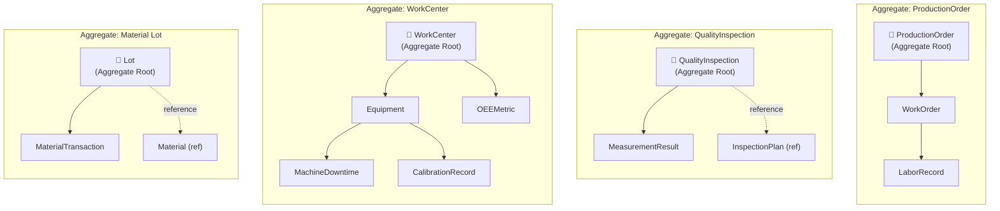
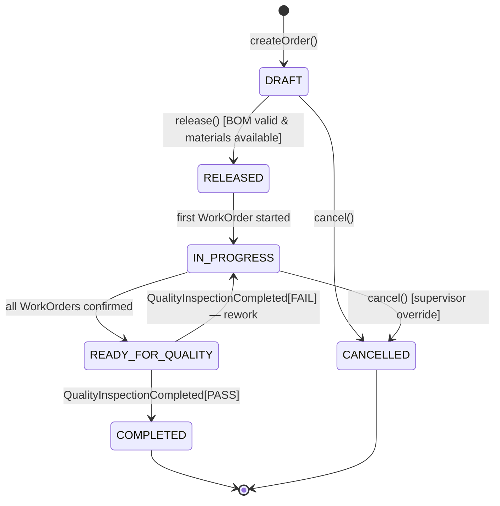
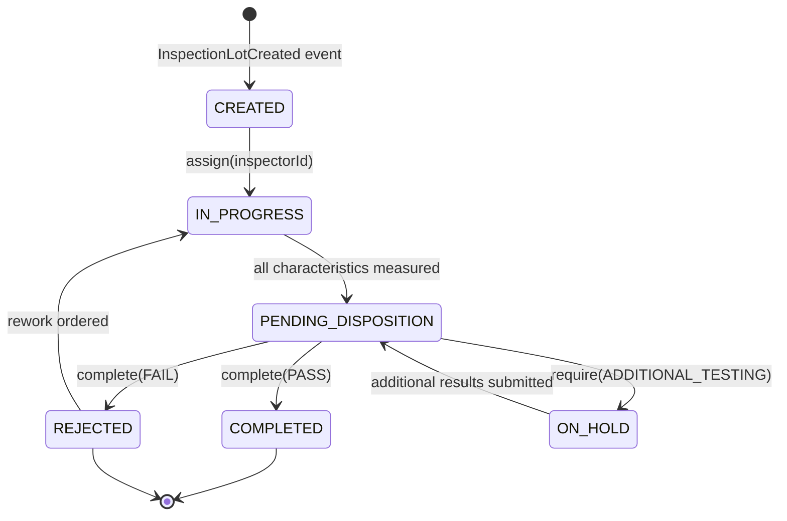

# Domain Model — Manufacturing Execution System

## Introduction

The MES domain model is structured around **Domain-Driven Design (DDD)** principles. The manufacturing
domain is inherently complex — it intersects production planning, quality management, equipment
monitoring, material tracking, and labor management. A naive "big ball of mud" model would couple
these concerns tightly, making the system fragile and expensive to evolve.

This document defines:
- **Entities and Value Objects** — the core building blocks
- **Aggregate Roots** — the transactional boundaries
- **Bounded Contexts** — the linguistic and functional sub-domains
- **Domain Events** — the integration currency between contexts

### Ubiquitous Language Glossary

| Term | Definition |
|---|---|
| **Production Order** | Authorization to manufacture a specific quantity of material by a target date |
| **Work Order** | A step-level execution unit derived from a Production Order routing |
| **Work Center** | A logical grouping of machines/labor with defined capacity |
| **BOM** | Bill of Materials — defines the component structure of a finished good |
| **Routing** | The sequence of operations required to manufacture an item |
| **Inspection Lot** | A quality inspection instance tied to a production order |
| **OEE** | Overall Equipment Effectiveness — availability × performance × quality |
| **Lot** | A batch of material with traceability and genealogy data |
| **Shift** | A defined working period (e.g., Day Shift 06:00–14:00) |

---

## Class Diagram

```mermaid
classDiagram
    %% ══════════════════════════════════════════════════════════
    %% PRODUCTION CONTEXT
    %% ══════════════════════════════════════════════════════════

    class ProductionOrder {
        +UUID id
        +String orderNo
        +String materialNo
        +String plantCode
        +Quantity targetQuantity
        +Quantity confirmedQuantity
        +Quantity scrapQuantity
        +DateRange plannedDates
        +DateRange actualDates
        +OrderStatus status
        +String sapOrderNo
        +String batchNo
        +UUID routingId
        +UUID bomId
        +release() void
        +complete() void
        +cancel(reason: String) void
        +calculateVariance() Quantity
        +getProgressPercentage() double
    }

    class WorkOrder {
        +UUID id
        +String workOrderNo
        +UUID productionOrderId
        +UUID workCenterId
        +int operationSequence
        +String operationText
        +Quantity plannedQuantity
        +Quantity confirmedQuantity
        +Quantity scrapQuantity
        +Duration plannedDuration
        +Duration actualDuration
        +LocalDateTime scheduledStart
        +LocalDateTime scheduledEnd
        +LocalDateTime actualStart
        +LocalDateTime actualEnd
        +WorkOrderStatus status
        +start(operatorId: UUID) void
        +confirm(yieldQty: Quantity, scrapQty: Quantity) void
        +complete() void
        +calculateEfficiency() double
    }

    class WorkCenter {
        +UUID id
        +String workCenterCode
        +String name
        +String plantCode
        +WorkCenterType type
        +int plannedCapacityMinutesPerDay
        +double utilizationFactor
        +List~Equipment~ equipment
        +isAvailable(dateRange: DateRange) boolean
        +getCapacityUtilization(date: LocalDate) double
        +getActiveWorkOrders() List~WorkOrder~
        +getCurrentOEE() OEEScore
    }

    class Routing {
        +UUID id
        +String routingNo
        +String materialNo
        +String plantCode
        +String version
        +boolean isDefault
        +List~RoutingOperation~ operations
        +LocalDate validFrom
        +LocalDate validTo
        +getTotalPlannedDuration() Duration
        +getOperationBySequence(seq: int) RoutingOperation
    }

    class RoutingOperation {
        +UUID id
        +UUID routingId
        +int sequence
        +String operationNo
        +String description
        +UUID workCenterId
        +Duration setupTime
        +Duration machineTime
        +Duration laborTime
        +String controlKey
        +List~String~ workInstructions
    }

    class BillOfMaterials {
        +UUID id
        +String bomNo
        +String headerMaterialNo
        +String plantCode
        +String version
        +LocalDate validFrom
        +LocalDate validTo
        +List~BOMItem~ items
        +getComponentList() List~BOMItem~
        +getItemByMaterial(materialNo: String) BOMItem
        +calculateTotalCost() Money
    }

    class BOMItem {
        +UUID id
        +UUID bomId
        +String componentMaterialNo
        +Quantity requiredQuantity
        +String unit
        +int itemNo
        +BOMItemCategory category
        +boolean isCritical
        +String storageLocation
        +String backflushIndicator
    }

    %% ══════════════════════════════════════════════════════════
    %% QUALITY CONTEXT
    %% ══════════════════════════════════════════════════════════

    class QualityInspection {
        +UUID id
        +String lotNo
        +UUID productionOrderId
        +String materialNo
        +Quantity inspectedQuantity
        +UUID inspectionPlanId
        +UUID assignedInspectorId
        +InspectionStatus status
        +LotDisposition disposition
        +LocalDateTime triggeredAt
        +LocalDateTime completedAt
        +String limsReference
        +List~MeasurementResult~ measurements
        +assign(inspectorId: UUID) void
        +recordMeasurement(result: MeasurementResult) void
        +complete(disposition: LotDisposition) void
        +calculateAcceptance() boolean
        +generateCertificate() byte[]
    }

    class InspectionPlan {
        +UUID id
        +String planNo
        +String materialNo
        +String plantCode
        +String version
        +int sampleSize
        +AQLLevel aqlLevel
        +List~InspectionCharacteristic~ characteristics
        +LocalDate validFrom
        +getSampleSizeForLot(lotQuantity: Quantity) int
        +getCharacteristic(charId: UUID) InspectionCharacteristic
    }

    class InspectionCharacteristic {
        +UUID id
        +UUID planId
        +String characteristicNo
        +String description
        +String measurementUnit
        +SpecificationLimit specLimit
        +boolean spcEnabled
        +int spcSubgroupSize
        +String gaugeType
        +MeasurementMethod method
        +isWithinSpec(value: double) boolean
        +getControlLimits() ControlLimits
    }

    class MeasurementResult {
        +UUID id
        +UUID inspectionLotId
        +UUID characteristicId
        +double measuredValue
        +String unit
        +UUID gaugeId
        +UUID recordedBy
        +LocalDateTime recordedAt
        +boolean withinSpec
        +boolean oocFlag
        +String assignableCause
        +evaluate() MeasurementStatus
    }

    %% ══════════════════════════════════════════════════════════
    %% EQUIPMENT CONTEXT
    %% ══════════════════════════════════════════════════════════

    class Equipment {
        +UUID id
        +String equipmentNo
        +String description
        +String serialNo
        +String manufacturer
        +String modelNo
        +UUID workCenterId
        +EquipmentStatus status
        +LocalDate commissioningDate
        +LocalDate nextMaintenanceDate
        +isOperational() boolean
        +getLastCalibration() CalibrationRecord
        +getActiveDowntime() Optional~MachineDowntime~
        +getMTBF() Duration
        +getMTTR() Duration
    }

    class MachineDowntime {
        +UUID id
        +UUID equipmentId
        +UUID workCenterId
        +LocalDateTime startTime
        +LocalDateTime endTime
        +DowntimeCode code
        +DowntimeCategory category
        +String description
        +UUID reportedBy
        +String rootCause
        +boolean isPlanned
        +getDuration() Duration
        +close(endTime: LocalDateTime, rootCause: String) void
    }

    class DowntimeCode {
        +UUID id
        +String code
        +String description
        +DowntimeCategory category
        +boolean requiresRootCause
        +boolean triggersMaintenance
        +int sortOrder
    }

    class MaintenanceWorkOrder {
        +UUID id
        +String mwoNo
        +UUID equipmentId
        +MaintenanceType type
        +Priority priority
        +String description
        +UUID assignedTechId
        +MaintenanceStatus status
        +LocalDateTime scheduledDate
        +LocalDateTime actualStart
        +LocalDateTime actualEnd
        +List~String~ tasksCompleted
        +schedule(techId: UUID, date: LocalDateTime) void
        +start() void
        +complete(notes: String) void
    }

    class CalibrationRecord {
        +UUID id
        +UUID equipmentId
        +String calibrationStandard
        +LocalDate calibrationDate
        +LocalDate nextCalibrationDate
        +String performedBy
        +String externalLabRef
        +CalibrationStatus result
        +boolean inTolerance
        +Map~String, Double~ measurementPoints
        +isValid() boolean
        +isExpired() boolean
    }

    class OEEMetric {
        +UUID id
        +UUID equipmentId
        +UUID workCenterId
        +UUID shiftId
        +LocalDate date
        +OEEComponent availability
        +OEEComponent performance
        +OEEComponent qualityRate
        +OEEScore oeeScore
        +int plannedProductionTimeMinutes
        +int actualRunTimeMinutes
        +int totalPartsProduced
        +int goodPartsProduced
        +calculateOEE() OEEScore
        +getWorldClassGap() double
    }

    class OEEComponent {
        +double value
        +double numerator
        +double denominator
        +String unit
        +toPercentage() String
        +isWorldClass() boolean
    }

    %% ══════════════════════════════════════════════════════════
    %% MATERIAL CONTEXT
    %% ══════════════════════════════════════════════════════════

    class Material {
        +UUID id
        +String materialNo
        +String description
        +MaterialType type
        +String baseUnit
        +String materialGroup
        +double weightKg
        +boolean batchManaged
        +boolean serialNumberManaged
        +boolean shelfLifeRelevant
        +int shelfLifeDays
        +getStock(plant: String, sloc: String) Quantity
        +isAvailable(qty: Quantity, date: LocalDate) boolean
    }

    class Lot {
        +UUID id
        +String lotNo
        +String materialNo
        +String plantCode
        +String storageLocation
        +Quantity quantity
        +Quantity remainingQuantity
        +LotStatus status
        +LocalDate manufacturingDate
        +LocalDate expiryDate
        +String supplierBatchNo
        +UUID productionOrderId
        +List~MaterialTransaction~ transactions
        +reserve(qty: Quantity, reference: String) void
        +consume(qty: Quantity, orderId: UUID) void
        +block(reason: String) void
        +isExpired() boolean
    }

    class MaterialTransaction {
        +UUID id
        +UUID lotId
        +String materialNo
        +TransactionType type
        +Quantity quantity
        +String movementType
        +UUID referenceOrderId
        +String storageLocation
        +UUID createdBy
        +LocalDateTime postedAt
        +String sapDocumentNo
    }

    %% ══════════════════════════════════════════════════════════
    %% LABOR CONTEXT
    %% ══════════════════════════════════════════════════════════

    class LaborRecord {
        +UUID id
        +UUID workOrderId
        +UUID operatorId
        +UUID shiftId
        +LocalDateTime clockIn
        +LocalDateTime clockOut
        +Duration plannedDuration
        +Duration actualDuration
        +LaborActivity activity
        +double efficiencyRate
        +String notes
        +getDurationMinutes() int
        +calculateEfficiency() double
    }

    class Shift {
        +UUID id
        +String shiftCode
        +String name
        +LocalTime startTime
        +LocalTime endTime
        +List~LocalDate~ workDays
        +List~BreakPeriod~ breaks
        +String plantCode
        +getNetWorkingMinutes() int
        +isActiveAt(dateTime: LocalDateTime) boolean
        +getBreakDurationMinutes() int
    }

    %% ══════════════════════════════════════════════════════════
    %% IDENTITY CONTEXT
    %% ══════════════════════════════════════════════════════════

    class User {
        +UUID id
        +String username
        +String email
        +String firstName
        +String lastName
        +String employeeNo
        +String plantCode
        +boolean isActive
        +List~Role~ roles
        +LocalDateTime lastLogin
        +hasPermission(permission: Permission) boolean
        +getEffectivePermissions() Set~Permission~
    }

    class Role {
        +UUID id
        +String name
        +String description
        +List~Permission~ permissions
        +addPermission(p: Permission) void
        +removePermission(p: Permission) void
    }

    class Permission {
        +UUID id
        +String resource
        +String action
        +String scope
        +toString() String
    }

    %% ══════════════════════════════════════════════════════════
    %% RELATIONSHIPS
    %% ══════════════════════════════════════════════════════════

    ProductionOrder "1" *-- "1..*" WorkOrder : contains
    ProductionOrder "1" --> "1" BillOfMaterials : references
    ProductionOrder "1" --> "1" Routing : uses
    ProductionOrder "1" --> "0..1" QualityInspection : triggers

    WorkOrder "1" --> "1" WorkCenter : assigned to
    WorkOrder "0..*" --> "0..*" LaborRecord : records labor via

    Routing "1" *-- "1..*" RoutingOperation : defines
    RoutingOperation "1" --> "1" WorkCenter : performed at

    BillOfMaterials "1" *-- "1..*" BOMItem : composed of
    BOMItem "1" --> "1" Material : references

    QualityInspection "1" --> "1" InspectionPlan : follows
    QualityInspection "1" *-- "0..*" MeasurementResult : contains

    InspectionPlan "1" *-- "1..*" InspectionCharacteristic : defines

    WorkCenter "1" *-- "0..*" Equipment : contains
    WorkCenter "1" --> "0..*" MachineDowntime : records
    WorkCenter "1" --> "0..*" OEEMetric : measures

    Equipment "1" --> "0..*" MachineDowntime : experiences
    Equipment "1" --> "0..*" MaintenanceWorkOrder : has
    Equipment "1" --> "0..*" CalibrationRecord : has

    MachineDowntime "1" --> "1" DowntimeCode : classified by

    OEEMetric "1" *-- "3" OEEComponent : composed of
    OEEMetric "1" --> "1" Shift : measured in

    Lot "1" --> "1" Material : instance of
    Lot "1" *-- "0..*" MaterialTransaction : tracks via

    LaborRecord "1" --> "1" Shift : belongs to
    LaborRecord "1" --> "1" User : performed by

    User "1" --> "0..*" Role : has
    Role "1" *-- "0..*" Permission : grants
```



---

## Domain Aggregates

An **Aggregate** is a cluster of entities and value objects treated as a single unit for data changes.
Only the **Aggregate Root** may be referenced from outside the aggregate boundary.



### Aggregate Rules

| Rule | Description |
|---|---|
| **Single transaction boundary** | All changes within an aggregate are committed atomically |
| **Reference by ID only** | Cross-aggregate references use only the root's UUID |
| **Small aggregates preferred** | Each aggregate fits in memory; no lazy-loading surprises |
| **Invariants enforced by root** | Only the aggregate root validates business rules across child entities |

---

## Bounded Contexts

```mermaid
flowchart LR
    subgraph PROD["Production Context"]
        ProductionOrder
        WorkOrder
        WorkCenter
        Routing
        BOM["BillOfMaterials"]
    end

    subgraph QUAL["Quality Context"]
        QualityInspection
        InspectionPlan
        InspectionCharacteristic
        MeasurementResult
        SPCEngine["SPC Engine"]
    end

    subgraph EQUIP["Equipment Context"]
        Equipment
        MachineDowntime
        OEEMetric
        MaintenanceWorkOrder
        CalibrationRecord
    end

    subgraph MATL["Material Context"]
        Material
        Lot
        MaterialTransaction
    end

    subgraph LABOR["Labor Context"]
        LaborRecord
        Shift
        User
        Role
    end

    PROD -->|ProductionOrderReleased| MATL
    PROD -->|ProductionOrderReadyForQuality| QUAL
    PROD -->|WorkOrderStarted| LABOR
    EQUIP -->|MachineBreakdownDetected| PROD
    QUAL -->|QualityInspectionCompleted| PROD
    MATL -->|MaterialConsumed| PROD
    EQUIP -->|OEECalculationCompleted| PROD
```



### Context Mapping

| Upstream Context | Downstream Context | Integration Pattern |
|---|---|---|
| Production | Quality | Domain Event (Kafka topic) |
| Production | Material | Orchestration Saga (REST + compensating) |
| Equipment | Production | Domain Event (Kafka topic) |
| Quality | Production | Domain Event (Kafka topic) |
| Quality | LIMS (External) | ACL — Anti-Corruption Layer via REST adapter |
| Production | SAP ERP (External) | ACL via ERPSyncService |

---

## Domain Events

### Production Context Events

| Event | Aggregate | Trigger | Consumers |
|---|---|---|---|
| `ProductionOrderCreated` | ProductionOrder | Draft saved | ERPSyncService |
| `ProductionOrderReleased` | ProductionOrder | Order released | MaterialService, SchedulingService, ERPSyncService |
| `ProductionOrderReadyForQuality` | ProductionOrder | All WOs confirmed | QualityService |
| `ProductionOrderCompleted` | ProductionOrder | Quality approved | ERPSyncService, ReportingService |
| `ProductionOrderCancelled` | ProductionOrder | Supervisor cancels | MaterialService (release reservations) |
| `WorkOrderStarted` | WorkOrder | Operator starts | LaborService, OEEService |
| `WorkOrderConfirmed` | WorkOrder | Yield reported | OEEService, MaterialService |

### Quality Context Events

| Event | Aggregate | Trigger | Consumers |
|---|---|---|---|
| `InspectionLotCreated` | QualityInspection | PO ready for QC | NotificationService |
| `OOCAlertRaised` | QualityInspection | SPC WER violated | NotificationService, ProductionService |
| `LotDispositioned` | QualityInspection | Inspector decides | MaterialService |
| `QualityInspectionCompleted` | QualityInspection | Inspection closed | ProductionService, LIMSAdapter |

### Equipment Context Events

| Event | Aggregate | Trigger | Consumers |
|---|---|---|---|
| `MachineBreakdownDetected` | WorkCenter | State → BREAKDOWN | MaintenanceService, OEEService, NotificationService |
| `MachineBackOnline` | WorkCenter | State → RUNNING | OEEService, ProductionService |
| `OEECalculationCompleted` | WorkCenter | End of OEE window | ReportingService, AlertService |
| `MaintenanceCompleted` | WorkCenter | MWO closed | OEEService, ERPSyncService |
| `CalibrationExpired` | Equipment | Calibration due date | NotificationService, QualityService |

---

## Value Objects

Value objects are **immutable**, **equality by value**, and have **no identity**.

### `Quantity`

```java
public record Quantity(BigDecimal value, String unit) {
    public Quantity {
        if (value.compareTo(BigDecimal.ZERO) < 0)
            throw new InvalidQuantityException("Quantity must be non-negative");
    }
    public Quantity add(Quantity other) { /* unit-safe addition */ }
    public Quantity subtract(Quantity other) { /* unit-safe subtraction */ }
    public boolean isZero() { return value.compareTo(BigDecimal.ZERO) == 0; }
}
```

### `DateRange`

```java
public record DateRange(LocalDateTime start, LocalDateTime end) {
    public DateRange {
        if (end.isBefore(start))
            throw new InvalidDateRangeException("End must be after start");
    }
    public Duration getDuration() { return Duration.between(start, end); }
    public boolean overlaps(DateRange other) { /* interval overlap check */ }
    public boolean contains(LocalDateTime point) { /* point-in-interval check */ }
}
```

### `OEEScore`

```java
public record OEEScore(double value) {
    public static final double WORLD_CLASS_THRESHOLD = 0.85;
    public OEEScore {
        if (value < 0 || value > 1)
            throw new IllegalArgumentException("OEE must be in [0, 1]");
    }
    public boolean isWorldClass() { return value >= WORLD_CLASS_THRESHOLD; }
    public String toPercentage() { return String.format("%.1f%%", value * 100); }
    public RatingLevel getRating() {
        if (value >= 0.85) return RatingLevel.WORLD_CLASS;
        if (value >= 0.65) return RatingLevel.ACCEPTABLE;
        return RatingLevel.POOR;
    }
}
```

### `SpecificationLimit`

```java
public record SpecificationLimit(double nominal, double usl, double lsl) {
    public SpecificationLimit {
        if (usl <= lsl) throw new IllegalArgumentException("USL must exceed LSL");
        if (nominal < lsl || nominal > usl)
            throw new IllegalArgumentException("Nominal must be within spec range");
    }
    public boolean isWithinSpec(double value) { return value >= lsl && value <= usl; }
    public double getTolerance() { return (usl - lsl) / 2.0; }
    public double getCpk(double processMean, double processStdDev) {
        double cpkUpper = (usl - processMean) / (3 * processStdDev);
        double cpkLower = (processMean - lsl) / (3 * processStdDev);
        return Math.min(cpkUpper, cpkLower);
    }
}
```

---

## Entity State Machines

### ProductionOrder Status Transitions



### QualityInspection Status Transitions


