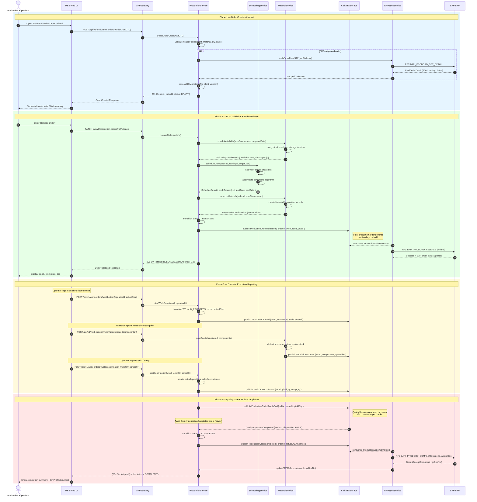
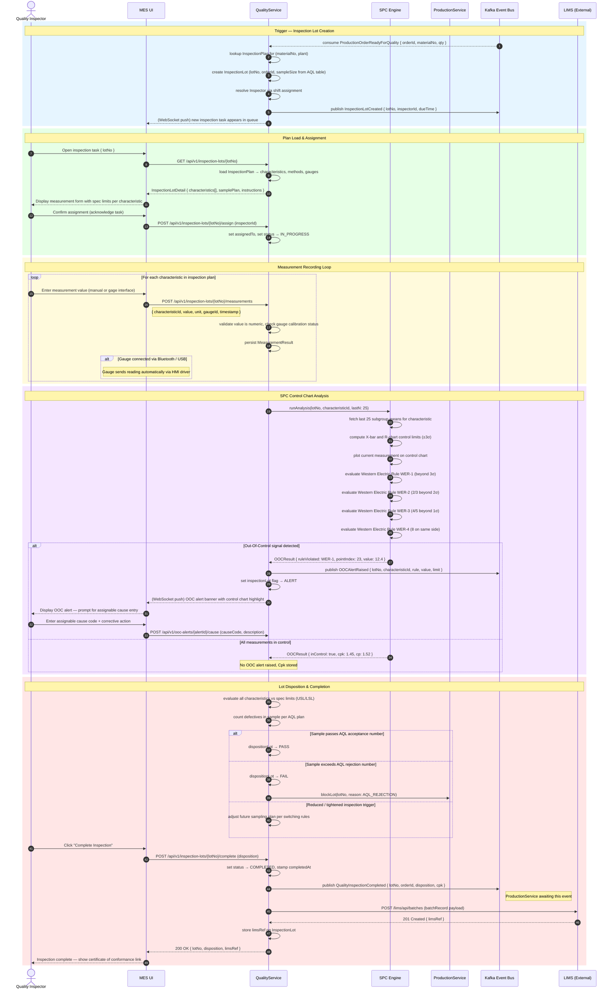
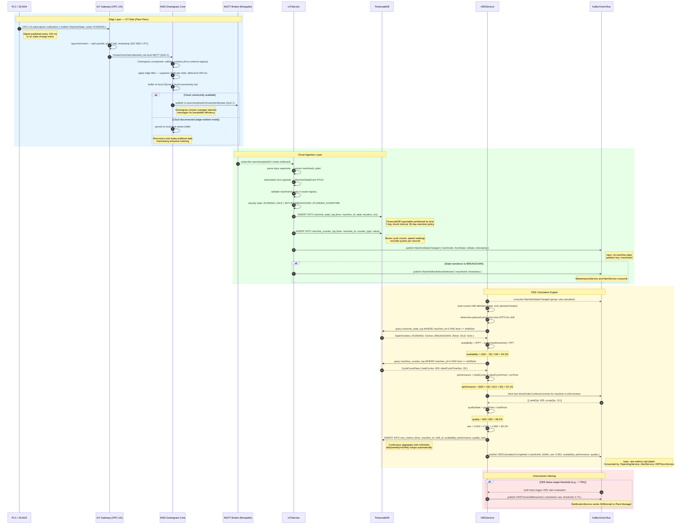

# System Sequence Diagrams — Manufacturing Execution System

This document captures the end-to-end message flows for three critical MES processes:
**Production Order Execution**, **Quality Inspection with SPC**, and **IoT Data Ingestion with OEE Calculation**.
Each diagram exposes the full temporal ordering of service calls, events, and async interactions.

---

## 1. Production Order Execution Sequence

### Overview

A Production Order (PO) travels through four distinct lifecycle phases inside MES before it is
confirmed back to SAP ERP:

| Phase | Description |
|---|---|
| **Creation / Import** | Supervisor manually creates or pulls from SAP |
| **Release** | BOM validated, materials reserved, schedule confirmed |
| **Execution** | Operators report against work orders on the shop floor |
| **Completion** | Quality gate passed, ERP confirmation sent |

The sequence below models the complete happy-path flow including the asynchronous event spine
over Kafka and the eventual ERP round-trip.



### Key Design Decisions

- **Saga Pattern**: The release phase uses an orchestration saga inside `ProductionService`. If
  `MatSvc.reserveMaterials` fails, a compensating `MatSvc.cancelReservation` is issued and the
  order reverts to `DRAFT`.
- **At-least-once delivery**: All Kafka publishes use idempotency keys (`orderId + eventType`).
  Consumers are idempotent to handle duplicate delivery.
- **ERP decoupling**: `ERPSyncService` is the sole adapter for SAP RFC calls. Other services never
  call SAP directly, preserving the anti-corruption layer.

---

## 2. Quality Inspection with SPC Sequence

### Overview

Quality in MES follows the **Inspection Lot** pattern aligned to ISO 2859 / VDA 6.3. Every
production order completion triggers an automatic inspection lot. The SPC Engine evaluates
measurements against **Western Electric Rules (WER)** and raises Out-Of-Control (OOC) alerts
when control limits are violated.

| SPC Signal | Western Electric Rule |
|---|---|
| WER-1 | 1 point beyond 3σ |
| WER-2 | 2 of 3 consecutive beyond 2σ same side |
| WER-3 | 4 of 5 consecutive beyond 1σ same side |
| WER-4 | 8 consecutive points on same side of mean |



### SPC Engine Architecture Note

The `SPC Engine` is deployed as a **sidecar container** within the `QualityService` Kubernetes pod.
It exposes a gRPC interface on `localhost:50051`. This co-location eliminates network round-trips
during real-time measurement entry, keeping p99 latency under 50 ms even with 25-subgroup lookback.

---

## 3. IoT Data Ingestion and OEE Calculation Sequence

### Overview

OEE (Overall Equipment Effectiveness) is the product of three rates:

```
OEE = Availability × Performance × Quality Rate
```

| Metric | Formula | Data Source |
|---|---|---|
| **Availability** | (Planned − Downtime) / Planned | Machine state signals |
| **Performance** | (Actual cycles × Ideal cycle time) / Run time | Encoder / counter signals |
| **Quality Rate** | Good parts / Total parts | Production confirmations |

The sequence below models the journey from a raw PLC signal to a persisted OEE metric published
to downstream BI systems.



### TimescaleDB Schema Notes

```sql
-- Hypertable for machine state
SELECT create_hypertable('machine_state_log', 'time', chunk_time_interval => INTERVAL '1 day');

-- Continuous aggregate for hourly OEE
CREATE MATERIALIZED VIEW oee_hourly
WITH (timescaledb.continuous) AS
SELECT time_bucket('1 hour', time) AS bucket,
       machine_id,
       AVG(oee) AS avg_oee,
       MIN(oee) AS min_oee
FROM oee_metrics
GROUP BY bucket, machine_id;
```

---

## Sequence Diagram Conventions

| Symbol | Meaning |
|---|---|
| `rect rgb(...)` | Logical phase boundary with color coding |
| `alt / else` | Conditional branching (if-then-else logic) |
| `loop` | Repeating interaction over a collection |
| `Note over` / `Note right of` | In-line design annotations |
| `->>` | Synchronous request / call |
| `-->>` | Synchronous response or async delivery |
| `autonumber` | Step numbers for traceability in design reviews |

All sequence diagrams are **living documents** — update them when service contracts change or new
async flows are introduced. Diagrams are the authoritative source for sequence-level API contracts
during sprint planning and integration testing.
