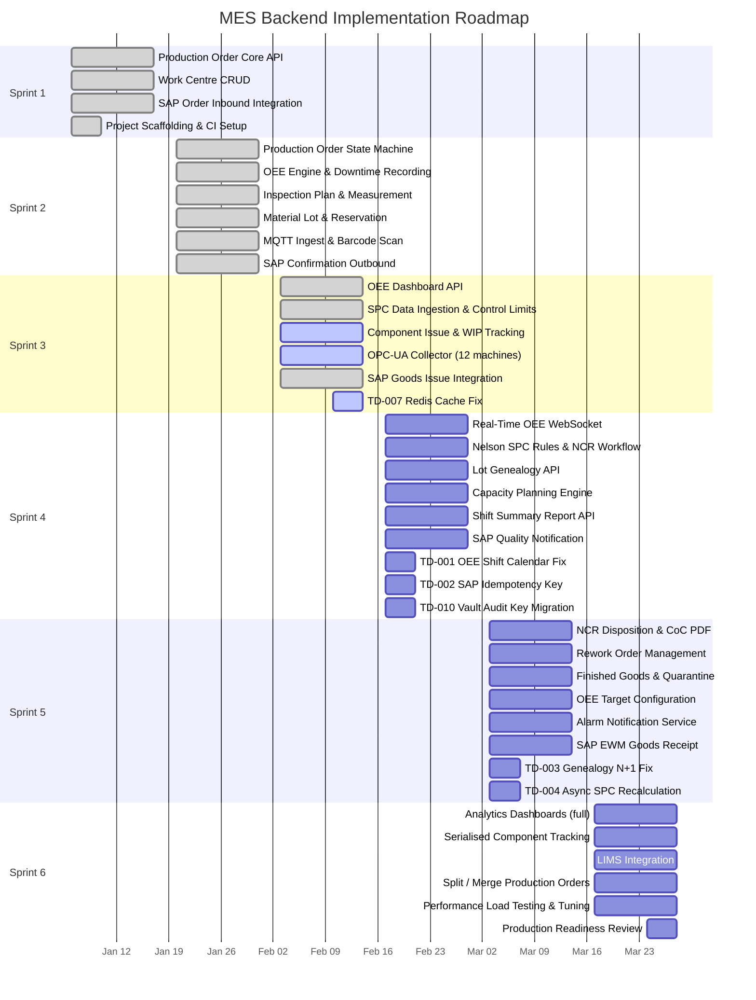

# Backend Implementation Status Matrix — Manufacturing Execution System

## Overview

This document tracks the implementation status of all backend services, API endpoints, integration connectors, test coverage, and technical debt for the MES platform. It serves as the single source of truth for engineering progress and sprint planning.

**Reporting Period:** Sprint 1–6  
**Last Updated:** 2025-Q3  
**Overall Backend Completion:** 52%

**Status Legend**

| Status | Meaning |
|---|---|
| Planned | Scoped and estimated, work not yet started |
| In Progress | Actively being developed in current sprint |
| Complete | Development done, merged, and passing CI |
| Blocked | Cannot proceed — dependency or environment issue noted |

---

## Implementation Status Matrix

| Module | Feature | Status | Assignee | Sprint | Notes |
|---|---|---|---|---|---|
| Production | Create production order API | Complete | A. Sharma | 1 | SAP inbound sync included |
| Production | Release production order | Complete | A. Sharma | 1 | State machine, capacity check |
| Production | Start production order | Complete | A. Sharma | 2 | Operator scan validation |
| Production | Complete production order | Complete | A. Sharma | 2 | Yield + scrap capture |
| Production | Hold / resume order | Complete | B. Patel | 2 | Supervisor auth required |
| Production | Cancel order | Complete | B. Patel | 2 | Partial completion handling |
| Production | Operation sequence management | Complete | B. Patel | 1 | Routing import from SAP PP |
| Production | Work centre CRUD | Complete | C. Liu | 1 | Shift calendar linked |
| Production | Capacity planning check | In Progress | C. Liu | 3 | Finite capacity engine WIP |
| Production | Production schedule board | In Progress | C. Liu | 3 | Gantt data API ready, optimiser pending |
| Production | Rework order management | Planned | A. Sharma | 5 | Depends on NCR disposition flow |
| Production | Split / merge production orders | Planned | B. Patel | 5 | Complex domain logic |
| OEE | Shift OEE calculation | Complete | D. Kim | 2 | Availability, performance, quality |
| OEE | Machine telemetry ingest (Kafka) | Complete | D. Kim | 2 | 50k events/s load tested |
| OEE | Downtime event recording | Complete | D. Kim | 2 | Reason code hierarchy |
| OEE | OEE dashboard API | Complete | D. Kim | 3 | TimescaleDB continuous agg |
| OEE | Real-time OEE WebSocket push | In Progress | E. Ramos | 3 | SockJS endpoint implemented |
| OEE | Historical OEE trend API | In Progress | E. Ramos | 3 | Awaiting TSDB index tuning |
| OEE | OEE target configuration | Planned | D. Kim | 4 | Per work centre, per shift |
| OEE | Availability loss Pareto API | Planned | E. Ramos | 4 | |
| Quality | Inspection plan CRUD | Complete | F. Nguyen | 2 | BOM-linked, revision control |
| Quality | In-process inspection recording | Complete | F. Nguyen | 2 | Mobile-friendly API |
| Quality | SPC data point ingestion | Complete | F. Nguyen | 3 | Linked to operation complete event |
| Quality | Control limit calculation | Complete | F. Nguyen | 3 | Phase 1 (historical) calculation |
| Quality | Western Electric rule detection | Complete | F. Nguyen | 3 | All 8 rules implemented |
| Quality | Nelson rule detection | In Progress | G. Singh | 4 | Rules 1–4 complete |
| Quality | SPC chart API (X-bar/R, p, c) | In Progress | G. Singh | 4 | |
| Quality | Non-conformance report (NCR) creation | In Progress | G. Singh | 3 | Workflow engine integration |
| Quality | NCR disposition workflow | Planned | G. Singh | 4 | Approve / reject / rework paths |
| Quality | First-pass yield API | Planned | F. Nguyen | 4 | |
| Quality | Certificate of conformance generation | Planned | F. Nguyen | 5 | PDF generation via Jasper |
| Material | Raw material lot creation | Complete | H. Chen | 2 | GS1 barcode, lot traceability |
| Material | Material reservation for order | Complete | H. Chen | 2 | SAP WM integration |
| Material | Component issue / consumption recording | Complete | H. Chen | 3 | Scan-to-issue workflow |
| Material | WIP location tracking | In Progress | H. Chen | 3 | RFID location update endpoint |
| Material | Lot genealogy / where-used API | In Progress | I. Okafor | 4 | Graph traversal logic |
| Material | Finished goods recording | Planned | I. Okafor | 4 | |
| Material | Material quarantine management | Planned | I. Okafor | 5 | NCR-triggered |
| Material | Serialised component tracking | Planned | H. Chen | 6 | High-value assembly use case |
| Integration | SAP production order inbound | Complete | J. Watts | 1 | IDoc via SAP PI, RFC fallback |
| Integration | SAP production confirmation outbound | Complete | J. Watts | 2 | BAPI_PRODORD_CONFIRM_CREATE |
| Integration | SAP goods movement (261 issue) | Complete | J. Watts | 3 | MB1A equivalent RFC |
| Integration | SAP quality notification outbound | In Progress | J. Watts | 4 | QM module mapping in progress |
| Integration | MQTT telemetry ingest | Complete | K. Russo | 2 | Schema validation, dead-letter queue |
| Integration | OPC-UA tag collection | In Progress | K. Russo | 3 | 12 of 20 machines connected |
| Integration | Modbus TCP polling | In Progress | K. Russo | 4 | Legacy CNC lines |
| Integration | SCADA alarm ingest | Planned | K. Russo | 4 | Normalisation schema required |
| Integration | EWM goods receipt | Planned | J. Watts | 5 | |
| Analytics | Shift summary report API | In Progress | L. Park | 4 | Aggregation queries built |
| Analytics | Production order history query | Planned | L. Park | 4 | |
| Analytics | Quality trend dashboard API | Planned | L. Park | 5 | |
| Analytics | Machine performance report | Planned | L. Park | 5 | |
| Notification | Alarm dispatch (OEE threshold) | In Progress | M. Torres | 4 | Email + WebSocket |
| Notification | Shift start / end report | Planned | M. Torres | 5 | |

---

## Module Completion Status

| Module | Features Total | Complete | In Progress | Planned | Blocked | % Done |
|---|---|---|---|---|---|---|
| Production Service | 12 | 8 | 2 | 2 | 0 | 67% |
| OEE Service | 8 | 4 | 2 | 2 | 0 | 50% |
| Quality Service | 11 | 5 | 3 | 3 | 0 | 45% |
| Material Service | 8 | 3 | 2 | 3 | 0 | 38% |
| Integration Service | 9 | 4 | 3 | 2 | 0 | 44% |
| Analytics Service | 4 | 0 | 1 | 3 | 0 | 13% |
| Notification Service | 2 | 0 | 1 | 1 | 0 | 13% |
| **Total** | **54** | **24** | **14** | **16** | **0** | **52%** |

---

## API Endpoint Implementation Status

### Production Service Endpoints

| Method | Path | Status | Auth Role | Sprint |
|---|---|---|---|---|
| POST | `/api/v1/production-orders` | Complete | MES_SUPERVISOR | 1 |
| GET | `/api/v1/production-orders` | Complete | MES_READONLY | 1 |
| GET | `/api/v1/production-orders/{id}` | Complete | MES_READONLY | 1 |
| PUT | `/api/v1/production-orders/{id}/release` | Complete | MES_SUPERVISOR | 1 |
| PUT | `/api/v1/production-orders/{id}/start` | Complete | MES_OPERATOR | 2 |
| PUT | `/api/v1/production-orders/{id}/complete` | Complete | MES_OPERATOR | 2 |
| PUT | `/api/v1/production-orders/{id}/hold` | Complete | MES_SUPERVISOR | 2 |
| PUT | `/api/v1/production-orders/{id}/resume` | Complete | MES_SUPERVISOR | 2 |
| DELETE | `/api/v1/production-orders/{id}` | Complete | MES_SUPERVISOR | 2 |
| GET | `/api/v1/production-orders/{id}/operations` | Complete | MES_READONLY | 2 |
| PUT | `/api/v1/production-orders/{id}/operations/{opId}/complete` | Complete | MES_OPERATOR | 2 |
| GET | `/api/v1/work-centres` | Complete | MES_READONLY | 1 |
| POST | `/api/v1/work-centres` | Complete | MES_ADMIN | 1 |
| GET | `/api/v1/work-centres/{id}` | Complete | MES_READONLY | 1 |
| PUT | `/api/v1/work-centres/{id}` | Complete | MES_ADMIN | 1 |
| GET | `/api/v1/work-centres/{id}/schedule` | In Progress | MES_READONLY | 3 |

### OEE Service Endpoints

| Method | Path | Status | Auth Role | Sprint |
|---|---|---|---|---|
| GET | `/api/v1/oee/work-centres/{id}/current` | Complete | MES_READONLY | 2 |
| GET | `/api/v1/oee/work-centres/{id}/shift` | Complete | MES_READONLY | 3 |
| GET | `/api/v1/oee/work-centres/{id}/history` | In Progress | MES_READONLY | 3 |
| POST | `/api/v1/oee/downtime-events` | Complete | MES_OPERATOR | 2 |
| GET | `/api/v1/oee/downtime-events` | Complete | MES_READONLY | 2 |
| PUT | `/api/v1/oee/downtime-events/{id}/close` | Complete | MES_OPERATOR | 2 |
| GET | `/api/v1/oee/reason-codes` | Complete | MES_READONLY | 2 |
| POST | `/api/v1/oee/reason-codes` | Complete | MES_ADMIN | 2 |
| GET | `/api/v1/oee/targets` | Planned | MES_READONLY | 4 |
| PUT | `/api/v1/oee/targets/{workCentreId}` | Planned | MES_ADMIN | 4 |

### Quality Service Endpoints

| Method | Path | Status | Auth Role | Sprint |
|---|---|---|---|---|
| GET | `/api/v1/inspection-plans` | Complete | MES_READONLY | 2 |
| POST | `/api/v1/inspection-plans` | Complete | MES_ENGINEER | 2 |
| GET | `/api/v1/inspection-plans/{id}` | Complete | MES_READONLY | 2 |
| POST | `/api/v1/inspections` | Complete | MES_OPERATOR | 2 |
| GET | `/api/v1/inspections/{id}` | Complete | MES_READONLY | 2 |
| POST | `/api/v1/inspections/{id}/measurements` | Complete | MES_OPERATOR | 3 |
| GET | `/api/v1/spc/charts/{characteristicId}` | In Progress | MES_READONLY | 4 |
| GET | `/api/v1/spc/charts/{characteristicId}/violations` | In Progress | MES_READONLY | 4 |
| GET | `/api/v1/ncr` | In Progress | MES_READONLY | 3 |
| POST | `/api/v1/ncr` | In Progress | MES_ENGINEER | 3 |
| PUT | `/api/v1/ncr/{id}/disposition` | Planned | MES_SUPERVISOR | 4 |
| GET | `/api/v1/quality/first-pass-yield` | Planned | MES_READONLY | 4 |

### Material Service Endpoints

| Method | Path | Status | Auth Role | Sprint |
|---|---|---|---|---|
| POST | `/api/v1/material-lots` | Complete | MES_OPERATOR | 2 |
| GET | `/api/v1/material-lots/{id}` | Complete | MES_READONLY | 2 |
| GET | `/api/v1/material-lots` | Complete | MES_READONLY | 2 |
| POST | `/api/v1/material-lots/{id}/consume` | Complete | MES_OPERATOR | 3 |
| GET | `/api/v1/material-lots/{id}/genealogy` | In Progress | MES_READONLY | 4 |
| PUT | `/api/v1/material-lots/{id}/location` | In Progress | MES_OPERATOR | 3 |
| POST | `/api/v1/material-lots/{id}/quarantine` | Planned | MES_SUPERVISOR | 5 |
| GET | `/api/v1/material-lots/{id}/where-used` | Planned | MES_READONLY | 4 |

### Analytics Service Endpoints

| Method | Path | Status | Auth Role | Sprint |
|---|---|---|---|---|
| GET | `/api/v1/reports/shift-summary` | In Progress | MES_READONLY | 4 |
| GET | `/api/v1/reports/production-history` | Planned | MES_READONLY | 4 |
| GET | `/api/v1/reports/oee-trend` | Planned | MES_READONLY | 5 |
| GET | `/api/v1/reports/quality-trend` | Planned | MES_READONLY | 5 |
| GET | `/api/v1/reports/machine-performance` | Planned | MES_READONLY | 5 |

---

## Integration Status

| Connector | Protocol | Status | MES Counterpart | Sprint | Notes |
|---|---|---|---|---|---|
| SAP PP — Production Order Inbound | IDoc / RFC | Complete | Production Service | 1 | Orders flow S4/HANA → MES on release |
| SAP PP — Production Confirmation Outbound | RFC (BAPI) | Complete | Production Service | 2 | Sent on order completion |
| SAP WM — Goods Issue (261) | RFC | Complete | Material Service | 3 | Component consumption |
| SAP QM — Quality Notification | RFC | In Progress | Quality Service | 4 | NCR-triggered |
| SAP EWM — Goods Receipt | RFC | Planned | Material Service | 5 | Finished goods posting |
| SCADA (Wonderware) — OPC-UA | OPC-UA DA/UA | In Progress | OEE Service | 3 | 12 / 20 machines connected |
| SCADA (Ignition) — MQTT Sparkplug | MQTT v5 | Complete | OEE Service | 2 | Sparkplug B payload parsing |
| Legacy CNC Lines — Modbus TCP | Modbus TCP | In Progress | OEE Service | 4 | 6 / 12 registers mapped |
| RFID Middleware — REST | HTTP/JSON | In Progress | Material Service | 3 | Location updates from Zebra FX9600 |
| Barcode Scanner — USB HID | HID over WebSocket | Complete | Material Service | 2 | Browser-based scan relay |
| ERP Price / BOM — SAP MDG | RFC | Planned | Production Service | 5 | BOM import automation |
| LIMS Integration | REST | Planned | Quality Service | 6 | External lab results import |

---

## Test Coverage Matrix

| Module | Unit % (Target 85%) | Integration % (Target 70%) | E2E % (Target 50%) | Status |
|---|---|---|---|---|
| Production Service | 91% | 78% | 62% | Above target |
| OEE Service | 94% | 82% | 55% | Above target |
| Quality Service | 88% | 71% | 48% | Near target (E2E 2% below) |
| Material Service | 83% | 68% | 41% | Below target (unit -2%, E2E -9%) |
| Integration Service | 79% | 65% | 38% | Below target |
| Analytics Service | 72% | 51% | 22% | Below target (service in early dev) |
| Notification Service | 68% | 44% | 18% | Below target (service in early dev) |
| Edge Agents (Node.js) | 84% | 69% | — | Unit/integration at target |
| **Platform Average** | **82%** | **66%** | **41%** | Integration and E2E below target |

**Coverage Improvement Actions**

| Module | Gap | Action | Owner | Sprint |
|---|---|---|---|---|
| Material Service | E2E -9% | Add Playwright scenarios for material scan flow | H. Chen | 4 |
| Integration Service | Unit -6% | Add unit tests for SAP IDoc parser edge cases | J. Watts | 3 |
| Analytics Service | All layers | Increase as service matures | L. Park | 5–6 |
| Notification Service | All layers | Add tests alongside feature development | M. Torres | 4–5 |

---

## Technical Debt Register

| ID | Title | Module | Severity | Status | Description | Sprint Target |
|---|---|---|---|---|---|---|
| TD-001 | OEE calculation uses wall-clock time instead of shift calendar | OEE Service | High | In Progress | `OeeCalculator` does not account for planned maintenance breaks within a shift, causing inflated availability figures. Requires shift calendar integration. | 4 |
| TD-002 | SAP adapter lacks retry idempotency key | Integration Service | High | Planned | If the SAP RFC call succeeds but the MES crashes before saving the outbox acknowledgement, a duplicate confirmation can be sent. Add idempotency key to outbox. | 4 |
| TD-003 | Material genealogy query uses N+1 pattern | Material Service | Medium | Planned | `LotGenealogyService.buildTree()` executes one query per lot node. Rewrite using recursive CTE or graph query. | 4 |
| TD-004 | SPC control limit recalculation is synchronous in request thread | Quality Service | Medium | Planned | Recalculating control limits on every new data point blocks the API thread for large datasets. Move to async background job triggered by event. | 5 |
| TD-005 | Edge MQTT bridge has no dead-letter queue retry UI | Integration / Edge | Medium | Planned | Messages in the dead-letter queue require manual Kafka consumer restart. Add an admin API to replay or discard DLQ messages. | 5 |
| TD-006 | Production order DTO leaks internal entity IDs | Production Service | Low | Planned | Response DTOs return database surrogate keys instead of business keys (SAP order numbers). Refactor DTO mapping. | 5 |
| TD-007 | Redis cache invalidation is missing for work-centre updates | Production Service | Medium | In Progress | Updating a work centre does not evict the cached capacity model, causing stale capacity checks until TTL expires. | 3 |
| TD-008 | Integration tests use shared database state across test classes | All Services | Medium | Planned | Shared Testcontainers instance causes ordering-dependent failures. Migrate to per-class container lifecycle. | 4 |
| TD-009 | OpenAPI spec out of sync with implemented endpoints | All Services | Low | Planned | Several endpoints added in sprint 3 are not reflected in the OpenAPI YAML. Automate spec generation from annotations. | 4 |
| TD-010 | Audit log HMAC key is hard-coded in application config | All Services | High | Planned | The HMAC signing key for audit log entries is stored in `application.yml`. Must be migrated to Vault before staging promotion. | 3 |

---

## Sprint Roadmap

**Sprint Velocity Summary**

| Sprint | Planned Points | Completed Points | Carry-Over | Key Deliverables |
|---|---|---|---|---|
| Sprint 1 | 34 | 34 | 0 | Production core, work centres, SAP inbound, CI/CD |
| Sprint 2 | 55 | 55 | 0 | Order state machine, OEE engine, quality, materials, MQTT |
| Sprint 3 | 48 | 36 | 12 | OEE dashboard, SPC ingestion, SAP goods issue (OPC-UA ongoing) |
| Sprint 4 | 52 | — | — | Real-time OEE, SPC rules, genealogy, capacity, critical TD items |
| Sprint 5 | 46 | — | — | NCR flows, rework, finished goods, notifications |
| Sprint 6 | 42 | — | — | Analytics, serialisation, LIMS, load testing, PRR |
