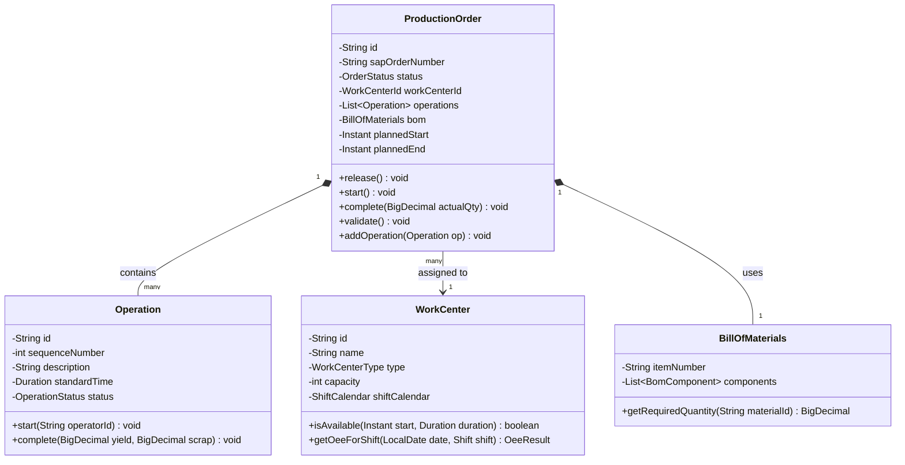
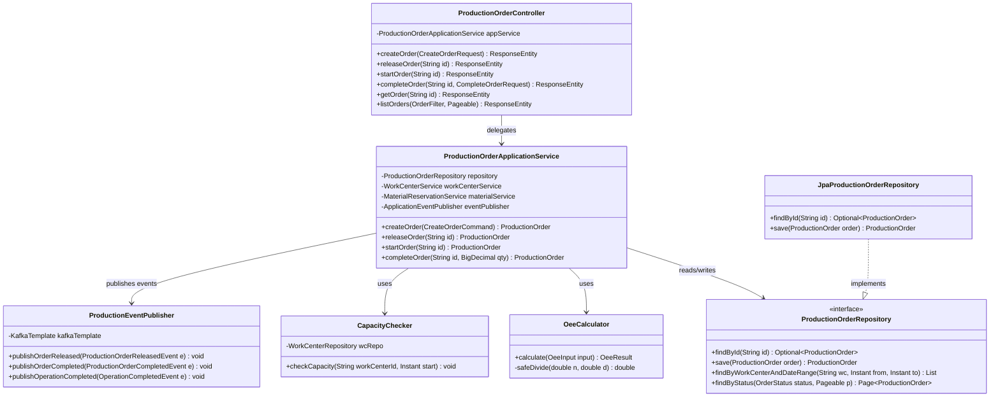
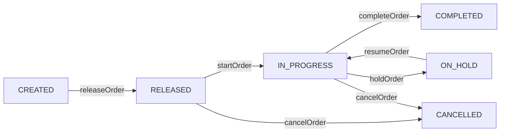
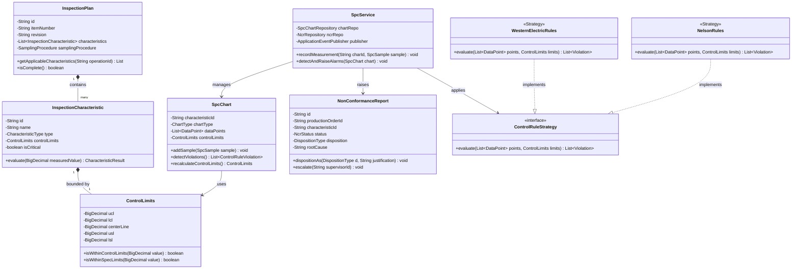
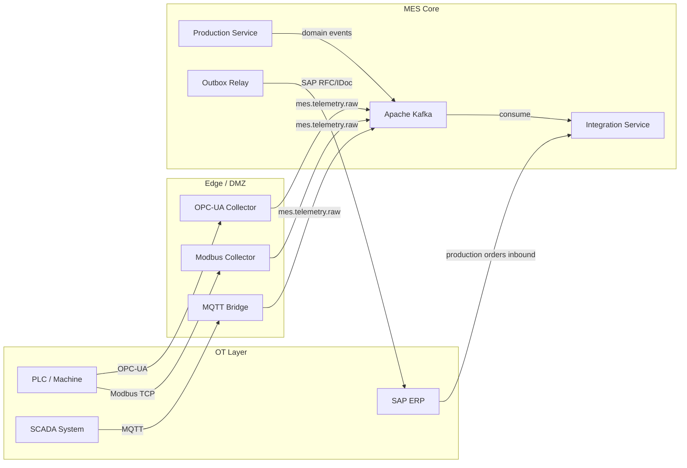
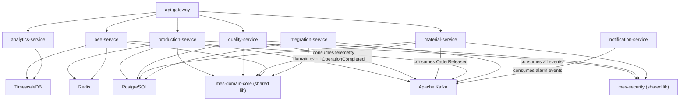

# C4 Code Diagram — Manufacturing Execution System

## Overview

This document provides the code-level (C4 Level 4) architecture view of the MES platform. It shows package structures, class hierarchies, key design patterns, and dependency relationships across all modules. Diagrams are expressed in Mermaid `classDiagram` and `flowchart` notation.

The codebase is organised as a multi-module Maven project (Java/Spring Boot) with a separate `edge-agents` workspace (Node.js/TypeScript). Each bounded context maps to one Maven module and one Kubernetes service.

---

## Code Organization

**Top-Level Repository Layout**

```
mes-platform/
├── services/
│   ├── production-service/          # Production orders, work centres, scheduling
│   ├── quality-service/             # SPC, inspection plans, NCR management
│   ├── material-service/            # Material tracking, lot management, GRN
│   ├── oee-service/                 # OEE calculation, downtime, KPI aggregation
│   ├── integration-service/         # SAP, SCADA, OPC-UA adapters
│   ├── analytics-service/           # Reporting, dashboards, historical queries
│   ├── notification-service/        # Alerts, shift reports, email/SMS dispatch
│   └── api-gateway/                 # Spring Cloud Gateway, auth, rate limiting
├── edge-agents/
│   ├── mqtt-bridge/                 # MQTT → Kafka normaliser
│   ├── opcua-collector/             # OPC-UA tag reader → Kafka
│   └── modbus-collector/            # Modbus TCP → Kafka
├── shared-libs/
│   ├── mes-domain-core/             # Shared value objects, domain events, exceptions
│   ├── mes-security/                # JWT validation, RBAC utilities
│   └── mes-test-support/            # Testcontainers, fixtures, PLC simulator
├── frontend/
│   └── mes-web/                     # React 18 single-page application
├── infra/
│   ├── helm/                        # Helm charts per service
│   ├── terraform/                   # AWS infrastructure (EKS, RDS, MSK)
│   └── alerting/                    # Prometheus alert rules
└── scripts/                         # Dev tooling, seed scripts
```

**Internal Module Layout (per Spring Boot service)**

```
production-service/src/main/java/com/mes/production/
├── api/
│   ├── controller/          # ProductionOrderController, WorkCenterController
│   └── dto/                 # request/ and response/ sub-packages
├── application/             # ProductionOrderApplicationService, WorkCenterApplicationService
├── domain/
│   ├── model/               # ProductionOrder, WorkCenter, Operation
│   ├── event/               # ProductionOrderReleasedEvent, OperationCompletedEvent
│   ├── exception/           # ProductionOrderNotFoundException, …
│   ├── repository/          # ProductionOrderRepository (interface)
│   └── service/             # OeeCalculator, CapacityChecker
└── infrastructure/
    ├── persistence/         # JpaProductionOrderRepository, ProductionOrderEntity
    ├── kafka/               # ProductionEventPublisher
    └── config/              # ProductionServiceConfig
```

---

## Module Structure

### Production Module

Owns production orders, work-centre definitions, operation sequences, and scheduling. Exposes the canonical `ProductionOrder` aggregate and publishes domain events consumed by OEE, material, and integration modules.

### Quality Module

Manages inspection plans, in-process quality checks, SPC charts (X-bar/R, p-chart, c-chart), control limits, and non-conformance reports (NCR). Receives `OperationCompletedEvent` to trigger mandatory inspection steps.

### Material Module

Tracks raw material lots, work-in-progress (WIP) locations, finished goods, and component consumption per production order. Integrates with SAP WM/EWM for goods movements and maintains full lot genealogy.

### Integration Module

Houses all external system adapters: SAP RFC/IDoc, SCADA OPC-UA bridge, MQTT ingest, and Modbus relay. Uses the Adapter pattern to decouple external protocol specifics from core domain logic.

### Analytics Module

Reads from read-replica databases and TimescaleDB continuous aggregates to serve historical OEE trends, SPC analysis, first-pass yield, and production summary reports. Stateless and horizontally scalable.

---

## Key Code Components



---

## Production Service Code Diagram



**State Machine — Production Order Lifecycle**



---

## Quality Service Code Diagram



---

## Integration Adapter Code Diagram

```mermaid
classDiagram
    direction TB

    class ExternalSystemPort {
        <<interface>>
        +sendProductionConfirmation(ConfirmationPayload p) void
        +fetchProductionOrders(String plant, LocalDate date) List~ExternalOrder~
        +sendGoodsMovement(GoodsMovementPayload p) void
    }

    class SapRfcAdapter {
        -JCoDestination sapDestination
        -CircuitBreaker circuitBreaker
        -OutboxRepository outboxRepo
        +sendProductionConfirmation(ConfirmationPayload p) void
        +fetchProductionOrders(String plant, LocalDate date) List~ExternalOrder~
        +sendGoodsMovement(GoodsMovementPayload p) void
        -checkBapiReturn(JCoTable returnTable) void
        -fallback(ConfirmationPayload p, Exception ex) void
    }

    class OpcUaAdapter {
        -OpcUaClient client
        -TagConfigRepository tagConfigRepo
        -KafkaProducer kafkaProducer
        +connect(String endpointUrl) void
        +subscribe(List~String~ nodeIds) void
        +onTagChange(UaMonitoredItem item, DataValue value) void
        -normalise(String nodeId, DataValue v) TelemetryPayload
    }

    class MqttIngestAdapter {
        -MqttClient mqttClient
        -KafkaProducer kafkaProducer
        -SchemaValidator validator
        +start() void
        +onMessage(String topic, byte[] payload) void
        -routeToKafkaTopic(String mqttTopic) String
    }

    class ModbusAdapter {
        -ModbusTcpMaster master
        -PollingScheduler scheduler
        +readHoldingRegisters(int addr, int count) int[]
        +pollAndPublish() void
    }

    class IntegrationOutboxRelay {
        -OutboxRepository outboxRepo
        -ExternalSystemPort sapPort
        -KafkaProducer kafkaProducer
        +processOutbox() void
    }

    class SchemaValidator {
        -JsonSchemaFactory factory
        +validate(String schemaId, JsonNode payload) ValidationResult
    }

    SapRfcAdapter ..|> ExternalSystemPort : implements
    IntegrationOutboxRelay --> ExternalSystemPort : uses
    MqttIngestAdapter --> SchemaValidator : validates payloads
    OpcUaAdapter --> KafkaProducer : forwards telemetry
    MqttIngestAdapter --> KafkaProducer : forwards telemetry
```



**Integration Data Flow**



---

## Design Patterns Used

| Pattern | Applied In | Purpose |
|---|---|---|
| Repository | All domain modules | Decouple domain from persistence technology |
| Factory | `SpcChartFactory`, `OrderFactory` | Centralise creation logic for variant types |
| Strategy | `ControlRuleStrategy` (Western Electric, Nelson) | Pluggable SPC rule evaluation |
| Observer / Events | Spring `ApplicationEventPublisher` | Decoupled intra-service side effects |
| Adapter | `SapRfcAdapter`, `OpcUaAdapter`, `MqttIngestAdapter` | Insulate domain from external protocols |
| Outbox | `IntegrationOutboxRelay` | Guaranteed at-least-once delivery to external systems |
| Circuit Breaker | Resilience4j on all external calls | Fault tolerance for SAP, SCADA connections |
| CQRS (light) | Analytics service reads from read replicas | Separate command/query scalability |

---

## Code Dependencies



**Dependency Rules**

| Rule | Rationale |
|---|---|
| `domain` must not import `infrastructure` | Domain logic stays pure and testable without Spring |
| `application` imports `domain` interfaces only | Application services are decoupled from JPA entities |
| Services do not call each other synchronously | Inter-service communication via Kafka events only |
| `shared-libs` contain no Spring Boot auto-configuration | Shared libraries are framework-agnostic utilities |
| Edge agents do not import Java services | Edge layer is fully independent Node.js workspace |
