# Deployment Diagram

This document describes the hybrid on-premise and cloud deployment architecture for the Manufacturing Execution System (MES). The topology follows the ISA-95 functional hierarchy, enforcing strict segmentation between OT (Operational Technology) and IT networks, while enabling secure, unidirectional data flow from plant floor sensors through edge processing up to cloud-based analytics and ERP integration layers.

The architecture spans four primary security domains: the Plant Floor Zone (ISA-95 Level 0–1), the Industrial DMZ (Level 3.5), the On-Premise IT Zone (Level 3–4), and a cloud extension hosted in AWS us-east-1. AWS Direct Connect provides 1 Gbps private BGP connectivity between the on-premise IT zone and AWS. A hardware-enforced data diode ensures all OT telemetry flows unidirectionally from OT toward IT, with no return path that could expose field devices to enterprise network threats.

---

## Architecture Diagram

```mermaid
flowchart TD

    %% ---------------------------------------------------------------
    %% PLANT FLOOR ZONE — ISA-95 Level 0-1
    %% ---------------------------------------------------------------
    subgraph PFZ["🏭  Plant Floor Zone — ISA-95 Level 0–1  (Air-Gapped OT Network / VLAN 10)"]
        direction TB

        subgraph PLCs["Programmable Logic Controllers"]
            PLC1["Allen-Bradley ControlLogix L85E\nEtherNet/IP · TCP/44818\nCIP Motion / CIP Safety"]
            PLC2["Siemens S7-1500 CPU 1516F\nPROFINET IRT · UDP/34964\nPROFIsafe SIL-2"]
        end

        subgraph Sensors["Sensors & Actuators"]
            TMP["Temperature Sensors\nPT100 RTD → 4–20 mA\nHART over twisted pair"]
            PRS["Pressure Transmitters\nFoundation Fieldbus H1\nDP/Flow — 31.25 kbps"]
            VIS["Cognex In-Sight 9000\nVision Systems\nGigE Vision · TCP/3956"]
            ACT["Pneumatic / Servo Actuators\nControlled via CIP outputs"]
        end

        subgraph HMI["SCADA / DCS HMI Workstations"]
            HMI1["Wonderware System Platform 2020\nInTouch HMI · OPC-DA\nWindows Server 2019 (hardened)"]
            HMI2["Rockwell FactoryTalk View SE\nDisplays CIP Tag values\nWindows 10 LTSC (no internet)"]
        end

        subgraph OPC["OPC-UA Aggregation"]
            KEP["Kepware KEPServerEX 6.14\nOPC-UA Server · TCP/49320\nAggregates EtherNet/IP, PROFINET,\nModbus TCP, DNP3 drivers\nCertificate-based auth (X.509)"]
        end

        subgraph EdgeGW["Edge Gateway (Beckhoff IPC C6030)"]
            GG["AWS Greengrass v2.12\nFanless IPC · -40°C to +70°C\nIntel Core i7 · 32 GB ECC RAM\nTPM 2.0 · Secure Boot\nLocal inference: ONNX Runtime\nMQTT Broker (Mosquitto 2.x)\nStream Manager → IoT Core"]
        end

        PLC1 -- "EtherNet/IP CIP\nTCP/44818" --> KEP
        PLC2 -- "PROFINET · S7-COMM\nTCP/102" --> KEP
        TMP -- "HART 4-20mA\nvia I/O module" --> PLC1
        PRS -- "FF-H1 → linking device\n→ EtherNet/IP" --> PLC1
        VIS -- "GigE Vision\nTCP/3956" --> KEP
        ACT -- "CIP discrete outputs" --> PLC1
        HMI1 -- "OPC-DA DCOM\nTCP/135 + dynamic" --> KEP
        HMI2 -- "CIP Tag Read\nEtherNet/IP" --> PLC1
        KEP -- "OPC-UA\nTCP/49320\nX.509 mutual TLS" --> GG
        GG -- "MQTT/TLS 1.3\nTCP/8883\n→ IoT Core FIPS endpoint" --> DIODE
    end

    %% ---------------------------------------------------------------
    %% INDUSTRIAL DMZ — Level 3.5
    %% ---------------------------------------------------------------
    subgraph IDMZ["🔒  Industrial DMZ — Level 3.5  (Isolated VLAN 30 — OT/IT Boundary)"]
        direction TB

        subgraph Firewall["Firewall Pair (Active/Passive HA)"]
            FW1["Palo Alto PA-3220 — Primary\nApp-ID · User-ID · Threat Prevention\nVLAN trunking · Panorama-managed"]
            FW2["Palo Alto PA-3220 — Secondary\nHA heartbeat · 1 Gbps failover\nSame policy as primary"]
        end

        subgraph Diode["Hardware Data Diode"]
            DIODE["Waterfall Security Unidirectional\nSecurity Gateway (USG) Rev 4\nFibre optic TX-only\nOT → IT direction enforced in hardware\nNo electrical return path possible\nSFP+ 10GbE uplink"]
        end

        subgraph Historian["OSIsoft PI System (Historian)"]
            PIA["PI Data Archive 2023\nHigh-speed TSDB\n~2M tags · sub-second resolution\nPI-to-PI replication"]
            PIAF["PI Asset Framework (PI AF)\nEquipment hierarchy\nElement templates · analyses\nEvent frames for alarms"]
            PIINT["PI Interface Node\nPI OPC-UA DA interface\nPolling: 250 ms scan class"]
        end

        subgraph ProtoConv["Protocol Converter"]
            MOXA["Moxa MGate 5135\nModbus TCP/RTU → MQTT\nPorts: TCP/502 in · TCP/1883 out\nJSON payload mapping"]
        end

        FW1 -. "HA sync\nUDP/28769" .- FW2
        DIODE -- "Fibre RX only\nSFP+ stripped TX" --> FW1
        FW1 -- "PI-to-PI\nTCP/5450" --> PIA
        PIINT -- "OPC-UA client\nTCP/49320" --> KEP
        PIINT -- "PI SDK write\nTCP/5450" --> PIA
        PIA -- "PI-AF link\nTCP/5457" --> PIAF
        MOXA -- "MQTT → Kafka bridge\nTCP/9093 TLS" --> KFK
    end

    %% ---------------------------------------------------------------
    %% ON-PREMISE IT ZONE — ISA-95 Level 3-4
    %% ---------------------------------------------------------------
    subgraph OPSZ["🖥️  On-Premise IT Zone — ISA-95 Level 3–4  (Corporate VLAN 50 · 10GbE fabric)"]
        direction TB

        subgraph K8sCluster["MES Kubernetes Cluster (VMware vSphere 8 / Tanzu)"]
            direction LR
            MASTERS["Control Plane\n3× Masters (anti-affinity)\nkube-apiserver · etcd (TLS)\nkube-scheduler · controller-manager\nMetalLB · Calico CNI (NetworkPolicy)"]
            WORKERS["Worker Nodes (6×)\n2× m6i-equivalent: 32 vCPU / 128 GB\n4× c6i-equivalent: 16 vCPU / 64 GB\nLocal NVMe for InfluxDB WAL\nHPA + VPA enabled"]

            subgraph MicroSvc["MES Microservices (Kubernetes Pods)"]
                WOS["Work Order Service\nGo 1.22 · gRPC/TLS TCP/50051\nPostgres read/write · Kafka producer\nReplicas: 3 · PodDisruptionBudget"]
                PTS["Production Tracking Service\nGo 1.22 · REST TCP/8080\nRedis write-behind · Kafka consumer\nReplicas: 3"]
                QCS["Quality Control Service\nPython 3.12 · FastAPI TCP/8000\nStores SPC data → InfluxDB\nConsumes vision system events"]
                OEE["OEE Calculator\nPython 3.12 · Celery workers\nConsumes PI AF event frames\nWrites KPIs → InfluxDB + Postgres\nReplicas: 2"]
                SCHED["Scheduler / Dispatch Engine\nJava 21 (Spring Boot 3)\nConstraint-based scheduling\nDrools rule engine"]
                APIGTW["API Gateway (Kong 3.6)\nOAuth 2.0 / JWT validation\nRate limiting · mTLS upstream\nTCP/443 → services"]
            end
        end

        subgraph TSDBCluster["InfluxDB OSS Cluster (3 Nodes)"]
            IDB1["InfluxDB Node 1 — Leader\nInfluxDB 2.7 · Flux queries\nRetention: 90 days hot / 1 yr cold\nTCP/8086 · NVMe SSD"]
            IDB2["InfluxDB Node 2 — Follower\nRaft consensus · async replication"]
            IDB3["InfluxDB Node 3 — Follower\nUsed for OEE batch reads"]
        end

        subgraph PGCluster["PostgreSQL HA Cluster (Patroni + HAProxy)"]
            PGM["PostgreSQL 16 — Primary\nMaster data · BOMs · Work Orders\nRow-level security · pgcrypto\nWAL archiving → S3"]
            PGS1["PostgreSQL 16 — Standby 1\nSynchronous replication\nHot standby reads"]
            PGS2["PostgreSQL 16 — Standby 2\nAsynchronous replication\nBackup target · pgBackRest"]
            HAP["HAProxy 2.8\nRead/write split TCP/5432\nHealth: REST TCP/7000"]
        end

        subgraph RedisCluster["Redis Sentinel (Shop Floor State)"]
            RD1["Redis 7.2 — Master\nWIP tracking · machine state\nMaxmemory-policy: allkeys-lru\nTCP/6379"]
            RD2["Redis 7.2 — Replica 1"]
            RD3["Redis 7.2 — Replica 2"]
            RDSEN["Redis Sentinel × 3\nAutomatic failover <30s\nTCP/26379"]
        end

        subgraph KafkaCluster["On-Prem Kafka (3 Brokers — KRaft mode)"]
            KFK["Kafka 3.7 — Broker 1 (Controller)\nTopics: mes.work-orders\nmes.production-events\nmes.quality-records\nmes.erp-sync\nTCP/9093 (TLS) · 9094 (SASL/PLAIN)"]
            KFK2["Kafka 3.7 — Broker 2\nReplication factor: 3\nmin.insync.replicas: 2"]
            KFK3["Kafka 3.7 — Broker 3\nKafka MirrorMaker 2\n→ Amazon MSK (ERP sync topic)"]
        end

        subgraph AuthSvc["Identity & Access Management"]
            AD["Active Directory 2022\nOperator / engineer accounts\nGPO · Kerberos / NTLM\nTCP/389 LDAP · TCP/636 LDAPS"]
            VAULT["HashiCorp Vault 1.16\nPKI secrets engine (X.509)\nDatabase dynamic credentials\nKubernetes auth method\nTCP/8200"]
        end

        MASTERS -- "kubelet\nTCP/10250" --> WORKERS
        WORKERS --> MicroSvc
        WOS -- "Postgres write\nTCP/5432" --> HAP
        QCS -- "InfluxDB write\nTCP/8086\nLine Protocol" --> IDB1
        OEE -- "InfluxDB read\nTCP/8086" --> IDB1
        OEE -- "Postgres write KPIs\nTCP/5432" --> HAP
        PTS -- "Redis SET/GET\nTCP/6379" --> RD1
        WOS -- "Kafka produce\nTCP/9093" --> KFK
        PTS -- "Kafka consume\nTCP/9093" --> KFK
        SCHED -- "Kafka consume\nTCP/9093" --> KFK
        APIGTW -- "LDAP bind\nTCP/636" --> AD
        APIGTW -- "Vault JWT\nTCP/8200" --> VAULT
        HAP -- "read/write\nTCP/5432" --> PGM
        HAP -- "read\nTCP/5432" --> PGS1
        PGM -- "WAL stream\nTCP/5432" --> PGS1
        PGM -- "WAL stream\nTCP/5432" --> PGS2
        IDB1 -- "Raft replication\nTCP/8088" --> IDB2
        IDB1 -- "Raft replication\nTCP/8088" --> IDB3
        RD1 -- "replication\nTCP/6379" --> RD2
        RD1 -- "replication\nTCP/6379" --> RD3
        KFK -- "KRaft replication\nTCP/9093" --> KFK2
        KFK -- "KRaft replication\nTCP/9093" --> KFK3
        PIAF -- "REST API\nTCP/443\nPI Web API" --> OEE
        PIA -- "PI JDBC\nTCP/5457" --> IDB1
    end

    %% ---------------------------------------------------------------
    %% CLOUD ZONE — AWS us-east-1
    %% ---------------------------------------------------------------
    subgraph AWS["☁️  Cloud Zone — AWS us-east-1  (VPC 10.100.0.0/16)"]
        direction TB

        subgraph DXConn["AWS Direct Connect (1 Gbps)"]
            DX["Direct Connect Gateway\nDXGW — BGP AS 64512\n1 Gbps dedicated port\nVLAN 802.1Q tagged\nIPsec VPN backup (BGP failover)"]
        end

        subgraph EKSCluster["EKS Cluster (Managed Node Groups)"]
            EKSNODES["EKS 1.30 · Managed Node Group\n3× m6i.2xlarge (analytics)\n3× c6i.xlarge (API)\nKarpenter autoscaler\nAWS Load Balancer Controller"]

            subgraph CloudSvc["Cloud MES Services"]
                OEEAPI["OEE Analytics API\nPython / FastAPI\nReads Timestream · RDS\nTCP/8000"]
                PREDMAINT["Predictive Maintenance API\nPython · FastAPI\nLoads SageMaker endpoint\nReal-time inference TCP/8001"]
                ERPBRIDGE["ERP Integration Bridge\nJava 21 · Spring Integration\nSAP RFC / REST → MSK topics\nTCP/8002"]
            end
        end

        subgraph MSK["Amazon MSK (Managed Kafka)"]
            MSKKAFKA["MSK 3.7 · 3 brokers\nm5.xlarge per broker\nTopic: erp-sync · mes-cloud-events\nSASL/SCRAM · TLS in-transit\nMSK Connect: S3 sink connector"]
        end

        subgraph RDSDB["RDS PostgreSQL Multi-AZ"]
            RDSM["RDS PostgreSQL 16\ndb.r6g.2xlarge · Multi-AZ\nERP integration tables\nMaster data replica\nKMS encryption at rest\nAutomated snapshots 35 days"]
        end

        subgraph TimeSeriesDB["Amazon Timestream"]
            TS["Timestream for LiveAnalytics\nRetention: 1 day memory / 5 yr mag\nMagnetic tier Parquet export → S3\nQuery via JDBC / ODBC"]
        end

        subgraph IoTCore["AWS IoT Core"]
            IOTCORE["IoT Core FIPS endpoint\nDevice registry: Edge GW certs\nX.509 mutual TLS\nIoT Rules Engine\n→ route to Timestream / MSK\nIoT Defender anomaly detection"]
        end

        subgraph MLPlatform["AWS SageMaker — Predictive Maintenance"]
            SM_TRAIN["SageMaker Training Job\nLSTM on bearing vibration data\nFeature store: S3 Parquet\nec2 ml.p3.2xlarge spot"]
            SM_EP["SageMaker Endpoint\nml.m5.xlarge · auto-scaling\nReal-time inference <50ms p99\nModel registry versioned"]
        end

        subgraph Analytics["Analytics & Reporting"]
            S3["S3 Buckets\n  mes-quality-records/\n  mes-compliance-reports/\n  mes-oee-historical/\n  mes-ml-features/\nSSE-KMS · versioning · MFA delete\nLifecycle: Glacier IR after 365d"]
            GLUE["AWS Glue 4.0\nGlue Catalog · ETL jobs\nParquet schema evolution\nCrawlers: hourly"]
            ATHENA["Athena v3\nAd-hoc SQL on S3 Parquet\nWorkgroup with query result\nencryption · cost controls"]
            QS["Amazon QuickSight\nExecutive OEE dashboards\nSPICE 250M row dataset\nRow-level security by plant\nScheduled email reports"]
        end

        DX -- "VPC peering / TGW\nBGP routes" --> EKSNODES
        DX -- "Private VIF\nBGP routes" --> MSKKAFKA
        DX -- "Private VIF" --> RDSM
        IOTCORE -- "IoT Rule\nPutRecord" --> TS
        IOTCORE -- "IoT Rule\nKafka producer" --> MSKKAFKA
        MSKKAFKA -- "MSK Connect\nS3 sink" --> S3
        MSKKAFKA -- "consume\nTCP/9096 TLS" --> ERPBRIDGE
        ERPBRIDGE -- "write\nTCP/5432" --> RDSM
        OEEAPI -- "JDBC\nTCP/8182" --> TS
        OEEAPI -- "read\nTCP/5432" --> RDSM
        PREDMAINT -- "invoke\nHTTPS" --> SM_EP
        SM_TRAIN -- "read features\nS3 API" --> S3
        SM_TRAIN -- "register model" --> SM_EP
        GLUE -- "catalog\nS3 read/write" --> S3
        ATHENA -- "query\nvia Glue catalog" --> S3
        QS -- "SPICE import\nAthena connector" --> ATHENA
        QS -- "direct query\nTCP/5432" --> RDSM
        TS -- "Parquet export\nscheduled" --> S3
    end

    %% ---------------------------------------------------------------
    %% CROSS-ZONE CONNECTIVITY
    %% ---------------------------------------------------------------
    GG -- "MQTT/TLS 1.3\nTCP/8883 · port 443 ALPN\n→ IoT Core FIPS" --> IOTCORE
    KFK3 -- "MirrorMaker 2\nTCP/9096 TLS\nOver Direct Connect" --> MSKKAFKA
    FW1 -- "Screened subnet\nstateful inspect" --> APIGTW
    APIGTW -- "HTTPS TCP/443\nJWT bearer" --> OEEAPI
    APIGTW -- "HTTPS TCP/443" --> PREDMAINT
    PGM -- "logical replication\nTCP/5432 over DX" --> RDSM
    DX -- "BGP 64512↔64513\n1 Gbps dedicated" --> KFK3

    %% Styling
    classDef otZone fill:#fff3cd,stroke:#856404,color:#000
    classDef dmzZone fill:#f8d7da,stroke:#842029,color:#000
    classDef itZone fill:#d1e7dd,stroke:#0f5132,color:#000
    classDef cloudZone fill:#cfe2ff,stroke:#084298,color:#000
    classDef secBoundary fill:#f5c6cb,stroke:#721c24,color:#000,stroke-dasharray:6 3

    class PFZ otZone
    class IDMZ dmzZone
    class OPSZ itZone
    class AWS cloudZone
```

---

## Plant Floor Zone — ISA-95 Level 0–1

The plant floor zone is the most security-sensitive segment of the architecture. All devices in this zone operate on an isolated VLAN (VLAN 10) with no route to the internet and no route to the corporate IT network. Physical access controls, cable routing separation, and managed switches configured with 802.1Q port isolation enforce this boundary at the data-link layer.

### Programmable Logic Controllers

Two PLC families cover the plant: Allen-Bradley ControlLogix L85E controllers communicate over EtherNet/IP using the Common Industrial Protocol (CIP), occupying well-known TCP port 44818 for explicit messaging and UDP port 2222 for implicit I/O. CIP Safety extensions enforce SIL-2 rated safety functions for emergency stops and interlocks. Siemens S7-1500 CPU 1516F units communicate over PROFINET IRT (isochronous real-time), achieving cycle times below 1 ms for motion-critical tasks. S7-COMM via TCP port 102 provides the programmatic interface consumed by Kepware. Both PLC families are deployed with read-only SCADA accounts and firmware integrity validation enabled.

### Sensors and Actuators

PT100 RTD temperature sensors connect via 4–20 mA HART loops to analog input modules on ControlLogix chassis. HART 7 allows concurrent process variable transmission and diagnostics over the same two wires. Pressure transmitters use Foundation Fieldbus H1 at 31.25 kbps, bridged to EtherNet/IP via linking devices. Cognex In-Sight 9000 vision systems attach directly to the Kepware server via GigE Vision (TCP/3956), supplying pass/fail classifications and defect coordinates at up to 60 frames per second. Pneumatic and servo actuators receive discrete and analog outputs from the ControlLogix I/O modules under CIP control.

### SCADA and HMI Workstations

Wonderware System Platform 2020 (AVEVA) provides plant-wide situational awareness through Galaxy-based object models and InTouch HMI displays. It communicates to Kepware via OPC-DA (DCOM, TCP/135 plus dynamically assigned ports), which is acceptable only within the isolated OT VLAN. Rockwell FactoryTalk View Site Edition reads CIP tag values directly from ControlLogix controllers and displays equipment state on dedicated operator panels. Both HMI platforms run on hardened Windows installations with application whitelisting (AppLocker), disabled Windows Update automatic delivery (WSUS-only patching), and no browser or email clients installed.

### OPC-UA Aggregation — Kepware KEPServerEX

KEPServerEX 6.14 acts as the universal protocol concentrator on the OT network. It exposes a single OPC-UA server endpoint on TCP/49320 with X.509 certificate-based mutual authentication and AES-256-CBC message signing. Individual drivers handle EtherNet/IP (Allen-Bradley), S7-COMM (Siemens), Modbus TCP, GigE Vision, and DNP3 simultaneously. Each tag subscription is mapped to a 250 ms scan class by default, with 100 ms fast-scan classes available for machine cycle detection. The aggregated tag namespace is consumed exclusively by the AWS Greengrass edge gateway and the PI Interface Node in the DMZ.

### Edge Gateway — AWS Greengrass v2 on Beckhoff IPC C6030

The Beckhoff C6030 industrial PC serves as the edge computing anchor. Its fanless enclosure is rated for -40°C to +70°C operation with vibration and shock resistance per IEC 60068-2-6. An Intel Core i7 processor (8 cores) with 32 GB ECC RAM runs AWS Greengrass v2.12 on a hardened Ubuntu 22.04 LTS installation. Secure Boot, TPM 2.0-backed attestation, and UEFI password lockdown prevent unauthorized firmware modification.

Greengrass components deployed on this device include:

- **Mosquitto MQTT Broker (v2.x)** — local pub/sub for PLC-adjacent devices, bridged to AWS IoT Core.
- **Stream Manager** — buffers OPC-UA telemetry to local NVMe during Direct Connect outages, then replays ordered to IoT Core on reconnect, providing at-least-once delivery guarantees.
- **ONNX Runtime component** — runs pre-trained anomaly detection models (vibration envelope analysis) locally for sub-100 ms response to bearing failures, independent of cloud connectivity.
- **Greengrass Nucleus** — orchestrates component deployment, certificate rotation, and shadow synchronization with AWS IoT Core.

All outbound traffic from the edge gateway targets the AWS IoT Core FIPS 140-2 validated endpoint over MQTT/TLS 1.3 on TCP/8883, with TLS 1.2 fallback disabled. A secondary path uses MQTT over WebSockets on port 443 with ALPN negotiation for environments where only port 443 egress is permitted.

---

## Industrial DMZ — Level 3.5

The industrial DMZ (IDMZ) is the critical boundary zone separating OT and IT networks. No device in the IDMZ has simultaneous connectivity to both zones; the Waterfall hardware data diode physically enforces this property.

### Hardware Data Diode — Waterfall Security USG

The Waterfall Unidirectional Security Gateway Rev 4 uses a fibre-optic transmitter on the OT side and a fibre-optic receiver on the IT side. The transmitter module has no physical RX fibre; the receiver module has no physical TX fibre. This hardware architecture makes bidirectional traffic physically impossible — not just policy-blocked. The gateway ingests MQTT streams from the Greengrass edge gateway (via the OT VLAN) and re-publishes them as MQTT on the IT-facing interface at 10 GbE SFP+ line rate. All OT-sourced telemetry passes through this device before any IT system can consume it.

### OSIsoft PI System — Historian

The PI Data Archive 2023 is the authoritative time-series historian for plant data. It stores approximately 2 million tags at sub-second resolution with lossless compression using the PI squish algorithm. PI-to-PI replication provides a secondary archive on the corporate WAN for business continuity. The PI Asset Framework (PI AF) models equipment hierarchy — lines, cells, units, machines — and applies element templates that normalize raw tag names into semantic asset attributes. PI AF analyses compute derived values (utilization ratios, quality percentages) as event-driven calculations directly within the historian layer, reducing load on the MES application tier.

The PI Interface Node is a Windows Server running the PI OPC-UA DA Interface, polling KEPServerEX every 250 ms via OPC-UA subscriptions. It writes timestamped values to the PI Data Archive via the PI SDK on TCP port 5450. The PI Web API (REST, TCP/443) exposes asset data to the OEE Calculator microservice in the IT zone.

### Firewall Pair — Palo Alto PA-3220

Two Palo Alto PA-3220 next-generation firewalls operate in active/passive high availability with HA heartbeat on UDP/28769. Panorama centralized management enforces consistent policy across both units. App-ID classifies industrial protocols (OPC-UA, PI, MQTT) by payload inspection, not just port numbers. User-ID maps Active Directory security groups to firewall policies, restricting PI AF access to authorized engineering accounts. Threat Prevention licenses provide IPS signatures tailored for industrial protocols, blocking known PLC exploit patterns.

---

## On-Premise IT Zone — ISA-95 Level 3–4

The on-premise IT zone hosts the production MES application stack on a VMware vSphere 8 / Tanzu Kubernetes Grid cluster connected via a 10 GbE leaf-spine fabric. All inter-service communication is encrypted with mTLS enforced by Istio service mesh.

### MES Kubernetes Cluster

Three control plane masters are distributed across separate physical hosts with anti-affinity rules, preventing simultaneous failure. etcd is configured with TLS encryption for both peer and client communication, with snapshots taken every 5 minutes and stored on a dedicated NFS volume. Six worker nodes split into two pools: two high-memory nodes (32 vCPU / 128 GB) host stateful-adjacent services and InfluxDB WAL, while four compute-optimized nodes (16 vCPU / 64 GB) handle microservice pods. MetalLB provides bare-metal LoadBalancer IPs for services requiring direct TCP exposure. Calico CNI enforces Kubernetes NetworkPolicy, ensuring pods in the `quality` namespace cannot initiate connections to pods in the `erp` namespace without an explicit allow rule.

### Work Order Service

Written in Go 1.22, the Work Order Service is the authoritative system for manufacturing order lifecycle management. It exposes a gRPC API (TLS, TCP/50051) consumed by the Scheduler and downstream services. Work order state transitions (Created → Released → Active → Completed → Closed) are persisted to PostgreSQL with optimistic locking using `version` columns. Each state change produces a Kafka event to the `mes.work-orders` topic, enabling audit trail reconstruction and ERP synchronization. The service runs three replicas with a PodDisruptionBudget requiring at least two pods available during node drains.

### Production Tracking Service

The Production Tracking Service maintains real-time WIP (Work In Progress) state for every unit on every production line. It consumes Kafka events from `mes.production-events` (PLC-sourced cycle completion signals arriving via Greengrass → IoT Core → MSK → MirrorMaker2 → on-prem Kafka) and writes machine state to Redis using a write-behind pattern. The Redis key schema is `plant:{plant_id}:line:{line_id}:machine:{machine_id}:state`, with a 24-hour TTL for historical state snapshots persisted asynchronously to PostgreSQL.

### Quality Control Service

The Quality Control Service processes inspection results from vision systems and manual gauging stations. It implements Statistical Process Control (SPC) using Shewhart X-bar and R charts, computing control limits dynamically as new measurements arrive. Out-of-control signals (Western Electric rules 1 through 4) generate Kafka events to `mes.quality-records` and trigger real-time notifications to operator HMI panels via the API Gateway WebSocket push path. All measurement data is written to InfluxDB using the Line Protocol over TCP/8086, enabling sub-millisecond-precision correlation with PLC cycle events.

### OEE Calculator

Overall Equipment Effectiveness is computed continuously by the OEE Calculator service. Celery workers consume PI AF event frames (machine stops, changeovers, planned downtime) via the PI Web API and correlate them with production count events from Kafka. Availability, Performance, and Quality components are written to InfluxDB every 60 seconds per machine and aggregated to line and plant levels. Daily rolled-up OEE values are persisted to PostgreSQL for long-term trending and ERP-facing reporting APIs.

### PostgreSQL HA Cluster — Patroni + HAProxy

The PostgreSQL 16 cluster managed by Patroni provides automatic leader election using etcd as the distributed lock store. HAProxy listens on TCP/5432 and splits read/write traffic: writes route exclusively to the primary, while reads round-robin across both hot-standby replicas using server-side read-only transaction enforcement. Synchronous replication to Standby 1 ensures zero data loss on primary failure. pgBackRest manages continuous WAL archiving to an on-premise NFS volume and incremental backup uploads to S3 for offsite retention. Row-level security policies restrict access to work orders by plant code, enforced at the database layer independent of application logic.

### Redis Sentinel — Real-Time Shop Floor State

Three Redis 7.2 nodes (one master, two replicas) with three Sentinel processes provide automatic failover in under 30 seconds. The master holds the live shop floor state: current machine mode (Auto/Manual/Fault), active work order per machine, WIP unit counts, and operator session bindings. The `allkeys-lru` eviction policy ensures memory-bounded operation. Redis Keyspace Notifications (KEA configuration) allow the Production Tracking Service to subscribe to state change events without polling.

### On-Premise Kafka — KRaft Mode

Kafka 3.7 operates in KRaft mode (ZooKeeper removed), with Broker 1 serving as the active KRaft controller. All inter-broker communication is encrypted with TLS on TCP/9093. SASL/PLAIN on TCP/9094 is used for producer/consumer authentication from microservices, with credentials managed via HashiCorp Vault dynamic secrets. Kafka MirrorMaker 2 running on Broker 3 replicates the `mes.erp-sync` topic to Amazon MSK over the Direct Connect link, maintaining offset translation and topic configuration synchronization.

### HashiCorp Vault

Vault 1.16 provides centralized secrets management for the entire on-premise IT zone. The PKI secrets engine issues short-lived X.509 certificates (72-hour TTL) for mTLS between microservices, eliminating long-lived certificate management. The database secrets engine generates dynamic PostgreSQL credentials with per-service roles and 1-hour TTL, meaning compromised credentials are automatically expired. Kubernetes auth method validates pod service accounts against the Kubernetes API before issuing tokens, ensuring only authorized pods can retrieve secrets.

---

## Cloud Zone — AWS us-east-1

The cloud extension of the MES handles long-term analytics, predictive maintenance model training, ERP integration, and executive reporting workloads that benefit from elastic compute and managed services.

### AWS Direct Connect

A 1 Gbps dedicated Direct Connect port at the colocation facility connects to the on-premise IT zone. A Direct Connect Gateway (DXGW) with BGP AS 64512 on the AWS side peers with the plant's edge router (AS 64513), advertising VPC CIDR 10.100.0.0/16 to the plant and receiving the plant IT subnet 10.50.0.0/16 in return. An IPsec VPN tunnel over the public internet serves as a BGP failover path, automatically advertised when Direct Connect health checks fail, with higher metric values ensuring it is used only as a last resort. The Direct Connect link carries MirrorMaker 2 replication traffic (Kafka), PostgreSQL logical replication, and REST API calls from the cloud EKS cluster to on-premise services.

### EKS Cluster — Analytics and Integration Services

The EKS 1.30 cluster uses Karpenter for demand-driven node provisioning, spinning up Spot instances for batch analytics workloads and On-Demand instances for latency-sensitive API services. The AWS Load Balancer Controller provisions Network Load Balancers for external API exposure. Istio service mesh enforces mTLS and provides distributed tracing via AWS X-Ray integration. The OEE Analytics API queries Amazon Timestream for real-time production metrics and RDS PostgreSQL for master data, serving aggregated responses to the QuickSight SPICE connector and to the on-premise API Gateway for operator-facing dashboards.

### AWS SageMaker — Predictive Maintenance

Bearing vibration data collected by accelerometers on spindle motors flows through Greengrass → IoT Core → Timestream → S3 Parquet. SageMaker Training Jobs consume this Parquet dataset from the `mes-ml-features` S3 bucket to train LSTM (Long Short-Term Memory) sequence models that predict remaining useful life (RUL) of bearings. Features include time-domain statistics (RMS, kurtosis, crest factor), frequency-domain features (FFT envelope bands), and wavelet packet energy. Trained models are registered in the SageMaker Model Registry with approval gates before promotion to the production endpoint. The SageMaker Endpoint (`ml.m5.xlarge`, auto-scaling 1–10 replicas) serves real-time inference requests from the Predictive Maintenance API with a p99 latency target of 50 ms.

### Amazon Timestream and S3 Analytics Layer

IoT Core Routes Engine delivers sensor telemetry from the edge gateway to Timestream for LiveAnalytics within seconds of measurement. The memory store retention of 1 day covers real-time dashboard queries, while the magnetic store retains data for 5 years. Scheduled exports write Parquet files to the `mes-oee-historical` S3 bucket hourly, partitioned by `year/month/day/plant_id`. AWS Glue crawlers update the Glue Data Catalog schema hourly, enabling Athena v3 SQL queries against the full historical dataset without ETL preprocessing. Amazon QuickSight SPICE imports pre-aggregated OEE datasets for sub-second executive dashboard rendering, with row-level security restricting each plant manager to their own facility's data.

---

## Security Architecture

### Network Segmentation

Five distinct trust boundaries partition the system. The plant floor OT network (VLAN 10) has no routed path to the internet or corporate IT network. The IDMZ (VLAN 30) is the single point of controlled data transfer, with the hardware data diode enforcing OT→IT directionality. The corporate IT network (VLAN 50) has outbound-only connectivity to AWS via Direct Connect, with no inbound connections accepted from AWS. AWS security groups restrict all inbound traffic to explicitly defined source CIDRs and ports. AWS PrivateLink endpoints prevent any MES service traffic from traversing the public internet within AWS.

### Identity and Access Control

Human operators authenticate to MES applications via Active Directory Kerberos tickets, federated through the API Gateway's OAuth 2.0 authorization server using the LDAP bind flow. Role-based access control maps AD security groups to MES roles (Operator, Supervisor, Quality Engineer, Maintenance Technician, Plant Manager). Service-to-service authentication uses short-lived X.509 mTLS certificates issued by Vault PKI. PLC engineering workstations require two-factor authentication (smart card + PIN) for any firmware or program change operation.

### Data Protection

All data in transit uses TLS 1.3 with PFS cipher suites (ECDHE-ECDSA-AES256-GCM-SHA384 preferred). Data at rest in PostgreSQL uses pgcrypto column-level encryption for personally identifiable operator data (badge numbers, names). AWS KMS CMKs with automatic annual rotation protect S3, RDS, and Timestream at-rest encryption. S3 buckets enforce MFA Delete and object versioning to prevent ransomware deletion attacks. WAL archives and pgBackRest backups are stored with Object Lock (Compliance mode, 7-year retention) to satisfy FDA 21 CFR Part 11 and ISO 13485 record-retention requirements.

### Monitoring and Incident Response

Prometheus (on-premise) and Amazon CloudWatch (cloud) collect metrics from all layers. Grafana dashboards display infrastructure health alongside MES business KPIs. AWS IoT Defender monitors edge gateway behavior (connection frequency, data volume, TLS certificate validity) and triggers SNS alerts on anomalies. On-premise ELK Stack (Elasticsearch, Logstash, Kibana) aggregates syslog from PLCs, Kepware, firewalls, and Kubernetes pods. Security events are forwarded to Splunk Cloud SIEM via Kafka Connect for correlation with enterprise security operations.

---

## Deployment Topology Summary

| Zone | Layer | Key Components | Primary Protocols |
|---|---|---|---|
| Plant Floor | ISA-95 L0–1 | ControlLogix, S7-1500, Kepware, Greengrass | EtherNet/IP, PROFINET, OPC-UA, MQTT |
| Industrial DMZ | L3.5 | Waterfall USG, PI System, PA-3220 | PI-to-PI, OPC-UA, MQTT |
| On-Premise IT | L3–4 | K8s (vSphere), Kafka, InfluxDB, PostgreSQL, Redis | gRPC, REST, Kafka, SQL |
| Cloud (AWS) | Cloud Extension | EKS, MSK, Timestream, SageMaker, QuickSight | HTTPS, Kafka, JDBC, S3 API |

Network connectivity between zones flows strictly in the direction of increasing trust level for commands and decreasing trust level for telemetry responses. No lateral movement path exists between the plant floor and the cloud that bypasses both the data diode and the on-premise Kafka broker. This architecture satisfies IEC 62443 Security Level 2 for the OT network and IEC 62443 Security Level 3 requirements for the IDMZ boundary.
