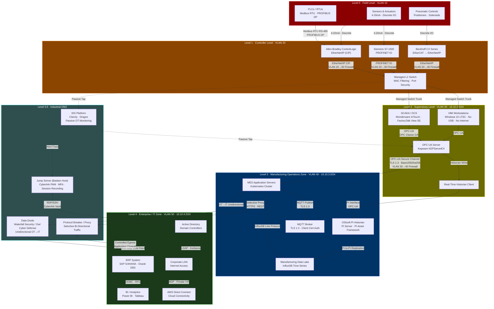

# Network Infrastructure

## ISA/IEC 62443 Security Zone Architecture

The Manufacturing Execution System network is partitioned into discrete security zones following the ISA/IEC 62443 standard. Each zone represents a distinct conduit boundary with its own trust level, protocol set, and access control policy. Traffic crossing zone boundaries is inspected and mediated by firewalls, data diodes, or protocol proxies — never routed directly. The architecture enforces defense-in-depth: a breach at any single level cannot propagate to adjacent levels without traversing an enforced control point.

---

## Level 0 — Field Level

Level 0 is the physical process layer. All assets here interface directly with the manufacturing process: sensors that measure temperature, pressure, flow rate, and vibration; actuators that modulate valves and motor drives; and pneumatic controls that position equipment. Communication at this level is exclusively serial or analog — there is no IP stack involved, making this zone inherently air-gapped from the IP network above.

**Protocols in use at Level 0:**

*Modbus RTU over RS-485* is the dominant protocol for legacy PLCs and remote I/O blocks. The RS-485 physical layer supports multi-drop configurations with up to 32 nodes on a single bus segment and cable runs exceeding 1,200 meters. Register maps are statically allocated: coils (0x) for discrete outputs, discrete inputs (1x), input registers (3x) for analog sensor readings, and holding registers (4x) for setpoints. Polling intervals are typically 100–500 ms depending on process criticality.

*PROFIBUS DP* (Decentralized Periphery) runs at up to 12 Mbit/s on shielded twisted pair. It provides deterministic, cyclic I/O exchange between the master PLC and distributed slave devices. Token-passing ensures that bus access is collision-free; bus cycle times are well under 10 ms for typical configurations.

*4-20 mA analog loops* carry continuous process variable measurements (temperature, pressure, flow) from transmitters to PLC analog input cards. The current-based signaling is immune to voltage drop over long cable runs and provides a live-zero (4 mA = minimum range value) that distinguishes a valid zero measurement from a broken wire.

**Physical security** is enforced through locked control panels (IP54 or better enclosures) with tamper-evident seals. Physical key management is tracked in the site's asset management system. Only operations and maintenance personnel with site-specific authorization may open panels. No wireless interfaces are present at Level 0.

VLAN 10 is assigned to the IP management interfaces of Level 0 gateways (RS-485/PROFIBUS to EtherNet/IP converters), but these gateways are configured with access-list deny-all outbound rules — no IP traffic originating from VLAN 10 is routed to any other VLAN.

---

## Level 1 — Controller Level

Level 1 hosts the programmable logic controllers and industrial PCs that execute real-time control programs. These systems run deterministic scan cycles (typically 1–20 ms) and cannot tolerate the latency or non-determinism introduced by general-purpose IT networks. Network access from external zones is strictly limited to read-only monitoring traffic.

**Installed controllers:**

*Allen-Bradley ControlLogix* (1756 chassis) uses Rockwell Automation's EtherNet/IP protocol stack. ControlLogix communicates over CIP (Common Industrial Protocol) using both implicit messaging (cyclic I/O with no application-layer handshake) and explicit messaging (request-response for tag reads and program download). Each controller is configured with a producer/consumer relationship to the SCADA layer above and the I/O modules below.

*Siemens S7-1500* runs PROFINET IO at the controller tier. The S7-1500 supports IRT (Isochronous Real-Time) mode for motion control axes with cycle times under 1 ms and jitter below 1 µs. Standard I/O devices use RT (Real-Time) mode at 4–8 ms cycle times. TIA Portal projects are version-controlled in the site's engineering workstation and deployed via Siemens' offline programming model.

*Beckhoff CX Series* industrial PCs run TwinCAT 3 on a Windows Embedded Standard kernel. EtherCAT is used for sub-millisecond I/O scanning on the backplane; EtherNet/IP adapters bridge to the plant network. Beckhoff devices support ADS (Automation Device Specification) for remote variable access, which is firewall-blocked at the VLAN 20/30 boundary.

**Network hardening at Level 1:**

All Level 1 switches have been upgraded from unmanaged to managed models (minimum: IEEE 802.1Q VLAN support, port security with sticky MAC learning, and SNMP v3 read-only for network monitoring). Port security is configured to allow a maximum of one MAC address per access port; new MAC addresses trigger a port shutdown and SNMP trap to the NOC. Unused ports are administratively shut and assigned to a black-hole VLAN.

Firmware updates to controllers are performed offline via engineering workstation SD cards or USB-to-serial adapters — never over the plant network — and require a dual-person integrity check before deployment to production.

---

## Level 2 — Supervisory Level

Level 2 provides the human-machine interface and supervisory data acquisition layer. Operators interact with the process through SCADA and HMI software. This zone sits above the real-time control boundary; its availability is critical for situational awareness but a brief interruption (seconds to low minutes) is survivable because Level 1 controllers continue to execute their last-known setpoints autonomously.

**SCADA and HMI platforms:**

*Wonderware InTouch* (AVEVA) and *Rockwell FactoryTalk View SE* are deployed in parallel across different production lines to match the PLC vendor. Both platforms connect to field devices via OPC-UA subscriptions through Kepware KEPServerEX, which consolidates the protocol translation: Kepware exposes a unified OPC-UA namespace regardless of whether the underlying device speaks EtherNet/IP, PROFINET, Modbus TCP, or a legacy driver.

*HMI workstations* run Windows 10 LTSC (Long-Term Servicing Channel) to minimize feature updates that could disrupt industrial software compatibility. Group Policy Objects enforce: USB storage device block (except whitelisted maintenance devices with certificate-based identification), no internet access, Windows Defender Application Control (WDAC) allowlist covering only approved industrial applications, and automatic screen lock after 3 minutes of inactivity. Remote Desktop is disabled except for connections originating from the Level 3.5 jump server.

*OPC-UA Server (Kepware KEPServerEX)* is the data aggregation hub for Level 2. It maintains persistent subscriptions to Level 1 controllers, publishes process data to the OSIsoft PI Interface on Level 3, and exposes secure OPC-UA endpoints to the MES application layer. Certificate management for OPC-UA is handled by the site's internal PKI; all client certificates are issued from a dedicated Intermediate CA for industrial systems.

The subnet `10.10.2.0/24` is dedicated to VLAN 30. DNS for this subnet is served by a read-only DNS replica in Level 3 — Level 2 hosts have no DNS queries resolved through corporate DNS, preventing DNS-based lateral movement.

---

## Level 3.5 — Industrial DMZ

The Industrial DMZ is the most critical security boundary in the architecture. It physically and logically separates the Operational Technology (OT) network from the Information Technology (IT) network. No data path exists between Level 3 (MES) and Level 4 (Enterprise) that does not traverse a control point within this zone.

**Data Diode (Waterfall Security Unidirectional Security Appliance / Owl Cyber Defense):**

The data diode is a hardware-enforced unidirectional gateway. Optical transmit fibers carry data from OT to IT; the receive fiber to the OT side is physically severed. The TCP/IP stack is terminated on the OT side and re-originated on the IT side. No protocol or data can travel from IT to OT through the diode — even a fully compromised IT environment cannot inject commands into the OT network via the diode path. The diode carries OSIsoft PI replication data (PI-to-PI), time-series exports from InfluxDB, and SCADA alarm logs destined for the enterprise data warehouse.

**Protocol Breaker / Proxy:**

A software-defined application proxy provides selective bidirectional communication for approved use cases: ERP-initiated production order downloads to MES (MES pulls orders on a schedule via REST API), and MES push of completed goods confirmations to ERP. Each transaction is schema-validated, rate-limited, and logged. The proxy maintains a strict allowlist of source IPs, destination ports, and JSON schema versions. Any non-conforming payload is dropped and alerted.

**Intrusion Detection — Claroty and Dragos:**

Passive network taps (aggregation TAPs, not SPAN ports) are deployed on the managed switches in Levels 1 and 2. Traffic mirrors feed into both the Claroty Platform and the Dragos Platform running in the DMZ. These platforms perform deep packet inspection of industrial protocols (EtherNet/IP, Modbus TCP, PROFINET, OPC-UA, DNP3) without injecting any traffic onto the OT network.

Claroty builds a baseline asset inventory and communication model. Deviations from the established behavioral baseline trigger alerts: new device appearing on the network, a PLC receiving write commands outside of scheduled maintenance windows, an HMI communicating to a PLC it has never previously addressed, or unusual register read patterns that may indicate reconnaissance.

Dragos applies ICS-specific threat intelligence including signatures and behavioral indicators for known ICS malware families: CRASHOVERRIDE (the malware responsible for the 2016 Ukraine power grid attack, which manipulates IEC 104 and IEC 61850 traffic), TRITON (targets Schneider Electric Safety Instrumented Systems), INDUSTROYER2, and PIPEDREAM/INCONTROLLER. Dragos WorldView threat intelligence feeds are updated continuously.

**Jump Server (Bastion Host) with CyberArk PAM:**

All cross-zone administrative access to OT/ICS systems is mediated through a hardened jump server in the DMZ. The jump server runs Windows Server Core with no GUI components beyond Remote Desktop Services and CyberArk's PSM (Privileged Session Manager) agent. Direct RDP or SSH connections from Level 4 to any Level 1, 2, or 3 host are firewall-blocked at the zone boundary; the only permitted path is through the jump server.

CyberArk manages all privileged credentials for OT systems. Vendor accounts, emergency break-glass accounts, and administrator accounts are vaulted — the actual passwords and SSH keys are never visible to operators. CyberArk PSM establishes sessions on behalf of the authenticated user, records the full session (video + keystroke), and terminates the session when the time-limited checkout window expires. MFA (hardware token or FIDO2 authenticator) is mandatory for any session to Level 2 and below.

---

## Level 3 — Manufacturing Operations Zone

Level 3 hosts the MES application tier, historian infrastructure, and the manufacturing data lake. This zone is the operational intelligence layer: it aggregates real-time process data from Level 2, executes manufacturing business logic, and feeds production performance data to the enterprise layer above.

**MES Application Servers (Kubernetes):**

The MES application runs as a set of containerized microservices in a Kubernetes cluster (minimum three worker nodes for HA). Services include: production order management, work-in-progress tracking, quality data collection, OEE (Overall Equipment Effectiveness) calculation engines, and the OPC-UA client that pulls data from Kepware on Level 2. The cluster uses Calico CNI with network policies enforcing pod-to-pod traffic segmentation — MES services cannot communicate with historian pods except through defined API endpoints.

Container images are built from a hardened base (UBI minimal or Distroless) and stored in an internal Harbor registry. Image scanning (Trivy) runs on every push; images with critical CVEs are blocked from deployment. The Kubernetes API server is not exposed outside Level 3; `kubectl` access requires the jump server.

**OSIsoft PI Historian:**

The PI Server receives process data from the PI Interface for OPC-UA, which polls the Kepware OPC-UA server on Level 2 via the approved firewall path. PI Asset Framework (PI AF) models the plant hierarchy — enterprise → site → line → unit → equipment — and computes derived KPIs (yield, downtime, energy intensity) from raw time-series data. PI Data Archive stores up to five years of process data at full resolution (1-second timestamps on critical variables).

**Manufacturing Data Lake (InfluxDB):**

InfluxDB is the high-throughput time-series store for telemetry volumes too large for PI's licensing model: high-frequency vibration data from CbM (Condition-based Monitoring) sensors sampled at 25,600 Hz, vision system inspection results, and environmental monitoring streams. Data is ingested via the InfluxDB Line Protocol over TCP from the MES Kubernetes pods. Retention policies are defined per measurement: raw high-frequency data is retained for 30 days; 1-minute downsampled data is retained for 2 years.

**MQTT Broker:**

An internal MQTT broker (Eclipse Mosquitto or EMQX) handles telemetry from edge devices and IoT gateways that cannot speak OPC-UA natively. All MQTT connections require TLS 1.3 and mutual certificate authentication. Topic ACLs are enforced per client certificate CN: a sensor gateway certificate for Line 1 can publish only to `plant/line1/#` and cannot subscribe to command topics. QoS 1 (at-least-once delivery) is used for telemetry to prevent data loss during brief network interruptions; QoS 2 is reserved for control-path confirmations.

Communication between Level 3 and Level 2 (VLAN 40 ↔ VLAN 30) is restricted to a single firewall rule allowing outbound TCP 4840 (OPC-UA) from the MES OPC-UA client pod IP range to the Kepware server IP. All other traffic is implicitly denied.

---

## Level 4 — Enterprise / IT Zone

Level 4 is the corporate IT environment operating under standard IT security policies. Systems here have internet access, Active Directory authentication, and cloud connectivity. The trust level is higher than the OT zones for general IT purposes, but OT systems are explicitly more trusted than Level 4 from the perspective of safety and reliability.

**ERP Integration:**

SAP S/4HANA (or Oracle EBS at sites not yet migrated) receives production confirmations from MES via the protocol proxy in the DMZ. The integration uses SAP's IDocs or BAPI RFC calls translated to REST by the proxy. Production orders flow in the reverse direction: SAP releases planned orders, the proxy validates the payload and delivers them to the MES order queue via HTTPS POST. No direct SAP-to-Level 2 connectivity exists or is permitted.

**Active Directory:**

A dedicated OT Active Directory domain (`ot.mes.internal`) is separate from the corporate domain (`corp.internal`). A selective, one-way trust allows OT domain accounts to authenticate to corporate resources where needed, but corporate accounts cannot be used to authenticate to OT systems. This prevents a compromised corporate credential from granting access to OT hosts.

**AWS Direct Connect:**

A dedicated 1 Gbps Direct Connect circuit connects the corporate network to AWS for cloud workloads (data lake extensions, ML inference, ERP SaaS). OT data that has passed through the data diode and is resident in the enterprise data warehouse may be forwarded to S3 or Redshift for cross-site analytics. No AWS connectivity is provisioned for VLAN 40 or below — cloud access does not extend into the OT network.

---

## Industrial Protocol Details

### Modbus TCP (Port 502)

Modbus TCP wraps the Modbus PDU in a MBAP (Modbus Application Protocol) header over standard TCP. At Level 1–2 boundaries, Modbus TCP polling is used to bridge legacy Modbus RTU devices that are fronted by a serial-to-TCP gateway. Firewall rules permit TCP 502 only from the Kepware server IP to specific gateway IPs; no broadcast or multicast Modbus is permitted.

Register map conventions enforced site-wide:

| Register Range | Function Code | Use |
|---|---|---|
| 0x0000–0x00FF | FC01/FC05/FC15 | Discrete output coils (actuator commands) |
| 0x0100–0x01FF | FC02 | Discrete input contacts (sensor states) |
| 0x1000–0x1FFF | FC04 | Input registers (analog sensor values, 16-bit scaled) |
| 0x3000–0x3FFF | FC03/FC06/FC16 | Holding registers (setpoints, configuration) |

Write access to holding registers (FC06, FC16) is permitted only from the engineering workstation IP during scheduled change windows. The Kepware driver is configured read-only for all monitoring clients; only the control application running on ControlLogix has write access, enforced at the Modbus gateway level through IP-based ACL.

Polling intervals: 100 ms for critical process variables (pressure, temperature on safety interlocks), 500 ms for standard I/O, 5,000 ms for slowly changing analog values (tank levels, ambient temperature).

### PROFINET IO

PROFINET IO operates in two real-time classes at Level 1:

*IRT (Isochronous Real-Time):* Used for servo drives and synchronized motion control axes. Cycle time is configured at 500 µs with jitter below ±1 µs. IRT requires dedicated PROFINET switches that support hardware timestamping; standard IT switches are not permitted in IRT topologies.

*RT (Real-Time):* Used for standard distributed I/O. Cycle time 4–8 ms. Compatible with standard managed Ethernet switches provided they are PROFINET-aware (supporting LLDP and prioritizing PROFINET frames via IEEE 802.1p QoS with DSCP CS6 marking).

PROFINET's GSD (General Station Description) files for all devices are stored in the engineering workstation project repository. Device replacement (in case of hardware failure) follows a PROFINET address assignment procedure using the device name — the replacement device is given the same PROFINET device name and inherits the IP address and configuration automatically from the controller.

### OPC-UA Secure Channel

All OPC-UA sessions between Level 2 and Level 3 use the following security parameters:

| Parameter | Value |
|---|---|
| SecurityPolicy | `Basic256Sha256` |
| MessageSecurityMode | `SignAndEncrypt` |
| Transport | TCP binary (port 4840) |
| Certificate key length | RSA 2048-bit minimum |
| Session timeout | 600,000 ms (10 minutes) |
| Subscription publish interval | 1,000 ms (critical tags), 5,000 ms (quality/status tags) |
| Monitored item queue size | 10 (prevents data loss during brief connectivity interruptions) |

Certificates are issued by the site PKI's Industrial Intermediate CA with a 2-year validity. Revocation is checked via OCSP at session establishment. Certificate thumbprints are pinned in both the Kepware server configuration and the MES OPC-UA client configuration; an unknown certificate causes session rejection and an alert.

Kepware is configured with a dedicated OPC-UA user identity token per connecting application. Anonymous access is disabled. Each token maps to a read-only or read-write role at the namespace level; MES clients have read-only access to process data namespaces and write access only to the acknowledgement and setpoint namespaces approved by the process engineering team.

### MQTT (TLS 1.3)

The MQTT broker enforces:

- **Transport:** TLS 1.3 only; TLS 1.2 and below are disabled.
- **Authentication:** X.509 client certificates for all publishing clients. Username/password is disabled.
- **Topic ACL:** Enforced per client CN via a plugin (Mosquitto `auth-plugin` or EMQX authorization rules). Publishing clients can only publish to their assigned topic prefix; subscribing clients can only subscribe to approved topics.
- **QoS levels:** QoS 1 for all telemetry (guaranteed delivery, deduplication by the MES consumer). QoS 0 is prohibited. QoS 2 is reserved for command-acknowledgement flows.
- **Retained messages:** Disabled for telemetry topics to prevent stale state being delivered to new subscribers after a broker restart.
- **Maximum message size:** 256 KB to prevent memory exhaustion attacks.
- **Keep-alive:** 30 seconds; clients exceeding two missed keep-alive intervals are disconnected.

### EtherNet/IP (CIP)

EtherNet/IP runs CIP (Common Industrial Protocol) over TCP (explicit messaging, port 44818) and UDP (implicit messaging, port 2222).

*Explicit messaging* (TCP 44818) is used for: PLC tag reads/writes by SCADA, program downloads from the engineering workstation, and diagnostic data collection. These are request-response transactions with no time constraint.

*Implicit messaging* (UDP 2222) is used for: I/O data transfer between controllers and I/O adapters. Implicit connections are established through the Connection Manager object (CIP class 0x06); once established, data is exchanged cyclically as UDP unicast. Implicit connections are pre-configured with a requested packet interval (RPI) — typically 10 ms for standard I/O, 2 ms for motion — and have a configurable connection timeout multiplier (typically ×4, meaning 4 missed packets cause a connection fault).

Firewall policy for EtherNet/IP: TCP 44818 and UDP 2222 are permitted only between specific controller IPs and the SCADA/HMI subnet. Broadcast EtherNet/IP discovery (UDP port 44818 broadcast) is blocked at the VLAN boundary.

---

## VLAN Segmentation Table

| Zone | VLAN | Subnet | Allowed Inbound Protocols | Allowed Outbound Protocols | Inter-VLAN Policy |
|---|---|---|---|---|---|
| Level 0 — Field | 10 | Non-routed (RS-485 / analog) | None (serial/analog only) | None (serial/analog only) | No IP routing; gateway ACL deny-all |
| Level 1 — Controller | 20 | 10.10.1.0/24 | EtherNet/IP CIP (44818/TCP, 2222/UDP) from VLAN 30 HMI/SCADA only | EtherNet/IP CIP to VLAN 30 only | Deny all from VLAN 30+ except engineering workstation (maintenance window) |
| Level 2 — Supervisory | 30 | 10.10.2.0/24 | OPC-UA (4840/TCP) from VLAN 40 MES OPC-UA client IP only; RDP (3389/TCP) from jump server only | OPC-UA (4840/TCP) to VLAN 40; EtherNet/IP to VLAN 20 | Deny internet; deny VLAN 50 direct; USB disabled via GPO |
| Level 3 — Operations | 40 | 10.10.3.0/24 | OPC-UA (4840/TCP) from VLAN 30 Kepware; MQTT (8883/TCP) intra-VLAN; REST (443/TCP) from jump server | OPC-UA to VLAN 30 (Kepware only); HTTPS to DMZ proxy only; InfluxDB write intra-VLAN | Deny direct VLAN 50 access; all ERP integration via DMZ proxy |
| Level 3.5 — Ind. DMZ | N/A (isolated segment) | 10.10.35.0/29 | Data diode receive (IT side), proxy from VLAN 40, jump RDP from VLAN 50 | Data diode transmit (IT side) to VLAN 50; proxy to VLAN 40; jump RDP to VLAN 30/40 | Strictest zone; all traffic statefully inspected; IDS tap on all ports |
| Level 4 — Enterprise | 50 | 10.10.4.0/24 | HTTPS (443) from DMZ proxy; data diode feed; AD replication; AWS Direct Connect | HTTPS to DMZ proxy; RDP/SSH to jump server (DMZ) only | Standard IT policy; internet access permitted; no direct OT routing |

---

## Incident Detection — IDS for Industrial Protocols

### Claroty Platform

Claroty is deployed in passive monitoring mode with hardware TAPs (not SPAN/mirror ports, which can drop packets under load) on the managed switches in Levels 1 and 2. The TAP feeds a 10G aggregation link into the Claroty appliance.

Claroty performs passive asset discovery and builds a communication baseline during an initial 30-day learning period. After baseline establishment, the following alert policies are active:

| Alert | Severity | Description |
|---|---|---|
| New device on OT network | High | MAC address not previously seen in VLAN 20 or 30 |
| Abnormal PLC write frequency | Critical | FC06/FC16 Modbus or CIP Set Attribute requests exceed 2× baseline rate |
| Unexpected IP→PLC communication | High | Any IP address not in the approved communication matrix initiates a session to a PLC |
| PLC firmware download | Critical | Engineering workstation protocol detected outside of approved change window |
| PROFINET device name change | High | PROFINET SET_NAME or factory-reset DCP packet outside of maintenance window |
| OPC-UA session from unknown client | High | OPC-UA session establishment with certificate not in the trust list |
| Modbus function code 8 (diagnostic) | Medium | Diagnostic/loopback commands sent to production PLCs |
| Large CIP explicit message | Medium | CIP explicit message payload exceeding 1,400 bytes (potential buffer manipulation) |

Claroty alerts are forwarded via syslog to the enterprise SIEM (Splunk) in Level 4 through the DMZ proxy. The SIEM correlates OT alerts with IT security events for cross-domain incident detection.

### Dragos Platform

Dragos is configured with a dedicated sensor in the DMZ that receives mirrored traffic from both the Level 1–2 TAP feeds and the OPC-UA channel between Levels 2 and 3.

Dragos WorldView threat intelligence is updated every 6 hours and includes behavioral indicators for:

- **CRASHOVERRIDE / INDUSTROYER:** Detects reconnaissance of IEC 104 station addresses and abnormal ASDU (Application Service Data Unit) sequences characteristic of grid attack tooling.
- **TRITON / TRISIS:** Detects unauthorized communication to Schneider Electric Triconex Safety Instrumented System engineering ports (TriStation protocol, UDP 1502) and read of SIL logic.
- **PIPEDREAM / INCONTROLLER:** Detects use of Omron FINS protocol commands (UDP 9600) for unauthorized controller enumeration and the OPC-UA browsing patterns associated with INCONTROLLER reconnaissance.
- **EKANS / SNAKE Ransomware:** Detects processes attempting to terminate industrial software (Honeywell HMIWeb, Wonderware InTouch, Iconics Genesis) which is a precursor to ransomware encryption.

Dragos generates playbooks for each alert type. The ICS incident response procedure is documented separately and includes offline controller backup, network isolation procedures for each VLAN, and contact trees for vendor emergency response (Rockwell Automation PSIRT, Siemens ProductCERT, Schneider Electric CPCERT).

---

## Jump Host and Privileged Access Control

### CyberArk PAM Architecture

CyberArk Privileged Access Manager is the sole authorized path for interactive administrative access to any OT asset. The architecture consists of:

- **CyberArk Vault (Digital Vault):** Encrypted credential store, deployed in Level 4 with a replicated vault in the DMZ. All OT system credentials (PLC engineering accounts, SCADA administrator accounts, Kepware configuration accounts, historian service accounts) are stored in the vault. Passwords are rotated automatically on a 30-day schedule or immediately after any privileged session.
- **CyberArk PSM (Privileged Session Manager):** Deployed on the jump server in the DMZ. PSM establishes RDP and SSH sessions to target systems on behalf of the authenticated operator. The operator's machine connects to PSM via HTML5 browser (RDP over HTTPS) or native RDP client; PSM then originates the connection to the target. Target credentials are never exposed to the operator's workstation.
- **CyberArk PVWA (Password Vault Web Access):** Web portal where operators request access to specific accounts. Access requests for Level 2 and below require a second approver (dual-control) and a valid change or work order ticket number. After approval, a time-limited session (maximum 4 hours) is issued.

### Access Control Policy

| Target Zone | Access Method | MFA Required | Dual Control | Session Recording | Max Session Duration |
|---|---|---|---|---|---|
| Level 4 — Enterprise IT | Standard AD logon | Yes (Conditional Access) | No | No | Standard AD policy |
| Level 3 — MES | SSH via jump server | Yes (FIDO2 or TOTP) | No | Yes (Claroty + CyberArk) | 8 hours |
| Level 2 — Supervisory | RDP via jump server | Yes (FIDO2 hardware token) | Yes (2nd approver) | Yes (full video) | 4 hours |
| Level 1 — Controller | Engineering workstation (physical or RDP via jump) | Yes (FIDO2 hardware token) | Yes (2nd approver) | Yes (full video + keystroke log) | 2 hours |
| Level 0 — Field | Physical access only | Badge + PIN | Yes (buddy system) | CCTV | Per work order |

### Vendor Remote Access

Third-party vendors (PLC manufacturers' support engineers, SCADA integrators) access OT systems exclusively through the CyberArk just-in-time provisioning flow:

1. Vendor submits a support access request with a maintenance window, scope, and ticket reference.
2. Site OT security engineer approves the request in PVWA, creating a time-limited account in the OT Active Directory.
3. Vendor authenticates to the jump server using their assigned credentials and TOTP MFA.
4. CyberArk PSM records the session; the session URL is shared with the site OT engineer for live monitoring.
5. After the session expires, the account is automatically disabled and the password is rotated.

Vendor accounts are never issued static long-lived credentials. All vendor sessions are subject to the same dual-control and recording requirements as internal privileged access to Level 2 and below.

---

## Firewall Rule Summary

The following stateful firewall rules are enforced at each zone boundary. Rules are listed in order of evaluation; implicit deny-all applies at each boundary.

**VLAN 20 (Controller) ↔ VLAN 30 (Supervisory):**
- Permit TCP 44818 from `10.10.2.0/24` to `10.10.1.0/24` (EtherNet/IP explicit messaging, SCADA polling)
- Permit UDP 2222 from `10.10.1.0/24` to `10.10.2.0/24` (EtherNet/IP implicit I/O — controller-initiated)
- Permit TCP 102 from engineering workstation IP only to controller IPs (S7comm for TIA Portal)
- Deny all other traffic in both directions

**VLAN 30 (Supervisory) ↔ VLAN 40 (Operations):**
- Permit TCP 4840 from MES OPC-UA client pod CIDR (`10.10.3.64/26`) to Kepware server IP only
- Permit TCP 5450 from PI Interface service IP to Kepware server IP (OPC-DA/DCOM — legacy interface, scheduled for OPC-UA migration)
- Permit ICMP echo from `10.10.3.0/24` to `10.10.2.0/24` for network monitoring only
- Deny all other traffic in both directions

**VLAN 40 (Operations) ↔ DMZ:**
- Permit TCP 443 from MES application server pod CIDR to DMZ proxy IP only (ERP integration REST API)
- Permit TCP 9514 from InfluxDB IP to data diode OT-side IP (InfluxDB export stream)
- Permit TCP 3389 from jump server IP to MES bastion access IP
- Deny all other traffic in both directions

**DMZ ↔ VLAN 50 (Enterprise):**
- Permit TCP 443 from DMZ proxy IT-side IP to ERP application server IP only
- Permit TCP 3389 from `10.10.4.0/24` engineering subnet to jump server IP (inbound operator connections)
- Permit UDP 514 from IDS appliance IP to SIEM collector IP (syslog)
- Deny all other traffic in both directions

---

## Network Monitoring and Change Management

All managed switches in Levels 1–3 forward SNMP v3 traps and syslog (RFC 5424) to a dedicated network management server in Level 3. Configuration backups are taken nightly via RANCID/TFTP and stored in a version-controlled network configuration repository. Any configuration change triggers a diff alert to the OT change management queue for review within 24 hours.

Interface utilization, CRC error rates, and port-flap events are monitored via SNMP polling at 60-second intervals. Thresholds: interface utilization above 70% for 5 consecutive minutes triggers a warning alert; above 90% triggers a critical alert and pages the network operations team.

Network time synchronization is provided by a GPS-disciplined NTP stratum-1 server installed on-site. All OT devices synchronize to this server over NTP (UDP 123), which is permitted inbound from all VLANs to the NTP server IP. Accurate timestamps are essential for correlating process historian data, IDS alerts, and firewall logs across the ISA-95 level hierarchy.
