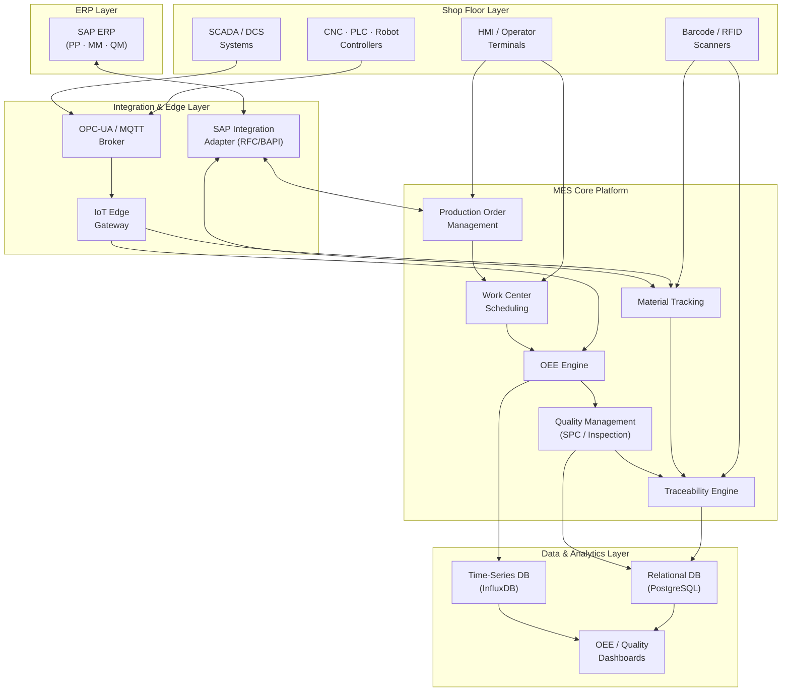

# Manufacturing Execution System — Requirements Specification

## Overview

This document defines the functional and non-functional requirements for a Manufacturing Execution System (MES) purpose-built for discrete manufacturing environments. The MES bridges the gap between enterprise resource planning (ERP) and shop-floor execution, providing real-time visibility, control, and end-to-end traceability across all production operations.

The system targets high-mix, low-to-medium volume discrete manufacturers operating multi-shift production environments with a combination of automated work centers, semi-automated assembly stations, and manual operations. It integrates bidirectionally with SAP ERP (PP/MM/QM modules), consumes machine data from IoT sensors and SCADA systems via OPC-UA and MQTT, and produces ISO 9001-compliant quality records alongside FDA 21 CFR Part 11-ready electronic records and audit trails.

**Intended Audience:** Product managers, solution architects, backend and frontend engineers, QA engineers, systems integrators, and operational technology (OT) teams.

**Scope:** Shop-floor execution control, production scheduling, OEE analytics, Statistical Process Control (SPC)-based quality management, material genealogy, ERP/SCADA integration, and traceability. Out of scope: product design, CAD/CAM, financial accounting, maintenance management (CMMS), and HR payroll.

**Document Version:** 1.0  
**Status:** Approved

---

## System Architecture Overview

The following diagram illustrates the layered architecture of the MES platform and its integration touchpoints.

---

## Functional Requirements

### Production Order Management

Production order management governs the full lifecycle of manufacturing orders from ERP release through shop-floor closure, ensuring accurate scheduling, capacity allocation, operator assignment, and real-time progress visibility.

**FR-001** The system shall import production orders from SAP PP via a certified RFC/BAPI integration adapter, mapping SAP order header data, operation sequences, component lists, and revision levels to MES work orders without data loss or transformation errors.

**FR-002** The system shall enforce a production order state machine with the states: Planned → Released → In Progress → Completed → Closed, requiring role-based authorisation for each state transition and logging the actor identity, timestamp, and optional reason code for every change.

**FR-003** The system shall allow production supervisors to split a released work order into two or more child work orders, redistributing planned quantity, routing steps, and material allocations proportionally across the resulting children, while linking children back to the parent for consolidated reporting.

**FR-004** The system shall record actual start time, actual end time, yield quantity, scrap quantity, and rework quantity at the individual operation level for every production order, distinguishing operator-reported values from machine-reported values where both sources are available.

**FR-005** The system shall automatically generate a shop-floor traveller document (PDF or ZPL label) upon work order release, incorporating the routing sequence, component requirements, revision and engineering change notice (ECN) levels, inspection plan reference, and a scannable QR code linking back to the live work order record.

**FR-006** The system shall raise a configurable priority alert—delivered via in-app notification, email, and optional SMS—when a production order's projected completion timestamp exceeds the ERP-committed due date by more than a user-defined threshold (default: 2 hours).

**FR-007** The system shall maintain an immutable field-level change history for every production order record, capturing the previous value, new value, actor, timestamp, and reason for each modification, accessible to authorised users via the audit trail viewer.

**FR-008** The system shall support batch-release of multiple work orders in a single operation, applying scheduling rules (earliest due date, critical ratio, or manual priority) to determine the release sequence.

---

### Work Center Scheduling

Work center scheduling provides finite-capacity scheduling across all registered production resources, enabling dispatchers and supervisors to optimise throughput, minimise changeover losses, and respond dynamically to unplanned events.

**FR-009** The system shall maintain a real-time capacity model for each work center, including available shift hours, planned downtime windows, machine speed rates, and concurrent operation limits, updated automatically when any input changes.

**FR-010** The system shall generate a sequenced dispatch list for each work center based on a configurable scheduling rule (earliest due date, shortest processing time, critical ratio, or FIFO), refreshable on demand or on a user-defined automatic interval.

**FR-011** The system shall support drag-and-drop rescheduling on the Gantt-style planning board, with automatic conflict detection that highlights capacity overloads, missing prerequisites, or violated minimum changeover times in real time.

**FR-012** The system shall model and enforce operation prerequisites, preventing an operation from being dispatched to a work center until all predecessor operations across any upstream work center are reported as complete.

**FR-013** The system shall calculate and display the remaining cycle time for every in-progress operation based on the planned cycle time, actual start time, and current machine speed signal received from the IoT gateway.

**FR-014** The system shall propagate work center schedule changes downstream to affected operations within the same production order and notify impacted supervisors within 60 seconds of the change being committed.

**FR-015** The system shall allow supervisors to record planned and unplanned downtime events against a work center using a structured reason-code taxonomy (e.g., ISO 22400 loss categories), capturing start time, end time, responsible party, and corrective action taken.

---

### OEE Monitoring

Overall Equipment Effectiveness (OEE) monitoring provides continuous, real-time insight into asset utilisation, performance, and quality ratios across all production resources, aligned with the ISO 22400 KPI framework.

**FR-016** The system shall calculate OEE as the product of Availability, Performance, and Quality ratios, refreshing values in real time from machine signal data and operator-reported counts, and displaying current OEE alongside a rolling 8-hour trend sparkline on every work center card.

**FR-017** The system shall decompose total losses into the six major loss categories (Unplanned Stops, Planned Stops, Small Stops, Slow Cycles, Production Rejects, Startup Rejects) per the ISA-95 and ISO 22400 frameworks, attributing each loss event to a specific work center, shift, and product.

**FR-018** The system shall support both manual OEE data entry (for work centers without machine connectivity) and automated OEE calculation from real-time PLC/SCADA signals, presenting both data sources on the same dashboard with a clear source indicator.

**FR-019** The system shall display a live OEE heatmap at the plant, area, and work-center levels, colour-coded by configurable performance bands (e.g., red < 50%, amber 50–75%, green > 75%), with drill-down capability from plant to individual machine.

**FR-020** The system shall generate automated OEE shift reports at the end of each configured shift window, including total production time, OEE breakdown by loss category, top-three contributors to downtime, and comparison against the same shift's historical average.

**FR-021** The system shall allow authorised users to configure OEE target values per work center and product family, and shall display performance-against-target deviation visually on all OEE dashboards and trend charts.

**FR-022** The system shall export OEE data in CSV and JSON formats for integration with external BI platforms, supporting both scheduled pushes and on-demand pull via REST API.

---

### Quality Management

Quality management encompasses SPC-driven process monitoring, incoming and in-process inspection, non-conformance recording, and disposition workflows to ensure products meet specification before advancing to downstream operations or shipping.

**FR-023** The system shall create inspection lots automatically when a production order operation reaches a configured inspection point, linking the lot to the parent work order, work center, shift, and operator, and pre-populating the inspection plan characteristics from the connected SAP QM module.

**FR-024** The system shall render real-time SPC control charts (X̄-R, X̄-S, Individuals-MR, p-chart, and c-chart) for each monitored quality characteristic, automatically applying Nelson and Western Electric rule sets to flag out-of-control conditions and alerting the responsible quality engineer within 30 seconds of detection.

**FR-025** The system shall calculate and display Cpk, Ppk, Cp, and Pp process capability indices for each critical-to-quality characteristic, updated after every new measurement, and shall raise a capability alert when Cpk falls below a configurable threshold (default: 1.33).

**FR-026** The system shall support structured Non-Conformance Reports (NCRs), capturing defect code, affected quantity, severity classification, immediate containment actions, root-cause investigation status, and corrective action assignments with due dates and owners.

**FR-027** The system shall enforce a disposition workflow for non-conforming material, requiring authorised quality engineer approval before non-conforming units can be re-routed to rework, scrapped, returned to supplier, or accepted under deviation, and shall block the affected work order from advancing until a disposition decision is recorded.

**FR-028** The system shall integrate with gauges, CMMs, and vision systems via OPC-UA or file-based import, automatically associating incoming measurement data with the active inspection lot and work order without requiring manual operator entry.

**FR-029** The system shall retain all inspection records, SPC data, and NCR documentation for a configurable retention period (default: 10 years), with immutable audit trails to support ISO 9001 and IATF 16949 surveillance audits.

---

### Material Tracking

Material tracking provides lot-level and serial-level visibility of all raw materials, components, and sub-assemblies consumed or produced during manufacturing, enabling accurate inventory management and downstream traceability.

**FR-030** The system shall record a goods-issue transaction for every component consumed against a production order operation, capturing component lot number or serial number, quantity issued, issuing location, operator identity, and timestamp, and synchronising confirmed consumptions back to SAP MM.

**FR-031** The system shall support barcode (1D/2D) and RFID scanning at goods-issue, goods-receipt, and point-of-use stations, validating scanned material identities against the production order's bill of materials (BOM) and rejecting or flagging mismatches in real time.

**FR-032** The system shall maintain real-time inventory balances for all materials staged in shop-floor supermarkets and buffer locations, deducting quantities as components are issued and incrementing quantities as finished goods are received into WIP stores.

**FR-033** The system shall support material substitution, allowing authorised users to record a BOM deviation when an alternative material lot is consumed in place of the planned component, capturing the deviation reason and obtaining quality engineer approval before the substitution is confirmed.

**FR-034** The system shall generate automated replenishment signals (kanban triggers or min/max alerts) when shop-floor staging area inventory drops below a configurable minimum level, notifying the materials handler and optionally creating a transfer order in SAP WM.

**FR-035** The system shall track work-in-process (WIP) inventory at the operation level, providing a real-time queue size and age (oldest piece waiting) for every work center, and alerting the supervisor when WIP queue age exceeds a configurable threshold.

---

### IoT/SCADA Integration

IoT and SCADA integration enables the MES to consume machine signals, process parameters, and sensor data from shop-floor automation systems in near-real-time, eliminating manual data entry and providing the ground truth for OEE calculations and process monitoring.

**FR-036** The system shall connect to PLC, SCADA, and DCS systems via OPC-UA (IEC 62541) using both polling and subscription modes, with subscription update intervals configurable per tag down to 100 milliseconds for high-frequency process signals.

**FR-037** The system shall support MQTT (v3.1.1 and v5.0) as an alternative IoT transport protocol, with TLS 1.2+ encryption, mutual certificate authentication, and configurable QoS levels (0, 1, or 2) per topic.

**FR-038** The system shall buffer up to 72 hours of incoming machine data on the IoT edge gateway during network outages, replaying buffered data in chronological order upon connectivity restoration without creating duplicate records.

**FR-039** The system shall map incoming raw machine signals to MES process parameters using a configurable tag mapping table, supporting unit-of-measure conversion, scaling transformations, and derived tag calculations (e.g., spindle power = voltage × current).

**FR-040** The system shall detect and alert on machine signal anomalies—including unexpected value spikes, frozen signals (unchanged for a configurable duration), and out-of-range readings—routing alerts to the responsible maintenance or process engineer.

**FR-041** The system shall store all incoming time-series machine data in a dedicated time-series database, retaining raw samples at full resolution for 90 days and downsampled aggregates (1-minute averages) for 3 years.

**FR-042** The system shall expose a REST API endpoint allowing authorised external systems and custom dashboards to query historical machine data by work center, tag name, and time range, returning data in JSON or CSV format.

---

### ERP Integration

ERP integration ensures the MES operates as the authoritative system of record for shop-floor execution data while maintaining a consistent, synchronised view of orders, materials, and quality outcomes with SAP ERP.

**FR-043** The system shall integrate with SAP ERP using certified RFC/BAPI calls and IDocs, supporting both synchronous transactional calls (for order confirmations) and asynchronous batch transfers (for OEE summaries and quality results).

**FR-044** The system shall receive production order master data (order header, routing operations, component lists, and work center assignments) from SAP PP via an event-driven push mechanism, processing new and changed orders within 5 minutes of the change being saved in SAP.

**FR-045** The system shall post production order operation confirmations (yield, scrap, activity times) back to SAP PP CO11N transactions upon operator sign-off in the MES, ensuring ERP actual costs reflect real shop-floor outcomes.

**FR-046** The system shall synchronise quality inspection results and usage decisions from MES inspection lots back to the corresponding SAP QM inspection lots, keeping the QM module current without requiring duplicate data entry by quality engineers.

**FR-047** The system shall handle ERP integration errors (connection failures, BAPI exceptions, IDoc posting failures) with a configurable retry policy, quarantining failed messages for manual review and maintaining a message-level audit trail of all outbound transactions.

**FR-048** The system shall support ERP integration blackout windows (e.g., SAP month-end close periods) during which outbound messages are queued locally and bulk-posted when the blackout window ends, with no loss of shop-floor transactions.

**FR-049** The system shall provide an integration monitoring dashboard displaying the status, throughput, and error rate of all active ERP interface channels, with drill-down capability to inspect individual failed messages and re-trigger them after correction.

---

### Traceability

Traceability provides complete, auditable records linking every finished unit or lot to its consumed materials, machines, operators, process parameters, and quality results, supporting regulatory compliance, customer audits, and rapid field-issue investigations.

**FR-050** The system shall maintain a genealogy tree for every finished production order lot, recording all parent materials (with lot numbers), child sub-assemblies, serial-numbered components, and their relationships, enabling forward and backward traceability queries.

**FR-051** The system shall capture and associate all process parameters recorded or received during an operation—including machine ID, operator ID, tool ID, temperature, pressure, speed, and torque—with the specific unit or lot produced in that operation.

**FR-052** The system shall link quality inspection results, SPC data points, and NCR records to the corresponding production lot or serial number, ensuring every quality event is traceable to the exact unit it affects.

**FR-053** The system shall respond to a full backward traceability query (from finished lot to all consumed raw material lots) within 10 seconds for production histories up to 5 years old, returning results as an interactive genealogy tree and a downloadable PDF report.

**FR-054** The system shall respond to a full forward traceability query (from a raw material lot to all finished goods lots containing that material) within 10 seconds, enabling rapid quarantine scoping in response to supplier notifications or field complaints.

**FR-055** The system shall generate a Certificate of Conformance (CoC) document for any completed production order lot, consolidating the lot genealogy, process parameter summary, inspection results, and disposition status into a signed, printable document.

**FR-056** The system shall support electronic signature capture (compliant with FDA 21 CFR Part 11 and EU Annex 11) for critical traceability events, including work order completion, quality disposition, and CoC issuance, recording the signer's identity, timestamp, and meaning of the signature.

---

## Non-Functional Requirements

### Performance

**NFR-001** The system shall process and display shop-floor operator transactions (work order sign-on, operation confirmation, component scan) with an end-to-end response time of ≤ 2 seconds at the 95th percentile under normal operating load (up to 500 concurrent users).

**NFR-002** The system shall ingest and persist IoT/SCADA time-series data at a sustained rate of at least 50,000 tag samples per second across all connected machines without data loss or backpressure.

**NFR-003** The OEE calculation engine shall refresh live OEE values for all monitored work centers within 5 seconds of receiving a new machine event or operator transaction.

**NFR-004** SPC control chart pages shall render with up to 500 data points within 3 seconds at the 95th percentile on a standard operator terminal (4-core CPU, 8 GB RAM, gigabit LAN).

**NFR-005** Traceability genealogy queries for production histories up to 5 years old shall return complete results within 10 seconds at the 95th percentile.

**NFR-006** All scheduled integration jobs between the MES and SAP ERP shall complete within their configured schedule window, with an integration throughput of at least 2,000 order transactions per hour.

### Availability

**NFR-007** The MES platform shall achieve a minimum availability of 99.5% measured monthly, excluding pre-approved maintenance windows, equivalent to no more than 3.65 hours of unplanned downtime per month.

**NFR-008** The system shall support rolling upgrades and maintenance operations without requiring a full platform shutdown, with individual service restarts causing no more than 30 seconds of degraded service for affected modules.

**NFR-009** The system shall implement an active-passive failover configuration for all stateful services, with automatic failover completing within 60 seconds of primary node failure detection.

**NFR-010** All shop-floor operator terminals shall function in offline mode (enabling basic work order progress reporting and barcode scanning) for up to 4 hours during a server outage, synchronising buffered transactions automatically upon reconnection.

### Security

**NFR-011** All network communication between MES components, and between the MES and external systems, shall be encrypted using TLS 1.2 or higher, with mutual certificate authentication required for machine-to-server and server-to-server connections.

**NFR-012** The system shall implement role-based access control (RBAC) with a minimum of eight distinct roles (Operator, Supervisor, Quality Engineer, Planner, Maintenance Technician, Integration Admin, Quality Manager, System Administrator), enforcing the principle of least privilege for all data access and functional operations.

**NFR-013** The system shall integrate with the plant's Active Directory / LDAP identity provider for user authentication, supporting SAML 2.0 and OAuth 2.0 / OIDC protocols.

**NFR-014** All authentication attempts (successful and failed), privilege escalation events, and access to sensitive quality or traceability records shall be logged in an immutable audit log with actor identity, source IP, timestamp, and resource accessed.

**NFR-015** The system shall enforce session timeouts of 15 minutes of inactivity for HMI operator terminals and 30 minutes for desktop workstations, requiring re-authentication to resume.

### Scalability

**NFR-016** The MES application tier shall scale horizontally to support between 50 and 5,000 concurrent shop-floor users by adding stateless application server instances without architectural changes.

**NFR-017** The system shall support a minimum of 500 simultaneously connected IoT/SCADA data sources and shall scale to 2,000 connections through horizontal expansion of the edge gateway cluster.

**NFR-018** The time-series database shall support at least 10 years of raw machine data at full ingestion rate (50,000 samples/second) without requiring data archiving or performance degradation.

### Compliance

**NFR-019** All electronic records and electronic signatures shall comply with FDA 21 CFR Part 11, EU GMP Annex 11, and ISO 13485 (where applicable), ensuring record integrity, controlled access, and audit trail completeness.

**NFR-020** Quality management data structures, KPI definitions, and reporting formats shall comply with ISO 9001:2015, IATF 16949:2016, and ISO 22400 (KPIs for manufacturing operations management).

**NFR-021** The system shall support GDPR-compliant handling of operator personal data, including data minimisation, retention policy enforcement, and a process for responding to data subject access and erasure requests within 30 days.

---

## System Constraints

- **Deployment Environment:** The MES shall be deployable on-premises within the plant's private data center, with an optional cloud-connected mode for remote monitoring dashboards. A fully air-gapped deployment mode must be supported for facilities with no internet access.
- **Client Hardware:** Shop-floor HMI terminals are industrial panel PCs running Windows 10 IoT Enterprise (minimum 4-core CPU, 8 GB RAM) with touch screens and USB barcode scanner ports. The MES UI must function correctly on 1024 × 768 displays and higher.
- **Network Architecture:** The OT network (shop floor) is physically segregated from the IT network via a DMZ with a unidirectional security gateway. All OT-to-IT data flows must traverse a controlled integration zone; no direct IT-to-OT write access is permitted except via authorised MES control commands.
- **SAP Version Compatibility:** The ERP integration adapter must support SAP ECC 6.0 (EhP7 and above) and SAP S/4HANA 2020 and later, using standard BAPI and IDoc interfaces only (no direct database access to SAP).
- **Technology Stack Alignment:** The MES must be built on approved technology components: PostgreSQL 14+ for relational data, InfluxDB 2.x for time-series data, Kubernetes for container orchestration, and a React-based frontend. Custom proprietary components must be avoided where open standards exist.
- **Language and Locale:** The primary UI language is English. The system must support UTF-8 character encoding throughout and provide a localisation framework capable of supporting German, Mandarin, and Spanish in a future release without code changes.
- **Change Management:** All schema migrations and integration interface changes must be backward-compatible for at least one major version cycle to allow phased upgrades of connected systems.

---

## Assumptions

- SAP ERP is the system of record for production order master data, BOM structures, routing definitions, and quality inspection plans. The MES consumes this data but does not own or originate it.
- Work centers are already defined and maintained in SAP CR01/CR02; the MES imports work center master data from SAP rather than managing it independently.
- IoT edge gateway hardware is supplied and pre-commissioned by the OT engineering team; the MES vendor is responsible only for the gateway software and its northbound API.
- Plant network infrastructure (switches, firewalls, DMZ, and Wi-Fi access points) is provisioned and managed by the plant IT team and meets the bandwidth and latency prerequisites specified in the MES infrastructure guide.
- Operators have been trained in barcode scanning procedures and are equipped with individual operator ID badges or login credentials. Shared login accounts for operators are not permitted.
- Product quality characteristics and their specification limits are maintained in SAP QM inspection plans and are considered complete and accurate at the point of MES go-live; any gaps must be resolved during the pre-go-live data readiness phase.
- The organisation has appointed a dedicated MES product owner and a cross-functional steering committee with authority to make scope and priority decisions throughout the implementation.
- Third-party systems that require MES data (e.g., BI platforms, MOM dashboards, customer portals) will consume data via the MES REST API; direct database access by third parties is not permitted.
- The initial deployment covers a single plant site. Multi-site rollout requirements will be captured in a separate requirements revision following pilot-site stabilisation.
