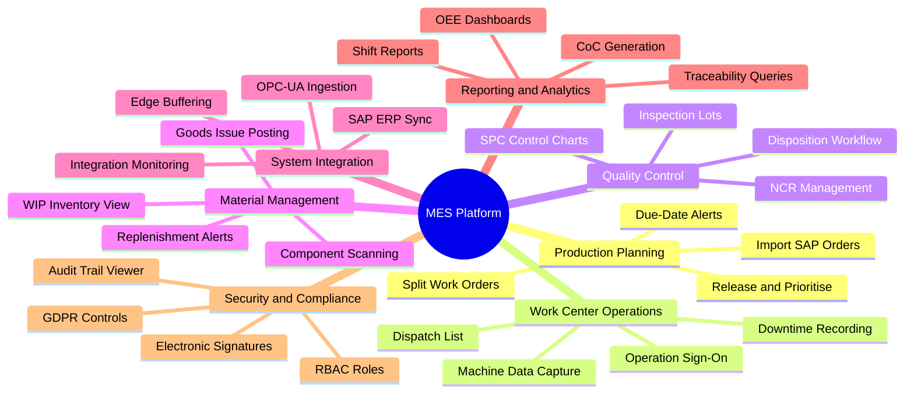
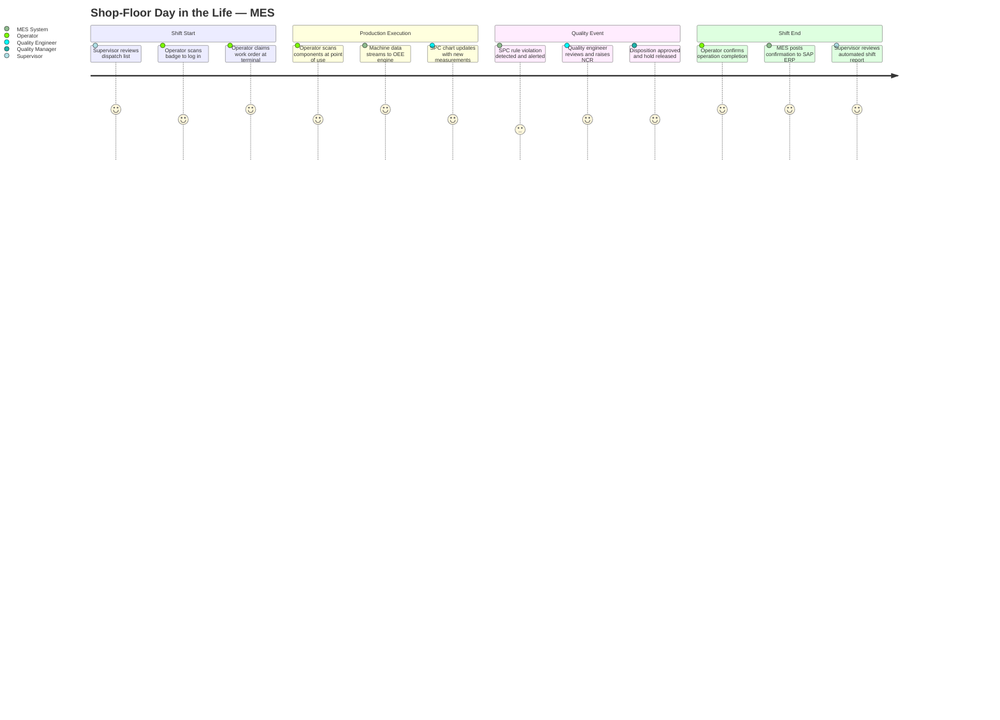

# Manufacturing Execution System — User Stories

## Overview

This document captures user stories and acceptance criteria for the MES for discrete manufacturing. Stories are grouped by epic and written from the perspective of primary personas: production operators, shift supervisors, quality engineers, production planners, materials handlers, system integrators, plant managers, and compliance officers.

Each story follows the format:

> **US-XXX** As a [role], I want [feature] so that [benefit].

**Document Version:** 1.0  
**Status:** Approved

---

## Epics

| Epic ID | Name | Description |
|---------|------|-------------|
| EP-01 | Production Planning | Release, schedule, and manage production orders through their full lifecycle |
| EP-02 | Work Center Operations | Execute, monitor, and report on shop-floor operations in real time |
| EP-03 | Quality Control | Perform inspections, monitor SPC, manage non-conformances and dispositions |
| EP-04 | Material Management | Track component consumption, WIP inventory, and goods movements |
| EP-05 | System Integration | Synchronise data with SAP ERP and consume machine data from IoT/SCADA |
| EP-06 | Reporting and Analytics | Access OEE trends, quality metrics, and traceability reports |
| EP-07 | Security and Compliance | Govern user access, enforce electronic signatures, and maintain audit trails |

---

## MES Capability Mindmap

---

## Shop-Floor User Journey

---

## User Stories by Epic

---

### Epic EP-01 — Production Planning

**US-001**  
As a **production planner**, I want to view all SAP production orders in a single prioritised list so that I can identify urgent orders and release them to the shop floor in the correct sequence.

**Acceptance Criteria:**
- List shows SAP order number, product, planned quantity, due date, MES status, and a calculated priority score (critical ratio or earliest due date).
- Orders within 4 hours of due date are highlighted amber; overdue orders are highlighted red.
- Planners can sort and filter by due date, priority, work center, product family, and status in any combination.
- Selecting multiple orders and releasing them in bulk requires a single confirmation dialog listing all selected orders.

---

**US-002**  
As a **production planner**, I want to release a production order to the shop floor so that the target work center's dispatch list is updated and operators can begin execution.

**Acceptance Criteria:**
- Release transitions the order from Planned to Released and immediately appears on the work center dispatch list.
- The system validates routing, BOM, and work center assignment before allowing release; missing data produces a specific error identifying the gap.
- A shop-floor traveller PDF is generated automatically upon release, containing order details, routing, BOM, and a scannable QR code.
- If the work center is at full capacity, the system shows a warning but allows override with a documented justification.

---

**US-003**  
As a **production planner**, I want to split a released work order into child orders so that I can distribute quantity across two shifts or work centers to meet the delivery deadline.

**Acceptance Criteria:**
- The split accepts a user-defined quantity distribution; the sum of child quantities must equal the parent planned quantity.
- Child orders inherit the parent's routing, BOM, revision level, and inspection plan references.
- The parent order is locked from direct execution; only child orders can be confirmed.
- Consolidated reporting on the parent aggregates yield, scrap, and actual times from all children.

---

**US-004**  
As a **production planner**, I want to receive an automated alert when an order is projected to miss its ERP due date so that I can take corrective action before the customer delivery is impacted.

**Acceptance Criteria:**
- Projected completion is recalculated at least every 15 minutes based on remaining operations, queue depth, and average cycle time.
- An alert fires when projected completion exceeds the due date by more than the configured threshold (default: 2 hours).
- Each alert includes order number, projected completion, ERP due date, and the gap in hours.
- Unresolved alerts re-notify the planner after 1 hour and escalate to the production supervisor.

---

**US-005**  
As a **shift supervisor**, I want a Gantt scheduling board for my area so that I can see all current and upcoming work orders across my work centers and reorganise them by drag-and-drop.

**Acceptance Criteria:**
- All Released and In Progress orders are displayed as horizontal bars grouped by work center, showing order number, product, and colour-coded status.
- Dragging an order triggers an automatic conflict check, flagging capacity overloads or violated prerequisites visually.
- The board updates in real time when operators report progress; an undo option is available for 5 minutes after any save.

---

### Epic EP-02 — Work Center Operations

**US-006**  
As a **production operator**, I want to view the prioritised dispatch list for my work center so that I know which work orders to execute in what order and what materials are required.

**Acceptance Criteria:**
- The list shows order number, product, operation description, planned quantity, planned cycle time, and attached work instructions.
- Expanding a row reveals the BOM component list, tool requirements, and inspection checkpoints.
- Orders blocked by unresolved NCRs or missing prerequisites are greyed out with the blocking reason shown on hover.

---

**US-007**  
As a **production operator**, I want to sign on to a work order operation so that the system records who performed the work, the actual start time, and tracks operation progress.

**Acceptance Criteria:**
- Sign-on requires badge scan or operator ID entry validated against Active Directory.
- Sign-on transitions the operation to In Progress and records the actual start timestamp, operator ID, and work center ID.
- An operator cannot sign on to more concurrent operations than the configured maximum (default: 1); the system prevents additional sign-ons.
- A different operator attempting to claim the same operation must obtain supervisor override.

---

**US-008**  
As a **production operator**, I want to confirm operation completion and record yield, scrap, and rework quantities so that progress is reflected in the MES and posted to SAP ERP.

**Acceptance Criteria:**
- The confirmation screen pre-populates planned quantity; yield is required, scrap and rework default to zero.
- Yield + scrap + rework must not exceed the planned quantity; the system prevents saving if violated.
- If yield is below planned, the operator must select a reason code from a configurable list.
- Confirmed quantities are posted to SAP PP as an operation confirmation within 5 minutes of the MES transaction being saved.

---

**US-009**  
As a **production operator**, I want to record an unplanned downtime event so that the cause of lost production time is captured for OEE reporting and maintenance planning.

**Acceptance Criteria:**
- The downtime screen is accessible in two taps from the active work order view and requires selecting a loss category and reason code.
- Start time is stamped when the record is opened; end time is stamped when the operator closes the event.
- Downtime events are immediately reflected in the real-time OEE calculation for the affected work center.
- The supervisor is notified within 60 seconds of a downtime event being opened.

---

**US-010**  
As a **shift supervisor**, I want to monitor real-time status of all work centers in my area on a single screen so that I can identify and respond to issues without walking the floor.

**Acceptance Criteria:**
- Each work center is displayed as a card showing OEE, active work order, operator, units completed vs. planned, and machine status.
- Cards are colour-coded: green (OEE ≥ target, running), amber (OEE below target or downtime < 30 min), red (downtime > 30 min or idle when scheduled).
- The dashboard refreshes automatically every 10 seconds; a summary bar shows area-level OEE, total shift units, and open downtime events.

---

### Epic EP-03 — Quality Control

**US-011**  
As a **quality engineer**, I want inspection lots created automatically at designated quality checkpoints so that no inspection is missed without manual initiation.

**Acceptance Criteria:**
- Inspection lots are created when the preceding operation is confirmed and the next operation is flagged as an inspection point in the routing.
- The lot is pre-populated with characteristics, specification limits, and sampling plan from the linked SAP QM inspection plan.
- The quality engineer receives an in-app notification with work order number, product, and required sample size.
- If no inspection plan is found in SAP QM, the lot is created with a warning flag requiring the engineer to assign characteristics manually.

---

**US-012**  
As a **quality engineer**, I want to record measurements and see the SPC control chart update immediately so that I can assess process stability and respond to out-of-control conditions.

**Acceptance Criteria:**
- After each measurement is saved, the corresponding SPC chart updates in real time with the new data point plotted against control limits.
- Nelson and Western Electric rule violations on newly entered points trigger an alert banner and an email to the engineer and supervisor within 30 seconds.
- Current Cpk and Ppk values are displayed beneath the control chart after each new measurement.

---

**US-013**  
As a **quality engineer**, I want to raise a Non-Conformance Report so that defective material is contained, root cause is investigated, and corrective actions are assigned.

**Acceptance Criteria:**
- The NCR captures defect codes, affected quantity, severity (Minor / Major / Critical), immediate containment, and the engineer's identity.
- A unique NCR number is auto-generated in the format NCR-YYYY-NNNNN.
- The affected work order operation is placed on quality hold, preventing the operator from advancing until a disposition decision is recorded.
- An automated reminder is sent 24 hours before the investigation due date if the NCR is still open.

---

**US-014**  
As a **quality manager**, I want to approve a disposition decision for a non-conforming lot so that material is handled correctly and the work order can proceed.

**Acceptance Criteria:**
- Disposition options are: Accept As-Is, Rework, Scrap, Return to Supplier, and Accept Under Deviation.
- Accept Under Deviation requires a written justification and a second electronic signature from an authorised approver.
- Selecting Rework automatically creates a rework work order linked to the NCR and routed to the designated rework center.
- The quality hold is released automatically after disposition approval, and the operator is notified to proceed.

---

**US-015**  
As a **quality engineer**, I want to view the Cpk trend for a critical characteristic over 90 days so that I can identify degrading process performance before non-conformances occur.

**Acceptance Criteria:**
- The trend chart displays Cpk and Ppk over configurable rolling windows (last 25 subgroups, 7, 30, or 90 days).
- A reference line at Cpk = 1.33 marks the minimum acceptable threshold; values below are highlighted amber.
- The chart allows filtering by work center, machine, operator, and material lot to isolate variation sources.
- Chart data is exportable as CSV for external statistical analysis.

---

### Epic EP-04 — Material Management

**US-016**  
As a **production operator**, I want to scan component barcodes at the point of use so that material consumption is recorded without manual entry and BOM compliance is enforced.

**Acceptance Criteria:**
- A valid scan records a goods-issue transaction with material number, lot number, quantity, work order reference, work center, and operator ID; a success tone confirms acceptance.
- Scanning a material that does not match the BOM triggers an error tone and requires supervisor override to proceed.
- The goods-issue transaction is posted to SAP MM within 30 seconds; posting failures are queued for retry and shown in the integration dashboard.

---

**US-017**  
As a **materials handler**, I want to view real-time inventory balances in shop-floor staging locations so that I can proactively replenish work centers before a shortage interrupts production.

**Acceptance Criteria:**
- The inventory view lists all materials per staging location with current quantity, unit of measure, and minimum stock level.
- Materials at or below the minimum are highlighted amber; zero-quantity materials are highlighted red.
- Inventory balances update in real time as goods-issue transactions are recorded; no manual refresh is required.

---

**US-018**  
As a **materials handler**, I want automated replenishment alerts when a component drops below minimum stock so that I can issue a kanban trigger before production is interrupted.

**Acceptance Criteria:**
- Alerts fire within 60 seconds of a material quantity dropping below its configured minimum, specifying material, location, current quantity, and affected work orders.
- The handler can acknowledge an alert to mark it In Progress, updating the status for all dashboard viewers.
- Unresolved alerts escalate to the supervisor and planner after a configurable window (default: 2 hours).

---

**US-019**  
As a **production supervisor**, I want to authorise a material substitution so that production continues when the planned component is unavailable, with a full deviation record maintained.

**Acceptance Criteria:**
- The substitution workflow requires the supervisor to specify the planned material, substitute lot, quantity, and structured deviation reason.
- If the substitute is not on the approved substitute list, a quality engineer co-approval is required before the substitution is confirmed.
- The goods-issue transaction records both planned and actual material numbers for downstream traceability.
- The substitution is flagged on the traceability genealogy tree and included in any Certificate of Conformance generated for the lot.

---

### Epic EP-05 — System Integration

**US-020**  
As a **system integrator**, I want to monitor all SAP integration channels from a single dashboard so that failures are detected and resolved before impacting shop-floor execution.

**Acceptance Criteria:**
- The dashboard lists each interface channel with current status (Active / Degraded / Failed / Paused), throughput, error rate, last successful transaction, and queue depth.
- Failed messages appear in a quarantine queue with error code, description, payload snippet, and a Retry button.
- Alerts are sent to the integration admin team when any channel's error rate exceeds 5% or a channel has been in Failed status for more than 15 minutes.

---

**US-021**  
As a **system integrator**, I want MES operation confirmations automatically posted to SAP PP so that ERP actual costs and progress reflect real shop-floor data without manual re-keying.

**Acceptance Criteria:**
- Operator confirmations are queued for SAP posting within 5 minutes of the MES transaction being saved.
- Successful postings update a "Last Confirmed to SAP" timestamp visible on the MES order detail screen.
- SAP validation failures are displayed in the integration dashboard with the error detail; the confirmation is quarantined for manual resolution.

---

**US-022**  
As an **OT integration engineer**, I want to configure an OPC-UA tag subscription for a new machine so that production counts, process parameters, and fault codes stream to the MES OEE engine in real time.

**Acceptance Criteria:**
- The configuration screen accepts the OPC-UA server endpoint URL, node IDs, data types, engineering units, and subscription interval per tag.
- A Test Connection button validates connectivity and confirms node IDs are readable before the configuration is saved.
- Configured tags begin streaming data within 2 minutes of saving, visible on the machine's live data panel.

---

**US-023**  
As an **OT integration engineer**, I want the IoT edge gateway to buffer machine data during server outages so that no OEE or quality data is lost due to temporary network interruptions.

**Acceptance Criteria:**
- The gateway buffers up to 72 hours of machine data locally during loss of server connectivity.
- Buffered data replays in strict chronological order upon reconnection, with a progress indicator on the integration dashboard.
- Replayed records are tagged with a "replayed" flag distinguishing them from live data in queries and dashboards.

---

**US-024**  
As a **quality engineer**, I want MES inspection results synchronised to SAP QM automatically so that the SAP quality record is complete without requiring duplicate data entry.

**Acceptance Criteria:**
- Inspection results and usage decisions are posted to SAP QM within 10 minutes of the MES inspection lot being saved.
- The SAP posting status (Pending / Posted / Failed) is visible on each MES inspection lot detail screen.
- Posting failures are logged in the integration dashboard and do not prevent the MES inspection lot from being saved.

---

### Epic EP-06 — Reporting and Analytics

**US-025**  
As a **plant manager**, I want a real-time OEE dashboard for the entire plant so that I can assess production health at a glance and drill into any underperforming area.

**Acceptance Criteria:**
- The plant-level view displays OEE, Availability, Performance, and Quality for the current shift, refreshed every 60 seconds.
- A heatmap of all work centers is colour-coded by OEE performance band, with drill-down from plant to individual machine.
- All dashboard data is exportable as PDF (formatted report) and CSV (raw data) from a single export button.

---

**US-026**  
As a **shift supervisor**, I want an automated end-of-shift report delivered to my email so that I can review shift performance data without logging in to the MES.

**Acceptance Criteria:**
- The report is generated within 10 minutes of the shift end time and delivered as a PDF attachment with a summary in the email body.
- Content includes OEE breakdown, total planned vs. actual units, top-three downtime events, NCRs raised, and comparison to the 30-day rolling average for the same shift.
- Historical shift reports are accessible from the MES reporting menu for up to 24 months.

---

**US-027**  
As a **quality engineer**, I want to run a forward traceability query for a raw material lot so that I can identify all finished goods containing that material and scope a rapid containment action.

**Acceptance Criteria:**
- The query accepts a material number and lot number and returns all finished goods lots containing that material, directly or through sub-assemblies.
- Results display as an interactive genealogy tree showing the path from raw material through each assembly level to the finished lot.
- Queries return results within 10 seconds for production data up to 5 years old and are exportable as a PDF containment report and CSV.

---

**US-028**  
As a **quality engineer**, I want to generate a Certificate of Conformance for a completed production lot so that customers receive documented evidence of quality compliance.

**Acceptance Criteria:**
- CoC generation is only available when all inspections for the lot are complete and the usage decision is Accept.
- The CoC PDF includes part number, revision, production order, lot number, shipped quantity, inspection results summary, and the quality engineer's 21 CFR Part 11-compliant electronic signature.
- Each CoC receives a unique document number, is stored in the MES document library, and can be reprinted at any future date.

---

**US-029**  
As a **quality manager**, I want a quality trend report for a product family over 3 months so that I can identify recurring defect types and prioritise improvement projects.

**Acceptance Criteria:**
- A Pareto chart of defect frequency by code is displayed with a cumulative percentage line; clicking a bar lists all NCRs for that code.
- First-pass yield and right-first-time rates are shown as trend lines over the selected period.
- The report can be filtered by work center, shift, operator, and supplier lot, and exported as PDF and CSV.

---

### Epic EP-07 — Security and Compliance

**US-030**  
As a **system administrator**, I want to manage user roles and permissions from a central panel so that MES access is appropriately controlled and adjusted as personnel roles change.

**Acceptance Criteria:**
- The panel lists all users with their assigned roles, last login date, and account status (Active / Locked / Inactive).
- Role changes take effect at the user's next login without a system restart; bulk assignments support CSV import for reorganisations.
- All user account changes are logged in the system audit trail with the administrator's identity and timestamp.

---

**US-031**  
As a **quality engineer**, I want to apply an electronic signature to critical quality records so that signed records meet FDA 21 CFR Part 11 and ISO 13485 requirements.

**Acceptance Criteria:**
- Electronic signatures are required for inspection lot usage decisions, NCR dispositions, CoC issuance, and deviation approvals.
- The signature workflow presents the meaning statement (e.g., "I approve this disposition") and requires the user to re-enter their password to confirm identity.
- Signed records display a visible block with the signer's name, role, timestamp (UTC), and stated meaning; any post-signature modification invalidates the signature and alerts the quality manager.

---

**US-032**  
As a **compliance officer**, I want to access a comprehensive audit trail for any MES record so that I can respond to regulatory audit queries and demonstrate data integrity compliance.

**Acceptance Criteria:**
- The audit trail viewer is accessible from the detail screen of every auditable record (work order, inspection lot, NCR, production lot, user account).
- Each entry shows: field changed, previous and new values, actor name and role, source IP, timestamp (UTC), and action type.
- Audit trail records are immutable; no user—including system administrators—can modify or delete them.
- Data is retained for a minimum of 10 years; the viewer supports filtering by actor, date range, action type, and record type, with PDF and CSV export.

---

**US-033**  
As a **system administrator**, I want session timeouts enforced on all terminals so that unattended sessions cannot be accessed by unauthorised personnel on the shop floor.

**Acceptance Criteria:**
- HMI operator terminals lock after 15 minutes of inactivity; desktop workstations lock after 30 minutes.
- A 60-second countdown warning is displayed before automatic lock, giving the user a chance to extend their session.
- Timeout thresholds are configurable per role by the system administrator without requiring a code deployment.

---

**US-034**  
As a **system administrator**, I want MFA enforced for privileged roles so that administrator and quality manager accounts are protected against credential compromise.

**Acceptance Criteria:**
- TOTP or push-notification MFA is enforced for System Administrator, Quality Manager, and Integration Admin roles at every login.
- Three consecutive MFA failures lock the account for 30 minutes and notify the system administrator.
- MFA enrolment status for all users is visible on the user management screen; administrators can revoke and re-enrol credentials from the panel.
