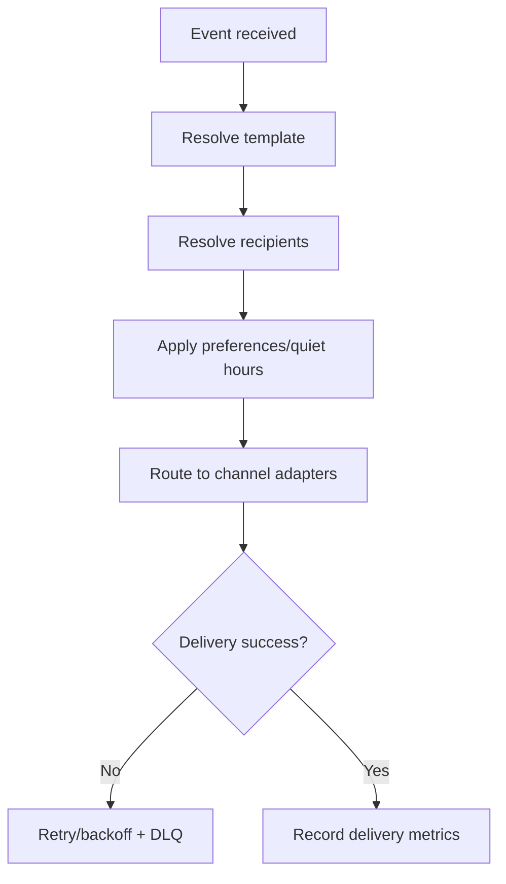
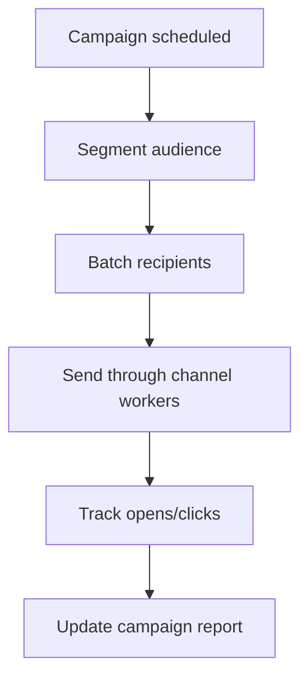

# Activity Diagrams

## Event Notification Flow

```mermaid
flowchart TD
  A[Event received] --> B[Resolve template]
  B --> C[Resolve recipients]
  C --> D[Apply preferences/quiet hours]
  D --> E[Route to channel adapters]
  E --> F{Delivery success?}
  F -- No --> G[Retry/backoff + DLQ]
  F -- Yes --> H[Record delivery metrics]
```

## Campaign Dispatch Flow

```mermaid
flowchart TD
  A[Campaign scheduled] --> B[Segment audience]
  B --> C[Batch recipients]
  C --> D[Send through channel workers]
  D --> E[Track opens/clicks]
  E --> F[Update campaign report]
```
