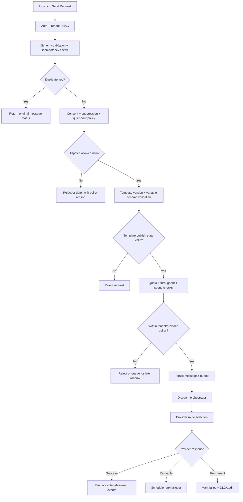

# Business Rules

This document defines enforceable policy rules for **Messaging and Notification Platform** so message ingestion, delivery orchestration, provider dispatch, and compliance controls behave consistently.

## Traceability
- Requirements baseline: [`../requirements/requirements.md`](../requirements/requirements.md)
- Data semantics: [`./data-dictionary.md`](./data-dictionary.md)
- Event contracts: [`./event-catalog.md`](./event-catalog.md)
- Implementation policy: [`../implementation/implementation-guidelines.md`](../implementation/implementation-guidelines.md)

## Context
- Domain focus: multi-channel, multi-tenant notification delivery for transactional, operational, and promotional traffic.
- Rule categories: request admission, consent, suppression, template governance, provider routing, retries, billing, and data protection.
- Enforcement points: API gateway, ingestion service, orchestration engine, template service, compliance service, provider adapters, and operator console.

## Rule Domains

| Domain | Primary concern | Enforcement surfaces |
|---|---|---|
| Request admission | schema, authentication, idempotency, tenant quota | API gateway, ingestion service |
| Compliance | consent, suppression, quiet hours, regional restrictions | compliance service, orchestration engine |
| Content governance | template versioning, approval, allowed variables | template service, publishing workflow |
| Delivery control | priority lanes, retry class, provider routing, failover | orchestration engine, provider adapters |
| Financial control | per-tenant message quotas, spend ceilings, campaign caps | billing/quota service, scheduler |
| Audit and privacy | PII minimization, evidence retention, operator authorization | audit service, storage policy, admin UI |

## Enforceable Rules
1. Every mutation request (`send`, `schedule`, `cancel`, `template publish`, `provider config update`) must carry an authenticated actor identity and a tenant-scoped authorization context.
2. Every send request must include a tenant-unique `idempotency_key`; a duplicate key within the deduplication window returns the original `message_id` and current status instead of creating a new send.
3. Consent must be active, non-expired, and channel-compatible before a message becomes dispatch-eligible.
4. Suppression always wins over a send instruction; global suppression, category suppression, and legal-hold suppression are evaluated before queue admission and again before provider handoff.
5. Quiet-hour rules may delay P1/P2 traffic, but P0 transactional traffic may bypass quiet hours only when the message category is explicitly marked as critical.
6. Template version must be pinned in each send request; draft, deprecated, or retired template versions are rejected for new sends.
7. Regulated templates (financial, healthcare, legal, security) require two-person approval and immutable publication history before they become dispatchable.
8. A message may move only through the allowed lifecycle states: `ACCEPTED -> QUEUED -> DISPATCHING -> PROVIDER_ACCEPTED -> DELIVERED | FAILED | EXPIRED | CANCELLED`.
9. Retry policy is derived from normalized error class, not raw provider code alone; retryable transport and quota errors use bounded exponential backoff with jitter, while permanent content or recipient errors bypass retries and move to DLQ.
10. Provider failover must preserve the original message identity, idempotency key, and audit chain; failover creates a new dispatch attempt, not a new business message.
11. Promotional and campaign sends are subject to tenant spend ceilings, throughput caps, and recipient fatigue controls; when a cap is exceeded, the platform must reject or defer dispatch explicitly.
12. Provider credentials and webhook secrets must be versioned and rotated by policy; a credential marked stale or compromised blocks new dispatches for the affected provider route.
13. PII in logs is minimized to recipient tokens, hashed addresses, and correlation IDs unless an explicit legal-hold workflow grants controlled access.
14. Operator actions that can replay, cancel, override routing, or export message evidence require just-in-time privileged access and full audit logging.

## Rule Evaluation Pipeline

## Exception and Override Handling
- Rate-limit, spend, and throughput overrides require a tenant-level policy change with approval and expiry; no request-scoped bypass token exists.
- Template approval bypass is not permitted; emergency regulated-content changes still require a new immutable version and expedited approval path.
- DLQ replay requires operator approval, replay reason, and batch scoping; replay preserves original message identity and records a new dispatch attempt sequence.
- Suppression overrides are not supported from the send API; any change must flow through preference-management or compliance tooling.
- Provider-route overrides for incident response are temporary, audited, and auto-expire when the incident is closed.

## Compliance Controls
- Opt-out processing must complete within 24 hours of receipt, with target propagation to dispatch workers within 60 seconds for new sends.
- GDPR/CCPA erasure requests must purge all non-aggregated recipient data from hot and warm stores within 72 hours, except records held under documented legal retention.
- Campaign sends must include required unsubscribe mechanisms, sender identity, and jurisdictional disclosures by channel and locale.
- Webhook delivery to tenant endpoints requires signature validation, replay protection, and SSRF-safe allow/deny controls.

## Measurable Acceptance Criteria
- Idempotency deduplication window: minimum 24 hours per tenant.
- P95 transactional message enqueue latency <= 1 second.
- Consent check latency adds no more than 10 ms P99 to request path.
- Policy engine decision logs are queryable by `tenant_id`, `message_id`, `correlation_id`, and `rule_id`.
- A failed provider route cannot remain in half-open state longer than the configured recovery window without explicit operator acknowledgement.
