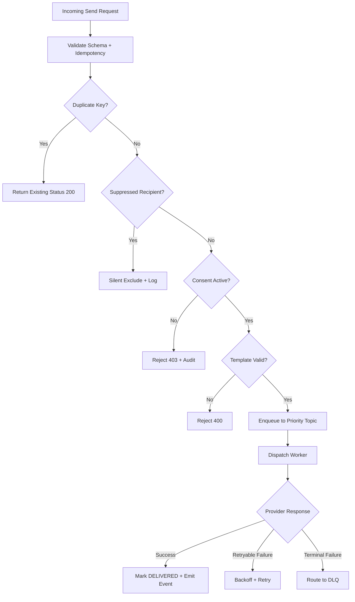

# Business Rules

This document defines enforceable policy rules for **Messaging and Notification Platform** so message ingestion, delivery orchestration, provider dispatch, and compliance controls behave consistently.

## Context
- Domain focus: multi-channel, multi-tenant notification delivery.
- Rule categories: consent, suppression, idempotency, retry, rate limiting, and template governance.
- Enforcement points: API gateway, ingestion service, delivery orchestrator, provider adapters, and compliance workers.

## Enforceable Rules
1. Every notification request must carry a valid `idempotency_key`; duplicate keys within the deduplication window return the existing status without a new send.
2. Consent must be active and non-expired for the target channel before any message is admitted to the queue.
3. Suppressed recipients (global or channel-specific) are silently excluded; suppression checks run before queue admission and cannot be bypassed by callers.
4. Template version must be explicitly pinned in each send request; sending against a deprecated or retired template version is rejected.
5. Message status transitions follow the defined state machine: `ACCEPTED` -> `QUEUED` -> `DISPATCHING` -> `PROVIDER_ACCEPTED` -> `DELIVERED` or `FAILED` or `EXPIRED`.
6. Retry attempts use capped exponential backoff with jitter; non-retryable errors (invalid recipient, permanent reject) route to DLQ immediately without retrying.
7. Promotional messages are subject to tenant-level and recipient-level rate limits; requests exceeding limits return `429 Too Many Requests`.
8. Provider failover must preserve the original idempotency key and not create a new message record.
9. Template changes that affect regulated content require dual approval before publication.
10. PII in message bodies must be tokenized in operational logs; only the recipient token and correlation ID are stored in hot logs.

## Rule Evaluation Pipeline

## Exception and Override Handling
- Rate limit overrides require tenant-level configuration change with approval; no per-request bypass is permitted.
- Template approval bypass is not available; emergency content changes require a new version with expedited approval.
- DLQ replay requires operator approval; replay preserves original idempotency keys and does not generate new message IDs.
- Suppression overrides are not supported at the API level; suppression changes must go through the preference management flow.

## Compliance Controls
- Opt-out processing must complete within 24 hours of receipt; messages in-flight at the time of opt-out are cancelled where possible.
- GDPR erasure requests must purge all non-aggregated recipient data from hot and warm stores within 72 hours.
- Campaign sends must include unsubscribe links compliant with CAN-SPAM, GDPR, and applicable regional regulations.

## Measurable Acceptance Criteria
- Idempotency deduplication window: minimum 24 hours per tenant.
- P95 transactional message enqueue latency <= 1 second.
- Consent check latency adds no more than 10 ms P99 to request path.
