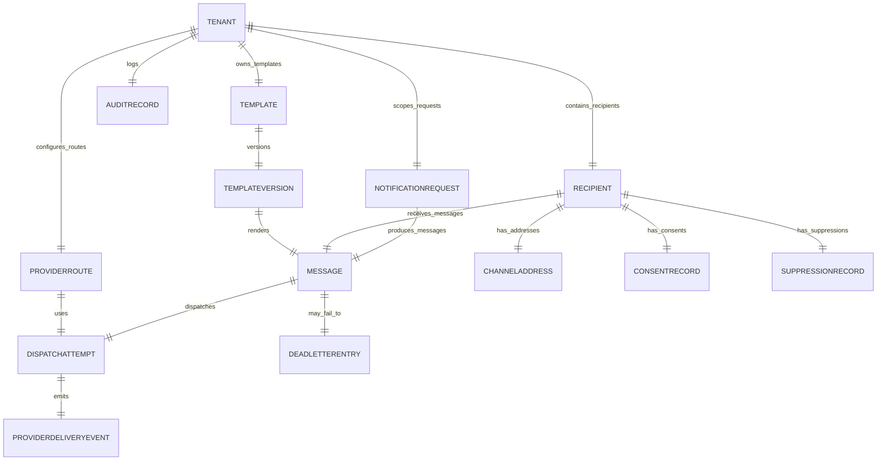

# Data Dictionary

This data dictionary is the canonical reference for **Messaging and Notification Platform**. It defines shared terminology, entity semantics, and governance controls for multi-channel notification delivery.

## Traceability
- Requirements baseline: [`../requirements/requirements.md`](../requirements/requirements.md)
- Business rules: [`./business-rules.md`](./business-rules.md)
- Event contracts: [`./event-catalog.md`](./event-catalog.md)
- Database schema: [`../detailed-design/erd-database-schema.md`](../detailed-design/erd-database-schema.md)

## Scope and Goals
- Establish stable vocabulary for ingestion, orchestration, dispatch, feedback, analytics, and compliance domains.
- Define minimum required fields, ownership boundaries, and lifecycle expectations for core entities.
- Document quality, retention, and privacy controls needed for production readiness.

## Core Entities

| Entity | Description | Required Attributes |
|---|---|---|
| `Tenant` | Logical customer boundary owning templates, providers, recipients, quotas, and audit evidence | `tenant_id`, `name`, `status`, `plan_tier`, `default_region` |
| `NotificationRequest` | Top-level send instruction from a calling service or campaign scheduler | `request_id`, `tenant_id`, `category`, `priority`, `idempotency_key`, `source_system`, `requested_at` |
| `Message` | Canonical business message derived from a request and eligible for dispatch | `message_id`, `request_id`, `tenant_id`, `recipient_id`, `channel`, `status`, `template_version_id`, `scheduled_at` |
| `DispatchAttempt` | Provider-facing attempt for a message on a specific route | `attempt_id`, `message_id`, `provider_route_id`, `attempt_no`, `status`, `started_at` |
| `Recipient` | Contact record containing delivery addresses, locale, and preference anchors | `recipient_id`, `tenant_id`, `external_ref`, `locale`, `timezone`, `status` |
| `ChannelAddress` | Normalized delivery endpoint for a recipient per channel | `address_id`, `recipient_id`, `channel`, `address_value`, `is_verified`, `is_primary` |
| `ConsentRecord` | Opt-in/opt-out legal basis and lifecycle record per channel/category | `consent_id`, `recipient_id`, `channel`, `category`, `status`, `captured_at`, `source` |
| `SuppressionRecord` | Hard stop preventing sends due to user preference, bounce, complaint, or legal event | `suppression_id`, `recipient_id`, `channel`, `reason`, `suppressed_at`, `scope` |
| `Template` | Logical template family grouped by channel and business purpose | `template_id`, `tenant_id`, `channel`, `name`, `category`, `current_published_version` |
| `TemplateVersion` | Immutable published or draft content revision with variable schema | `template_version_id`, `template_id`, `version_no`, `status`, `locale`, `body_hash`, `schema_hash` |
| `ProviderRoute` | Configured tenant or platform route to a delivery provider | `provider_route_id`, `tenant_id`, `channel`, `provider`, `priority_weight`, `status` |
| `ProviderDeliveryEvent` | Callback or polling result describing provider acceptance or final delivery outcome | `event_id`, `attempt_id`, `provider_message_id`, `event_type`, `occurred_at` |
| `DeadLetterEntry` | Failed message or attempt requiring replay or manual intervention | `dlq_id`, `message_id`, `attempt_id`, `error_class`, `attempt_count`, `created_at` |
| `AuditRecord` | Immutable evidence of security-sensitive or compliance-relevant actions | `audit_id`, `tenant_id`, `actor_id`, `action`, `entity_type`, `entity_id`, `occurred_at` |

## Canonical Relationship Diagram

## Data Quality Controls
1. `idempotency_key` must be unique per tenant and request purpose within the configured deduplication window.
2. Channel addresses are normalized and validated by channel-specific format rules before a message becomes dispatchable.
3. `ConsentRecord` and `SuppressionRecord` versions are re-evaluated immediately before provider handoff, not only at ingestion time.
4. `TemplateVersion` variable schemas are validated before rendering; unresolved required variables block dispatch.
5. `DispatchAttempt` records are append-only by attempt number and cannot overwrite prior provider interaction evidence.
6. `ProviderDeliveryEvent` records are immutable and drive message status transitions through reconciliation rules.
7. `AuditRecord` storage is write-once and linked to actor identity, tenant context, and originating request correlation ID.
8. PII-bearing entities must expose a tokenized representation for logs and analytics views.

## Retention and Access Patterns
- Active requests, messages, and attempts: hot OLTP for real-time status queries and dispatch orchestration.
- Provider callback events: 90 days hot, 1 year warm, cold archive for long-lived audit cases.
- Consent and suppression records: retained until superseded, revoked, or explicitly expunged under regulatory workflows.
- Audit evidence: 7-year retention with immutable archive policy for regulated tenants.
- Dead-letter entries: 30 days hot with replay tooling; archive resolution artifacts separately.

## Ownership and Access Boundaries

| Entity family | Owning service | Write access | Read access |
|---|---|---|---|
| Requests, messages, attempts | ingestion/orchestration | ingestion, orchestration | API, analytics, operator console |
| Templates and versions | template service | template service | renderer, API, audit |
| Consent and suppression | compliance/preference service | preference service, compliance workers | ingestion, orchestration, support tools |
| Provider routes | provider management service | provider admin workflow | orchestration, health monitor |
| Audit records | audit service | all privileged workflows via append API | audit UI, compliance exports |

## Domain Glossary
- **Idempotency Key**: Composite deterministic key ensuring at-most-once business effect per distinct send intent.
- **Channel**: Delivery mechanism (email, SMS, push, webhook, in-app).
- **Suppression**: Hard block applied at recipient or tenant level to prevent messages on specific channels.
- **DLQ**: Dead-letter queue holding messages that have exhausted all retry attempts.
- **Dispatch Attempt**: A provider-facing send try for a message; multiple attempts may exist for one message under retry/failover rules.
