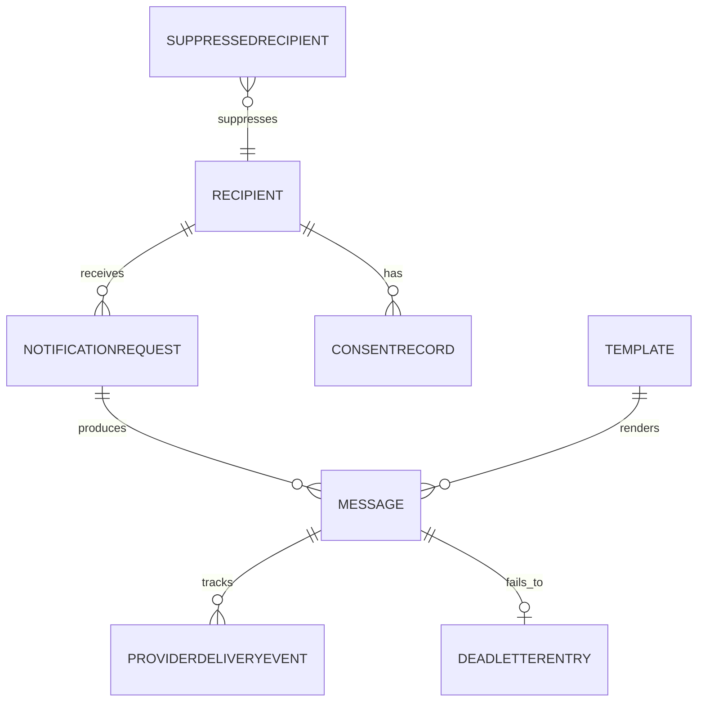

# Data Dictionary

This data dictionary is the canonical reference for **Messaging and Notification Platform**. It defines shared terminology, entity semantics, and governance controls for multi-channel notification delivery.

## Scope and Goals
- Establish stable vocabulary for ingestion, orchestration, dispatch, feedback, and compliance domains.
- Define minimum required fields for core notification entities and expected relationship boundaries.
- Document data quality and retention controls needed for production readiness.

## Core Entities

| Entity | Description | Required Attributes |
|---|---|---|
| `NotificationRequest` | Top-level send instruction from a calling service | `request_id`, `tenant_id`, `recipient_id`, `channel`, `template_id`, `template_version`, `idempotency_key` |
| `Message` | Rendered, addressable notification ready for dispatch | `message_id`, `request_id`, `channel`, `status`, `content_hash`, `scheduled_at` |
| `Recipient` | Contact record with channel addresses and preferences | `recipient_id`, `tenant_id`, `email`, `phone`, `push_token`, `preferred_channel` |
| `ConsentRecord` | Opt-in/opt-out compliance record per channel | `consent_id`, `recipient_id`, `channel`, `status`, `version`, `captured_at` |
| `Template` | Versioned message template with locale and variable schema | `template_id`, `version`, `channel`, `locale`, `status`, `body_hash` |
| `ProviderDeliveryEvent` | Callback from provider about delivery outcome | `event_id`, `message_id`, `provider_message_id`, `event_type`, `occurred_at` |
| `SuppressedRecipient` | Recipients excluded from all or specific channels | `suppression_id`, `recipient_id`, `channel`, `reason`, `suppressed_at`, `expires_at` |
| `DeadLetterEntry` | Failed messages after exhausted retries | `dlq_id`, `message_id`, `error_class`, `attempt_count`, `last_error`, `created_at` |

## Canonical Relationship Diagram

## Data Quality Controls
1. `idempotency_key` must be unique per tenant; duplicate requests return the existing message status without re-sending.
2. Recipient channel addresses are validated against format rules before any dispatch attempt.
3. Consent version is checked at render time; sends are blocked for expired or revoked consent.
4. Template variables are validated against the schema defined for the template version before rendering.
5. `ProviderDeliveryEvent` records are append-only; status transitions on `Message` are derived from events.
6. Suppression records take precedence over all send instructions; suppression checks run before queue admission.

## Retention and Access Patterns
- Active messages and request records: hot OLTP for real-time status queries and delivery tracking.
- Provider callback events: 90 days hot, 1 year warm for compliance and analytics.
- Consent records: permanent until superseded or explicitly expunged under regulatory request.
- Dead-letter entries: 30 days hot with replay tooling; archived after DLQ resolution.

## Domain Glossary
- **Idempotency Key**: Composite deterministic key ensuring at-most-once business effect per distinct send intent.
- **Channel**: Delivery mechanism (email, SMS, push, webhook, in-app).
- **Suppression**: Hard block applied at recipient or tenant level to prevent messages on specific channels.
- **DLQ**: Dead-letter queue holding messages that have exhausted all retry attempts.
