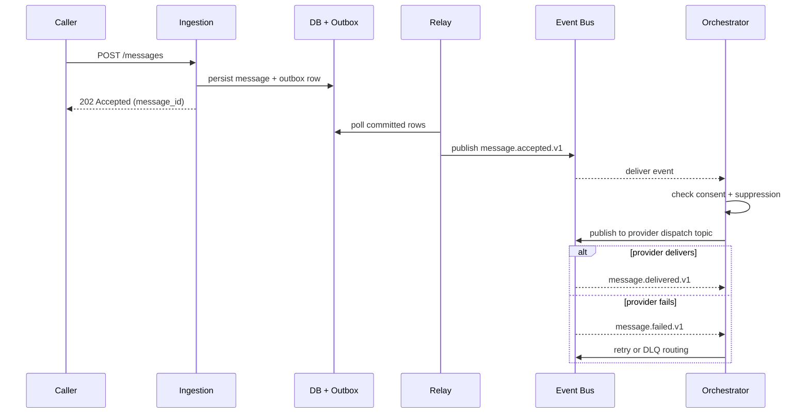

# Event Catalog

This catalog defines production event contracts for the **Messaging and Notification Platform**. It covers events produced during message ingestion, dispatch, delivery feedback, and compliance lifecycle.

## Contract Conventions
- Event name format: `<domain>.<aggregate>.<action>.v1`.
- Mandatory headers: `event_id`, `event_time`, `correlation_id`, `causation_id`, `tenant_id`, `schema_version`.
- Delivery semantics: at-least-once; all consumers must implement idempotency using `event_id`.
- Ordering guarantee: ordered per partition key (`tenant_id:recipient_id:channel`).
- Breaking change policy: major version bump with old topic maintained during migration window.

## Domain Events

| Event | Producer | Partition Key | Key Payload Fields | Trigger | Consumers |
|---|---|---|---|---|---|
| `message.accepted.v1` | ingestion-service | `tenant_id:recipient_id:channel` | `message_id`, `idempotency_key`, `channel`, `priority` | Request validated and queued | Orchestrator, Analytics |
| `message.delivered.v1` | provider-adapter | `tenant_id:message_id` | `message_id`, `provider_message_id`, `delivered_at` | Provider delivery confirmed | Status tracker, Analytics, Audit |
| `message.failed.v1` | provider-adapter | `tenant_id:message_id` | `message_id`, `error_class`, `provider_code`, `attempt_no` | Non-retryable provider failure | DLQ handler, Alerting, Audit |
| `message.expired.v1` | orchestrator | `tenant_id:message_id` | `message_id`, `channel`, `queued_at`, `expired_at` | TTL exceeded before dispatch | DLQ handler, Analytics |
| `recipient.suppressed.v1` | compliance-service | `tenant_id:recipient_id` | `recipient_id`, `channel`, `reason`, `suppressed_at` | Opt-out or policy suppression | Preference sync, Audit |
| `consent.revoked.v1` | preference-service | `tenant_id:recipient_id` | `recipient_id`, `channel`, `revoked_at`, `version` | Recipient opts out | Consent cache, In-flight cancel, Audit |
| `provider.circuit.opened.v1` | provider-monitor | `channel:provider_id` | `provider_id`, `channel`, `error_rate`, `opened_at` | Circuit breaker trips | Failover router, Alerting |
| `dlq.message.received.v1` | dlq-processor | `tenant_id:message_id` | `message_id`, `error_class`, `attempt_count`, `last_error` | Message sent to DLQ | Alerting, Operator console |
| `template.published.v1` | template-service | `tenant_id:template_id` | `template_id`, `version`, `approved_by`, `published_at` | Template approved and published | Render cache, Audit |

## Publish and Consumption Sequence

## Operational SLOs
- P95 message.accepted to message.delivered latency: <= 5 seconds for P0 transactional messages.
- P95 message.accepted to message.delivered latency: <= 30 seconds for P1 operational messages.
- DLQ alert acknowledgement within 10 minutes for tenant-impacting failures.
- Consent revocation must propagate to all dispatch workers within 60 seconds P95.
- Monthly schema compatibility review with all registered consumers.
- Provider circuit-breaker state changes must trigger PagerDuty alert within 30 seconds.
