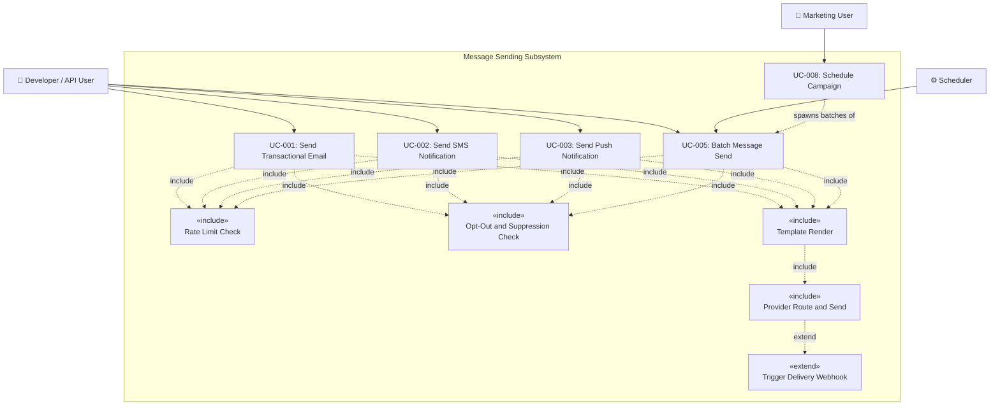
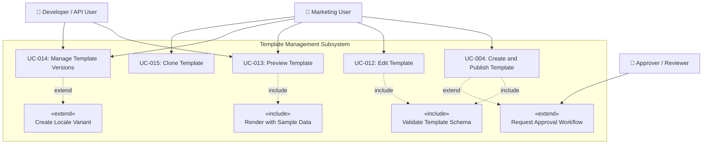
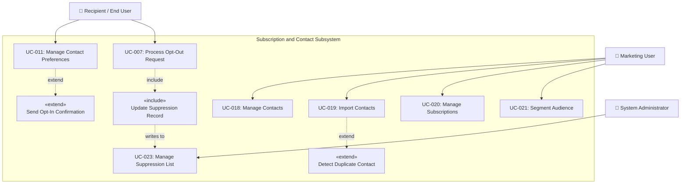

# Use Case Diagram — Messaging and Notification Platform

**Version:** 1.0
**Status:** Approved
**Last Updated:** 2025-01
**Module:** Analysis / Requirements

---

## 1. Introduction

This document captures all significant use cases for the Messaging and Notification Platform (MNP). It defines the actors who interact with the system, the goals they pursue, and the functional boundaries of each use case. These use cases form the primary contract between business stakeholders and the engineering team, and feed directly into sprint planning, API design, and acceptance test criteria.

The platform supports multi-channel message delivery (email, SMS, push notification, in-app, WhatsApp, Slack, webhook), multi-tenant operation, transactional and campaign workloads, template lifecycle management, provider orchestration with automatic failover, compliance controls (opt-out, bounce, complaint handling), and recipient self-service via a preference centre.

---

## 2. Scope

### In Scope
- Sending transactional, operational, and campaign messages across all supported channels.
- Template creation, versioning, approval workflow, and rendering.
- Contact and subscription management including bulk import and audience segmentation.
- Provider configuration, health monitoring, weighted routing, and automatic failover.
- Recipient opt-out processing, bounce handling, complaint processing, and suppression list management.
- Analytics dashboards, delivery reporting, and data export.
- Delivery event webhooks and API key management.
- Recipient self-service via preference centre.

### Out of Scope
- End-user application business logic (handled by integrating client applications).
- Billing and subscription tier management (handled by a separate billing service).
- Content moderation beyond template schema and variable validation.

---

## 3. Actor Descriptions

| Actor | Type | Description |
|-------|------|-------------|
| **Developer / API User** | Primary | Engineers integrating with the platform REST API to send transactional notifications and manage templates programmatically. Responsible for API key lifecycle and webhook configuration. |
| **Marketing User** | Primary | Business users designing campaigns, managing templates, building audience segments, and analysing send performance via the management console. |
| **System Administrator** | Primary | Platform operators responsible for provider configuration, tenant settings, API key governance, suppression list management, and compliance oversight. |
| **Recipient / End User** | Primary | The individual receiving notifications. Interacts with the preference centre to manage channel subscriptions and submits opt-out requests. |
| **External Provider** | Secondary | Third-party delivery services (SendGrid, Twilio, FCM/Firebase, APNS/Apple, WhatsApp Business API, Slack) that deliver messages and return delivery status callbacks. |
| **Inbound Webhook Handler** | Secondary (internal) | Internal component receiving provider-initiated callbacks for bounces, complaints, and delivery receipts. Shown as actor to clarify triggering boundaries. |

---

## 4. Main System Use Case Diagram

The diagram below shows all primary actors and the use cases they initiate. Groupings correspond to functional subsystems of the platform.

```mermaid
flowchart LR
    DEV["👤 Developer / API User"]
    MKT["👤 Marketing User"]
    ADM["👤 System Administrator"]
    RCP["👤 Recipient / End User"]
    PRV["⚙ External Provider"]

    subgraph MNP["Messaging and Notification Platform"]
        direction TB

        subgraph MSG["Message Sending"]
            UC001["UC-001: Send Transactional Email"]
            UC002["UC-002: Send SMS Notification"]
            UC003["UC-003: Send Push Notification"]
            UC005["UC-005: Batch Message Send"]
            UC008["UC-008: Schedule Campaign"]
        end

        subgraph TPL["Template Management"]
            UC004["UC-004: Create and Publish Template"]
            UC012["UC-012: Edit Template"]
            UC013["UC-013: Preview Template"]
            UC014["UC-014: Manage Template Versions"]
            UC015["UC-015: Clone Template"]
        end

        subgraph PROV["Provider Management"]
            UC006["UC-006: Configure Provider"]
            UC016["UC-016: Configure Provider Failover"]
            UC017["UC-017: Monitor Provider Health"]
        end

        subgraph CONT["Contact and Subscription"]
            UC011["UC-011: Manage Contact Preferences"]
            UC018["UC-018: Manage Contacts"]
            UC019["UC-019: Import Contacts"]
            UC020["UC-020: Manage Subscriptions"]
            UC021["UC-021: Segment Audience"]
        end

        subgraph COMP["Compliance and Feedback"]
            UC007["UC-007: Process Opt-Out Request"]
            UC009["UC-009: Process Bounce Record"]
            UC022["UC-022: Process Complaint"]
            UC023["UC-023: Manage Suppression List"]
        end

        subgraph RPT["Analytics and Reporting"]
            UC010["UC-010: View Delivery Analytics"]
            UC024["UC-024: Export Reports"]
            UC025["UC-025: Configure Delivery Webhooks"]
        end

        subgraph ADMIN["Administration"]
            UC026["UC-026: Manage API Keys"]
            UC027["UC-027: Configure Tenant Settings"]
            UC028["UC-028: View Audit Logs"]
        end
    end

    DEV --> UC001
    DEV --> UC002
    DEV --> UC003
    DEV --> UC005
    DEV --> UC025
    DEV --> UC026

    MKT --> UC004
    MKT --> UC012
    MKT --> UC013
    MKT --> UC014
    MKT --> UC015
    MKT --> UC008
    MKT --> UC019
    MKT --> UC020
    MKT --> UC021
    MKT --> UC010
    MKT --> UC024

    ADM --> UC006
    ADM --> UC016
    ADM --> UC017
    ADM --> UC023
    ADM --> UC026
    ADM --> UC027
    ADM --> UC028

    RCP --> UC007
    RCP --> UC011

    PRV --> UC009
    PRV --> UC022
```

---

## 5. Message Sending Subsystem Diagram

---

## 6. Template Management Subsystem Diagram

---

## 7. Subscription Management Subsystem Diagram

---

## 8. Use Case Inventory

| ID | Use Case Name | Primary Actor | Priority | Module |
|----|---------------|---------------|----------|--------|
| UC-001 | Send Transactional Email | Developer / API User | High | Message Sending |
| UC-002 | Send SMS Notification | Developer / API User | High | Message Sending |
| UC-003 | Send Push Notification | Developer / API User | High | Message Sending |
| UC-004 | Create and Publish Template | Marketing User | High | Template Management |
| UC-005 | Batch Message Send | Developer / API User | High | Message Sending |
| UC-006 | Configure Provider | System Administrator | High | Provider Management |
| UC-007 | Process Opt-Out Request | Recipient / End User | High | Compliance |
| UC-008 | Schedule Campaign | Marketing User | High | Message Sending |
| UC-009 | Process Bounce Record | External Provider | High | Compliance |
| UC-010 | View Delivery Analytics | Marketing User | High | Analytics |
| UC-011 | Manage Contact Preferences | Recipient / End User | High | Subscription Management |
| UC-012 | Edit Template | Marketing User | Medium | Template Management |
| UC-013 | Preview Template | Marketing User / Developer | Medium | Template Management |
| UC-014 | Manage Template Versions | Marketing User | Medium | Template Management |
| UC-015 | Clone Template | Marketing User | Low | Template Management |
| UC-016 | Configure Provider Failover | System Administrator | High | Provider Management |
| UC-017 | Monitor Provider Health | System Administrator | Medium | Provider Management |
| UC-018 | Manage Contacts | Marketing User | Medium | Contact Management |
| UC-019 | Import Contacts | Marketing User | Medium | Contact Management |
| UC-020 | Manage Subscriptions | Marketing User | Medium | Subscription Management |
| UC-021 | Segment Audience | Marketing User | Medium | Contact Management |
| UC-022 | Process Complaint | External Provider | High | Compliance |
| UC-023 | Manage Suppression List | System Administrator | High | Compliance |
| UC-024 | Export Reports | Marketing User | Medium | Analytics |
| UC-025 | Configure Delivery Webhooks | Developer / API User | Medium | Integration |
| UC-026 | Manage API Keys | Developer / System Administrator | High | Administration |
| UC-027 | Configure Tenant Settings | System Administrator | High | Administration |
| UC-028 | View Audit Logs | System Administrator | Medium | Administration |

---

## 9. Use Case Relationships

### 9.1 «include» Relationships (mandatory sub-behaviours)

| Base Use Case | Included Use Case | Rationale |
|---------------|-------------------|-----------|
| UC-001, UC-002, UC-003, UC-005 | Rate Limit Check | Every outbound send must evaluate per-tenant and per-recipient rate limits before dispatch is allowed. |
| UC-001, UC-002, UC-003, UC-005 | Opt-Out and Suppression Check | Every send must consult the suppression list and evaluate consent status before proceeding. |
| UC-001, UC-002, UC-003, UC-005 | Template Render | Message content must be rendered from a published, versioned template before delivery. |
| UC-001 through UC-005 | Provider Route and Send | All sends require provider selection, priority evaluation, and delivery dispatch. |
| UC-004, UC-012 | Validate Template Schema | Template saves always include variable declaration, type validation, and required-field checks. |
| UC-013 | Render with Sample Data | Preview mode always renders the template using caller-supplied sample variable values. |
| UC-007 | Update Suppression Record | Every opt-out immediately writes a suppression entry to prevent future sends. |
| UC-009, UC-022 | Update Suppression Record | Hard bounces and spam complaints automatically add the recipient to the suppression list. |

### 9.2 «extend» Relationships (conditional behaviours)

| Base Use Case | Extending Use Case | Extension Condition |
|---------------|--------------------|---------------------|
| UC-001 through UC-005 | Trigger Delivery Webhook | The tenant has a delivery event webhook endpoint configured for the message type. |
| UC-004 | Request Approval Workflow | The template is flagged as requiring dual approval (e.g., regulated financial or medical content). |
| UC-019 | Detect Duplicate Contact | An imported record's email or phone matches an existing contact in the tenant's database. |
| UC-011 | Send Opt-In Confirmation | The subscription change is for a list requiring double opt-in confirmation. |
| UC-009 | Escalate to Incident Alert | The hard bounce rate for a campaign sender exceeds the configured alarm threshold. |
| UC-014 | Create Locale Variant | The user elects to create a language-specific localised variant of a template version. |

---

## 10. Revision History

| Version | Date | Author | Notes |
|---------|------|--------|-------|
| 1.0 | 2025-01 | Platform Team | Initial comprehensive use case inventory and subsystem diagrams |
