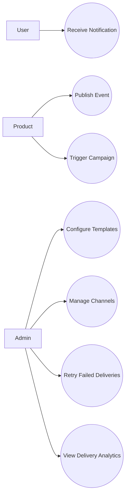

# Use Case Diagram

```mermaid
flowchart LR
  User --> UC1((Receive Notification))
  Product --> UC2((Publish Event))
  Admin --> UC3((Configure Templates))
  Admin --> UC4((Manage Channels))
  Product --> UC5((Trigger Campaign))
  Admin --> UC6((Retry Failed Deliveries))
  Admin --> UC7((View Delivery Analytics))
```
