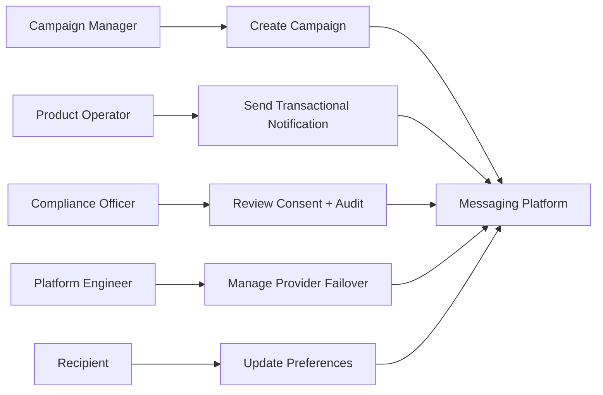

# Use Case Diagram

## Objective
Provide implementation-ready guidance for **Use Case Diagram** in the Messaging and Notification Platform.

## Scope
- Multi-tenant, multi-channel notifications (email, SMS, push, webhook).
- Transactional, operational, and campaign traffic profiles.
## Mermaid Diagram

- End-to-end controls from API ingestion to provider callbacks and compliance evidence.

## Analysis Notes
- Domain boundaries: ingestion, orchestration, dispatch, feedback, compliance.
- Primary risks: duplicate sends, delayed callbacks, consent drift, provider brownouts.
- Mitigations: idempotency, callback reconciliation, consent version checks, circuit breakers.

## Delivery, Reliability, and Compliance Baseline

### 1) Delivery semantics
- **Default guarantee:** At-least-once delivery for all async sends. Exactly-once is not assumed; business safety is achieved via idempotency.
- **Idempotency contract:** `idempotency_key = tenant_id + message_type + recipient + template_version + request_nonce`.
- **Latency tiers:**
  - `P0 Transactional` (OTP, password reset): enqueue < 1s, provider handoff p95 < 5s.
  - `P1 Operational` (alerts, statements): enqueue < 5s, handoff p95 < 30s.
  - `P2 Promotional` (campaign): enqueue < 30s, handoff p95 < 5m.
- **Status model:** `ACCEPTED -> QUEUED -> DISPATCHING -> PROVIDER_ACCEPTED -> DELIVERED|FAILED|EXPIRED`.

### 2) Queue and topic behavior
- **Topic split:** `notifications.transactional`, `notifications.operational`, `notifications.promotional`, plus channel suffixes.
- **Partition key:** `tenant_id:recipient_id:channel` to preserve recipient-level ordering without global lock contention.
- **Backpressure policy:** API returns `202 Accepted` once persisted; throttling starts at queue depth thresholds and adaptive worker concurrency.
- **Poison message isolation:** messages with schema/validation failures bypass retries and go directly to DLQ.

### 3) Retry and dead-letter handling
- **Retry policy:** capped exponential backoff with jitter (e.g., 30s, 2m, 10m, 30m, 2h max).
- **Retryable causes:** transport timeout, 429, 5xx, transient DNS/network faults.
- **Non-retryable causes:** invalid recipient, permanent provider policy reject, malformed template payload.
- **DLQ payload:** original envelope, error class/code, attempt history, provider response excerpt, trace IDs.
- **Redrive controls:** replay by batch, by tenant, by error class; replay requires approval in production.

### 4) Provider routing and failover
- **Routing mode:** weighted primary/secondary by channel and geography.
- **Health model:** active probes + rolling error-rate window + circuit breaker half-open testing.
- **Failover rule:** open circuit on sustained 5xx or timeout rates; route to standby while preserving idempotency keys.
- **Recovery:** gradual traffic ramp-back (10% -> 25% -> 50% -> 100%) with rollback guards.

### 5) Template management
- **Lifecycle:** `DRAFT -> REVIEW -> APPROVED -> PUBLISHED -> DEPRECATED -> RETIRED`.
- **Versioning:** immutable published versions; sends always pin explicit version.
- **Schema checks:** required variables, type validation, locale fallback chain, safe HTML sanitization.
- **Change control:** dual approval for regulated templates; rollback < 5 minutes.

### 6) Compliance and audit logging
- **Audit events:** consent evaluation, suppression decisions, template render inputs/outputs hash, provider requests/responses, operator actions.
- **PII policy:** log tokenized recipient identifiers; redact message body unless explicit legal-hold context.
- **Retention:** operational logs 90 days hot, 1 year warm; compliance evidence 7 years (policy configurable).
- **Forensics query keys:** `tenant_id`, `message_id`, `correlation_id`, `provider_message_id`, `recipient_token`, time range.

## Verification Checklist
- [ ] All interfaces include idempotency + correlation identifiers.
- [ ] Retryable vs non-retryable errors are explicitly classified.
- [ ] DLQ replay process is documented with approvals and guardrails.
- [ ] Provider failover policy defines trigger, action, and recovery criteria.
- [ ] Template versioning and approval workflow are enforceable in tooling.
- [ ] Compliance evidence can be queried by message_id and correlation_id.
