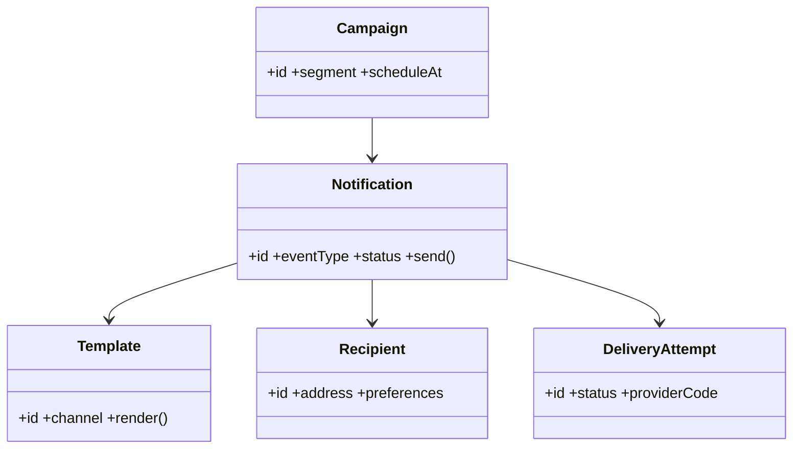

# Class Diagrams

```mermaid
classDiagram
  class Notification {+id +eventType +status +send()}
  class Template {+id +channel +render()}
  class Recipient {+id +address +preferences}
  class DeliveryAttempt {+id +status +providerCode}
  class Campaign {+id +segment +scheduleAt}
  Notification --> Template
  Notification --> Recipient
  Notification --> DeliveryAttempt
  Campaign --> Notification
```
