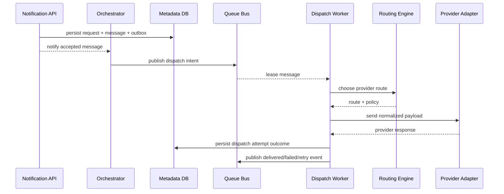
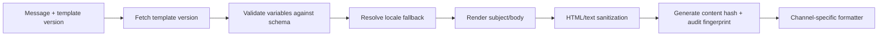

# Delivery Orchestration And Template System

## Traceability
- Analysis rules: [`../analysis/business-rules.md`](../analysis/business-rules.md)
- Event contracts: [`../analysis/event-catalog.md`](../analysis/event-catalog.md)
- High-level architecture: [`../high-level-design/architecture-diagram.md`](../high-level-design/architecture-diagram.md)
- Implementation controls: [`../implementation/implementation-guidelines.md`](../implementation/implementation-guidelines.md)

## Orchestration Flow

## Orchestrator Responsibilities

| Capability | Description |
|---|---|
| Admission handoff | move accepted messages into the correct priority lane |
| Policy reevaluation | re-check consent, suppression, quiet-hour, and quota conditions before dispatch |
| Retry scheduler | determine next attempt time, backoff, and max-attempt behavior |
| Failover controller | switch provider route on retryable provider failure without creating a new message |
| State reconciliation | merge callback, polling, and timeout signals into one canonical message lifecycle |
| Replay controls | requeue DLQ or callback-reconciliation jobs with operator approval and audit evidence |

## Template Rendering Pipeline

### Rendering rules
- Transactional messages use **strict mode**: missing required variables fail fast and block dispatch.
- Promotional messages may use **permissive mode** only for explicitly optional variables with approved defaults.
- Rendered payload hash is stored to correlate support issues without keeping full message content in hot logs.

## Provider Adapter Model

| Adapter concern | Standardized contract |
|---|---|
| authentication | secret reference + provider account context |
| send request | normalized recipient, payload, metadata, idempotency token |
| delivery response | normalized response class (`accepted`, `retryable_failure`, `permanent_failure`) |
| callback verification | provider signature, replay window, payload mapping |
| health scoring | latency, timeout, 4xx/5xx rate, carrier/provider incident markers |

## Retry, Failover, and DLQ Logic

1. Retryable provider or transport failures create a new `DispatchAttempt` and preserve the original `message_id`.
2. Failover is attempted only if another eligible route exists and policy allows cross-provider retry for that channel.
3. Permanent recipient/content failures bypass failover and go directly to DLQ with reason classification.
4. DLQ replay creates a new attempt chain but links back to the original error evidence and approval record.

## Invariants

- The outbox pattern is mandatory to keep request persistence and event publication consistent.
- Worker leasing prevents concurrent dispatch of the same message on the same attempt number.
- Callback verification uses provider signatures or polling correlation to prevent spoofed delivery updates.
- Route selection must be deterministic for a given health snapshot and policy state to support replay/debugging.

## Operational acceptance criteria

- A single message’s full attempt history is queryable by `message_id` without joining ad hoc logs.
- Renderer, adapter, and callback components expose contract tests for every supported channel/provider pair.
