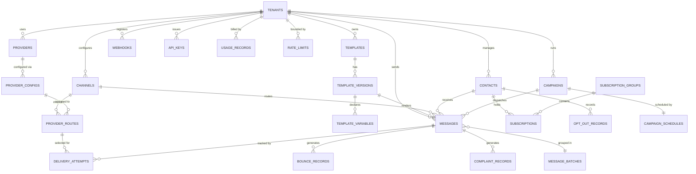
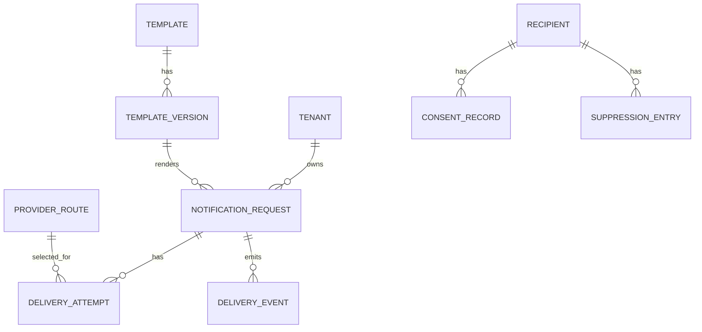

# ERD & Database Schema — Messaging and Notification Platform

**Document version:** 1.0.0
**Schema version:** v1
**Database engine:** PostgreSQL 16
**Last updated:** 2025-07-14
**Status:** Approved for Implementation

---

## Table of Contents

1. [Schema Overview](#1-schema-overview)
2. [Entity Relationship Diagram](#2-entity-relationship-diagram)
3. [DDL — Full Table Definitions](#3-ddl--full-table-definitions)
   - 3.1 tenants
   - 3.2 channels
   - 3.3 templates
   - 3.4 template_versions
   - 3.5 template_variables
   - 3.6 messages
   - 3.7 message_batches
   - 3.8 contacts
   - 3.9 subscriptions
   - 3.10 subscription_groups
   - 3.11 opt_out_records
   - 3.12 providers
   - 3.13 provider_configs
   - 3.14 provider_routes
   - 3.15 delivery_attempts
   - 3.16 bounce_records
   - 3.17 complaint_records
   - 3.18 campaigns
   - 3.19 campaign_schedules
   - 3.20 rate_limits
   - 3.21 webhooks
   - 3.22 api_keys
   - 3.23 usage_records
   - 3.24 audit_log
4. [Indexing Strategy](#4-indexing-strategy)
5. [Partitioning Strategy](#5-partitioning-strategy)
6. [Row-Level Security](#6-row-level-security)
7. [Data Retention Policies](#7-data-retention-policies)
8. [Migration Strategy](#8-migration-strategy)

---

## 1. Schema Overview

| Schema | Purpose |
|---|---|
| `notify` | Core application tables (tenants, messages, templates, contacts, etc.) |
| `notify_events` | High-volume append-only event tables (delivery_attempts, usage_records) — partitioned |
| `notify_audit` | Immutable audit trail |

All tables follow these conventions:
- Primary key: `UUID` generated with `gen_random_uuid()` (pgcrypto)
- Soft deletes: `deleted_at TIMESTAMPTZ` (NULL = not deleted)
- Tenant isolation: every table has `tenant_id UUID NOT NULL` with a foreign key to `notify.tenants`
- Timestamps: `created_at`, `updated_at` default to `NOW()` with triggers that auto-update `updated_at`
- Enum values: stored as `TEXT` with `CHECK` constraints for portability

---

## 2. Entity Relationship Diagram



---

## 3. DDL — Full Table Definitions

```sql
-- ============================================================
-- EXTENSIONS
-- ============================================================
CREATE EXTENSION IF NOT EXISTS "pgcrypto";
CREATE EXTENSION IF NOT EXISTS "pg_trgm";   -- trigram indexes for name search
CREATE EXTENSION IF NOT EXISTS "btree_gin"; -- composite GIN indexes

-- ============================================================
-- SCHEMAS
-- ============================================================
CREATE SCHEMA IF NOT EXISTS notify;
CREATE SCHEMA IF NOT EXISTS notify_events;
CREATE SCHEMA IF NOT EXISTS notify_audit;

-- ============================================================
-- HELPER: updated_at trigger
-- ============================================================
CREATE OR REPLACE FUNCTION notify.set_updated_at()
RETURNS TRIGGER LANGUAGE plpgsql AS $$
BEGIN
    NEW.updated_at = NOW();
    RETURN NEW;
END;
$$;
```

### 3.1 tenants

```sql
CREATE TABLE notify.tenants (
    id                  UUID        PRIMARY KEY DEFAULT gen_random_uuid(),
    name                TEXT        NOT NULL,
    slug                TEXT        NOT NULL UNIQUE,
    plan                TEXT        NOT NULL DEFAULT 'starter'
                            CHECK (plan IN ('starter','growth','business','enterprise')),
    status              TEXT        NOT NULL DEFAULT 'ACTIVE'
                            CHECK (status IN ('ACTIVE','SUSPENDED','DELETED')),
    settings            JSONB       NOT NULL DEFAULT '{}'::jsonb,
    billing_email       TEXT,
    created_at          TIMESTAMPTZ NOT NULL DEFAULT NOW(),
    updated_at          TIMESTAMPTZ NOT NULL DEFAULT NOW(),
    deleted_at          TIMESTAMPTZ
);

CREATE INDEX idx_tenants_slug   ON notify.tenants(slug);
CREATE INDEX idx_tenants_status ON notify.tenants(status) WHERE deleted_at IS NULL;

CREATE TRIGGER trg_tenants_updated_at
    BEFORE UPDATE ON notify.tenants
    FOR EACH ROW EXECUTE FUNCTION notify.set_updated_at();
```

### 3.2 channels

```sql
CREATE TABLE notify.channels (
    id                  UUID        PRIMARY KEY DEFAULT gen_random_uuid(),
    tenant_id           UUID        NOT NULL REFERENCES notify.tenants(id) ON DELETE CASCADE,
    name                TEXT        NOT NULL,
    type                TEXT        NOT NULL
                            CHECK (type IN ('email','sms','push','in_app','webhook','whatsapp')),
    description         TEXT,
    provider_config_id  UUID,       -- FK to provider_configs; nullable (set after config created)
    settings            JSONB       NOT NULL DEFAULT '{}'::jsonb,
    priority            SMALLINT    NOT NULL DEFAULT 1 CHECK (priority BETWEEN 1 AND 100),
    is_active           BOOLEAN     NOT NULL DEFAULT TRUE,
    created_at          TIMESTAMPTZ NOT NULL DEFAULT NOW(),
    updated_at          TIMESTAMPTZ NOT NULL DEFAULT NOW(),
    deleted_at          TIMESTAMPTZ,

    CONSTRAINT uq_channels_tenant_name UNIQUE (tenant_id, name)
);

CREATE INDEX idx_channels_tenant       ON notify.channels(tenant_id) WHERE deleted_at IS NULL;
CREATE INDEX idx_channels_tenant_type  ON notify.channels(tenant_id, type) WHERE deleted_at IS NULL;

CREATE TRIGGER trg_channels_updated_at
    BEFORE UPDATE ON notify.channels
    FOR EACH ROW EXECUTE FUNCTION notify.set_updated_at();
```

### 3.3 templates

```sql
CREATE TABLE notify.templates (
    id                  UUID        PRIMARY KEY DEFAULT gen_random_uuid(),
    tenant_id           UUID        NOT NULL REFERENCES notify.tenants(id) ON DELETE CASCADE,
    name                TEXT        NOT NULL,
    description         TEXT,
    channel             TEXT        NOT NULL
                            CHECK (channel IN ('email','sms','push','in_app','webhook','whatsapp')),
    category            TEXT        NOT NULL DEFAULT 'transactional'
                            CHECK (category IN ('transactional','operational','promotional','system')),
    locale              TEXT        NOT NULL DEFAULT 'en-US',
    status              TEXT        NOT NULL DEFAULT 'DRAFT'
                            CHECK (status IN ('DRAFT','PUBLISHED','DEPRECATED','RETIRED')),
    current_version     TEXT        NOT NULL DEFAULT '0.0.0',
    tags                TEXT[]      NOT NULL DEFAULT '{}',
    metadata            JSONB       NOT NULL DEFAULT '{}'::jsonb,
    created_by          UUID,
    created_at          TIMESTAMPTZ NOT NULL DEFAULT NOW(),
    updated_at          TIMESTAMPTZ NOT NULL DEFAULT NOW(),
    deleted_at          TIMESTAMPTZ,

    CONSTRAINT uq_templates_tenant_name_channel UNIQUE (tenant_id, name, channel)
);

CREATE INDEX idx_templates_tenant          ON notify.templates(tenant_id) WHERE deleted_at IS NULL;
CREATE INDEX idx_templates_tenant_channel  ON notify.templates(tenant_id, channel) WHERE deleted_at IS NULL;
CREATE INDEX idx_templates_tenant_status   ON notify.templates(tenant_id, status) WHERE deleted_at IS NULL;
CREATE INDEX idx_templates_tags            ON notify.templates USING GIN(tags);

CREATE TRIGGER trg_templates_updated_at
    BEFORE UPDATE ON notify.templates
    FOR EACH ROW EXECUTE FUNCTION notify.set_updated_at();
```

### 3.4 template_versions

```sql
CREATE TABLE notify.template_versions (
    id                  UUID        PRIMARY KEY DEFAULT gen_random_uuid(),
    tenant_id           UUID        NOT NULL REFERENCES notify.tenants(id) ON DELETE CASCADE,
    template_id         UUID        NOT NULL REFERENCES notify.templates(id) ON DELETE CASCADE,
    version             TEXT        NOT NULL,   -- semver e.g. "1.2.0"
    status              TEXT        NOT NULL DEFAULT 'DRAFT'
                            CHECK (status IN ('DRAFT','REVIEW','APPROVED','PUBLISHED','DEPRECATED')),
    subject             TEXT,                   -- email only
    html_body           TEXT,                   -- email only
    text_body           TEXT,                   -- email / sms
    preheader           TEXT,                   -- email only
    push_title          TEXT,                   -- push only
    push_body           TEXT,                   -- push only
    push_image_url      TEXT,                   -- push only
    data_payload        JSONB,                  -- push/in-app/webhook
    engine              TEXT        NOT NULL DEFAULT 'handlebars'
                            CHECK (engine IN ('handlebars','jinja2','mustache','liquid')),
    release_notes       TEXT,
    published_at        TIMESTAMPTZ,
    published_by        UUID,
    created_by          UUID,
    created_at          TIMESTAMPTZ NOT NULL DEFAULT NOW(),
    updated_at          TIMESTAMPTZ NOT NULL DEFAULT NOW(),

    CONSTRAINT uq_template_versions_template_ver UNIQUE (template_id, version)
);

CREATE INDEX idx_tpl_versions_template   ON notify.template_versions(template_id);
CREATE INDEX idx_tpl_versions_tenant     ON notify.template_versions(tenant_id);
CREATE INDEX idx_tpl_versions_status     ON notify.template_versions(template_id, status);

CREATE TRIGGER trg_template_versions_updated_at
    BEFORE UPDATE ON notify.template_versions
    FOR EACH ROW EXECUTE FUNCTION notify.set_updated_at();
```

### 3.5 template_variables

```sql
CREATE TABLE notify.template_variables (
    id                  UUID        PRIMARY KEY DEFAULT gen_random_uuid(),
    tenant_id           UUID        NOT NULL REFERENCES notify.tenants(id) ON DELETE CASCADE,
    template_version_id UUID        NOT NULL REFERENCES notify.template_versions(id) ON DELETE CASCADE,
    name                TEXT        NOT NULL,   -- dot-notation: "order.total"
    var_type            TEXT        NOT NULL DEFAULT 'string'
                            CHECK (var_type IN ('string','number','boolean','date','array','object')),
    is_required         BOOLEAN     NOT NULL DEFAULT TRUE,
    default_value       TEXT,
    description         TEXT,
    validation_rules    JSONB       NOT NULL DEFAULT '{}'::jsonb,
    created_at          TIMESTAMPTZ NOT NULL DEFAULT NOW(),

    CONSTRAINT uq_template_vars_version_name UNIQUE (template_version_id, name)
);

CREATE INDEX idx_tpl_vars_version ON notify.template_variables(template_version_id);
```

### 3.6 messages

```sql
CREATE TABLE notify.messages (
    id                  UUID        PRIMARY KEY DEFAULT gen_random_uuid(),
    tenant_id           UUID        NOT NULL REFERENCES notify.tenants(id) ON DELETE CASCADE,
    batch_id            UUID,                   -- FK to message_batches (nullable for singles)
    campaign_id         UUID,                   -- FK to campaigns (nullable for direct sends)
    channel_id          UUID        NOT NULL REFERENCES notify.channels(id),
    template_id         UUID        NOT NULL REFERENCES notify.templates(id),
    template_version_id UUID        NOT NULL REFERENCES notify.template_versions(id),
    contact_id          UUID        REFERENCES notify.contacts(id),
    idempotency_key     TEXT        NOT NULL,
    priority            TEXT        NOT NULL DEFAULT 'normal'
                            CHECK (priority IN ('critical','high','normal','low')),
    status              TEXT        NOT NULL DEFAULT 'ACCEPTED'
                            CHECK (status IN (
                                'ACCEPTED','QUEUED','DISPATCHING',
                                'PROVIDER_ACCEPTED','DELIVERED',
                                'FAILED','EXPIRED','CANCELLED'
                            )),
    channel_type        TEXT        NOT NULL
                            CHECK (channel_type IN ('email','sms','push','in_app','webhook','whatsapp')),
    recipient           JSONB       NOT NULL,   -- { email, phone, push_token, contact_id }
    variables           JSONB       NOT NULL DEFAULT '{}'::jsonb,
    rendered_subject    TEXT,
    rendered_body_ref   TEXT,                   -- S3/blob key to rendered body (PII isolation)
    provider_id         UUID,
    provider_message_id TEXT,
    metadata            JSONB       NOT NULL DEFAULT '{}'::jsonb,
    error_code          TEXT,
    error_message       TEXT,
    attempt_count       SMALLINT    NOT NULL DEFAULT 0,
    max_attempts        SMALLINT    NOT NULL DEFAULT 3,
    open_count          INTEGER     NOT NULL DEFAULT 0,
    click_count         INTEGER     NOT NULL DEFAULT 0,
    queued_at           TIMESTAMPTZ,
    dispatched_at       TIMESTAMPTZ,
    delivered_at        TIMESTAMPTZ,
    failed_at           TIMESTAMPTZ,
    expires_at          TIMESTAMPTZ,
    scheduled_at        TIMESTAMPTZ,
    created_at          TIMESTAMPTZ NOT NULL DEFAULT NOW(),
    updated_at          TIMESTAMPTZ NOT NULL DEFAULT NOW(),
    deleted_at          TIMESTAMPTZ,

    CONSTRAINT uq_messages_tenant_idempotency UNIQUE (tenant_id, idempotency_key)
);

CREATE INDEX idx_messages_tenant             ON notify.messages(tenant_id);
CREATE INDEX idx_messages_tenant_status      ON notify.messages(tenant_id, status);
CREATE INDEX idx_messages_tenant_channel     ON notify.messages(tenant_id, channel_type);
CREATE INDEX idx_messages_contact            ON notify.messages(contact_id) WHERE contact_id IS NOT NULL;
CREATE INDEX idx_messages_batch              ON notify.messages(batch_id) WHERE batch_id IS NOT NULL;
CREATE INDEX idx_messages_campaign           ON notify.messages(campaign_id) WHERE campaign_id IS NOT NULL;
CREATE INDEX idx_messages_created_at         ON notify.messages(tenant_id, created_at DESC);
CREATE INDEX idx_messages_idempotency        ON notify.messages(tenant_id, idempotency_key);

CREATE TRIGGER trg_messages_updated_at
    BEFORE UPDATE ON notify.messages
    FOR EACH ROW EXECUTE FUNCTION notify.set_updated_at();
```

### 3.7 message_batches

```sql
CREATE TABLE notify.message_batches (
    id                  UUID        PRIMARY KEY DEFAULT gen_random_uuid(),
    tenant_id           UUID        NOT NULL REFERENCES notify.tenants(id) ON DELETE CASCADE,
    campaign_id         UUID,
    label               TEXT,
    status              TEXT        NOT NULL DEFAULT 'PROCESSING'
                            CHECK (status IN ('PROCESSING','COMPLETED','PARTIALLY_FAILED','FAILED')),
    submitted_count     INTEGER     NOT NULL DEFAULT 0,
    accepted_count      INTEGER     NOT NULL DEFAULT 0,
    rejected_count      INTEGER     NOT NULL DEFAULT 0,
    metadata            JSONB       NOT NULL DEFAULT '{}'::jsonb,
    created_at          TIMESTAMPTZ NOT NULL DEFAULT NOW(),
    updated_at          TIMESTAMPTZ NOT NULL DEFAULT NOW()
);

CREATE INDEX idx_batches_tenant   ON notify.message_batches(tenant_id);
CREATE INDEX idx_batches_campaign ON notify.message_batches(campaign_id) WHERE campaign_id IS NOT NULL;

CREATE TRIGGER trg_batches_updated_at
    BEFORE UPDATE ON notify.message_batches
    FOR EACH ROW EXECUTE FUNCTION notify.set_updated_at();
```

### 3.8 contacts

```sql
CREATE TABLE notify.contacts (
    id                  UUID        PRIMARY KEY DEFAULT gen_random_uuid(),
    tenant_id           UUID        NOT NULL REFERENCES notify.tenants(id) ON DELETE CASCADE,
    external_id         TEXT,
    email               TEXT,
    phone               TEXT,
    name                TEXT,
    locale              TEXT        NOT NULL DEFAULT 'en-US',
    timezone            TEXT        NOT NULL DEFAULT 'UTC',
    status              TEXT        NOT NULL DEFAULT 'ACTIVE'
                            CHECK (status IN ('ACTIVE','BOUNCED','COMPLAINED','DELETED')),
    attributes          JSONB       NOT NULL DEFAULT '{}'::jsonb,
    channel_addresses   JSONB       NOT NULL DEFAULT '{}'::jsonb,
    bounce_count        SMALLINT    NOT NULL DEFAULT 0,
    complaint_count     SMALLINT    NOT NULL DEFAULT 0,
    last_messaged_at    TIMESTAMPTZ,
    created_at          TIMESTAMPTZ NOT NULL DEFAULT NOW(),
    updated_at          TIMESTAMPTZ NOT NULL DEFAULT NOW(),
    deleted_at          TIMESTAMPTZ,

    CONSTRAINT uq_contacts_tenant_external UNIQUE (tenant_id, external_id),
    CONSTRAINT uq_contacts_tenant_email    UNIQUE (tenant_id, email)
);

CREATE INDEX idx_contacts_tenant         ON notify.contacts(tenant_id) WHERE deleted_at IS NULL;
CREATE INDEX idx_contacts_email          ON notify.contacts(tenant_id, email) WHERE deleted_at IS NULL;
CREATE INDEX idx_contacts_phone          ON notify.contacts(tenant_id, phone) WHERE deleted_at IS NULL;
CREATE INDEX idx_contacts_external_id    ON notify.contacts(tenant_id, external_id) WHERE external_id IS NOT NULL;
CREATE INDEX idx_contacts_attributes     ON notify.contacts USING GIN(attributes);

CREATE TRIGGER trg_contacts_updated_at
    BEFORE UPDATE ON notify.contacts
    FOR EACH ROW EXECUTE FUNCTION notify.set_updated_at();
```

### 3.9 subscriptions

```sql
CREATE TABLE notify.subscriptions (
    id                      UUID        PRIMARY KEY DEFAULT gen_random_uuid(),
    tenant_id               UUID        NOT NULL REFERENCES notify.tenants(id) ON DELETE CASCADE,
    contact_id              UUID        NOT NULL REFERENCES notify.contacts(id) ON DELETE CASCADE,
    subscription_group_id   UUID        NOT NULL REFERENCES notify.subscription_groups(id),
    channel                 TEXT        NOT NULL
                                CHECK (channel IN ('email','sms','push','in_app','webhook','whatsapp')),
    status                  TEXT        NOT NULL DEFAULT 'SUBSCRIBED'
                                CHECK (status IN ('SUBSCRIBED','PENDING_CONFIRMATION','UNSUBSCRIBED')),
    double_opt_in           BOOLEAN     NOT NULL DEFAULT FALSE,
    confirmed_at            TIMESTAMPTZ,
    opt_in_source           TEXT,
    opt_in_ip               INET,
    opt_in_user_agent       TEXT,
    unsubscribed_at         TIMESTAMPTZ,
    unsubscribe_source      TEXT,
    created_at              TIMESTAMPTZ NOT NULL DEFAULT NOW(),
    updated_at              TIMESTAMPTZ NOT NULL DEFAULT NOW(),

    CONSTRAINT uq_subscriptions_contact_group_channel UNIQUE (contact_id, subscription_group_id, channel)
);

CREATE INDEX idx_subscriptions_tenant        ON notify.subscriptions(tenant_id);
CREATE INDEX idx_subscriptions_contact       ON notify.subscriptions(contact_id);
CREATE INDEX idx_subscriptions_group         ON notify.subscriptions(subscription_group_id);
CREATE INDEX idx_subscriptions_status        ON notify.subscriptions(tenant_id, status);

CREATE TRIGGER trg_subscriptions_updated_at
    BEFORE UPDATE ON notify.subscriptions
    FOR EACH ROW EXECUTE FUNCTION notify.set_updated_at();
```

### 3.10 subscription_groups

```sql
CREATE TABLE notify.subscription_groups (
    id                  UUID        PRIMARY KEY DEFAULT gen_random_uuid(),
    tenant_id           UUID        NOT NULL REFERENCES notify.tenants(id) ON DELETE CASCADE,
    name                TEXT        NOT NULL,
    description         TEXT,
    channel             TEXT        NOT NULL
                            CHECK (channel IN ('email','sms','push','in_app','webhook','whatsapp')),
    category            TEXT        NOT NULL DEFAULT 'marketing'
                            CHECK (category IN ('transactional','operational','marketing','system')),
    is_default          BOOLEAN     NOT NULL DEFAULT FALSE,
    is_active           BOOLEAN     NOT NULL DEFAULT TRUE,
    created_at          TIMESTAMPTZ NOT NULL DEFAULT NOW(),
    updated_at          TIMESTAMPTZ NOT NULL DEFAULT NOW(),
    deleted_at          TIMESTAMPTZ,

    CONSTRAINT uq_sub_groups_tenant_name_channel UNIQUE (tenant_id, name, channel)
);

CREATE INDEX idx_sub_groups_tenant ON notify.subscription_groups(tenant_id) WHERE deleted_at IS NULL;

CREATE TRIGGER trg_sub_groups_updated_at
    BEFORE UPDATE ON notify.subscription_groups
    FOR EACH ROW EXECUTE FUNCTION notify.set_updated_at();
```

### 3.11 opt_out_records

```sql
CREATE TABLE notify.opt_out_records (
    id                  UUID        PRIMARY KEY DEFAULT gen_random_uuid(),
    tenant_id           UUID        NOT NULL REFERENCES notify.tenants(id) ON DELETE CASCADE,
    contact_id          UUID        NOT NULL REFERENCES notify.contacts(id) ON DELETE CASCADE,
    channel             TEXT        NOT NULL
                            CHECK (channel IN ('email','sms','push','in_app','webhook','whatsapp','all')),
    scope               TEXT        NOT NULL DEFAULT 'ALL',   -- 'ALL', 'MARKETING', 'GROUP:{id}'
    source              TEXT        NOT NULL
                            CHECK (source IN (
                                'UNSUBSCRIBE_LINK','USER_REQUEST','ADMIN_ACTION',
                                'BOUNCE_AUTO','COMPLAINT_AUTO','IMPORT','API'
                            )),
    reason              TEXT,
    triggering_message_id UUID,
    ip_address          INET,
    user_agent          TEXT,
    is_global           BOOLEAN     NOT NULL DEFAULT FALSE,
    opted_out_at        TIMESTAMPTZ NOT NULL DEFAULT NOW(),
    opted_in_at         TIMESTAMPTZ,            -- set when re-opt-in occurs
    created_at          TIMESTAMPTZ NOT NULL DEFAULT NOW(),
    updated_at          TIMESTAMPTZ NOT NULL DEFAULT NOW()
);

CREATE INDEX idx_opt_outs_tenant         ON notify.opt_out_records(tenant_id);
CREATE INDEX idx_opt_outs_contact        ON notify.opt_out_records(contact_id);
CREATE INDEX idx_opt_outs_contact_channel ON notify.opt_out_records(contact_id, channel)
    WHERE opted_in_at IS NULL;

CREATE TRIGGER trg_opt_outs_updated_at
    BEFORE UPDATE ON notify.opt_out_records
    FOR EACH ROW EXECUTE FUNCTION notify.set_updated_at();
```

### 3.12 providers

```sql
CREATE TABLE notify.providers (
    id                  UUID        PRIMARY KEY DEFAULT gen_random_uuid(),
    name                TEXT        NOT NULL UNIQUE,   -- catalog: 'sendgrid','twilio','fcm','apns'
    display_name        TEXT        NOT NULL,
    channel_types       TEXT[]      NOT NULL,
    description         TEXT,
    logo_url            TEXT,
    documentation_url   TEXT,
    is_active           BOOLEAN     NOT NULL DEFAULT TRUE,
    config_schema       JSONB       NOT NULL DEFAULT '{}'::jsonb,
    created_at          TIMESTAMPTZ NOT NULL DEFAULT NOW(),
    updated_at          TIMESTAMPTZ NOT NULL DEFAULT NOW()
);

-- Seed data (run after DDL)
INSERT INTO notify.providers (name, display_name, channel_types) VALUES
    ('sendgrid',   'SendGrid',           ARRAY['email']),
    ('ses',        'Amazon SES',         ARRAY['email']),
    ('mailgun',    'Mailgun',            ARRAY['email']),
    ('twilio',     'Twilio',             ARRAY['sms','whatsapp']),
    ('vonage',     'Vonage',             ARRAY['sms','whatsapp']),
    ('fcm',        'Firebase Cloud Messaging', ARRAY['push']),
    ('apns',       'Apple Push Notification Service', ARRAY['push']),
    ('generic_webhook', 'Generic Webhook', ARRAY['webhook']);
```

### 3.13 provider_configs

```sql
CREATE TABLE notify.provider_configs (
    id                  UUID        PRIMARY KEY DEFAULT gen_random_uuid(),
    tenant_id           UUID        NOT NULL REFERENCES notify.tenants(id) ON DELETE CASCADE,
    provider_id         UUID        NOT NULL REFERENCES notify.providers(id),
    name                TEXT        NOT NULL,
    description         TEXT,
    credentials_ref     TEXT        NOT NULL,   -- vault path / KMS-encrypted secret reference
    settings            JSONB       NOT NULL DEFAULT '{}'::jsonb,
    rate_limits         JSONB       NOT NULL DEFAULT '{}'::jsonb,
    is_active           BOOLEAN     NOT NULL DEFAULT TRUE,
    last_tested_at      TIMESTAMPTZ,
    last_test_status    TEXT        CHECK (last_test_status IN ('SUCCESS','FAILURE')),
    created_at          TIMESTAMPTZ NOT NULL DEFAULT NOW(),
    updated_at          TIMESTAMPTZ NOT NULL DEFAULT NOW(),
    deleted_at          TIMESTAMPTZ,

    CONSTRAINT uq_provider_configs_tenant_name UNIQUE (tenant_id, name)
);

CREATE INDEX idx_provider_configs_tenant    ON notify.provider_configs(tenant_id) WHERE deleted_at IS NULL;
CREATE INDEX idx_provider_configs_provider  ON notify.provider_configs(provider_id);

CREATE TRIGGER trg_provider_configs_updated_at
    BEFORE UPDATE ON notify.provider_configs
    FOR EACH ROW EXECUTE FUNCTION notify.set_updated_at();
```

### 3.14 provider_routes

```sql
CREATE TABLE notify.provider_routes (
    id                  UUID        PRIMARY KEY DEFAULT gen_random_uuid(),
    tenant_id           UUID        NOT NULL REFERENCES notify.tenants(id) ON DELETE CASCADE,
    channel_id          UUID        NOT NULL REFERENCES notify.channels(id),
    provider_config_id  UUID        NOT NULL REFERENCES notify.provider_configs(id),
    priority            SMALLINT    NOT NULL DEFAULT 1 CHECK (priority BETWEEN 1 AND 10),
    weight              SMALLINT    NOT NULL DEFAULT 100 CHECK (weight BETWEEN 1 AND 100),
    conditions          JSONB       NOT NULL DEFAULT '{}'::jsonb,   -- geo, message type filters
    circuit_status      TEXT        NOT NULL DEFAULT 'CLOSED'
                            CHECK (circuit_status IN ('CLOSED','HALF_OPEN','OPEN')),
    circuit_opened_at   TIMESTAMPTZ,
    circuit_test_at     TIMESTAMPTZ,
    is_active           BOOLEAN     NOT NULL DEFAULT TRUE,
    created_at          TIMESTAMPTZ NOT NULL DEFAULT NOW(),
    updated_at          TIMESTAMPTZ NOT NULL DEFAULT NOW()
);

CREATE INDEX idx_routes_channel    ON notify.provider_routes(channel_id, priority) WHERE is_active = TRUE;
CREATE INDEX idx_routes_tenant     ON notify.provider_routes(tenant_id);

CREATE TRIGGER trg_routes_updated_at
    BEFORE UPDATE ON notify.provider_routes
    FOR EACH ROW EXECUTE FUNCTION notify.set_updated_at();
```

### 3.15 delivery_attempts

Partitioned by month for high-volume write throughput.

```sql
CREATE TABLE notify_events.delivery_attempts (
    id                  UUID        NOT NULL DEFAULT gen_random_uuid(),
    tenant_id           UUID        NOT NULL,
    message_id          UUID        NOT NULL,
    provider_route_id   UUID,
    provider_config_id  UUID,
    attempt_number      SMALLINT    NOT NULL DEFAULT 1,
    status              TEXT        NOT NULL
                            CHECK (status IN (
                                'DISPATCHING','PROVIDER_ACCEPTED','DELIVERED',
                                'FAILED','TIMEOUT','BOUNCED','COMPLAINED'
                            )),
    provider_request    JSONB,      -- sanitized outbound payload (PII tokenised)
    provider_response   JSONB,      -- raw provider response (truncated at 4 KB)
    provider_message_id TEXT,
    error_code          TEXT,
    error_message       TEXT,
    is_retryable        BOOLEAN     NOT NULL DEFAULT TRUE,
    latency_ms          INTEGER,
    attempted_at        TIMESTAMPTZ NOT NULL DEFAULT NOW(),
    resolved_at         TIMESTAMPTZ,
    created_at          TIMESTAMPTZ NOT NULL DEFAULT NOW(),

    PRIMARY KEY (id, created_at)
) PARTITION BY RANGE (created_at);

-- Monthly partitions (create via cron job or migration)
CREATE TABLE notify_events.delivery_attempts_2025_07
    PARTITION OF notify_events.delivery_attempts
    FOR VALUES FROM ('2025-07-01') TO ('2025-08-01');

CREATE TABLE notify_events.delivery_attempts_2025_08
    PARTITION OF notify_events.delivery_attempts
    FOR VALUES FROM ('2025-08-01') TO ('2025-09-01');

-- Indexes created on each partition automatically:
CREATE INDEX idx_da_message_tenant ON notify_events.delivery_attempts(message_id, tenant_id);
CREATE INDEX idx_da_attempted_at   ON notify_events.delivery_attempts(attempted_at DESC);
CREATE INDEX idx_da_provider_msg   ON notify_events.delivery_attempts(provider_message_id)
    WHERE provider_message_id IS NOT NULL;
```

### 3.16 bounce_records

```sql
CREATE TABLE notify.bounce_records (
    id                  UUID        PRIMARY KEY DEFAULT gen_random_uuid(),
    tenant_id           UUID        NOT NULL REFERENCES notify.tenants(id) ON DELETE CASCADE,
    message_id          UUID        NOT NULL REFERENCES notify.messages(id),
    contact_id          UUID        REFERENCES notify.contacts(id),
    email               TEXT        NOT NULL,
    bounce_type         TEXT        NOT NULL
                            CHECK (bounce_type IN ('HARD','SOFT','BLOCK','TRANSIENT')),
    bounce_subtype      TEXT,
    smtp_code           TEXT,
    smtp_message        TEXT,
    provider            TEXT        NOT NULL,
    provider_event_id   TEXT,
    raw_payload         JSONB,
    bounced_at          TIMESTAMPTZ NOT NULL DEFAULT NOW(),
    created_at          TIMESTAMPTZ NOT NULL DEFAULT NOW()
);

CREATE INDEX idx_bounces_tenant    ON notify.bounce_records(tenant_id);
CREATE INDEX idx_bounces_message   ON notify.bounce_records(message_id);
CREATE INDEX idx_bounces_contact   ON notify.bounce_records(contact_id) WHERE contact_id IS NOT NULL;
CREATE INDEX idx_bounces_email     ON notify.bounce_records(tenant_id, email);
```

### 3.17 complaint_records

```sql
CREATE TABLE notify.complaint_records (
    id                  UUID        PRIMARY KEY DEFAULT gen_random_uuid(),
    tenant_id           UUID        NOT NULL REFERENCES notify.tenants(id) ON DELETE CASCADE,
    message_id          UUID        NOT NULL REFERENCES notify.messages(id),
    contact_id          UUID        REFERENCES notify.contacts(id),
    email               TEXT        NOT NULL,
    complaint_type      TEXT        NOT NULL DEFAULT 'SPAM'
                            CHECK (complaint_type IN ('SPAM','ABUSE','FRAUD','OTHER')),
    feedback_type       TEXT,       -- ARF feedback-type header
    provider            TEXT        NOT NULL,
    provider_event_id   TEXT,
    raw_payload         JSONB,
    complained_at       TIMESTAMPTZ NOT NULL DEFAULT NOW(),
    created_at          TIMESTAMPTZ NOT NULL DEFAULT NOW()
);

CREATE INDEX idx_complaints_tenant   ON notify.complaint_records(tenant_id);
CREATE INDEX idx_complaints_message  ON notify.complaint_records(message_id);
CREATE INDEX idx_complaints_contact  ON notify.complaint_records(contact_id) WHERE contact_id IS NOT NULL;
CREATE INDEX idx_complaints_email    ON notify.complaint_records(tenant_id, email);
```

### 3.18 campaigns

```sql
CREATE TABLE notify.campaigns (
    id                  UUID        PRIMARY KEY DEFAULT gen_random_uuid(),
    tenant_id           UUID        NOT NULL REFERENCES notify.tenants(id) ON DELETE CASCADE,
    name                TEXT        NOT NULL,
    description         TEXT,
    channel             TEXT        NOT NULL
                            CHECK (channel IN ('email','sms','push','in_app','webhook','whatsapp')),
    status              TEXT        NOT NULL DEFAULT 'DRAFT'
                            CHECK (status IN ('DRAFT','SCHEDULED','SENDING','PAUSED','COMPLETED','CANCELLED')),
    template_id         UUID        NOT NULL REFERENCES notify.templates(id),
    template_version_id UUID        NOT NULL REFERENCES notify.template_versions(id),
    audience            JSONB       NOT NULL DEFAULT '{}'::jsonb,
    variables           JSONB       NOT NULL DEFAULT '{}'::jsonb,
    estimated_recipients INTEGER    DEFAULT 0,
    actual_recipients   INTEGER     DEFAULT 0,
    tags                TEXT[]      NOT NULL DEFAULT '{}',
    metadata            JSONB       NOT NULL DEFAULT '{}'::jsonb,
    started_at          TIMESTAMPTZ,
    completed_at        TIMESTAMPTZ,
    created_by          UUID,
    created_at          TIMESTAMPTZ NOT NULL DEFAULT NOW(),
    updated_at          TIMESTAMPTZ NOT NULL DEFAULT NOW(),
    deleted_at          TIMESTAMPTZ
);

CREATE INDEX idx_campaigns_tenant        ON notify.campaigns(tenant_id) WHERE deleted_at IS NULL;
CREATE INDEX idx_campaigns_tenant_status ON notify.campaigns(tenant_id, status) WHERE deleted_at IS NULL;

CREATE TRIGGER trg_campaigns_updated_at
    BEFORE UPDATE ON notify.campaigns
    FOR EACH ROW EXECUTE FUNCTION notify.set_updated_at();
```

### 3.19 campaign_schedules

```sql
CREATE TABLE notify.campaign_schedules (
    id                  UUID        PRIMARY KEY DEFAULT gen_random_uuid(),
    tenant_id           UUID        NOT NULL REFERENCES notify.tenants(id) ON DELETE CASCADE,
    campaign_id         UUID        NOT NULL REFERENCES notify.campaigns(id) ON DELETE CASCADE,
    send_at             TIMESTAMPTZ NOT NULL,
    timezone            TEXT        NOT NULL DEFAULT 'UTC',
    send_rate           JSONB       NOT NULL DEFAULT '{"messages_per_hour": 1000}'::jsonb,
    status              TEXT        NOT NULL DEFAULT 'PENDING'
                            CHECK (status IN ('PENDING','RUNNING','PAUSED','COMPLETED','CANCELLED')),
    scheduled_by        UUID,
    scheduled_at        TIMESTAMPTZ NOT NULL DEFAULT NOW(),
    started_at          TIMESTAMPTZ,
    completed_at        TIMESTAMPTZ,
    created_at          TIMESTAMPTZ NOT NULL DEFAULT NOW(),
    updated_at          TIMESTAMPTZ NOT NULL DEFAULT NOW(),

    CONSTRAINT uq_campaign_schedules_campaign UNIQUE (campaign_id)
);

CREATE INDEX idx_campaign_schedules_tenant   ON notify.campaign_schedules(tenant_id);
CREATE INDEX idx_campaign_schedules_send_at  ON notify.campaign_schedules(send_at)
    WHERE status = 'PENDING';

CREATE TRIGGER trg_campaign_schedules_updated_at
    BEFORE UPDATE ON notify.campaign_schedules
    FOR EACH ROW EXECUTE FUNCTION notify.set_updated_at();
```

### 3.20 rate_limits

```sql
CREATE TABLE notify.rate_limits (
    id                  UUID        PRIMARY KEY DEFAULT gen_random_uuid(),
    tenant_id           UUID        NOT NULL REFERENCES notify.tenants(id) ON DELETE CASCADE,
    scope               TEXT        NOT NULL,   -- 'api_key:{id}', 'channel:{type}', 'tenant'
    limit_type          TEXT        NOT NULL
                            CHECK (limit_type IN ('messages_per_second','messages_per_minute','messages_per_hour','messages_per_day')),
    limit_value         INTEGER     NOT NULL CHECK (limit_value > 0),
    burst_value         INTEGER,
    is_active           BOOLEAN     NOT NULL DEFAULT TRUE,
    created_at          TIMESTAMPTZ NOT NULL DEFAULT NOW(),
    updated_at          TIMESTAMPTZ NOT NULL DEFAULT NOW(),

    CONSTRAINT uq_rate_limits_tenant_scope_type UNIQUE (tenant_id, scope, limit_type)
);

CREATE INDEX idx_rate_limits_tenant ON notify.rate_limits(tenant_id);

CREATE TRIGGER trg_rate_limits_updated_at
    BEFORE UPDATE ON notify.rate_limits
    FOR EACH ROW EXECUTE FUNCTION notify.set_updated_at();
```

### 3.21 webhooks

```sql
CREATE TABLE notify.webhooks (
    id                  UUID        PRIMARY KEY DEFAULT gen_random_uuid(),
    tenant_id           UUID        NOT NULL REFERENCES notify.tenants(id) ON DELETE CASCADE,
    name                TEXT        NOT NULL,
    url                 TEXT        NOT NULL,
    events              TEXT[]      NOT NULL,
    secret_ref          TEXT        NOT NULL,   -- vault path to HMAC secret
    headers             JSONB       NOT NULL DEFAULT '{}'::jsonb,
    retry_policy        JSONB       NOT NULL DEFAULT '{"max_attempts":5,"backoff":"exponential"}'::jsonb,
    is_active           BOOLEAN     NOT NULL DEFAULT TRUE,
    last_triggered_at   TIMESTAMPTZ,
    last_status         TEXT        CHECK (last_status IN ('SUCCESS','FAILURE')),
    failure_count       INTEGER     NOT NULL DEFAULT 0,
    metadata            JSONB       NOT NULL DEFAULT '{}'::jsonb,
    created_at          TIMESTAMPTZ NOT NULL DEFAULT NOW(),
    updated_at          TIMESTAMPTZ NOT NULL DEFAULT NOW(),
    deleted_at          TIMESTAMPTZ
);

CREATE INDEX idx_webhooks_tenant  ON notify.webhooks(tenant_id) WHERE deleted_at IS NULL;
CREATE INDEX idx_webhooks_events  ON notify.webhooks USING GIN(events);

CREATE TRIGGER trg_webhooks_updated_at
    BEFORE UPDATE ON notify.webhooks
    FOR EACH ROW EXECUTE FUNCTION notify.set_updated_at();
```

### 3.22 api_keys

```sql
CREATE TABLE notify.api_keys (
    id                  UUID        PRIMARY KEY DEFAULT gen_random_uuid(),
    tenant_id           UUID        NOT NULL REFERENCES notify.tenants(id) ON DELETE CASCADE,
    name                TEXT        NOT NULL,
    description         TEXT,
    key_hash            TEXT        NOT NULL UNIQUE,    -- bcrypt hash of the raw key
    key_prefix          TEXT        NOT NULL,           -- first 12 chars for display
    environment         TEXT        NOT NULL DEFAULT 'live'
                            CHECK (environment IN ('live','test')),
    scopes              TEXT[]      NOT NULL DEFAULT '{}',
    allowed_ips         INET[]      DEFAULT NULL,
    expires_at          TIMESTAMPTZ,
    last_used_at        TIMESTAMPTZ,
    is_active           BOOLEAN     NOT NULL DEFAULT TRUE,
    revoked_at          TIMESTAMPTZ,
    revoked_by          UUID,
    created_by          UUID,
    created_at          TIMESTAMPTZ NOT NULL DEFAULT NOW(),
    updated_at          TIMESTAMPTZ NOT NULL DEFAULT NOW()
);

CREATE INDEX idx_api_keys_tenant     ON notify.api_keys(tenant_id) WHERE is_active = TRUE;
CREATE INDEX idx_api_keys_key_hash   ON notify.api_keys(key_hash);

CREATE TRIGGER trg_api_keys_updated_at
    BEFORE UPDATE ON notify.api_keys
    FOR EACH ROW EXECUTE FUNCTION notify.set_updated_at();
```

### 3.23 usage_records

Partitioned by billing period for efficient aggregation and archival.

```sql
CREATE TABLE notify_events.usage_records (
    id                  UUID        NOT NULL DEFAULT gen_random_uuid(),
    tenant_id           UUID        NOT NULL,
    period_start        DATE        NOT NULL,   -- partition key
    channel             TEXT        NOT NULL,
    message_count       BIGINT      NOT NULL DEFAULT 0,
    delivered_count     BIGINT      NOT NULL DEFAULT 0,
    failed_count        BIGINT      NOT NULL DEFAULT 0,
    billable_units      BIGINT      NOT NULL DEFAULT 0,
    cost_usd            NUMERIC(12,6) NOT NULL DEFAULT 0,
    recorded_at         TIMESTAMPTZ NOT NULL DEFAULT NOW(),

    PRIMARY KEY (id, period_start)
) PARTITION BY RANGE (period_start);

CREATE TABLE notify_events.usage_records_2025_07
    PARTITION OF notify_events.usage_records
    FOR VALUES FROM ('2025-07-01') TO ('2025-08-01');

CREATE TABLE notify_events.usage_records_2025_08
    PARTITION OF notify_events.usage_records
    FOR VALUES FROM ('2025-08-01') TO ('2025-09-01');

CREATE INDEX idx_usage_tenant_period ON notify_events.usage_records(tenant_id, period_start);
```

### 3.24 audit_log

```sql
CREATE TABLE notify_audit.audit_log (
    id                  UUID        NOT NULL DEFAULT gen_random_uuid(),
    tenant_id           UUID        NOT NULL,
    actor_id            UUID,
    actor_type          TEXT        NOT NULL
                            CHECK (actor_type IN ('USER','API_KEY','SYSTEM','WORKER')),
    action              TEXT        NOT NULL,   -- e.g. 'template.published', 'message.dispatched'
    resource_type       TEXT        NOT NULL,
    resource_id         UUID,
    ip_address          INET,
    user_agent          TEXT,
    request_id          TEXT,
    correlation_id      TEXT,
    before_state        JSONB,      -- redacted snapshot
    after_state         JSONB,      -- redacted snapshot
    metadata            JSONB       NOT NULL DEFAULT '{}'::jsonb,
    occurred_at         TIMESTAMPTZ NOT NULL DEFAULT NOW(),

    PRIMARY KEY (id, occurred_at)
) PARTITION BY RANGE (occurred_at);

CREATE TABLE notify_audit.audit_log_2025_07
    PARTITION OF notify_audit.audit_log
    FOR VALUES FROM ('2025-07-01') TO ('2025-08-01');

CREATE INDEX idx_audit_tenant         ON notify_audit.audit_log(tenant_id, occurred_at DESC);
CREATE INDEX idx_audit_resource       ON notify_audit.audit_log(resource_type, resource_id);
CREATE INDEX idx_audit_actor          ON notify_audit.audit_log(actor_id) WHERE actor_id IS NOT NULL;
CREATE INDEX idx_audit_correlation_id ON notify_audit.audit_log(correlation_id)
    WHERE correlation_id IS NOT NULL;
```

---

## 4. Indexing Strategy

| Index Type | When to Use | Examples |
|---|---|---|
| **B-Tree** | Equality and range queries on low-cardinality columns | `tenant_id`, `status`, `channel`, `created_at` |
| **B-Tree Composite** | Multi-column filters with consistent WHERE clause order | `(tenant_id, status)`, `(tenant_id, created_at DESC)` |
| **GIN (array)** | Containment queries on `TEXT[]` columns | `tags`, `events`, `scopes` |
| **GIN (JSONB)** | Key-existence and containment on JSONB | `attributes`, `metadata` |
| **Partial Index** | Filter out deleted / inactive rows from all scans | `WHERE deleted_at IS NULL`, `WHERE is_active = TRUE` |
| **Trigram (pg_trgm)** | `ILIKE` / full-text search on `name` columns | `contacts.name`, `templates.name` |

**Index Maintenance:**
- `REINDEX CONCURRENTLY` scheduled monthly for high-write tables (`messages`, `delivery_attempts`)
- `VACUUM ANALYZE` on `messages`, `delivery_attempts` every 6 hours via `pg_cron`
- `autovacuum_vacuum_scale_factor = 0.01` for `messages` and `delivery_attempts` (override default 0.2)

---

## 5. Partitioning Strategy

### 5.1 delivery_attempts (RANGE on created_at)

- Partition granularity: **monthly**
- Partition creation: automated via `pg_cron` job 7 days before month start
- Retention: partitions older than 13 months are detached and moved to cold storage (S3 Parquet via `pg_dump` or Crunchy Bridge export)
- Default partition: catches any rows that miss the created partition (alerts triggered)

### 5.2 usage_records (RANGE on period_start)

- Partition granularity: **monthly** by billing period
- Rows are upserted daily by a billing aggregation job
- Partitions older than 25 months (2-year retention) are detached

### 5.3 audit_log (RANGE on occurred_at)

- Partition granularity: **monthly**
- Retention per compliance policy: 7 years in warm storage, 1 year in hot PostgreSQL
- Partitions are made read-only (`ALTER TABLE ... NO INHERIT` trick) after 3 months

---

## 6. Row-Level Security

RLS is enabled on all `notify.*` tables to enforce tenant isolation at the database layer as a defence-in-depth measure. Application-level tenant filtering is still required in all queries.

```sql
-- Enable RLS on every tenant-scoped table
ALTER TABLE notify.messages         ENABLE ROW LEVEL SECURITY;
ALTER TABLE notify.templates        ENABLE ROW LEVEL SECURITY;
ALTER TABLE notify.contacts         ENABLE ROW LEVEL SECURITY;
ALTER TABLE notify.campaigns        ENABLE ROW LEVEL SECURITY;
ALTER TABLE notify.provider_configs ENABLE ROW LEVEL SECURITY;
-- (apply to all tenant-scoped tables)

-- Application role (used by all API/worker connections)
CREATE ROLE notify_app_role;

-- Policy: app role can only see rows for the tenant set in the session variable
CREATE POLICY tenant_isolation ON notify.messages
    AS PERMISSIVE
    FOR ALL
    TO notify_app_role
    USING (tenant_id = current_setting('app.current_tenant_id')::UUID);

-- Migration / admin role bypasses RLS
CREATE ROLE notify_admin_role BYPASSRLS;

-- Connection pool sets tenant before each query:
-- SET LOCAL app.current_tenant_id = 'ten_01HXYZ_ACME';
```

---

## 7. Data Retention Policies

| Table | Hot Retention | Warm / Archive | Deletion Policy |
|---|---|---|---|
| `messages` | 90 days | 1 year (S3 Parquet) | Soft-delete; hard-delete after archive |
| `delivery_attempts` | 13 months (partitioned) | 2 years cold | Partition detach → S3 export |
| `bounce_records` | 2 years | 5 years | Hard delete after warm retention |
| `complaint_records` | 2 years | 5 years | Hard delete after warm retention |
| `opt_out_records` | **Indefinite** | — | Never deleted (legal evidence) |
| `audit_log` | 1 year hot | 7 years warm | Partition detach → immutable object store |
| `usage_records` | 25 months | 7 years | Partition detach → billing archive |
| `contacts` | Until account deletion | 30 days post-deletion | GDPR erasure on request |
| `api_keys` | Until revocation + 30 days | — | Hard delete after grace period |
| `templates` | Until deleted + 30 days | 1 year | Hard delete after retention |

---

## 8. Migration Strategy

| Principle | Details |
|---|---|
| **Tool** | [golang-migrate](https://github.com/golang-migrate/migrate) or Flyway; migrations stored in `db/migrations/` |
| **Naming** | `V{yyyyMMddHHmm}__{description}.sql` (e.g., `V202507140900__create_tenants_table.sql`) |
| **Forward-only** | No down migrations in production; rollback via compensating forward migration |
| **Additive first** | Add columns nullable first; populate; add NOT NULL constraint in separate migration |
| **Zero-downtime** | Use `ADD COLUMN ... DEFAULT NULL` then `ALTER COLUMN ... SET DEFAULT` after backfill |
| **Index concurrently** | All index creation uses `CREATE INDEX CONCURRENTLY` to avoid table lock |
| **CI gate** | Migrations run against a test database in CI; schema diff validated against ER model |
| **Partition bootstrap** | A `db/scripts/create_partitions.sql` script creates the next 3 months of partitions |

## Scope
- Multi-tenant, multi-channel notifications (email, SMS, push, webhook).
- Transactional, operational, and campaign traffic profiles.
## Mermaid Diagram

- End-to-end controls from API ingestion to provider callbacks and compliance evidence.

## Design Deep Dive
- Outbox pattern is mandatory for publish consistency with DB transactions.
- Worker lease model prevents concurrent duplicate dispatch.
- Callback signature verification and replay protection are required.
- Template renderer must support strict and permissive modes by message tier.

## Delivery, Reliability, and Compliance Baseline

### 1) Delivery semantics
- **Default guarantee:** At-least-once delivery for all async sends. Exactly-once is not assumed; business safety is achieved via idempotency.
- **Idempotency contract:** `idempotency_key = tenant_id + message_type + recipient + template_version + request_nonce`.
- **Latency tiers:**
  - `P0 Transactional` (OTP, password reset): enqueue < 1s, provider handoff p95 < 5s.
  - `P1 Operational` (alerts, statements): enqueue < 5s, handoff p95 < 30s.
  - `P2 Promotional` (campaign): enqueue < 30s, handoff p95 < 5m.
- **Status model:** `ACCEPTED -> QUEUED -> DISPATCHING -> PROVIDER_ACCEPTED -> DELIVERED|FAILED|EXPIRED`.

### 2) Queue and topic behavior
- **Topic split:** `notifications.transactional`, `notifications.operational`, `notifications.promotional`, plus channel suffixes.
- **Partition key:** `tenant_id:recipient_id:channel` to preserve recipient-level ordering without global lock contention.
- **Backpressure policy:** API returns `202 Accepted` once persisted; throttling starts at queue depth thresholds and adaptive worker concurrency.
- **Poison message isolation:** messages with schema/validation failures bypass retries and go directly to DLQ.

### 3) Retry and dead-letter handling
- **Retry policy:** capped exponential backoff with jitter (e.g., 30s, 2m, 10m, 30m, 2h max).
- **Retryable causes:** transport timeout, 429, 5xx, transient DNS/network faults.
- **Non-retryable causes:** invalid recipient, permanent provider policy reject, malformed template payload.
- **DLQ payload:** original envelope, error class/code, attempt history, provider response excerpt, trace IDs.
- **Redrive controls:** replay by batch, by tenant, by error class; replay requires approval in production.

### 4) Provider routing and failover
- **Routing mode:** weighted primary/secondary by channel and geography.
- **Health model:** active probes + rolling error-rate window + circuit breaker half-open testing.
- **Failover rule:** open circuit on sustained 5xx or timeout rates; route to standby while preserving idempotency keys.
- **Recovery:** gradual traffic ramp-back (10% -> 25% -> 50% -> 100%) with rollback guards.

### 5) Template management
- **Lifecycle:** `DRAFT -> REVIEW -> APPROVED -> PUBLISHED -> DEPRECATED -> RETIRED`.
- **Versioning:** immutable published versions; sends always pin explicit version.
- **Schema checks:** required variables, type validation, locale fallback chain, safe HTML sanitization.
- **Change control:** dual approval for regulated templates; rollback < 5 minutes.

### 6) Compliance and audit logging
- **Audit events:** consent evaluation, suppression decisions, template render inputs/outputs hash, provider requests/responses, operator actions.
- **PII policy:** log tokenized recipient identifiers; redact message body unless explicit legal-hold context.
- **Retention:** operational logs 90 days hot, 1 year warm; compliance evidence 7 years (policy configurable).
- **Forensics query keys:** `tenant_id`, `message_id`, `correlation_id`, `provider_message_id`, `recipient_token`, time range.

## Verification Checklist
- [ ] All interfaces include idempotency + correlation identifiers.
- [ ] Retryable vs non-retryable errors are explicitly classified.
- [ ] DLQ replay process is documented with approvals and guardrails.
- [ ] Provider failover policy defines trigger, action, and recovery criteria.
- [ ] Template versioning and approval workflow are enforceable in tooling.
- [ ] Compliance evidence can be queried by message_id and correlation_id.
