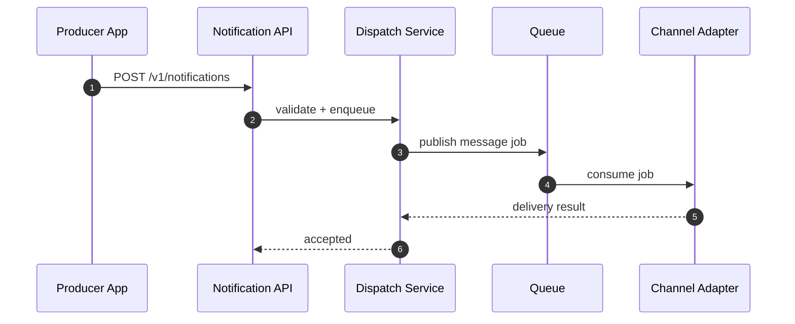

# Sequence Diagrams

```mermaid
sequenceDiagram
  autonumber
  participant App as Producer App
  participant API as Notification API
  participant Svc as Dispatch Service
  participant MQ as Queue
  participant Ch as Channel Adapter

  App->>API: POST /v1/notifications
  API->>Svc: validate + enqueue
  Svc->>MQ: publish message job
  MQ->>Ch: consume job
  Ch-->>Svc: delivery result
  Svc-->>API: accepted
```
