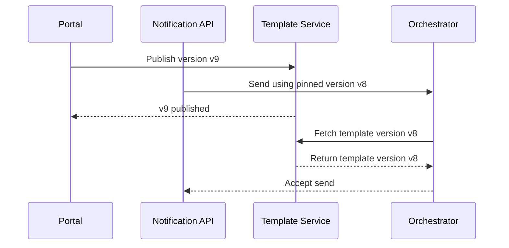

# Api And Ui

## Traceability
- API contracts: [`../detailed-design/api-design.md`](../detailed-design/api-design.md)
- Template rules: [`../analysis/business-rules.md`](../analysis/business-rules.md)
- Delivery flow: [`../detailed-design/delivery-orchestration-and-template-system.md`](../detailed-design/delivery-orchestration-and-template-system.md)

## Scenario Set A: Concurrent Template Publish and Send

### Trigger
An operator publishes a new template version while another client submits sends pinned to the prior version.

### Invariants
- Sends always resolve the explicitly pinned template version.
- Publication of a new version must not mutate already accepted sends.

### Operational acceptance criteria
- Support can explain which template version rendered a message using only `message_id`.
- UI blocks destructive edits to published versions; new content always creates a new version.

## Scenario Set B: Stale Status in Dashboard or SSE Disconnect

### Trigger
Operator dashboard polls lagging read models while the SSE stream drops during provider callback bursts.

### Invariants
- Streaming updates are authoritative over eventually consistent summary views.
- Retry/cancel/replay actions are disabled when status sources disagree.

### Operational acceptance criteria
- UI surfaces stale-state warnings with correlation ID and last refresh timestamp.
- Reconnect flow resumes from last acknowledged event and backfills missed status changes.

## Scenario Set C: Oversized Preview or Send Payload

### Trigger
A client submits a very large personalization object or malformed preview payload that could overwhelm renderer memory.

### Invariants
- Payload-size limits are enforced before rendering.
- Failed previews do not create message records or queue entries.

### Operational acceptance criteria
- Error response identifies the violated payload limit and offending field path.
- Abuse patterns on preview endpoints feed rate-limit and anomaly-detection controls.

---

**Status**: Complete  
**Document Version**: 2.0
