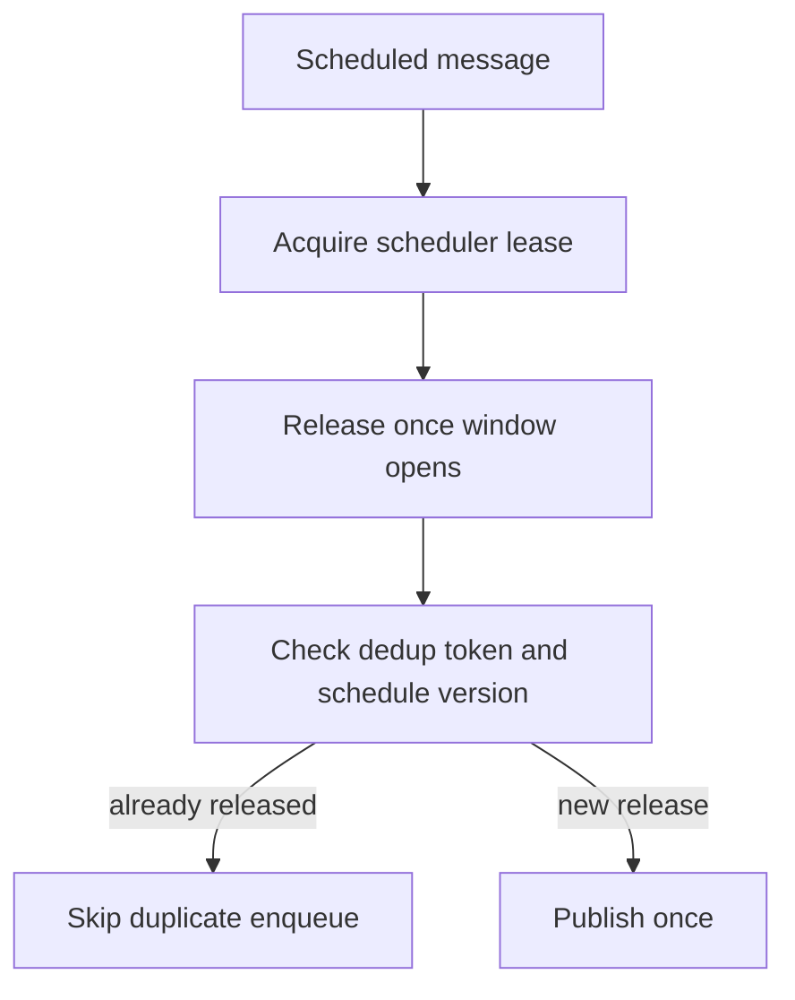

# Delayed Deduplicated Delivery

## Traceability
- Message semantics: [`../analysis/data-dictionary.md`](../analysis/data-dictionary.md)
- Event contracts: [`../analysis/event-catalog.md`](../analysis/event-catalog.md)
- Delivery internals: [`../detailed-design/delivery-orchestration-and-template-system.md`](../detailed-design/delivery-orchestration-and-template-system.md)

## Scenario Set A: Scheduled Send Replayed After Clock Skew

### Trigger
Scheduler nodes disagree on time and one node re-enqueues a scheduled notification that another node already released.

### Invariants
- Scheduled release is guarded by a lease and a dedup token tied to schedule version.
- A second enqueue attempt cannot create a second business message.

### Operational acceptance criteria
- Scheduler health dashboards expose lease contention and skew indicators.
- Recovery docs explain how to reconcile scheduled sends without blanket replays.

## Scenario Set B: Duplicate Provider Callback After Failover

### Trigger
Primary provider times out, message fails over, then the original provider later sends a delayed success callback.

### Invariants
- Callback reconciliation maps delayed provider events to the correct dispatch attempt.
- A late success from a superseded attempt cannot overwrite the final state of a newer successful attempt.

### Operational acceptance criteria
- Support tools show which attempt won and why the late callback was ignored or recorded as superseded.
- Analytics count one business delivery outcome while retaining full attempt evidence.

---

**Status**: Complete  
**Document Version**: 2.0
