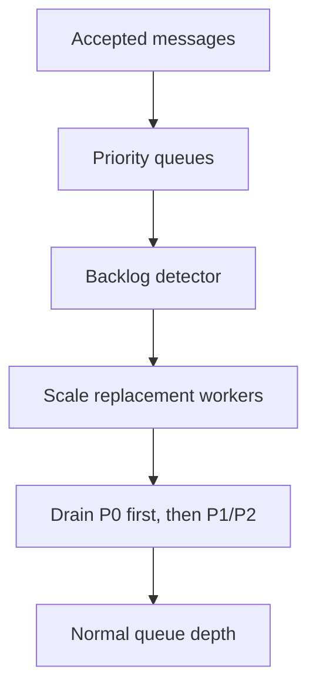

# Operations

## Traceability
- Infrastructure: [`../infrastructure/cloud-architecture.md`](../infrastructure/cloud-architecture.md)
- Delivery design: [`../detailed-design/delivery-orchestration-and-template-system.md`](../detailed-design/delivery-orchestration-and-template-system.md)
- Implementation controls: [`../implementation/implementation-guidelines.md`](../implementation/implementation-guidelines.md)

## Scenario Set A: Queue Backlog After Worker Pool Crash

### Trigger
Dispatch workers for one or more channels crash or scale to zero while messages continue entering the queue.

### Invariants
- P0 queues are isolated from P2 backlog pressure.
- Backlog recovery must preserve ordering guarantees at the configured partition level.

### Operational acceptance criteria
- Alert includes lag, impacted priorities, estimated drain time, and tenant blast radius.
- Recovery playbook documents when to shed promotional load to preserve transactional SLOs.

## Scenario Set B: Callback Ingestion Outage or Schema Drift

### Trigger
Provider callbacks arrive while the callback ingestion service is unavailable or a provider silently changes payload shape.

### Invariants
- Callback payloads are durably captured before normalization when possible.
- Message status does not advance on unverified or unparseable callback data.

### Operational acceptance criteria
- Polling fallback or replay workflow exists for providers that support post-facto reconciliation.
- Operators can replay captured callbacks after parser fixes without corrupting prior state.

---

**Status**: Complete  
**Document Version**: 2.0
