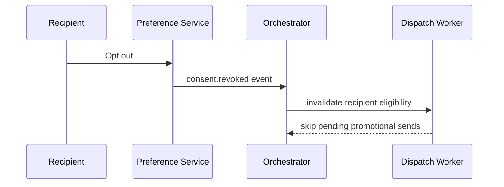

# Opt Out Compliance

## Traceability
- Consent rules: [`../analysis/business-rules.md`](../analysis/business-rules.md)
- Data semantics: [`../analysis/data-dictionary.md`](../analysis/data-dictionary.md)
- User journeys: [`../requirements/user-stories.md`](../requirements/user-stories.md)

## Scenario Set A: Opt-Out Arrives During Campaign Execution

### Trigger
A recipient unsubscribes while a large campaign batch is already being partitioned for dispatch.

### Invariants
- New promotional sends for the recipient stop as soon as revocation propagates.
- Already delivered messages remain auditable, but future eligibility changes immediately.

### Operational acceptance criteria
- Replay or redrive tooling re-checks consent instead of assuming original eligibility still applies.
- Audit export shows which queued messages were cancelled because of the opt-out event.

## Scenario Set B: Stale Consent Import Conflicts With Newer Local Decision

### Trigger
Nightly CRM import sends older consent data that conflicts with a newer opt-out captured in the platform.

### Invariants
- Consent writes are versioned; stale upstream data cannot overwrite a newer local decision.
- Conflict-resolution policy is deterministic and auditable.

### Operational acceptance criteria
- Import jobs emit conflict counts and affected tenant records.
- Support tooling can show the winning consent version and source of truth.

---

**Status**: Complete  
**Document Version**: 2.0
