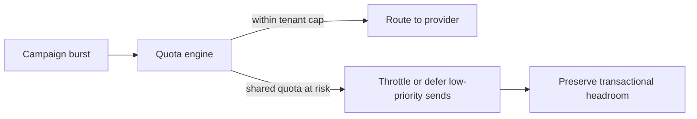

# Rate Limiting

## Traceability
- Routing and quota rules: [`../analysis/business-rules.md`](../analysis/business-rules.md)
- Cloud controls: [`../infrastructure/cloud-architecture.md`](../infrastructure/cloud-architecture.md)
- Delivery orchestration: [`../detailed-design/delivery-orchestration-and-template-system.md`](../detailed-design/delivery-orchestration-and-template-system.md)

## Scenario Set A: Tenant Burst Exhausts Shared Provider Quota

### Trigger
One tenant launches a large campaign and consumes most of a shared provider account quota.

### Invariants
- One tenant cannot exhaust headroom reserved for other tenants' transactional traffic.
- Throttling decisions are priority-aware and explicitly visible to affected tenants.

### Operational acceptance criteria
- Shared-quota dashboards expose projected exhaustion by provider account and priority lane.
- Tenant-facing APIs return actionable throttle metadata instead of generic failures.

## Scenario Set B: API and Worker Backpressure Drift

### Trigger
API gateway still accepts traffic at a higher rate than workers can drain because worker autoscaling lags.

### Invariants
- Backpressure thresholds are derived from queue lag and provider health, not only request rate.
- Low-priority work is throttled or deferred before transactional paths degrade.

### Operational acceptance criteria
- Queue-lag alarms trigger coordinated API throttling changes automatically or via fast operator action.
- Post-incident reporting shows when each throttle tier engaged and which tenants were affected.

---

**Status**: Complete  
**Document Version**: 2.0
