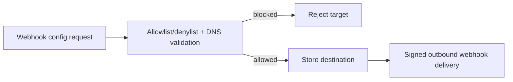

# Security And Compliance

## Traceability
- Compliance rules: [`../analysis/business-rules.md`](../analysis/business-rules.md)
- Infrastructure controls: [`../infrastructure/network-infrastructure.md`](../infrastructure/network-infrastructure.md)
- Audit readiness: [`../implementation/backend-status-matrix.md`](../implementation/backend-status-matrix.md)

## Scenario Set A: Webhook Destination Used for SSRF

### Trigger
A tenant configures a webhook target that resolves to an internal or metadata-service address.

### Invariants
- Private, link-local, and metadata-network targets are never reachable from tenant-configured webhook routes.
- DNS re-resolution is checked periodically to prevent drift into forbidden address space.

### Operational acceptance criteria
- Security logs retain rejected targets, actor, tenant, and resolved IP evidence.
- Red-team tests verify SSRF defenses against redirects, DNS rebinding, and IPv6 literals.

## Scenario Set B: Provider Credential Leak

### Trigger
A provider API key is exposed in logs, support tooling, or CI output.

### Invariants
- Provider secrets are versioned and rotated without code redeploy.
- A compromised route is blocked for new dispatches until replacement credentials are validated.

### Operational acceptance criteria
- Secret-rotation workflow can swap credentials with minimal dispatch disruption.
- Incident evidence links every affected provider route, tenant, and time window.

---

**Status**: Complete  
**Document Version**: 2.0
