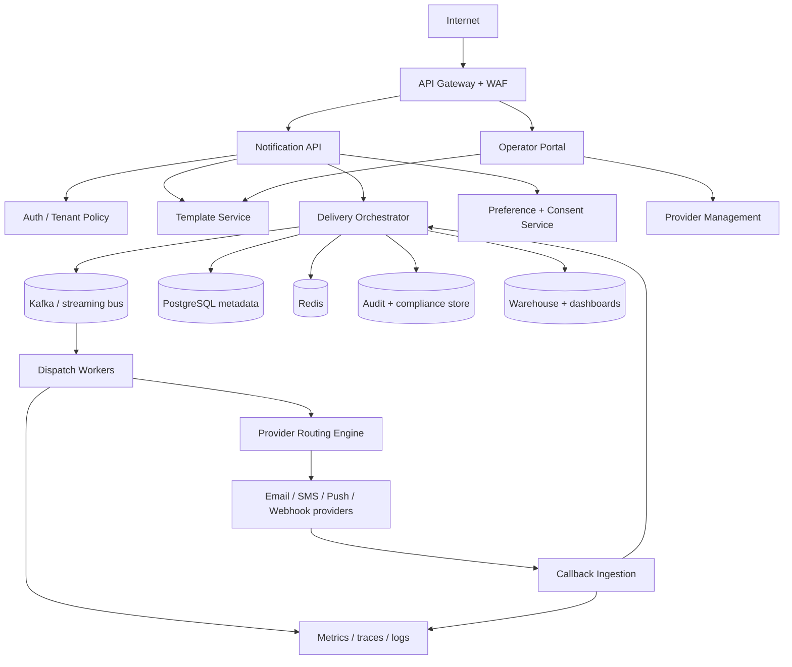

# Architecture Diagram

## Traceability
- Analysis context: [`../analysis/system-context-diagram.md`](../analysis/system-context-diagram.md)
- Domain semantics: [`./domain-model.md`](./domain-model.md)
- Detailed internals: [`../detailed-design/delivery-orchestration-and-template-system.md`](../detailed-design/delivery-orchestration-and-template-system.md)
- Infrastructure realization: [`../infrastructure/cloud-architecture.md`](../infrastructure/cloud-architecture.md)

## Platform Topology

## Service Responsibilities

| Service/Domain | Responsibility |
|---|---|
| Notification API | authenticated send, status, schedule, cancel, and configuration APIs |
| Operator Portal | template management, campaign setup, provider routing, DLQ/replay UI |
| Template Service | versioned templates, rendering schemas, approvals, locale fallback rules |
| Preference + Consent Service | suppression, quiet hours, legal consent, import/sync workflows |
| Delivery Orchestrator | policy evaluation, queueing, retry scheduling, failover decisions |
| Dispatch Workers | channel-specific rendering, provider request execution, callback correlation |
| Provider Routing Engine | weighted route selection, circuit-breaker state, geo/provider policy |
| Audit + Analytics | immutable evidence, delivery funnel metrics, compliance exports |

## Technology Shaping Decisions

- Kafka or equivalent durable bus separates request admission from dispatch so queue pressure does not directly break API availability.
- Redis is reserved for hot-path caches and counters; canonical state stays in PostgreSQL to preserve auditability and reconciliation.
- Provider adapters are isolated behind normalized contracts so channel/provider growth does not leak SDK-specific logic into orchestration.

## Critical Paths

1. **Request admission path**: API gateway -> API -> consent/policy -> metadata store -> outbox/event bus.
2. **Dispatch path**: bus -> dispatch worker -> route selection -> provider adapter -> callback ingestion/reconciliation.
3. **Governance path**: portal -> template service -> approval workflow -> published version cache.
4. **Evidence path**: state changes -> audit store -> analytics warehouse -> compliance export tooling.

## Architecture Invariants

- Message metadata is stored before asynchronous dispatch begins.
- A provider route failure only affects traffic matching that route policy; unrelated channels and healthy providers continue.
- Compliance decisions are made on authoritative preference data and rechecked immediately before handoff for long-lived queued messages.

## Operational acceptance criteria

- P0 transactional traffic continues meeting latency targets during partial provider brownouts via failover or queue prioritization.
- Every service boundary emits correlation IDs, tenant IDs, and actor IDs for audit and trace stitching.
- Architecture review artifacts explicitly identify which services are latency-critical, compliance-critical, or recovery-critical.
