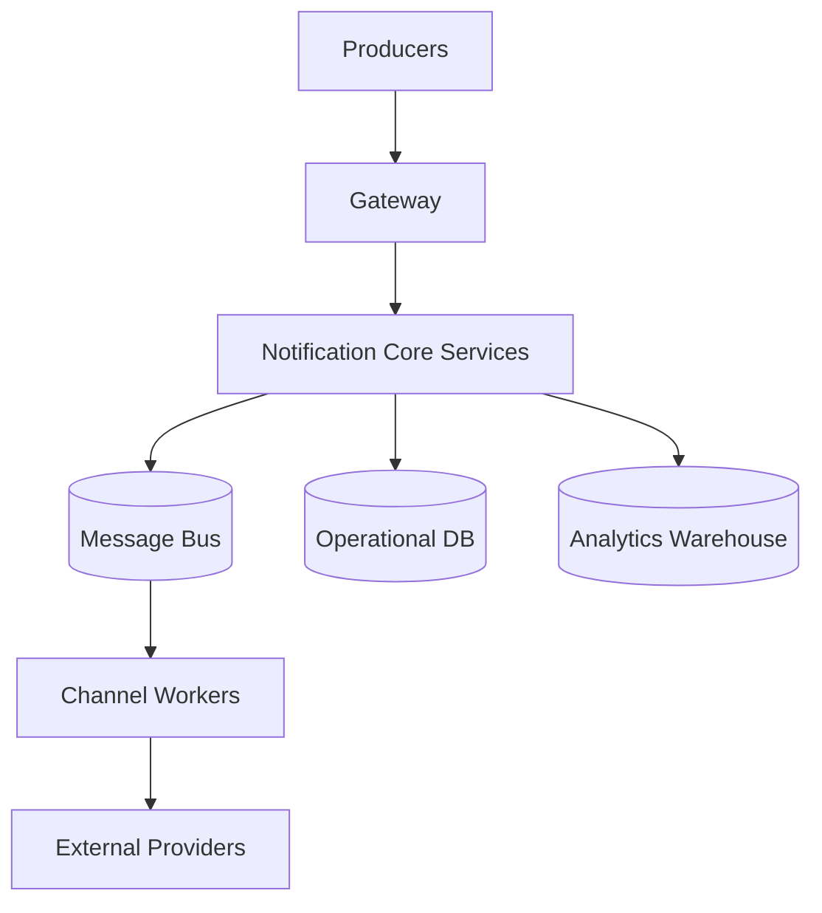

# Architecture Diagram

```mermaid
flowchart TB
  Producers --> Gateway
  Gateway --> Core[Notification Core Services]
  Core --> MQ[(Message Bus)]
  Core --> DB[(Operational DB)]
  MQ --> Workers[Channel Workers]
  Workers --> Providers[External Providers]
  Core --> BI[(Analytics Warehouse)]
```
