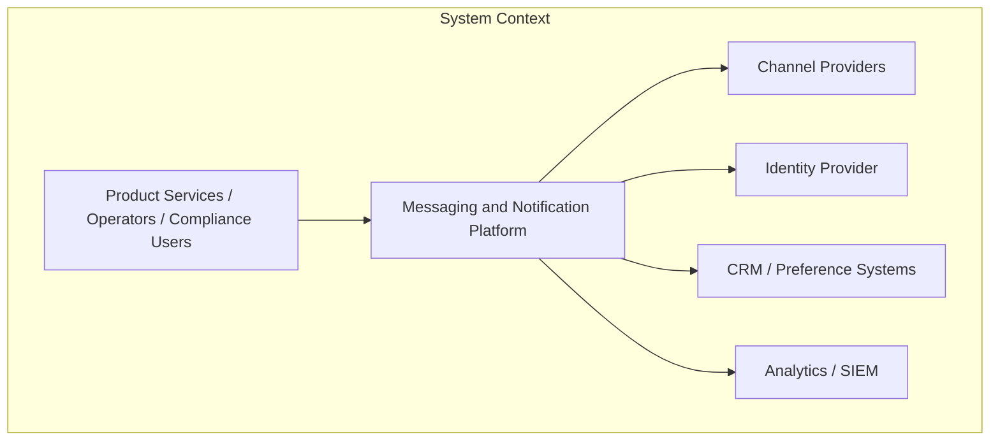
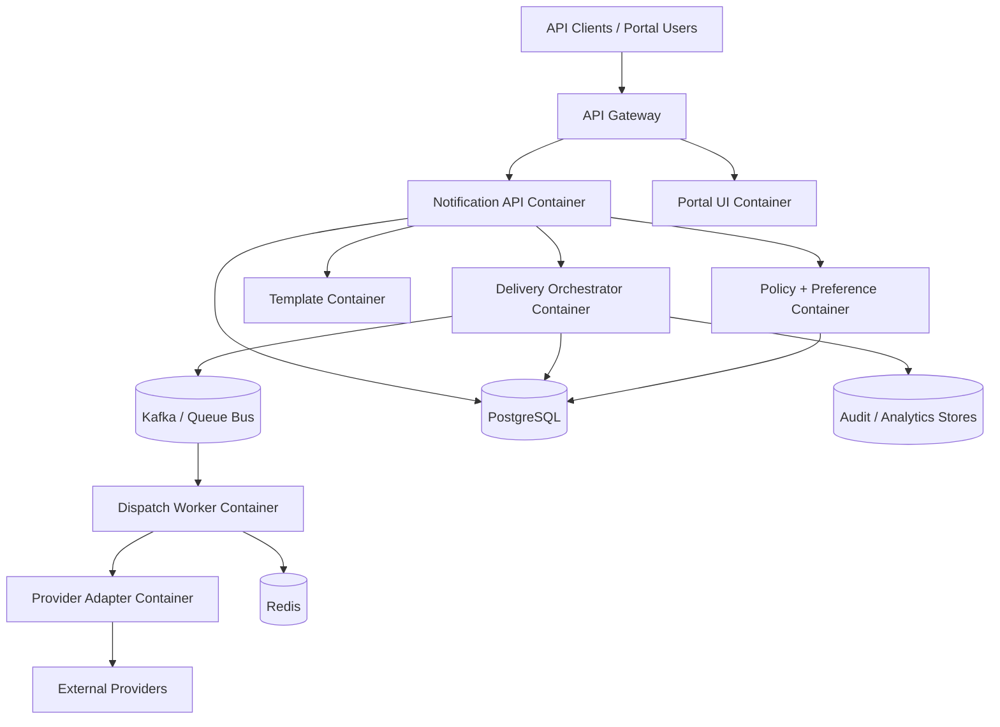

# C4 Diagrams

## Traceability
- System context: [`../analysis/system-context-diagram.md`](../analysis/system-context-diagram.md)
- Architecture topology: [`./architecture-diagram.md`](./architecture-diagram.md)
- Component view: [`../detailed-design/c4-component-diagram.md`](../detailed-design/c4-component-diagram.md)

## C4 Level 1: System Context

## C4 Level 2: Container View

## Container Responsibilities

| Container | Primary role |
|---|---|
| API Gateway | edge auth, rate limiting, WAF, request correlation |
| Notification API | request admission, message status APIs, scheduling, cancellation |
| Portal UI | operator workflows for templates, campaigns, provider settings, DLQ |
| Policy + Preference | consent, suppression, quiet hours, regional policy checks |
| Template | versioned templates, schema validation, approval workflow |
| Delivery Orchestrator | queueing, retry/failover, state transitions, dispatch control |
| Dispatch Worker | render and send channel payloads, manage provider responses |
| Provider Adapter | unify external provider APIs behind normalized contracts |
| PostgreSQL | source of truth for metadata, templates, preferences, audit references |
| Redis | idempotency window, hot policy cache, short-lived route state |
| Audit / Analytics stores | immutable evidence, delivery funnel metrics, reporting |

## Boundary Notes

- API Gateway and Portal UI are separate deployables so tenant self-service failures do not block product-driven API sends.
- Policy + Preference is separated from Template to isolate compliance-critical logic from content-authoring workflows.
- Dispatch Worker and Provider Adapter may be co-deployed for low-volume channels or separated for high-throughput lanes.

## C4 Invariants

- Only the Delivery Orchestrator may transition canonical message state.
- Provider adapters never persist business state directly; they report normalized outcomes back to orchestration.
- Portal UI uses the same governed APIs and permissions model as external operator clients.

## Operational acceptance criteria

- Container boundaries align with deployable ownership so a single team can own APIs, data, SLOs, and runbooks per container.
- C4 diagrams remain synchronized with service ownership, queue topology, and infrastructure namespaces.
- Each container has explicit persistence ownership and does not rely on undocumented shared-table writes.
