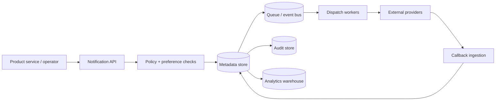
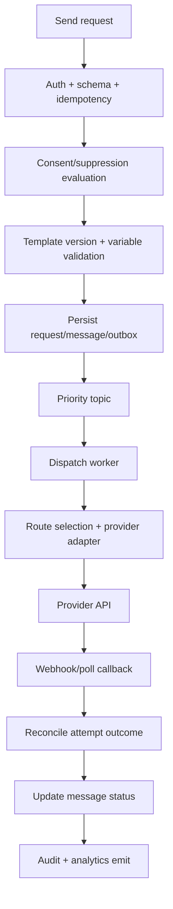

# Data Flow Diagrams

## Traceability
- Analysis semantics: [`../analysis/data-dictionary.md`](../analysis/data-dictionary.md)
- Architecture topology: [`./architecture-diagram.md`](./architecture-diagram.md)
- Detailed orchestration: [`../detailed-design/delivery-orchestration-and-template-system.md`](../detailed-design/delivery-orchestration-and-template-system.md)

## Level 0 Data Flow

## Level 1: Send and Callback Flow

## Data Stores and Access Patterns

| Store | Primary contents | Read/write pattern |
|---|---|---|
| PostgreSQL metadata | requests, messages, attempts, templates, consents, routes | transactional writes, status queries |
| Redis | idempotency keys, hot consent cache, rate counters, route state | low-latency lookups and expirations |
| Queue/event bus | accepted messages, retries, callbacks, audit events | append/read by partition |
| Audit store | immutable actor + message evidence | append-only with query/export |
| Analytics warehouse | delivery metrics, campaign aggregates, provider comparisons | batch/stream ingest, analytical reads |

## Data-Flow Guardrails

- Data needed for dispatch eligibility is read synchronously before queue admission.
- Long-running or eventually consistent analytics writes never block the dispatch path.
- Callback reconciliation uses provider identifiers plus attempt IDs to avoid cross-message contamination.

## Failure-Aware Data Flow Notes

- Outbox publication protects against partially committed request records that never reach dispatch workers.
- Callback failures are replayable because the provider payload, normalized mapping, and attempt reference are retained independently.
- Warehouse ingestion consumes derived events, not hot-path writes, so reporting outages do not threaten message durability.

## Operational acceptance criteria

- Queue lag, callback lag, and warehouse-lag metrics are visible per priority tier and tenant segment.
- Replay flows preserve original business identifiers while clearly separating replay execution metadata.
- Teams can trace a single message from request to final provider outcome using only persisted stores and emitted events.
