# Domain Model

## Overview

This document defines the Domain-Driven Design (DDD) model for the Messaging and Notification Platform. It establishes bounded contexts, aggregate roots, entities, value objects, domain services, repository interfaces, domain events, and the invariants that must be preserved at all times. The model is the canonical reference for engineering teams implementing any subdomain of the platform.

---

## Bounded Contexts

The platform is divided into seven bounded contexts, each owning its own data, language, and lifecycle rules. Cross-context communication is event-driven; no context reaches directly into another context's aggregate.

| Bounded Context | Responsibility |
|---|---|
| **Messaging** | Core message lifecycle from creation to final delivery status |
| **Template** | Template authoring, versioning, and rendering |
| **Contact** | Contact records, subscription preferences, and opt-out management |
| **Provider** | Provider configuration, routing rules, and health tracking |
| **Campaign** | Bulk campaign scheduling, audience selection, and execution |
| **Analytics** | Usage records, delivery events, bounces, and complaints |
| **Platform** | Tenants, API keys, webhooks, and rate limits |

---

## Aggregate Class Diagram

```mermaid
classDiagram
    direction TB

    %% ── Messaging Context ──────────────────────────────────────
    class Message {
        +UUID id
        +UUID tenantId
        +String channel
        +String status
        +String idempotencyKey
        +UUID templateVersionId
        +RecipientAddress recipient
        +RenderedContent content
        +DateTime createdAt
        +DateTime updatedAt
        +markSent(providerRef)
        +markDelivered(ts)
        +markFailed(reason)
        +markBounced(bounceType, reason)
    }
    class DeliveryAttempt {
        +UUID id
        +UUID messageId
        +Int attemptNumber
        +String provider
        +String status
        +String providerRef
        +String errorCode
        +DateTime attemptedAt
    }
    class MessageBatch {
        +UUID id
        +UUID campaignRunId
        +String channel
        +Int totalCount
        +Int sentCount
        +Int failedCount
        +String status
    }
    Message "1" --> "*" DeliveryAttempt : records
    MessageBatch "1" --> "*" Message : contains

    %% ── Template Context ───────────────────────────────────────
    class Template {
        +UUID id
        +UUID tenantId
        +String name
        +String channel
        +UUID activeVersionId
        +DateTime createdAt
        +createDraft() TemplateVersion
        +publishVersion(versionId)
    }
    class TemplateVersion {
        +UUID id
        +UUID templateId
        +Int version
        +String status
        +String locale
        +String htmlBody
        +String textBody
        +String subject
        +VariableSchema[] variables
        +DateTime lockedAt
        +edit(content)
        +publish()
    }
    class VariableSchema {
        +String name
        +String type
        +Boolean required
        +String defaultValue
    }
    Template "1" --> "*" TemplateVersion : versions
    TemplateVersion "1" --> "*" VariableSchema : declares

    %% ── Contact Context ────────────────────────────────────────
    class Contact {
        +UUID id
        +UUID tenantId
        +String email
        +String phone
        +String deviceToken
        +ContactStatus status
        +DateTime createdAt
        +subscribe(channel, groupId)
        +unsubscribe(channel, groupId)
        +globalOptOut()
    }
    class Subscription {
        +UUID id
        +UUID contactId
        +String channel
        +UUID groupId
        +Boolean active
        +DateTime subscribedAt
        +DateTime unsubscribedAt
    }
    class OptOutRecord {
        +UUID id
        +UUID tenantId
        +String recipient
        +String channel
        +String source
        +DateTime recordedAt
    }
    class SubscriptionGroup {
        +UUID id
        +UUID tenantId
        +String name
        +String description
    }
    Contact "1" --> "*" Subscription : has
    Contact "1" --> "*" OptOutRecord : generates
    SubscriptionGroup "1" --> "*" Subscription : categorises

    %% ── Provider Context ───────────────────────────────────────
    class Provider {
        +UUID id
        +String name
        +String channel
        +ProviderStatus status
        +Int priority
        +CircuitState circuitState
        +openCircuit()
        +closeCircuit()
        +halfOpen()
    }
    class ProviderConfig {
        +UUID id
        +UUID providerId
        +UUID tenantId
        +EncryptedCredentials credentials
        +RateLimit rateLimit
        +DateTime updatedAt
    }
    class ProviderRoute {
        +UUID id
        +UUID tenantId
        +String channel
        +UUID primaryProviderId
        +UUID fallbackProviderId
        +Int weightPrimary
    }
    Provider "1" --> "*" ProviderConfig : configuredPer
    ProviderRoute --> Provider : references

    %% ── Campaign Context ───────────────────────────────────────
    class Campaign {
        +UUID id
        +UUID tenantId
        +String name
        +String status
        +UUID segmentId
        +UUID templateId
        +CampaignSchedule schedule
        +launch()
        +pause()
        +cancel()
    }
    class CampaignRun {
        +UUID id
        +UUID campaignId
        +String status
        +Int totalRecipients
        +DateTime startedAt
        +DateTime completedAt
    }
    Campaign "1" --> "*" CampaignRun : executes

    %% ── Analytics Context ──────────────────────────────────────
    class UsageRecord {
        +UUID tenantId
        +String channel
        +Date date
        +Int sent
        +Int delivered
        +Int failed
        +Int bounced
        +Int complained
    }
    class BounceRecord {
        +UUID id
        +UUID messageId
        +UUID tenantId
        +String bounceType
        +String reason
        +String recipient
        +DateTime ts
    }
    class ComplaintRecord {
        +UUID id
        +UUID messageId
        +UUID tenantId
        +String complaintType
        +String recipient
        +DateTime ts
    }

    %% ── Platform Context ───────────────────────────────────────
    class Tenant {
        +UUID id
        +String name
        +TenantPlan plan
        +TenantStatus status
        +DateTime createdAt
    }
    class APIKey {
        +UUID id
        +UUID tenantId
        +String keyHash
        +String[] scopes
        +DateTime expiresAt
        +Boolean active
    }
    class Webhook {
        +UUID id
        +UUID tenantId
        +String url
        +String[] events
        +String hmacSecret
        +Boolean active
    }
    class RateLimit {
        +UUID tenantId
        +String channel
        +Int limitPerMinute
        +Int limitPerDay
        +Int burstLimit
    }
    Tenant "1" --> "*" APIKey : issues
    Tenant "1" --> "*" Webhook : registers
    Tenant "1" --> "*" RateLimit : configures
```



---

## Messaging Context

### Aggregate Root: `Message`

The `Message` aggregate represents a single unit of communication from creation through to final delivery status. It is the most central aggregate in the platform.

**Entities within aggregate:**
- `Message` (root) — owns the lifecycle state machine
- `DeliveryAttempt` — each provider call attempt, attached to the message

**Value Objects:**
- `RecipientAddress` — immutable record of `{email?, phone?, deviceToken?}` for the target channel
- `RenderedContent` — immutable snapshot of `{subject, htmlBody, textBody, smsText, pushPayload}` at send time
- `MessageStatus` — enum: `QUEUED | SENDING | SENT | DELIVERED | FAILED | BOUNCED | COMPLAINED | EXPIRED`

**Domain Events emitted:**
| Event | Trigger |
|---|---|
| `MessageQueued` | Message persisted and ready for delivery |
| `MessageSent` | Provider accepted the message |
| `MessageDelivered` | Provider confirmed delivery |
| `MessageFailed` | All retry attempts exhausted |
| `MessageBounced` | Hard or soft bounce received from provider |
| `MessageComplained` | Spam complaint received |

**Domain Services:**
- `MessageDispatchService` — coordinates opt-out check, rate-limit check, template rendering, and provider routing
- `IdempotencyService` — enforces at-most-once creation per `idempotencyKey` within a tenant

**Repository Interface:**
```
MessageRepository
  findById(id: UUID): Message
  findByIdempotencyKey(tenantId, key): Message | null
  save(message: Message): void
  updateStatus(id, status, metadata): void
  listByTenant(tenantId, filters, pagination): Page<Message>
```

---

## Template Context

### Aggregate Root: `Template`

The `Template` aggregate manages the full versioning lifecycle of message templates. Published versions are immutable.

**Entities within aggregate:**
- `Template` (root) — holds the active version pointer
- `TemplateVersion` — individual version with its content and lifecycle status

**Value Objects:**
- `VariableSchema` — declares a template variable: name, type (`string | number | boolean | date`), required flag, default value
- `RenderWarning` — emitted during preview: `{code, message, field}`

**Domain Events emitted:**
| Event | Trigger |
|---|---|
| `TemplateDraftCreated` | New draft version created |
| `TemplateVersionPublished` | Draft promoted to published; version locked |
| `TemplateDeprecated` | Active version marked deprecated (new sends blocked) |

**Domain Invariants:**
- A `TemplateVersion` with `status=PUBLISHED` is immutable; any mutation attempt raises `TemplateVersionLockedException`.
- `Template.activeVersionId` must always point to a `PUBLISHED` version before `MessageDispatchService` can use it.

**Repository Interface:**
```
TemplateRepository
  findById(id: UUID): Template
  findPublishedVersion(templateId): TemplateVersion
  findVersion(templateId, versionId): TemplateVersion
  save(template: Template): void
  saveVersion(version: TemplateVersion): void
```

---

## Contact Context

### Aggregate Root: `Contact`

The `Contact` aggregate models a reachable end-user along with all their channel subscriptions and opt-out records within a tenant.

**Entities within aggregate:**
- `Contact` (root)
- `Subscription` — per-channel, per-group subscription record
- `OptOutRecord` — immutable log of an opt-out action (cannot be deleted, only superseded)

**Value Objects:**
- `ContactStatus` — enum: `ACTIVE | SUPPRESSED | GLOBALLY_OPTED_OUT`
- `SubscriptionGroup` — a named category for grouping subscriptions (separate aggregate)

**Domain Events emitted:**
| Event | Trigger |
|---|---|
| `ContactOptedOut` | Contact globally opted out of all communications |
| `SubscriptionCancelled` | Contact unsubscribed from a specific channel/group |
| `ContactSuppressed` | Contact suppressed due to hard bounce or complaint |

**Domain Invariants:**
- Once `OptOutRecord` is created for a `(tenantId, recipient, channel)` tuple, no message may be sent to that address on that channel until the opt-out is revoked.
- `ContactStatus.GLOBALLY_OPTED_OUT` overrides all per-channel subscriptions.

**Repository Interface:**
```
ContactRepository
  findById(id: UUID): Contact
  findByEmail(tenantId, email): Contact | null
  findByPhone(tenantId, phone): Contact | null
  isOptedOut(tenantId, recipient, channel): boolean
  save(contact: Contact): void
```

---

## Provider Context

### Aggregate Root: `Provider`

The `Provider` aggregate represents a third-party messaging provider (e.g., SendGrid, Twilio) and its operational health state.

**Entities within aggregate:**
- `Provider` (root) — global provider catalogue entry
- `ProviderConfig` — tenant-specific credentials and limits per provider
- `ProviderRoute` — tenant-level routing rules mapping channels to providers

**Value Objects:**
- `EncryptedCredentials` — AES-256-encrypted credential blob; never stored in plaintext
- `CircuitState` — enum: `CLOSED | OPEN | HALF_OPEN`

**Domain Events emitted:**
| Event | Trigger |
|---|---|
| `ProviderCircuitOpened` | Error threshold exceeded; provider bypassed |
| `ProviderCircuitClosed` | Provider health restored; traffic resumed |
| `ProviderHealthDegraded` | Error rate elevated but below open threshold |

**Domain Services:**
- `ProviderRoutingService` — selects the appropriate provider for a message based on channel, tenant config, circuit state, and routing weights
- `CircuitBreakerService` — manages circuit state transitions based on rolling error-rate windows

---

## Campaign Context

### Aggregate Root: `Campaign`

The `Campaign` aggregate coordinates bulk message delivery to a defined audience segment.

**Entities within aggregate:**
- `Campaign` (root)
- `CampaignRun` — a single execution instance of the campaign (campaigns may be recurring)

**Value Objects:**
- `CampaignSchedule` — `{sendAt: DateTime, timezone: String, recurring: RecurrenceRule | null}`
- `AudienceSegment` — reference to a segment definition (resolved by `AudienceSegmentationService`)

**Domain Events emitted:**
| Event | Trigger |
|---|---|
| `CampaignLaunched` | Campaign execution started; batches enqueued |
| `CampaignCompleted` | All batches processed |
| `CampaignPaused` | Operator paused in-flight campaign |
| `CampaignFailed` | Fatal error aborted the run |

---

## Analytics Context

### Aggregate Root: `UsageRecord`

The Analytics context is append-only and event-sourced. Aggregates are pre-computed rollups for efficient querying.

**Entities:**
- `UsageRecord` — daily per-tenant per-channel counts
- `BounceRecord` — individual bounce event linked to a message
- `ComplaintRecord` — individual spam complaint event

**Domain Services:**
- `UsageAggregationService` — processes `MessageDelivered`, `MessageBounced`, `MessageComplained` events and updates rollups

---

## Platform Context

### Aggregate Root: `Tenant`

The Platform context manages multi-tenancy infrastructure: identity, access control, and platform-level policies.

**Entities within aggregate:**
- `Tenant` (root)
- `APIKey` — hashed, scoped credentials for API access
- `Webhook` — outbound event delivery endpoint registered by the tenant
- `RateLimit` — per-channel sending quotas

**Domain Invariants:**
- All operations on any aggregate must carry a valid `tenantId`; cross-tenant data access is prohibited at the repository layer.
- `APIKey` credentials are stored as bcrypt hashes; the raw key is returned only at creation time.

---

## Domain Invariants

### 1. Tenant Isolation Invariant
Every aggregate instance belongs to exactly one tenant. Repository implementations must include `tenantId` in all queries. Any attempt to read or write data belonging to a different tenant must raise `TenantAccessViolationException`. This invariant is enforced both at the application layer (via request context) and at the database layer (via row-level security or tenant-scoped schemas).

### 2. Template Immutability Invariant
Once a `TemplateVersion` transitions to `status=PUBLISHED`, its `htmlBody`, `textBody`, `subject`, and `variables` fields are locked. The `lockedAt` timestamp is set at publish time and must never be null for published versions. Any edit operation on a published version is rejected. New edits must create a new `DRAFT` version.

### 3. Opt-Out Enforcement Invariant
Before any message is dispatched, the `MessageDispatchService` must call `ContactRepository.isOptedOut(tenantId, recipient, channel)`. If the result is `true`, the message must be set to `status=SUPPRESSED` and no provider call may be made. This check is non-bypassable; even operator-triggered sends go through it.

---

## Cross-Context Integration

### How Messaging Context Gets Template Content
`MessageDispatchService` calls `TemplateRepository.findPublishedVersion(templateId)` directly. This is an in-process call within the same deployment unit. The rendered content is snapshotted into `Message.content` (a value object) at send time so that subsequent template edits never affect in-flight or historical messages.

### How Delivery Updates Analytics
`MessageService` publishes domain events (`MessageDelivered`, `MessageBounced`, etc.) to the internal event bus. `AnalyticsService` subscribes to these events and calls `UsageAggregationService` to update `UsageRecord` rollups. This is asynchronous; the primary delivery path is not blocked by analytics writes.

### Event-Driven Integration Points

```
MessageQueued        → DeliveryWorker (starts delivery pipeline)
MessageDelivered     → AnalyticsService (update usage counts)
                     → WebhookService (notify tenant)
MessageBounced       → ContactService (suppress contact if hard bounce)
                     → AnalyticsService (update bounce counts)
                     → WebhookService (notify tenant)
MessageComplained    → ContactService (suppress contact)
                     → AnalyticsService (update complaint counts)
CampaignLaunched     → AudienceSegmentation (resolve contacts)
                     → MessageQueue (enqueue batches)
CampaignCompleted    → WebhookService (notify tenant)
ProviderCircuitOpened → AlertingService (page on-call)
TemplateVersionPublished → TemplateCache (invalidate)
ContactOptedOut      → OptOutCache (update Redis cache)
```
