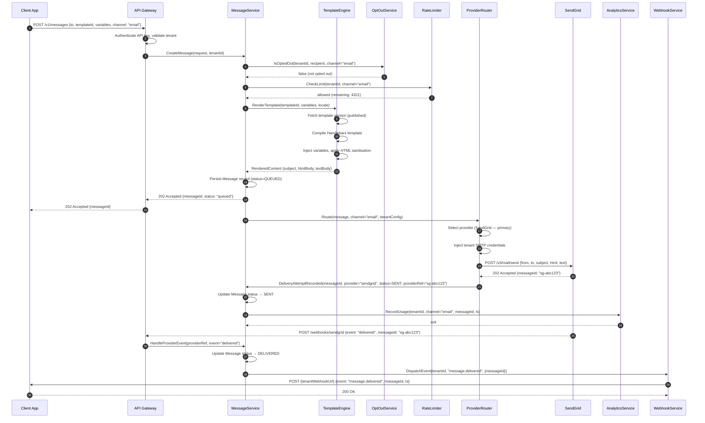
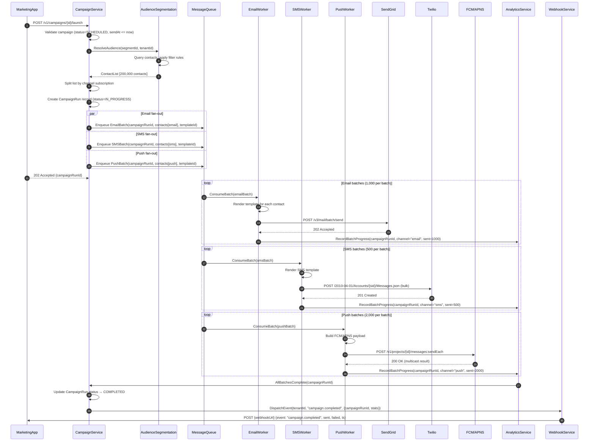
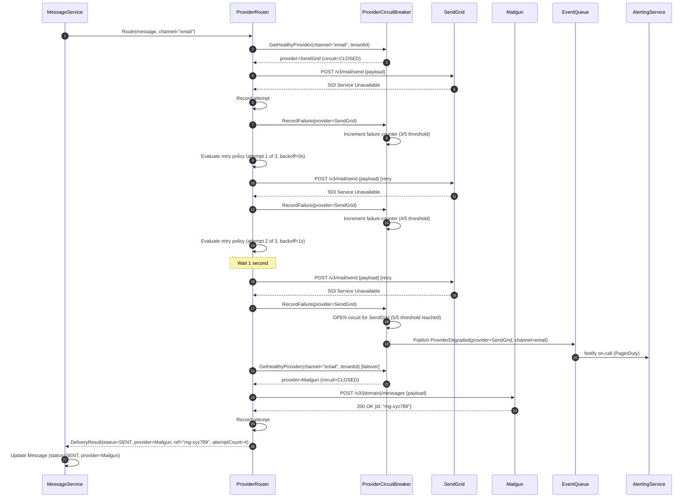
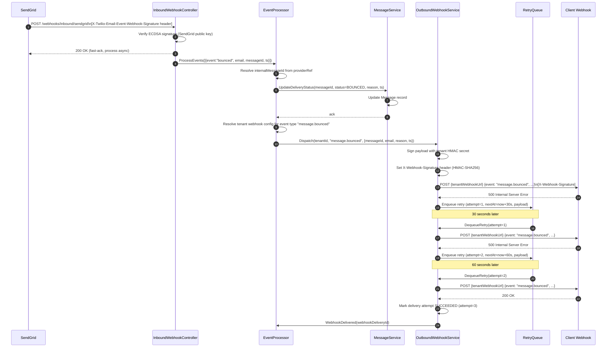
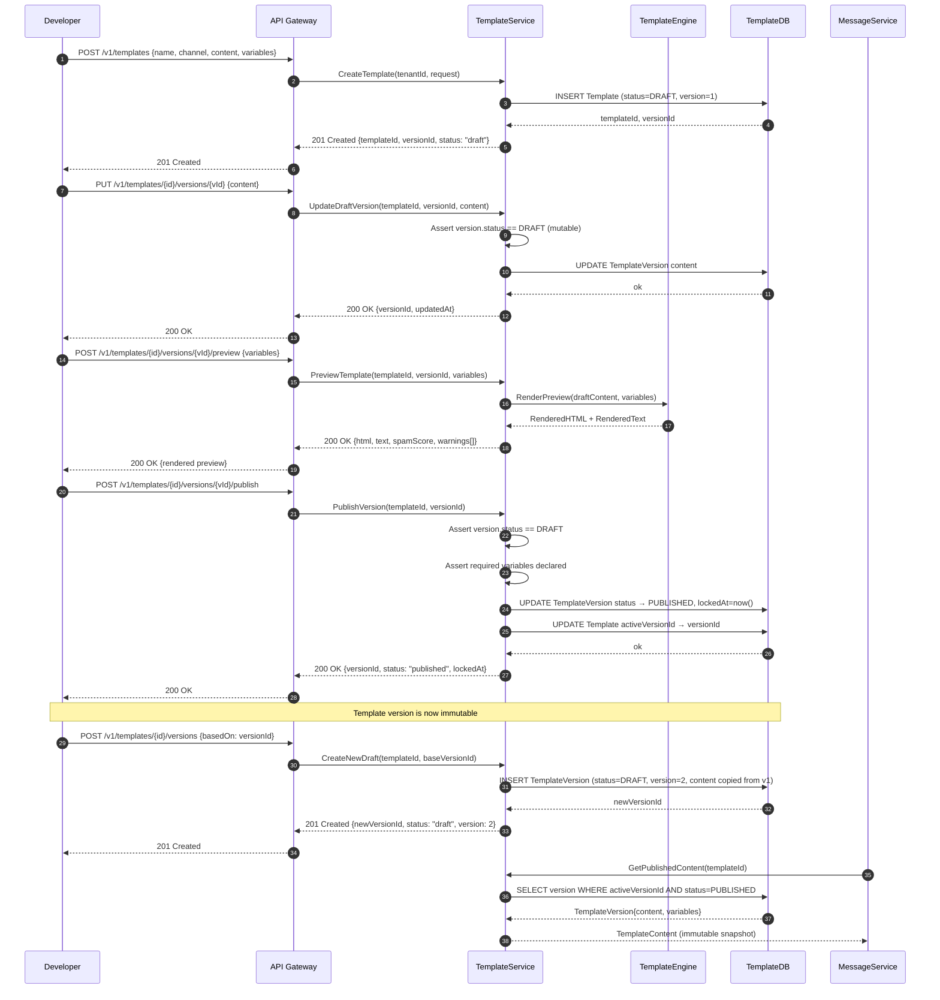
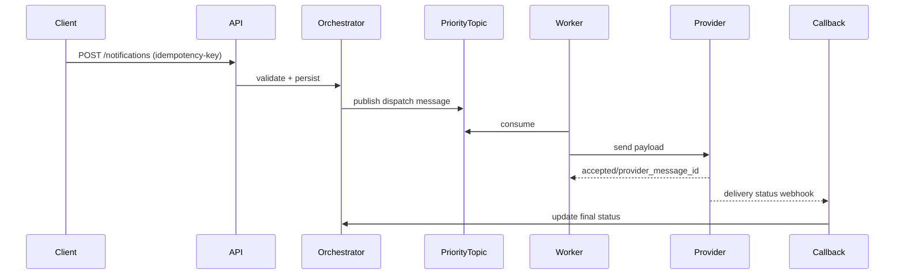

# System Sequence Diagrams

## Overview

This document captures system-level sequence diagrams for the Messaging and Notification Platform. Each diagram shows the ordered interactions between internal services and external systems for a specific business scenario. These diagrams are the primary reference for understanding runtime behaviour, integration contracts, and failure-handling logic across the platform.

---

## 1. Send Transactional Email

**Business context:** A client application (e.g., an e-commerce checkout service) calls the platform API to send a single transactional email — for example, an order confirmation. The platform must validate the request, enforce opt-out rules, apply rate limits, render the template, route to the correct email provider, record the delivery attempt, and surface delivery events back to the caller via webhooks.

**Key notes:**
- Steps 4–5 (opt-out and rate-limit checks) happen synchronously before any provider call, ensuring no message is sent in violation of preferences or quotas.
- The API returns `202 Accepted` before provider delivery completes; actual delivery status arrives via webhook (step 24).
- `AnalyticsService` is updated asynchronously to avoid blocking the critical path.

---

## 2. Multi-Channel Campaign Execution

**Business context:** A marketing team schedules a promotional campaign to send emails, SMS messages, and push notifications to a segmented audience of 200,000 contacts. The platform must fan-out the campaign across three delivery channels concurrently while tracking per-channel progress and emitting a completion event when all channels finish.

**Key notes:**
- Fan-out across channels is parallel (the `par` block); workers consume independently and report progress to `AnalyticsService`.
- Batch sizes are configurable per provider to respect their bulk API limits.
- `CampaignService` learns of completion via an event from `AnalyticsService` once all enqueued batches have been acknowledged.

---

## 3. Provider Failover

**Business context:** The primary email provider (SendGrid) returns a `503 Service Unavailable` error. The platform must detect the failure, retry with a secondary provider (Mailgun), record both attempts, and publish a provider-health event so the routing table can be updated automatically.

**Key notes:**
- The circuit breaker opens after 5 consecutive failures, preventing further calls to SendGrid until a health-check recovers it.
- All delivery attempts (including failures) are recorded for audit and analytics.
- The `ProviderDegraded` event triggers automated alerting independently of the delivery path.

---

## 4. Webhook Event Delivery

**Business context:** An email provider (SendGrid) sends a delivery status event (e.g., "bounce") to the platform's inbound webhook endpoint. The platform must validate the signature, parse the event, update message status, and re-dispatch the event to the tenant's registered outbound webhook URL with HMAC authentication. If the client's webhook returns an error, the platform must retry with exponential backoff.

**Key notes:**
- The inbound webhook controller returns `200 OK` immediately after signature verification; all processing is asynchronous so providers do not time out.
- Outbound retry schedule: 30 s → 60 s → 120 s → 300 s → 600 s (5 attempts max). After all attempts fail, the event is moved to the dead-letter store and an alert is raised.
- HMAC signing lets client applications verify that events originated from the platform.

---

## 5. Template Versioning Lifecycle

**Business context:** A developer creates a new email template, iterates on the content via a preview/test cycle, then publishes the template to production. Once published, the version is immutable; future edits create a new draft version. This sequence shows the full draft → publish lifecycle and the version-lock invariant enforcement.

**Key notes:**
- `PublishVersion` sets `lockedAt` and changes status to `PUBLISHED`; any subsequent `UpdateDraftVersion` call on a published version is rejected with `409 Conflict`.
- Creating a new draft (step 27) copies the published content as a starting point, incrementing the version counter.
- `MessageService` always fetches the `activeVersionId` snapshot at render time, ensuring in-flight messages are never affected by template edits.

## Scope
- Multi-tenant, multi-channel notifications (email, SMS, push, webhook).
- Transactional, operational, and campaign traffic profiles.
## Mermaid Diagram

- End-to-end controls from API ingestion to provider callbacks and compliance evidence.

## Coverage
This document is part of the implementation-ready set and should stay synchronized with requirements, design, and runbooks.

## Delivery, Reliability, and Compliance Baseline

### 1) Delivery semantics
- **Default guarantee:** At-least-once delivery for all async sends. Exactly-once is not assumed; business safety is achieved via idempotency.
- **Idempotency contract:** `idempotency_key = tenant_id + message_type + recipient + template_version + request_nonce`.
- **Latency tiers:**
  - `P0 Transactional` (OTP, password reset): enqueue < 1s, provider handoff p95 < 5s.
  - `P1 Operational` (alerts, statements): enqueue < 5s, handoff p95 < 30s.
  - `P2 Promotional` (campaign): enqueue < 30s, handoff p95 < 5m.
- **Status model:** `ACCEPTED -> QUEUED -> DISPATCHING -> PROVIDER_ACCEPTED -> DELIVERED|FAILED|EXPIRED`.

### 2) Queue and topic behavior
- **Topic split:** `notifications.transactional`, `notifications.operational`, `notifications.promotional`, plus channel suffixes.
- **Partition key:** `tenant_id:recipient_id:channel` to preserve recipient-level ordering without global lock contention.
- **Backpressure policy:** API returns `202 Accepted` once persisted; throttling starts at queue depth thresholds and adaptive worker concurrency.
- **Poison message isolation:** messages with schema/validation failures bypass retries and go directly to DLQ.

### 3) Retry and dead-letter handling
- **Retry policy:** capped exponential backoff with jitter (e.g., 30s, 2m, 10m, 30m, 2h max).
- **Retryable causes:** transport timeout, 429, 5xx, transient DNS/network faults.
- **Non-retryable causes:** invalid recipient, permanent provider policy reject, malformed template payload.
- **DLQ payload:** original envelope, error class/code, attempt history, provider response excerpt, trace IDs.
- **Redrive controls:** replay by batch, by tenant, by error class; replay requires approval in production.

### 4) Provider routing and failover
- **Routing mode:** weighted primary/secondary by channel and geography.
- **Health model:** active probes + rolling error-rate window + circuit breaker half-open testing.
- **Failover rule:** open circuit on sustained 5xx or timeout rates; route to standby while preserving idempotency keys.
- **Recovery:** gradual traffic ramp-back (10% -> 25% -> 50% -> 100%) with rollback guards.

### 5) Template management
- **Lifecycle:** `DRAFT -> REVIEW -> APPROVED -> PUBLISHED -> DEPRECATED -> RETIRED`.
- **Versioning:** immutable published versions; sends always pin explicit version.
- **Schema checks:** required variables, type validation, locale fallback chain, safe HTML sanitization.
- **Change control:** dual approval for regulated templates; rollback < 5 minutes.

### 6) Compliance and audit logging
- **Audit events:** consent evaluation, suppression decisions, template render inputs/outputs hash, provider requests/responses, operator actions.
- **PII policy:** log tokenized recipient identifiers; redact message body unless explicit legal-hold context.
- **Retention:** operational logs 90 days hot, 1 year warm; compliance evidence 7 years (policy configurable).
- **Forensics query keys:** `tenant_id`, `message_id`, `correlation_id`, `provider_message_id`, `recipient_token`, time range.

## Verification Checklist
- [ ] All interfaces include idempotency + correlation identifiers.
- [ ] Retryable vs non-retryable errors are explicitly classified.
- [ ] DLQ replay process is documented with approvals and guardrails.
- [ ] Provider failover policy defines trigger, action, and recovery criteria.
- [ ] Template versioning and approval workflow are enforceable in tooling.
- [ ] Compliance evidence can be queried by message_id and correlation_id.
