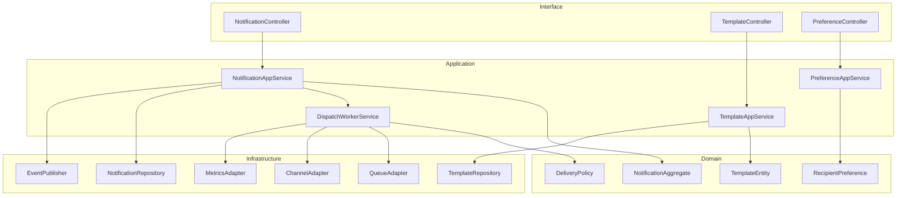
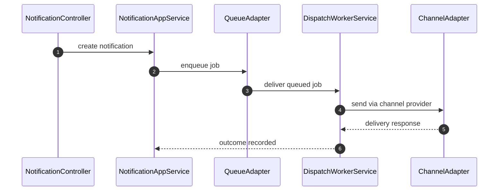

# C4 Code Diagram

This implementation view details the notification dispatch pipeline and reliability boundaries.

## Code-Level Structure

## Critical Runtime Sequence: Notification Dispatch

## Notes
- Use idempotent delivery keys for retry safety.
- Separate synchronous acceptance path from asynchronous channel dispatch.
