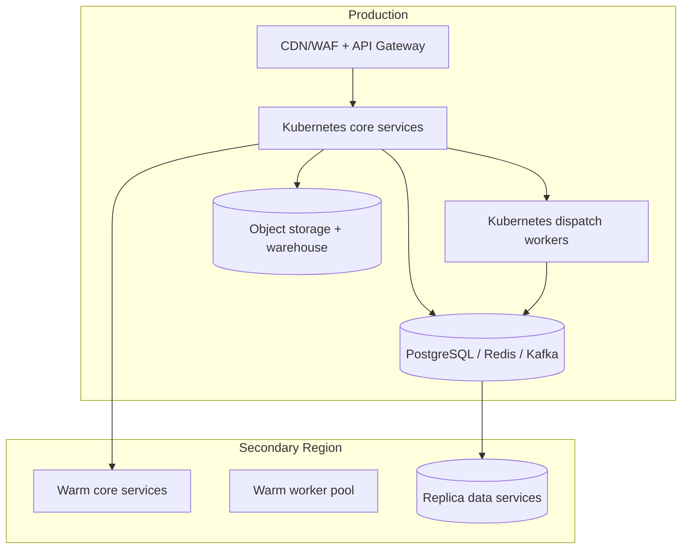

# Cloud Architecture

## Traceability
- Architecture topology: [`../high-level-design/architecture-diagram.md`](../high-level-design/architecture-diagram.md)
- Network controls: [`./network-infrastructure.md`](./network-infrastructure.md)
- Detailed delivery design: [`../detailed-design/delivery-orchestration-and-template-system.md`](../detailed-design/delivery-orchestration-and-template-system.md)
- Operational delivery plan: [`../implementation/implementation-guidelines.md`](../implementation/implementation-guidelines.md)

## Environment Layout

## Cloud Service Mapping

| Capability | Preferred managed service pattern |
|---|---|
| Edge ingress | CDN + WAF + managed API gateway |
| Stateless services | Kubernetes or container services with HPA/KEDA |
| Message bus | Kafka / Kinesis / PubSub equivalent with tiered retention |
| Metadata DB | PostgreSQL HA / Aurora / Cloud SQL HA |
| Hot cache | Redis cluster with replication and snapshots |
| Audit archive | object storage with immutable retention and lifecycle policies |
| Analytics | warehouse + streaming ETL |
| Secret management | cloud secret manager or Vault with rotation workflows |

## Isolation and Capacity Strategy

- Separate production and non-production accounts/projects.
- Core APIs, template services, and dispatch workers run in separate node pools to isolate latency-sensitive traffic from bursty workload spikes.
- Per-tenant rate limiting is enforced at both gateway and worker layers.
- Dispatch worker autoscaling uses queue depth, provider latency, and priority-lane pressure rather than CPU alone.

## Operational Control Plane

- Queue administration, provider-route changes, and replay approval tooling run in a locked-down operator namespace.
- Secret-rotation jobs and provider-health monitors are isolated from tenant-facing workloads.
- Regional failover automation is policy-driven but requires incident-commander approval for final cutover.

## DR and Resilience Targets

| Target | Value |
|---|---|
| Regional failover RTO | <= 30 minutes |
| Regional failover RPO | <= 5 minutes for metadata, near-zero for queued events with replicated bus |
| P0 lane recovery under provider outage | <= 5 minutes with route failover |
| Secret rotation cadence | every 90 days or immediately on compromise signal |

## Infrastructure Invariants

- A regional outage must not lose accepted messages that were acknowledged to callers.
- Provider secrets are never stored in application config files or CI variables outside approved secret stores.
- Audit exports and compliance evidence use immutable storage policies independent of hot operational databases.

## Operational acceptance criteria

- Infrastructure dashboards expose queue lag, provider health, database replication lag, and worker saturation by region.
- Quarterly DR rehearsal proves traffic cutover, event replay integrity, and audit-store availability.
- Cost dashboards break down spend by provider, channel, and tenant tier so routing policy can consider cost as well as reliability.
