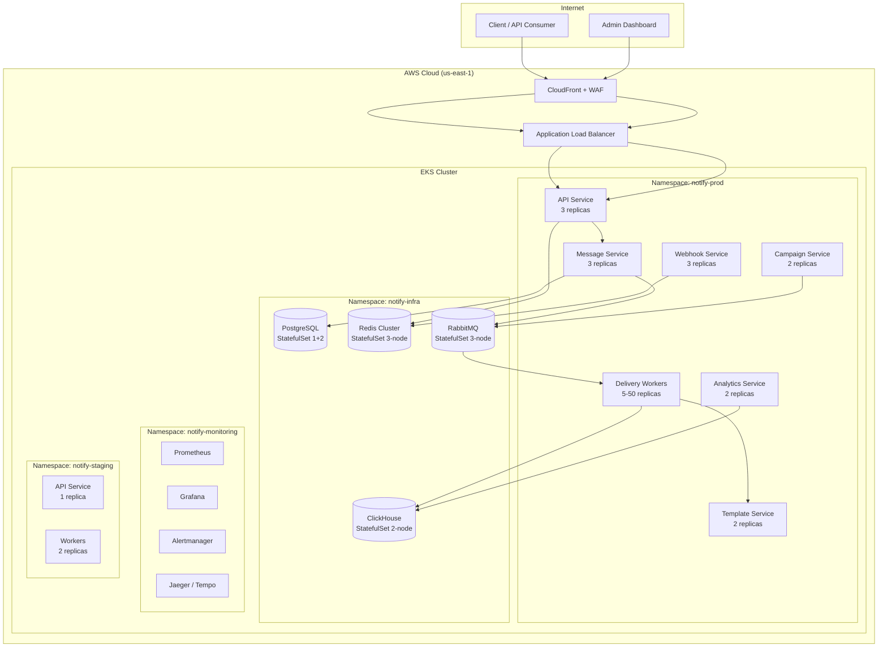
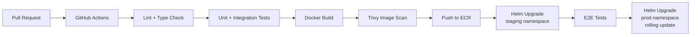
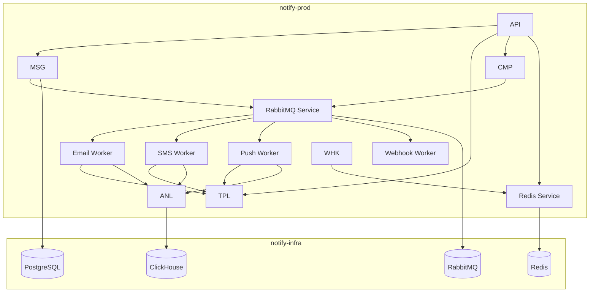

# Deployment Diagram – Messaging and Notification Platform

## Overview

This document describes the Kubernetes-based deployment topology for the Messaging and Notification Platform. All services run inside an EKS cluster organised into dedicated namespaces, with stateful workloads managed as StatefulSets and stateless workloads managed as Deployments with Horizontal Pod Autoscalers (HPA).

---

## 1. K8s Cluster Overview



---

## 2. Namespace Strategy

| Namespace | Purpose | Network Policy |
|---|---|---|
| `notify-prod` | Production application services | Deny-all default; allow-list per service |
| `notify-staging` | Staging/QA environment | Deny-all default; mirrors prod topology |
| `notify-monitoring` | Prometheus, Grafana, Alertmanager, Jaeger | Allow scrape from prod namespace |
| `notify-infra` | PostgreSQL, Redis, RabbitMQ, ClickHouse | Deny inbound from internet; allow from prod |

---

## 3. Application Service Deployments

### 3.1 API Service

```yaml
# api-service/deployment.yaml
apiVersion: apps/v1
kind: Deployment
metadata:
  name: api-service
  namespace: notify-prod
spec:
  replicas: 3
  selector:
    matchLabels:
      app: api-service
  template:
    spec:
      containers:
        - name: api-service
          image: <ECR_REPO>/api-service:latest
          ports:
            - containerPort: 3000
          resources:
            requests:
              cpu: "250m"
              memory: "256Mi"
            limits:
              cpu: "1000m"
              memory: "512Mi"
          livenessProbe:
            httpGet:
              path: /health/live
              port: 3000
            initialDelaySeconds: 15
            periodSeconds: 20
            failureThreshold: 3
          readinessProbe:
            httpGet:
              path: /health/ready
              port: 3000
            initialDelaySeconds: 5
            periodSeconds: 10
            failureThreshold: 3
---
apiVersion: autoscaling/v2
kind: HorizontalPodAutoscaler
metadata:
  name: api-service-hpa
  namespace: notify-prod
spec:
  scaleTargetRef:
    apiVersion: apps/v1
    kind: Deployment
    name: api-service
  minReplicas: 2
  maxReplicas: 10
  metrics:
    - type: Resource
      resource:
        name: cpu
        target:
          type: Utilization
          averageUtilization: 70
    - type: Resource
      resource:
        name: memory
        target:
          type: Utilization
          averageUtilization: 80
```

### 3.2 Message Service

| Parameter | Value |
|---|---|
| Replicas | 3 (HPA: 2–8) |
| CPU request/limit | 250m / 800m |
| Memory request/limit | 256Mi / 512Mi |
| HPA trigger | CPU ≥ 70% |
| Liveness probe | `GET /health/live` |
| Readiness probe | `GET /health/ready` |

### 3.3 Delivery Workers

Delivery workers are split into channel-specific worker pools to allow independent autoscaling:

```yaml
# Pools: email-worker, sms-worker, push-worker, webhook-worker, inapp-worker
apiVersion: autoscaling/v2
kind: HorizontalPodAutoscaler
metadata:
  name: email-worker-hpa
  namespace: notify-prod
spec:
  scaleTargetRef:
    apiVersion: apps/v1
    kind: Deployment
    name: email-worker
  minReplicas: 5
  maxReplicas: 50
  metrics:
    - type: External
      external:
        metric:
          name: rabbitmq_queue_messages
          selector:
            matchLabels:
              queue: email.delivery
        target:
          type: AverageValue
          averageValue: "100"
```

| Worker Pool | Min Replicas | Max Replicas | Scale Metric |
|---|---|---|---|
| `email-worker` | 5 | 50 | RabbitMQ queue depth |
| `sms-worker` | 3 | 20 | RabbitMQ queue depth |
| `push-worker` | 3 | 30 | RabbitMQ queue depth |
| `webhook-worker` | 2 | 15 | RabbitMQ queue depth |
| `inapp-worker` | 2 | 10 | RabbitMQ queue depth |

### 3.4 Other Services

| Service | Replicas | HPA Max | CPU Limit | Memory Limit |
|---|---|---|---|---|
| Template Service | 2 | 6 | 500m | 256Mi |
| Campaign Service | 2 | 6 | 500m | 512Mi |
| Analytics Service | 2 | 4 | 1000m | 1Gi |
| Webhook Service | 3 | 8 | 250m | 256Mi |

---

## 4. Database StatefulSets (notify-infra)

### 4.1 PostgreSQL

```yaml
apiVersion: apps/v1
kind: StatefulSet
metadata:
  name: postgresql
  namespace: notify-infra
spec:
  serviceName: postgresql
  replicas: 3          # 1 primary + 2 read replicas
  volumeClaimTemplates:
    - metadata:
        name: data
      spec:
        accessModes: ["ReadWriteOnce"]
        storageClassName: gp3
        resources:
          requests:
            storage: 100Gi
```

### 4.2 Redis Cluster

- 3-node cluster (1 primary, 2 replicas per shard)
- Storage per node: 20Gi gp3
- Sentinel mode enabled for automatic failover

### 4.3 RabbitMQ Cluster

- 3-node cluster with quorum queues
- Storage per node: 30Gi gp3
- Management plugin enabled (internal access only)

### 4.4 ClickHouse Cluster

- 2-node cluster with ZooKeeper coordination
- Storage per node: 500Gi gp3 (high-throughput analytics)
- Replicated MergeTree engine

---

## 5. Ingress Configuration

```yaml
apiVersion: networking.k8s.io/v1
kind: Ingress
metadata:
  name: api-ingress
  namespace: notify-prod
  annotations:
    kubernetes.io/ingress.class: nginx
    cert-manager.io/cluster-issuer: letsencrypt-prod
    nginx.ingress.kubernetes.io/rate-limit: "1000"
    nginx.ingress.kubernetes.io/ssl-redirect: "true"
spec:
  tls:
    - hosts:
        - api.notify.io
      secretName: api-tls-cert
  rules:
    - host: api.notify.io
      http:
        paths:
          - path: /
            pathType: Prefix
            backend:
              service:
                name: api-service
                port:
                  number: 3000
```

---

## 6. ConfigMap and Secret Management

External Secrets Operator pulls secrets from AWS Secrets Manager:

```yaml
apiVersion: external-secrets.io/v1beta1
kind: ExternalSecret
metadata:
  name: db-credentials
  namespace: notify-prod
spec:
  refreshInterval: 1h
  secretStoreRef:
    name: aws-secrets-manager
    kind: ClusterSecretStore
  target:
    name: db-credentials
  data:
    - secretKey: DATABASE_URL
      remoteRef:
        key: notify/prod/db-credentials
        property: DATABASE_URL
    - secretKey: REDIS_URL
      remoteRef:
        key: notify/prod/redis
        property: REDIS_URL
```

ConfigMaps are used for non-sensitive configuration (feature flags, rate limit defaults, channel routing config).

---

## 7. PersistentVolume Claims

| Service | Storage Class | Size | Access Mode |
|---|---|---|---|
| PostgreSQL primary | gp3 | 100Gi | ReadWriteOnce |
| PostgreSQL replica ×2 | gp3 | 100Gi | ReadWriteOnce |
| Redis ×3 | gp3 | 20Gi | ReadWriteOnce |
| RabbitMQ ×3 | gp3 | 30Gi | ReadWriteOnce |
| ClickHouse ×2 | gp3 | 500Gi | ReadWriteOnce |

---

## 8. Service Mesh (Istio)

Istio is deployed in the cluster to enable:
- **mTLS** between all services in `notify-prod`
- **Traffic management** (retries, timeouts, circuit breaking via VirtualService/DestinationRule)
- **Observability** (distributed tracing via Jaeger integration)
- **Authorization policies** enforcing service-to-service allow-lists

```yaml
apiVersion: security.istio.io/v1beta1
kind: PeerAuthentication
metadata:
  name: default
  namespace: notify-prod
spec:
  mtls:
    mode: STRICT
```

---

## 9. CI/CD Pipeline



### Deployment Strategy
- **Strategy**: RollingUpdate (`maxSurge: 1`, `maxUnavailable: 0`)
- **Helm charts**: One chart per service; umbrella chart for full-stack deploys
- **Rollback**: `helm rollback <release> <revision>` on alert trigger
- **Smoke tests**: Run automatically post-deploy via GitHub Actions job

---

## 10. Service-to-Service Communication Diagram


