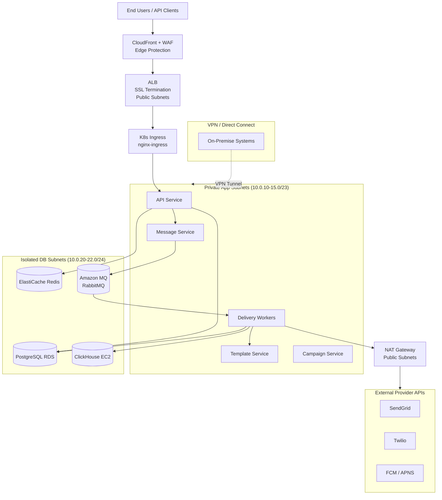

# Network Infrastructure – Messaging and Notification Platform

## Overview

This document describes the network architecture for the Messaging and Notification Platform deployed on AWS. The design follows a defence-in-depth approach with layered security controls, strict subnet isolation, and encrypted communication at every tier.

---

## 1. VPC Design

### 1.1 CIDR Allocation

| Resource | CIDR |
|---|---|
| VPC (primary – us-east-1) | `10.0.0.0/16` |
| VPC (DR – us-west-2) | `10.1.0.0/16` |
| VPC Peering / Transit Gateway | `10.0.0.0/8` supernet |

### 1.2 Subnet Layout – us-east-1

| Subnet Name | AZ | CIDR | Tier | Usage |
|---|---|---|---|---|
| public-us-east-1a | us-east-1a | `10.0.0.0/24` | Public | ALB, NAT GW |
| public-us-east-1b | us-east-1b | `10.0.1.0/24` | Public | ALB, NAT GW |
| public-us-east-1c | us-east-1c | `10.0.2.0/24` | Public | ALB, NAT GW |
| private-app-1a | us-east-1a | `10.0.10.0/23` | Private | EKS Node Group |
| private-app-1b | us-east-1b | `10.0.12.0/23` | Private | EKS Node Group |
| private-app-1c | us-east-1c | `10.0.14.0/23` | Private | EKS Node Group |
| private-db-1a | us-east-1a | `10.0.20.0/24` | Isolated | RDS, ElastiCache |
| private-db-1b | us-east-1b | `10.0.21.0/24` | Isolated | RDS, ElastiCache |
| private-db-1c | us-east-1c | `10.0.22.0/24` | Isolated | RDS, ElastiCache |

**Routing:**
- Public subnets → Internet Gateway (IGW) for inbound + outbound
- Private app subnets → NAT Gateway (per AZ) for outbound only
- Isolated DB subnets → No internet route; access only via private app subnets

---

## 2. Security Groups

### 2.1 API Service Security Group (`sg-api-service`)

| Direction | Protocol | Port | Source/Destination | Reason |
|---|---|---|---|---|
| Inbound | TCP | 443 | `sg-alb` | HTTPS from ALB |
| Inbound | TCP | 3000 | `sg-alb` | App port from ALB |
| Outbound | TCP | 5432 | `sg-rds` | PostgreSQL writes |
| Outbound | TCP | 6379 | `sg-redis` | Redis reads/writes |
| Outbound | TCP | 5672 | `sg-rabbitmq` | RabbitMQ publish |
| Outbound | TCP | 443 | `0.0.0.0/0` | External provider APIs |

### 2.2 Delivery Worker Security Group (`sg-worker`)

| Direction | Protocol | Port | Source/Destination | Reason |
|---|---|---|---|---|
| Inbound | NONE | — | — | No inbound from internet |
| Outbound | TCP | 5672 | `sg-rabbitmq` | Queue consume |
| Outbound | TCP | 5432 | `sg-rds` | DB status updates |
| Outbound | TCP | 6379 | `sg-redis` | Rate limit counters |
| Outbound | TCP | 443 | `0.0.0.0/0` | Provider API calls (SendGrid, Twilio, FCM) |

### 2.3 Database Security Group (`sg-rds`)

| Direction | Protocol | Port | Source/Destination | Reason |
|---|---|---|---|---|
| Inbound | TCP | 5432 | `10.0.10.0/22` | App subnets only |
| Inbound | TCP | 5432 | `sg-api-service` | API service |
| Inbound | TCP | 5432 | `sg-worker` | Worker service |
| Outbound | NONE | — | — | No outbound |

### 2.4 Redis Security Group (`sg-redis`)

| Direction | Protocol | Port | Source/Destination | Reason |
|---|---|---|---|---|
| Inbound | TCP | 6379 | `sg-api-service` | API cache |
| Inbound | TCP | 6379 | `sg-worker` | Rate limiting |
| Outbound | NONE | — | — | No outbound |

### 2.5 RabbitMQ Security Group (`sg-rabbitmq`)

| Direction | Protocol | Port | Source/Destination | Reason |
|---|---|---|---|---|
| Inbound | TCP | 5672 | `sg-api-service` | AMQP publish |
| Inbound | TCP | 5672 | `sg-worker` | AMQP consume |
| Inbound | TCP | 15672 | `sg-monitoring` | Management API |
| Outbound | NONE | — | — | No outbound |

---

## 3. Kubernetes Network Policies

### 3.1 Default Deny-All (namespace-wide)

```yaml
apiVersion: networking.k8s.io/v1
kind: NetworkPolicy
metadata:
  name: default-deny-all
  namespace: notify-prod
spec:
  podSelector: {}
  policyTypes:
    - Ingress
    - Egress
```

### 3.2 Allow API Service Ingress from Ingress Controller

```yaml
apiVersion: networking.k8s.io/v1
kind: NetworkPolicy
metadata:
  name: allow-api-from-ingress
  namespace: notify-prod
spec:
  podSelector:
    matchLabels:
      app: api-service
  ingress:
    - from:
        - namespaceSelector:
            matchLabels:
              kubernetes.io/metadata.name: ingress-nginx
      ports:
        - protocol: TCP
          port: 3000
```

### 3.3 Service-to-Service Allow Rules

| Policy Name | Source Pod | Destination Pod | Port |
|---|---|---|---|
| `allow-api-to-message` | `api-service` | `message-service` | 3001 |
| `allow-api-to-template` | `api-service` | `template-service` | 3002 |
| `allow-worker-to-template` | `*-worker` | `template-service` | 3002 |
| `allow-all-to-rabbitmq` | `notify-prod/*` | `rabbitmq` (notify-infra) | 5672 |
| `allow-all-to-redis` | `notify-prod/*` | `redis` (notify-infra) | 6379 |
| `allow-monitoring-scrape` | `notify-monitoring/prometheus` | `notify-prod/*` | 9090 |

---

## 4. Load Balancer Configuration

### 4.1 External ALB (Internet-Facing)

```
Internet → CloudFront (WAF) → ALB (public subnets) → K8s Ingress (nginx) → Services
```

| Attribute | Value |
|---|---|
| Type | Application Load Balancer |
| Scheme | internet-facing |
| Subnets | public-us-east-1a/b/c |
| SSL Certificate | ACM wildcard `*.notify.io` |
| Security Policy | `ELBSecurityPolicy-TLS13-1-2-2021-06` |
| Access Logs | S3 bucket: `notify-alb-logs` |
| Idle Timeout | 60 seconds |
| HTTP → HTTPS | Redirect rule (301) |

**Target Groups:**

| TG Name | Target | Health Check | Protocol |
|---|---|---|---|
| `tg-api` | K8s Ingress Controller pods | `/health/live` | HTTPS |

### 4.2 Internal NLB (Service Mesh)

- Istio ingress gateway backed by NLB for internal gRPC traffic
- TCP passthrough (mTLS terminated by Istio)
- Used for internal service-to-service calls crossing namespaces

---

## 5. DNS Architecture

### 5.1 Public DNS (Route 53)

| Record | Type | Target |
|---|---|---|
| `api.notify.io` | A (Alias) | ALB DNS name |
| `app.notify.io` | A (Alias) | CloudFront distribution |
| `webhooks.notify.io` | A (Alias) | ALB DNS name |
| `status.notify.io` | CNAME | Statuspage.io |

Health checks configured on `api.notify.io` with failover routing to DR region.

### 5.2 Internal DNS (CoreDNS)

Service discovery within EKS uses CoreDNS:

| FQDN | Resolves to | Port |
|---|---|---|
| `api-service.notify-prod.svc.cluster.local` | ClusterIP | 3000 |
| `message-service.notify-prod.svc.cluster.local` | ClusterIP | 3001 |
| `template-service.notify-prod.svc.cluster.local` | ClusterIP | 3002 |
| `postgresql.notify-infra.svc.cluster.local` | ClusterIP (primary) | 5432 |
| `postgresql-read.notify-infra.svc.cluster.local` | ClusterIP (read replicas) | 5432 |
| `redis.notify-infra.svc.cluster.local` | ClusterIP | 6379 |
| `rabbitmq.notify-infra.svc.cluster.local` | ClusterIP | 5672 |

---

## 6. TLS / mTLS

### 6.1 External TLS

- Minimum: **TLS 1.3** (TLS 1.2 allowed for legacy compatibility only via config)
- Certificates: AWS ACM auto-renewed wildcard cert `*.notify.io`
- HSTS header enforced with `max-age=31536000; includeSubDomains; preload`
- Certificate pinning: Not enforced at ALB level; enforced in mobile SDKs

### 6.2 Internal mTLS (Istio)

```yaml
apiVersion: security.istio.io/v1beta1
kind: PeerAuthentication
metadata:
  name: default
  namespace: notify-prod
spec:
  mtls:
    mode: STRICT   # All service-to-service traffic must use mTLS
```

- Certificates issued by Istio's built-in CA (or AWS Private CA in production)
- Certificate rotation: every 24 hours automatically
- Enforced via `AuthorizationPolicy` limiting which services can communicate

---

## 7. DDoS Protection

| Layer | Control | Provider |
|---|---|---|
| L3/L4 | AWS Shield Standard | Auto-enabled on all AWS resources |
| L3/L4 Advanced | AWS Shield Advanced | Enabled on ALB + CloudFront |
| L7 WAF | AWS WAF rules | Rate limiting, bot detection, OWASP Top 10 |
| CDN | CloudFront edge caching + IP reputation | AWS CloudFront |
| Application | Per-tenant rate limiting | Internal (Redis sliding window) |

**AWS WAF Rule Groups:**
- `AWSManagedRulesCommonRuleSet`
- `AWSManagedRulesKnownBadInputsRuleSet`
- `AWSManagedRulesBotControlRuleSet`
- Custom rule: Block IPs exceeding 1000 req/min

---

## 8. Network Monitoring and Alerting

| Metric | Threshold | Alert Channel |
|---|---|---|
| ALB 5xx error rate | > 1% over 5 min | PagerDuty P2 |
| ALB request count spike | > 200% of baseline | PagerDuty P1 |
| VPC Flow Logs: rejected connections | > 100/min from single IP | Security alert (Slack + PagerDuty) |
| NAT Gateway data transfer | > 10 GB/hour | Cost alert (email) |
| TLS certificate expiry | < 30 days | Ops email |

VPC Flow Logs → CloudWatch Logs → CloudWatch Metric Filters → CloudWatch Alarms → SNS → PagerDuty / Slack

---

## 9. Full Network Topology Diagram


