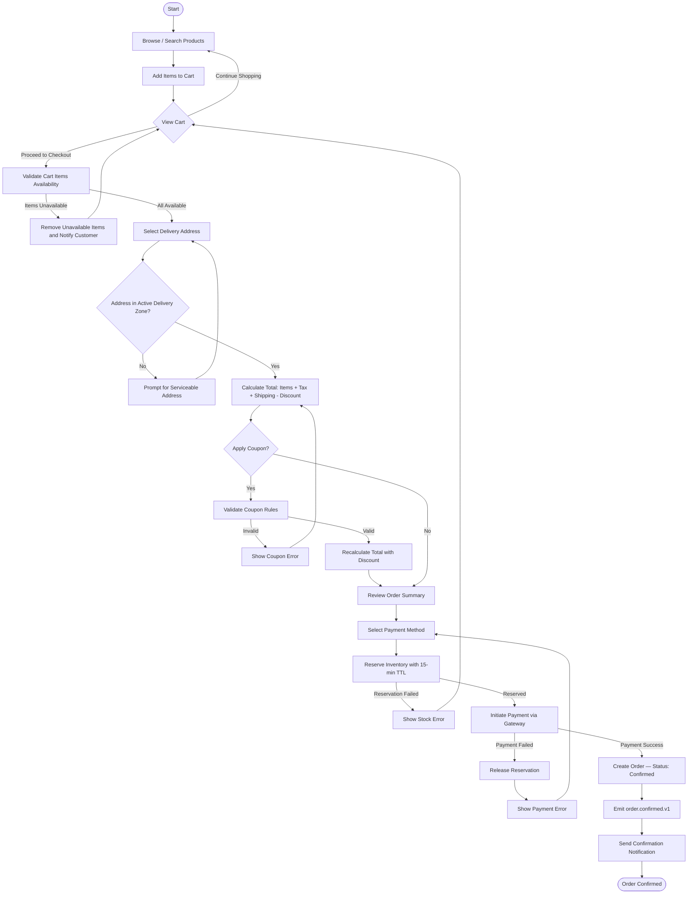
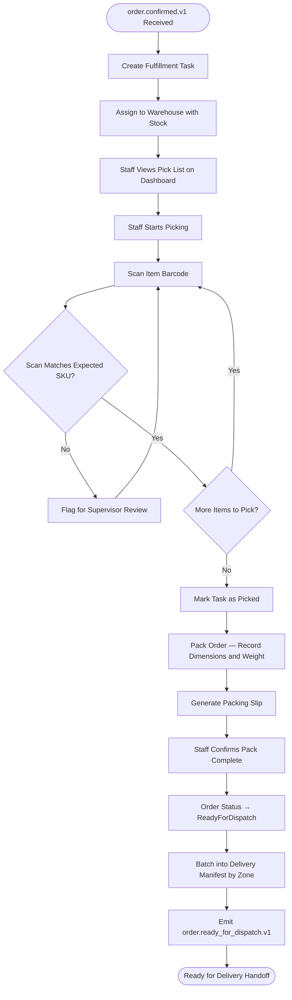
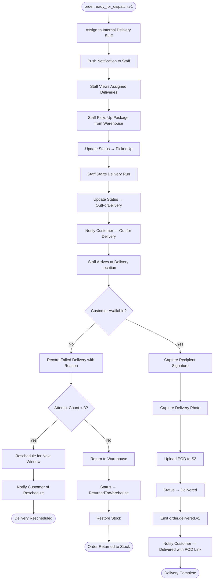
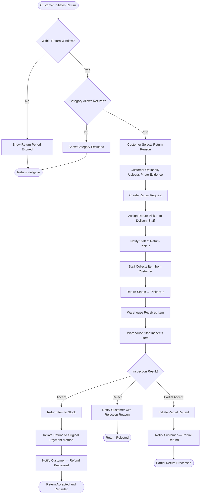

# Activity Diagram

## Overview

This document presents UML activity diagrams for the core business processes in the Order Management and Delivery System: order lifecycle, fulfillment, delivery, and returns.

## 1. Order Lifecycle — Browse to Delivery

## 2. Fulfillment Workflow — Confirmed to ReadyForDispatch

## 3. Delivery Workflow — ReadyForDispatch to Delivered

## 4. Returns Workflow — Return Request to Refund

