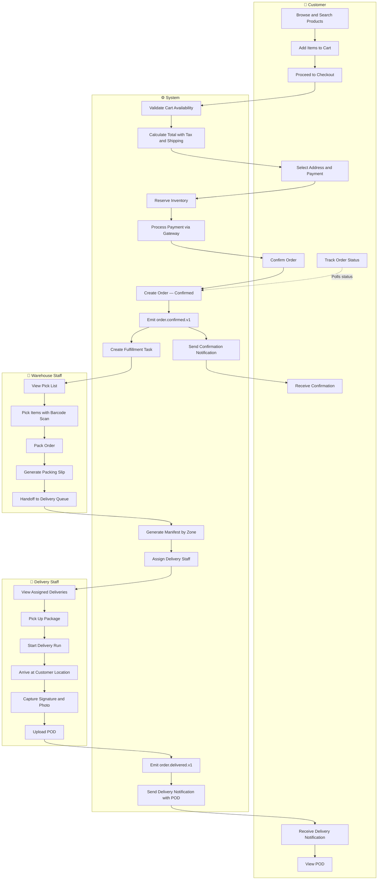
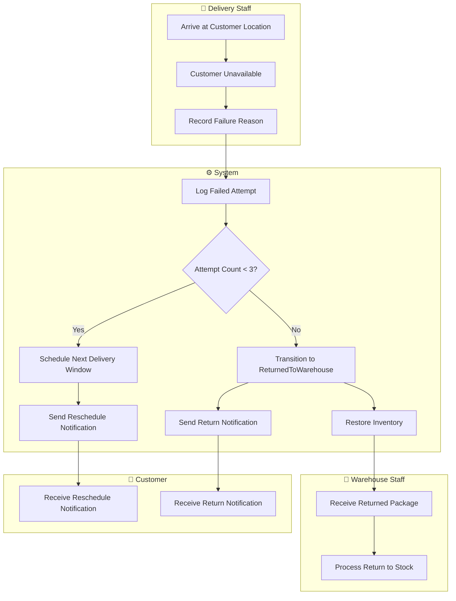
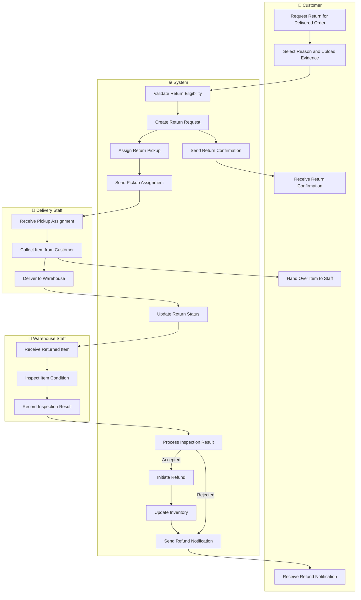
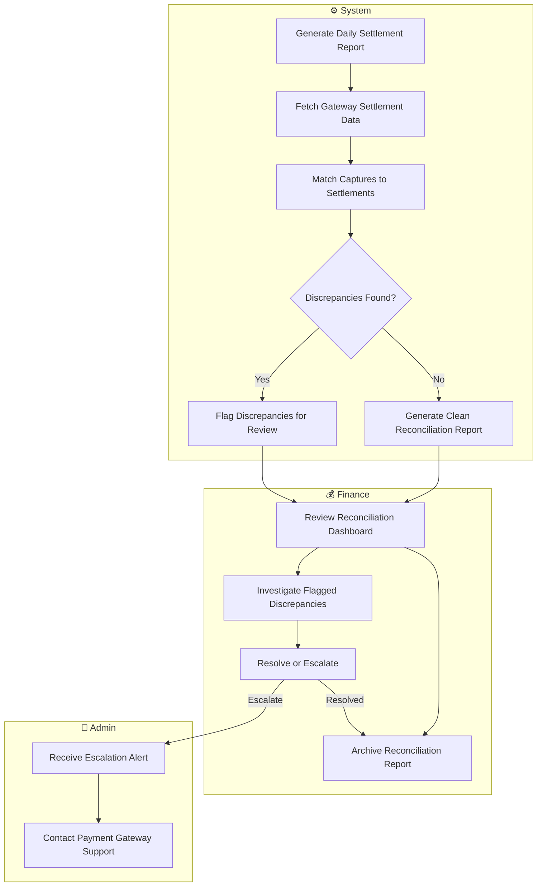

# BPMN / Swimlane Diagram

## Overview

This document presents cross-functional swimlane diagrams illustrating handoffs between Customer, Warehouse Staff, Delivery Staff, Operations Manager, Admin, and System for the core business processes.

## 1. Order-to-Delivery Swimlane

## 2. Failed Delivery Swimlane

## 3. Returns Processing Swimlane

## 4. Payment Reconciliation Swimlane

