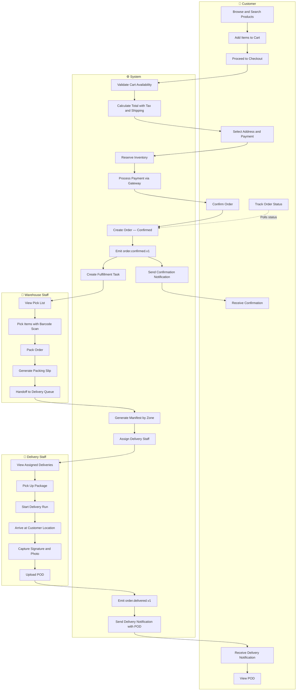
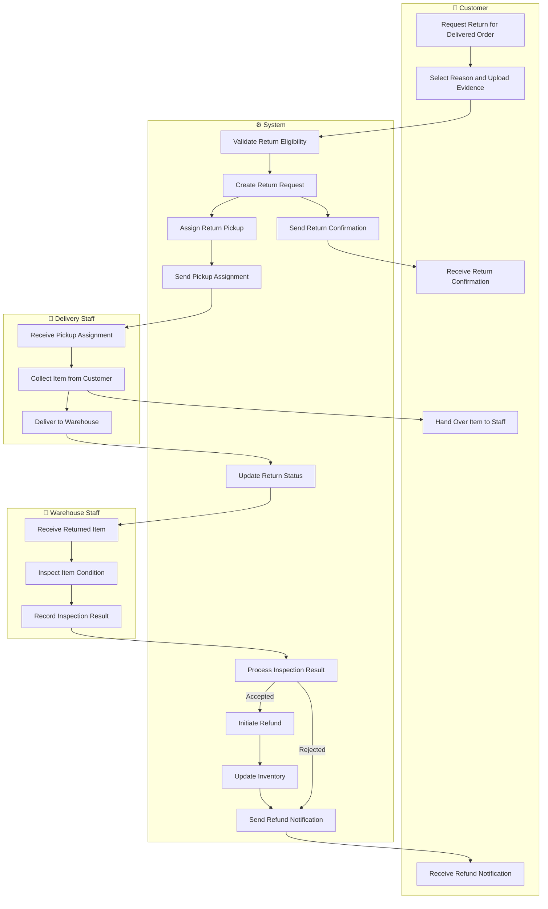
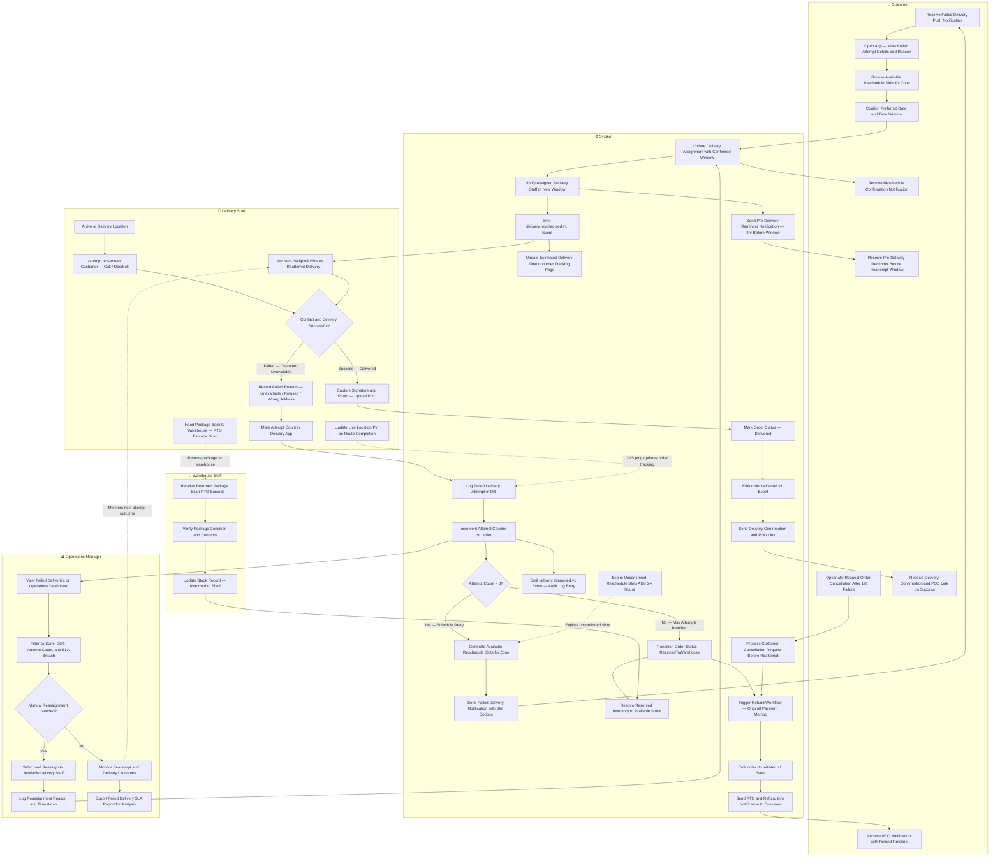
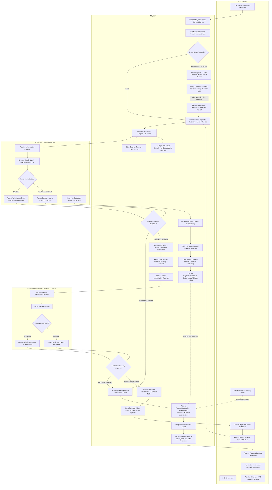
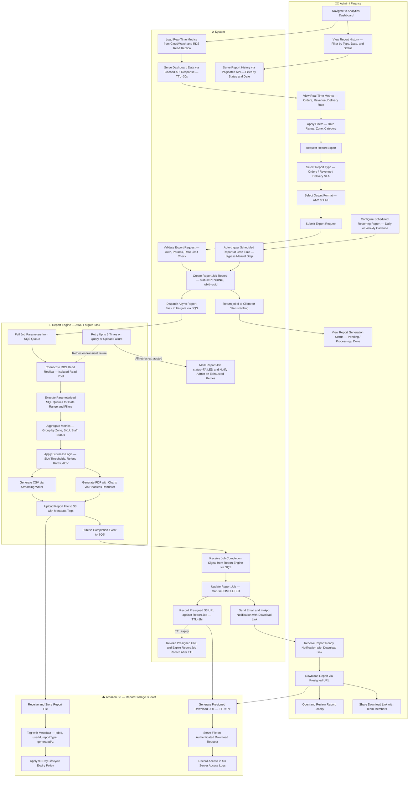

# BPMN / Swimlane Diagram

## Overview

This document presents cross-functional swimlane diagrams illustrating handoffs between Customer, Warehouse Staff, Delivery Staff, Operations Manager, Admin, Finance, and System for the core business processes of the Order Management and Delivery System.

Each diagram models the responsibilities of each actor lane, the decision points that route the process to different branches, and the domain events emitted at key state transitions.

| # | Swimlane | Key Actors | Purpose |
|---|----------|------------|---------|
| 1 | Order-to-Delivery | Customer, System, Warehouse, Delivery Staff | End-to-end order placement through confirmed delivery |
| 2 | Returns Processing | Customer, System, Delivery Staff, Warehouse | Customer-initiated return, inspection, and refund |
| 3 | Failed Delivery and Rescheduling | Customer, Delivery Staff, System, Ops Manager | Retry logic, rescheduling windows, and RTO handling |
| 4 | Payment Processing and Gateway Failover | Customer, System, Primary Gateway, Secondary Gateway | Authorization, capture, failover, and webhook reconciliation |
| 5 | Analytics Report Generation | Admin/Finance, System, Report Engine, S3 | Async report export and presigned download delivery |

---

## 1. Order-to-Delivery Swimlane

Covers the standard happy-path from a customer browsing and placing an order through to final delivery and proof-of-delivery upload. The System orchestrates inventory reservation, payment processing, fulfillment task creation, and delivery assignment. Domain events are emitted at each major state change — `order.confirmed.v1` and `order.delivered.v1` — to allow downstream services to react asynchronously.

---

## 2. Returns Processing Swimlane

Covers the reverse logistics flow initiated when a customer requests a return on a delivered order. Return eligibility is validated against the configured return window and policy rules before a return request is created. Delivery Staff collect the item and transport it to the warehouse where it undergoes quality inspection — a passed inspection triggers an automatic refund while a failed inspection closes the request without a refund.

---

## 3. Failed Delivery and Rescheduling Swimlane

Covers the end-to-end flow for a failed delivery attempt through to either successful rescheduling or Return-to-Origin (RTO). The System tracks attempt counts per order, generates available rescheduling slots for the delivery zone on each failure, and transitions the order to `ReturnedToWarehouse` after three consecutive failures.

Operations Managers monitor failed deliveries from a dedicated dashboard and can manually reassign to available staff. On RTO, inventory is restored and a refund is automatically initiated. The Warehouse Staff lane handles the physical RTO receipt, verifying package condition before restoring stock.

---

## 4. Payment Processing and Gateway Failover Swimlane

Covers payment authorization with automatic failover from the primary gateway to a secondary gateway on timeout or failure. A circuit breaker pattern prevents cascading requests to an unavailable primary gateway. The System applies a pre-authorization fraud detection check, tokenizes card details (no PAN storage), and captures payment on a valid authorization token from either gateway. Post-settlement webhooks are verified with HMAC-SHA256 and processed idempotently to prevent duplicate state updates.

---

## 5. Analytics Report Generation Swimlane

Covers on-demand report generation triggered from the analytics dashboard by Admin or Finance users. The System validates the request, creates a job record, and dispatches an async Fargate task via SQS. The Report Engine queries an isolated RDS read replica, aggregates and transforms the data, and generates the output in CSV or PDF format. The file is uploaded to S3 with a 90-day lifecycle expiry policy, and the requestor receives a time-limited presigned URL via notification. Scheduled recurring exports follow the same pipeline, auto-triggered at cron time without a manual dashboard request. Admins can also browse their full report history and share presigned download links with team members directly from the dashboard.

---

## Design Notes

- All diagrams use `flowchart TB` (top-to-bottom layout) with named `subgraph` blocks representing each actor or system lane.
- Solid arrows (`-->`) represent synchronous hand-offs or direct data flows between steps.
- Dashed arrows (`-.->`) represent asynchronous, polling, or background flows — such as GPS pings, event subscriptions, or TTL-based expiry.
- Decision diamonds (`{}`) mark branching points where the process diverges based on a runtime condition (e.g., attempt count, gateway response, fraud score).
- Domain events follow the naming convention `{entity}.{verb}.v{version}` (e.g., `order.confirmed.v1`, `payment.captured.v1`) and are consumed asynchronously by downstream services.
- Cross-subgraph edges are the primary modelling mechanism for hand-offs between actors; they surface ownership boundaries and integration points.
- The `ReturnedToWarehouse` state in the Failed Delivery flow is terminal — once an RTO is initiated, inventory is restored and a refund is triggered automatically with no further delivery attempts.
- The Payment gateway circuit breaker in Swimlane 4 is reset automatically after a configurable cool-down period; manual override is available through the Ops dashboard.
- Report presigned URLs in Swimlane 5 carry a 1-hour TTL enforced by S3; report job records and S3 objects themselves expire after 90 days via a lifecycle policy.
- Warehouse Staff lanes in Swimlanes 1 and 3 handle physical package operations — pick, pack, and RTO receipt — decoupled from the System's digital state transitions via fulfillment task records.
- The OpsManager lane in Swimlane 3 is a supervisory lane with no blocking dependency on the core delivery flow; all OpsManager actions feed back into the same System hand-off points used by automatic rescheduling.
- Scheduled reports in Swimlane 5 share the same async Fargate pipeline as on-demand exports, with the cron trigger substituting for the manual Admin request step.
- All payment authorization and capture steps in Swimlane 4 are idempotent by design — duplicate webhook deliveries from the gateway are safely ignored via the idempotency key stored against the PaymentTransaction record.
- The fraud detection check in Swimlane 4 runs synchronously on the hot path; a high-risk score suspends the payment flow and puts the order on hold pending manual review, rather than silently declining the transaction.

