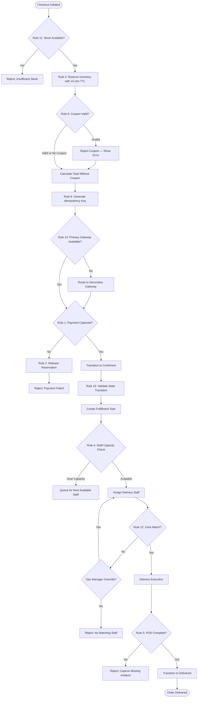

# Business Rules

## Enforceable Rules

1. An order cannot transition to `Confirmed` unless payment has been successfully captured. The system must verify the payment transaction status before allowing this transition.

2. Inventory reservation expires after 15 minutes if payment is not completed. The system timer releases the reserved quantity and restores `quantity_on_hand` atomically.

3. An order can only be cancelled by the customer if its status is `Confirmed` or `ReadyForDispatch`. Once the delivery staff has picked up the order (status `PickedUp` or later), cancellation is not permitted — the customer must wait for delivery and then initiate a return.

4. A delivery staff member cannot be assigned more than the configured maximum orders per delivery run (default 20). The assignment service must check current load before creating new assignments.

5. Proof of delivery must include at least one photo and an electronic signature. The system must reject POD submissions missing either artifact and keep the order in `OutForDelivery` state.

6. After 3 consecutive failed delivery attempts for the same order, the system must automatically transition the order to `ReturnedToWarehouse` and initiate the return-to-stock workflow. No further delivery attempts are permitted.

7. A return can only be initiated within the configured return window (default 7 days from delivery timestamp). The system must compare the current timestamp against `delivered_at + return_window_days` before accepting the request.

8. Coupons cannot be applied if the order subtotal is below the coupon's minimum order value. The system must validate this constraint at checkout and reject the coupon with a clear message.

9. All mutating API endpoints must require a unique `Idempotency-Key` header. Duplicate requests within the 24-hour TTL window must return the cached response without re-executing business logic or triggering side effects.

10. Refund amount must not exceed the original payment capture amount. For partial returns, the refund is calculated based on the line items being returned, not the full order total.

11. Stock quantity can never go negative. All inventory operations (reserve, release, adjust) must use database-level CHECK constraints and optimistic locking to prevent overselling.

12. Delivery assignments must target staff members whose assigned delivery zone matches the order's delivery address zone. Cross-zone assignments require explicit operations manager override.

13. Order state transitions must follow the defined state machine — no direct jumps between non-adjacent states. The system must validate the current state and target state against the allowed transitions before applying any change.

14. Payment gateway failover must be attempted before declaring a payment failure. If the primary gateway returns a 5xx error or times out after 3 retries, the system must route the request to the secondary gateway.

15. Email and SMS notifications for transactional events (OTP, order confirmation, delivery update) cannot be disabled by customer notification preferences. Only promotional notifications respect opt-out settings.

## Rule Evaluation Pipeline

The following flowchart illustrates how business rules are evaluated during the order checkout and fulfillment process:

## Exception and Override Handling

### Inventory Reservation Expiry
- **Exception:** Customer does not complete payment within 15 minutes.
- **System Response:** System timer releases reserved inventory. Cart items remain in cart but availability is no longer guaranteed. Customer must re-initiate checkout.
- **Override:** Admin can extend reservation TTL globally via platform configuration (FR-AM-002).

### Delivery Attempt Limit Override
- **Exception:** All 3 delivery attempts have failed, but the customer contacts support requesting one more attempt.
- **System Response:** By default, the order transitions to `ReturnedToWarehouse`.
- **Override:** Operations Manager can manually override the attempt limit by resetting the attempt counter on the delivery assignment. This action is logged in the audit trail with override reason.

### Return Window Extension
- **Exception:** Customer requests a return after the configured return window has expired.
- **System Response:** System rejects the return request.
- **Override:** Admin can issue a manual return authorisation by setting an extended return deadline on the specific order. The override is recorded in the audit trail.

### Cross-Zone Delivery Assignment
- **Exception:** No delivery staff available in the target delivery zone.
- **System Response:** System queues the delivery and alerts the operations manager.
- **Override:** Operations Manager can assign a staff member from an adjacent zone. The system logs the cross-zone assignment for performance tracking.

### Payment Gateway Permanent Failure
- **Exception:** Both primary and secondary payment gateways return permanent errors (e.g., card declined, insufficient funds).
- **System Response:** System releases inventory reservation, marks the order attempt as failed, and notifies the customer.
- **Override:** No override available for permanent payment failures. Customer must retry with a different payment method.

### Coupon Stacking
- **Exception:** Customer attempts to apply multiple coupons.
- **System Response:** System rejects the second coupon by default (one coupon per order).
- **Override:** Admin can create specific coupons with a `stackable` flag that permits combining with one other coupon. Stacking logic applies the higher-value coupon first, then the stackable coupon on the remaining amount.
