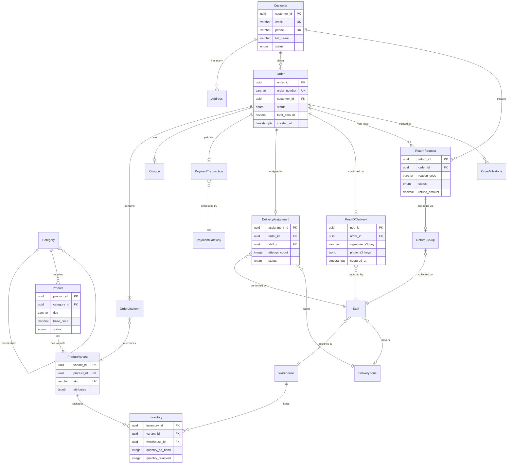

# Data Dictionary

## Core Entities

This section defines all key domain entities, their attributes, data types, constraints, and business meaning.

### Customer

| Attribute | Type | Constraints | Description |
|---|---|---|---|
| customer_id | UUID | PK, NOT NULL | Globally unique customer identifier |
| email | VARCHAR(255) | UNIQUE, NOT NULL | Verified email address |
| phone | VARCHAR(20) | UNIQUE, NULLABLE | Verified phone number |
| full_name | VARCHAR(150) | NOT NULL | Display name |
| password_hash | VARCHAR(255) | NOT NULL | bcrypt hashed password |
| auth_provider | ENUM | DEFAULT 'local' | Authentication method: local, google, apple |
| cognito_sub | VARCHAR(128) | UNIQUE, NOT NULL | Amazon Cognito user pool subject ID |
| notification_prefs | JSONB | NOT NULL, DEFAULT '{}' | Email, SMS, push opt-in flags |
| status | ENUM | NOT NULL, DEFAULT 'active' | active, suspended, deactivated |
| created_at | TIMESTAMPTZ | NOT NULL | Account creation timestamp |
| updated_at | TIMESTAMPTZ | NOT NULL | Last profile update timestamp |

### Product

| Attribute | Type | Constraints | Description |
|---|---|---|---|
| product_id | UUID | PK, NOT NULL | Globally unique product identifier |
| category_id | UUID | FK → Category, NOT NULL | Parent category reference |
| title | VARCHAR(255) | NOT NULL | Product display title |
| description | TEXT | NULLABLE | Rich-text product description |
| base_price | DECIMAL(12,2) | NOT NULL, CHECK > 0 | Base price before variant adjustments |
| currency | CHAR(3) | NOT NULL, DEFAULT 'NPR' | ISO 4217 currency code |
| images | JSONB | NOT NULL, DEFAULT '[]' | Array of S3 image URLs |
| specifications | JSONB | NULLABLE | Key-value specification pairs |
| status | ENUM | NOT NULL, DEFAULT 'active' | active, archived, draft |
| created_at | TIMESTAMPTZ | NOT NULL | Product creation timestamp |
| updated_at | TIMESTAMPTZ | NOT NULL | Last update timestamp |

### Product Variant

| Attribute | Type | Constraints | Description |
|---|---|---|---|
| variant_id | UUID | PK, NOT NULL | Globally unique variant identifier |
| product_id | UUID | FK → Product, NOT NULL | Parent product reference |
| sku | VARCHAR(64) | UNIQUE, NOT NULL | Stock keeping unit code |
| attributes | JSONB | NOT NULL | Variant attributes: size, color, etc. |
| price_adjustment | DECIMAL(12,2) | NOT NULL, DEFAULT 0 | Price delta from base price |
| weight_grams | INTEGER | NULLABLE | Package weight for shipping |
| status | ENUM | NOT NULL, DEFAULT 'active' | active, discontinued |

### Inventory

| Attribute | Type | Constraints | Description |
|---|---|---|---|
| inventory_id | UUID | PK, NOT NULL | Inventory record identifier |
| variant_id | UUID | FK → ProductVariant, NOT NULL | Product variant reference |
| warehouse_id | UUID | FK → Warehouse, NOT NULL | Warehouse location reference |
| quantity_on_hand | INTEGER | NOT NULL, CHECK >= 0 | Physical stock count |
| quantity_reserved | INTEGER | NOT NULL, DEFAULT 0, CHECK >= 0 | Quantity reserved for open orders |
| low_stock_threshold | INTEGER | NOT NULL, DEFAULT 10 | Alert threshold |
| updated_at | TIMESTAMPTZ | NOT NULL | Last stock change timestamp |

### Order

| Attribute | Type | Constraints | Description |
|---|---|---|---|
| order_id | UUID | PK, NOT NULL | Globally unique order identifier |
| order_number | VARCHAR(20) | UNIQUE, NOT NULL | Human-readable order number (ORD-XXXXXXXX) |
| customer_id | UUID | FK → Customer, NOT NULL | Ordering customer |
| delivery_address_id | UUID | FK → Address, NOT NULL | Selected delivery address |
| status | ENUM | NOT NULL | Draft, Confirmed, ReadyForDispatch, PickedUp, OutForDelivery, Delivered, DeliveryFailed, ReturnRequested, ReturnPickedUp, Refunded, ReturnedToWarehouse, Cancelled |
| subtotal | DECIMAL(12,2) | NOT NULL | Sum of line item totals |
| tax_amount | DECIMAL(12,2) | NOT NULL | Calculated tax amount |
| shipping_fee | DECIMAL(12,2) | NOT NULL | Delivery zone shipping fee |
| discount_amount | DECIMAL(12,2) | NOT NULL, DEFAULT 0 | Applied coupon discount |
| total_amount | DECIMAL(12,2) | NOT NULL | Final amount charged |
| coupon_id | UUID | FK → Coupon, NULLABLE | Applied coupon reference |
| payment_id | UUID | FK → PaymentTransaction, NULLABLE | Payment transaction reference |
| cancellation_reason | VARCHAR(255) | NULLABLE | Reason code if cancelled |
| estimated_delivery | TIMESTAMPTZ | NULLABLE | Estimated delivery timestamp |
| delivered_at | TIMESTAMPTZ | NULLABLE | Actual delivery timestamp |
| idempotency_key | VARCHAR(128) | UNIQUE, NOT NULL | Client-provided idempotency key |
| created_at | TIMESTAMPTZ | NOT NULL | Order creation timestamp |
| updated_at | TIMESTAMPTZ | NOT NULL | Last state change timestamp |

### Delivery Assignment

| Attribute | Type | Constraints | Description |
|---|---|---|---|
| assignment_id | UUID | PK, NOT NULL | Assignment record identifier |
| order_id | UUID | FK → Order, NOT NULL | Order being delivered |
| staff_id | UUID | FK → Staff, NOT NULL | Assigned delivery staff |
| delivery_zone_id | UUID | FK → DeliveryZone, NOT NULL | Target delivery zone |
| scheduled_window_start | TIMESTAMPTZ | NOT NULL | Delivery window start |
| scheduled_window_end | TIMESTAMPTZ | NOT NULL | Delivery window end |
| attempt_count | INTEGER | NOT NULL, DEFAULT 0 | Number of delivery attempts |
| status | ENUM | NOT NULL | assigned, picked_up, out_for_delivery, delivered, failed |
| created_at | TIMESTAMPTZ | NOT NULL | Assignment creation timestamp |

### Proof of Delivery

| Attribute | Type | Constraints | Description |
|---|---|---|---|
| pod_id | UUID | PK, NOT NULL | POD record identifier |
| order_id | UUID | FK → Order, UNIQUE, NOT NULL | Delivered order reference |
| staff_id | UUID | FK → Staff, NOT NULL | Delivery staff who captured POD |
| signature_s3_key | VARCHAR(512) | NOT NULL | S3 object key for signature image |
| photo_s3_keys | JSONB | NOT NULL | Array of S3 keys for delivery photos |
| delivery_notes | TEXT | NULLABLE | Optional delivery notes |
| captured_at | TIMESTAMPTZ | NOT NULL | Timestamp of POD capture |
| uploaded_at | TIMESTAMPTZ | NULLABLE | Timestamp of S3 upload completion |

### Return Request

| Attribute | Type | Constraints | Description |
|---|---|---|---|
| return_id | UUID | PK, NOT NULL | Return request identifier |
| order_id | UUID | FK → Order, NOT NULL | Original order reference |
| customer_id | UUID | FK → Customer, NOT NULL | Requesting customer |
| reason_code | VARCHAR(50) | NOT NULL | Return reason from predefined list |
| evidence_s3_keys | JSONB | NULLABLE | Customer-uploaded photo evidence |
| status | ENUM | NOT NULL | requested, pickup_assigned, picked_up, inspecting, accepted, rejected, partial_accepted |
| inspection_result | VARCHAR(255) | NULLABLE | Inspection outcome notes |
| refund_amount | DECIMAL(12,2) | NULLABLE | Calculated refund amount |
| created_at | TIMESTAMPTZ | NOT NULL | Return request timestamp |
| resolved_at | TIMESTAMPTZ | NULLABLE | Resolution timestamp |

## Canonical Relationship Diagram

## Data Quality Controls

### Referential Integrity
- All foreign keys enforce `ON DELETE RESTRICT` to prevent orphaned records.
- Order deletion is never performed; orders transition to terminal states only.
- Product archival uses soft-delete (status → archived) to preserve order history references.

### Uniqueness Constraints
- Customer email and phone are globally unique.
- Product variant SKU is globally unique.
- Order number is globally unique with a human-readable prefix format.
- Idempotency keys are unique per order to prevent duplicate creation.

### Data Validation Rules
- All monetary values use DECIMAL(12,2) with CHECK constraints ensuring non-negative amounts.
- Inventory quantities enforce CHECK >= 0 to prevent negative stock.
- Enum fields are constrained to defined value sets at the database level.
- Timestamps use TIMESTAMPTZ for timezone-aware storage.

### Audit and Traceability
- All entities include `created_at` and `updated_at` timestamps, auto-managed by database triggers.
- Order state changes are recorded in the `OrderMilestone` table with actor identity.
- Configuration changes are versioned in a `ConfigVersion` table with before/after snapshots.
- Soft-deleted records retain full data with a `deactivated_at` timestamp.

### Data Retention
- Active order data retained indefinitely in RDS.
- Completed order data archived to S3 after 2 years.
- POD artifacts retained in S3 for 5 years with lifecycle policies.
- Audit logs retained for 1 year in CloudWatch Logs, then archived to S3 Glacier.
- DynamoDB milestone data uses TTL of 2 years for automatic expiry.
